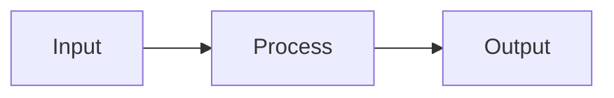

# 🤝 Contributing to RAG Production Guide

First off, thank you for considering contributing to this guide! It's practitioners like you who make this resource valuable for the community.

## 📋 Table of Contents

- [Code of Conduct](#code-of-conduct)
- [Ways to Contribute](#ways-to-contribute)
- [Getting Started](#getting-started)
- [Contribution Guidelines](#contribution-guidelines)
- [Style Guide](#style-guide)
- [Recognition](#recognition)

---

## 📜 Code of Conduct

This project adheres to a simple code of conduct:

- **Be respectful** — Treat all contributors with respect
- **Be constructive** — Focus on improving the content
- **Be inclusive** — Welcome contributors of all experience levels
- **Be honest** — Share real experiences, including failures

---

## 🎯 Ways to Contribute

### 📝 Content Contributions

| Type | Description | Difficulty |
|------|-------------|------------|
| **Fix typos/errors** | Correct mistakes in existing content | 🟢 Easy |
| **Update outdated info** | Refresh statistics, versions, or recommendations | 🟢 Easy |
| **Add examples** | Provide code snippets or configuration examples | 🟡 Medium |
| **Improve explanations** | Clarify confusing sections | 🟡 Medium |
| **Add case studies** | Share anonymized production experiences | 🟡 Medium |
| **Create diagrams** | Add Mermaid diagrams or visual aids | 🟡 Medium |
| **Add platform guides** | Document RAG on new platforms | 🔴 Advanced |
| **Translate content** | Make the guide accessible in other languages | 🔴 Advanced |

### 🐛 Issue Contributions

- Report errors or outdated information
- Suggest new topics to cover
- Request clarification on confusing sections
- Share production experiences that contradict our recommendations

### 💬 Community Contributions

- Answer questions in issues
- Review pull requests
- Share the guide with your network

---

## 🚀 Getting Started

### Prerequisites

- A GitHub account
- Basic familiarity with Markdown
- (Optional) Experience with RAG systems in production

### Quick Start

1. **Fork the repository**
   ```bash
   # Click "Fork" on GitHub, then clone your fork
   git clone https://github.com/YOUR-USERNAME/rag-production-guide.git
   cd rag-production-guide
   ```

2. **Create a branch**
   ```bash
   git checkout -b your-feature-name
   ```

3. **Make your changes**
   - Edit existing files or create new ones
   - Follow the [Style Guide](#style-guide)

4. **Commit your changes**
   ```bash
   git add .
   git commit -m "Brief description of changes"
   ```

5. **Push and create a Pull Request**
   ```bash
   git push origin your-feature-name
   ```
   Then open a PR on GitHub.

---

## 📐 Contribution Guidelines

### Adding Case Studies

Case studies are one of the most valuable contributions. When adding a case study:

#### Required Elements

```markdown
# Case Study: [Descriptive Title]

## Context
- Industry (anonymized if needed)
- Scale (documents, queries, users)
- Timeline

## The Challenge
- Business problem
- Technical constraints
- Success criteria

## What Failed
- Specific failure mode
- Root cause analysis
- Business impact

## What Worked
- Solution approach
- Key success factors
- Measurable outcomes

## Lessons Learned
| Lesson | Detail | RAG Applicability |
|--------|--------|-------------------|
| ... | ... | ... |

## References
- Link to relevant academic papers
- Link to vendor documentation
- Industry benchmarks cited
```

#### Anonymization Requirements

**Must anonymize:**
- Company names → Use descriptors like "Major Regional Health System"
- Employee names → Remove entirely
- Exact financial figures → Use ranges like "$300K-500K"
- Proprietary system names → Use generic descriptions

**Can include:**
- Industry vertical
- Approximate scale (orders of magnitude)
- Cloud platform used (AWS, Azure, GCP)
- Open-source tools used
- Architecture patterns

### Adding Platform Guides

Platform guides should be practical and actionable:

```markdown
# RAG on [Platform Name]

## Overview
Brief description of the platform's RAG capabilities

## Architecture
Mermaid diagram showing component relationships

## Key Services
| Service | Purpose | When to Use |
|---------|---------|-------------|
| ... | ... | ... |

## Implementation Example
Code snippets with comments

## Cost Considerations
Pricing model and optimization tips

## Limitations
Honest assessment of platform constraints

## Official Resources
Links to vendor documentation
```

### Adding Cheatsheets

Cheatsheets should be scannable and actionable:

- Use tables over prose
- Include decision criteria
- Provide specific numbers/thresholds
- Link to detailed docs for context

---

## ✍️ Style Guide

### Markdown Conventions

```markdown
# H1 - Document title only
## H2 - Major sections
### H3 - Subsections
#### H4 - Rarely used

**Bold** for emphasis
`code` for technical terms
> Blockquotes for important callouts

| Tables | For | Structured Data |
|--------|-----|-----------------|
```

### Writing Style

- **Be concise** — Practitioners are busy
- **Be specific** — Include numbers, thresholds, examples
- **Be honest** — Include limitations and trade-offs
- **Be practical** — Focus on "how" not just "what"

### Diagrams

Use Mermaid for diagrams (renders natively on GitHub):

```markdown

```

### Citations

When referencing external sources:

```markdown
According to [Source Name](URL), finding or statistic.
```

For academic papers:
```markdown
*Paper Title* (Conference Year) — Brief description
```

---

## 🏆 Recognition

All contributors will be recognized in:

1. **ACKNOWLEDGMENTS.md** — Listed in the Contributors section
2. **Git history** — Your commits are permanently recorded
3. **GitHub Contributors** — Shown on the repository page

### Becoming a Maintainer

Regular contributors who demonstrate:
- Consistent quality contributions
- Helpful code reviews
- Community engagement

May be invited to become maintainers with write access.

---

## ❓ Questions?

- **General questions** — Open a GitHub Discussion
- **Bug reports** — Open a GitHub Issue
- **Private matters** — Contact the maintainers directly

---

<div align="center">

**Thank you for helping make RAG systems better for everyone! 🚀**

</div>
