<div align="center">

# 🔍 RAG Production Guide

### A Practitioner's Handbook for Building RAG Systems That Actually Work

[](LICENSE)
[](CONTRIBUTING.md)
[](https://github.com/MarioLazo/rag-production-guide/graphs/contributors)

**80% of enterprise RAG projects fail.** This guide shows you how to be in the 20% that succeed.

[Why RAG Fails](#-why-rag-fails) •
[Architecture](#-architecture) •
[Case Studies](#-case-studies) •
[Cheatsheets](#-cheatsheets) •
[Platform Guides](#-platform-guides) •
[Contributing](#-contributing)

</div>

---

## 📖 About This Guide

This repository distills findings from **30+ authoritative sources** — including research from IBM, OpenAI, Anthropic, Microsoft, AWS, Google, NVIDIA, and leading open-source frameworks — combined with **real-world production experience** across healthcare, manufacturing, and enterprise deployments.

> **The core insight:** The "vector DB + LLM" recipe that dominates blog posts fails in practice. Success requires **modular architecture**, **hybrid retrieval**, **rigorous evaluation**, and **deliberate cost engineering**.

### Who This Is For

| Role | What You'll Get |
|------|-----------------|
| 🔧 **ML/AI Engineers** | Implementation patterns, code examples, evaluation frameworks |
| 🏗️ **Solution Architects** | Architecture decisions, platform comparisons, integration patterns |
| 📊 **Technical Leaders** | ROI frameworks, risk assessment, vendor evaluation criteria |

---

## 🚨 Why RAG Fails

<div align="center">

```
┌─────────────────────────────────────────────────────────────────┐
│                    THE STARK REALITY                            │
├─────────────────────────────────────────────────────────────────┤
│  📉 80% of enterprise RAG projects end in failure               │
│  📉 40-60% never reach production                               │
│  💰 $13.8 billion in enterprise AI spending at risk             │
│  📉 42% of AI projects failed in 2025 (2.5× increase from 2024) │
└─────────────────────────────────────────────────────────────────┘
```
*Sources: PIMCO 2025 Analysis, TMLS Insights, Gartner Research*

</div>

### The Seven Silent Killers

| # | Failure Mode | Stage | Impact |
|---|-------------|-------|--------|
| 1 | **Missed Retrieval** | Retrieval | Relevant documents don't surface |
| 2 | **Context Misalignment** | Retrieval | Retrieved content doesn't match intent |
| 3 | **Stale Indexes** | Retrieval | Data drift causes outdated responses |
| 4 | **Hallucination** | Generation | LLM fabricates content not in context |
| 5 | **Lost-in-the-Middle** | Generation | LLM ignores middle of context window |
| 6 | **Semantic Collapse** | System | Inter-document similarity > 0.65 causes degradation |
| 7 | **Compounding Errors** | System | 95% accuracy per layer = 81% end-to-end across 5 layers |

> 📚 **Deep Dive:** [Failure Modes & How to Prevent Them](docs/02-failure-modes.md)

---

## 🏗️ Architecture

### The Modular RAG Pattern

```mermaid
flowchart LR
    subgraph Ingestion["📥 Ingestion"]
        A[Documents] --> B[Chunking]
        B --> C[Embedding]
        C --> D[(Vector Store)]
    end
    
    subgraph Retrieval["🔍 Retrieval"]
        E[Query] --> F{Hybrid Search}
        F -->|BM25| D
        F -->|Vector| D
        D --> G[Reranker]
    end
    
    subgraph Generation["✨ Generation"]
        G --> H[Context Assembly]
        H --> I[LLM]
        I --> J[Response + Citations]
    end
    
    style Ingestion fill:#e1f5fe
    style Retrieval fill:#fff3e0
    style Generation fill:#e8f5e9
```



### Key Architectural Insights

| Component | Recommendation | Why |
|-----------|---------------|-----|
| **Chunking** | 400-512 tokens, 10-20% overlap | 80% of failures trace back to chunking decisions |
| **Search** | Hybrid BM25 + Vector with RRF | Pure vector search has fundamental bottlenecks |
| **Reranking** | Cross-encoder on top-20 results | 49-67% retrieval failure reduction |
| **Context** | Contextual Retrieval preprocessing | Single highest-ROI improvement available |

> 📚 **Deep Dives:**
> - [Chunking Strategies](docs/03-chunking-strategies.md)
> - [Hybrid Search](docs/04-hybrid-search.md)
> - [Advanced Patterns](docs/05-advanced-patterns.md)

---

## 📋 Case Studies

Real-world production experiences with anonymized details. Each case study includes:
- ✅ Business context and scale
- ❌ What failed and why
- ✅ What worked and lessons learned
- 🔧 Technical architecture patterns

| Case Study | Industry | Scale | Key Learning |
|------------|----------|-------|--------------|
| [Healthcare Document AI](case-studies/01-healthcare-document-ai.md) | Healthcare | 8-12K docs/month | Taxonomy design is a data quality issue |
| [Technical Support Agent](case-studies/02-medtech-support-agent.md) | Medical Devices | 75-125K cases/year | Decision tree + RAG hybrid outperforms open-ended RAG |
| [Knowledge Mining Bot](case-studies/03-enterprise-knowledge-bot.md) | Enterprise SaaS | 10K-100K docs | Freshness is a trust issue, not just a data issue |

> 📚 **Framework:** [The 5 Danger Zones](case-studies/README.md#the-5-danger-zones)

---

## 📊 Cheatsheets

Quick-reference guides for common decisions:

| Cheatsheet | Description |
|------------|-------------|
| [🌳 Chunking Decision Tree](cheatsheets/chunking-decision-tree.md) | Visual guide for chunk size selection |
| [⚖️ Hybrid Search Weights](cheatsheets/hybrid-search-weights.md) | Domain-specific BM25/vector weights |
| [🚨 Danger Zones Checklist](cheatsheets/danger-zones-checklist.md) | Pre-flight checklist before production |
| [📏 Evaluation Metrics](cheatsheets/evaluation-metrics.md) | RAG Triad + extended metrics |
| [💰 Cost Optimization](cheatsheets/cost-optimization.md) | From $18K/month to sustainable |

---

## ☁️ Platform Guides

Practical implementation guidance for major platforms:

| Platform | Guide | Key Services |
|----------|-------|--------------|
|  | [AWS Bedrock](docs/platform-guides/aws-bedrock.md) | Bedrock, Kendra, OpenSearch, S3 Vectors |
|  | [Azure AI](docs/platform-guides/azure-ai-search.md) | AI Search, OpenAI Service, Document Intelligence |
|  | [Google Vertex AI](docs/platform-guides/gcp-vertex-ai.md) | Vertex AI Search, Gemini, Document AI |
|  | [Databricks](docs/platform-guides/databricks-mosaic.md) | Mosaic AI, Vector Search, MLflow |
|  | [UiPath](docs/platform-guides/uipath-automation.md) | AI Center, Document Understanding, Orchestrator |

---

## 📈 Evaluation Framework

The industry-standard **RAG Triad**:


| Tool | Stars | Best For |
|------|-------|----------|
| [RAGAS](https://github.com/explodinggradients/ragas) | ~12K | Reference-free evaluation, synthetic test data |
| [DeepEval](https://github.com/confident-ai/deepeval) | ~12K | CI/CD integration, 50+ metrics, red-teaming |
| [AutoRAG](https://github.com/Marker-Inc-Korea/AutoRAG) | ~5K | AutoML-style pipeline optimization |

> 📚 **Deep Dive:** [Evaluation Framework](docs/06-evaluation-framework.md)

---

## 💰 Cost Engineering

RAG costs grow **exponentially**, not linearly. A documented case reached **$18K/month** before optimization.

| Optimization | Savings | Implementation |
|-------------|---------|----------------|
| **Semantic Caching** | 18-68% | Cache query-response pairs by embedding similarity |
| **Model Routing** | 30-80% | Route simple queries to cheaper models |
| **Prompt Optimization** | Up to 35% | Concise instructions, context pruning |
| **Batch Inference** | 50% | Non-real-time workloads |

**Total potential savings: 70-85%** with the full optimization stack.

> 📚 **Deep Dive:** [Cost Engineering](docs/07-cost-engineering.md)

---

## 🤝 Contributing

We welcome contributions from the community! This guide improves with diverse production experiences.

### Ways to Contribute

- 🐛 Report errors or outdated information
- 📝 Add anonymized case studies from your experience
- 🔧 Improve platform-specific examples
- 🌐 Translate to other languages
- 📊 Add diagrams or visualizations

See [CONTRIBUTING.md](CONTRIBUTING.md) for guidelines.

---

## 🙏 Acknowledgments

This guide stands on the shoulders of giants. We're deeply grateful to:

### Open Source Community
- **[RAGFlow](https://github.com/infiniflow/ragflow)** by InfiniFlow — Production-ready RAG with deep document understanding
- **[RAGAS](https://github.com/explodinggradients/ragas)** by Exploding Gradients — Reference-free evaluation framework
- **[DeepEval](https://github.com/confident-ai/deepeval)** by Confident AI — Production testing with 50+ metrics
- **[AutoRAG](https://github.com/Marker-Inc-Korea/AutoRAG)** by Marker Inc — AutoML-style pipeline optimization
- **[Athina AI Cookbooks](https://github.com/athina-ai/rag-cookbooks)** — Complete taxonomy from Naive → Agentic

### Enterprise & Research
- **Microsoft** — Azure AI Search, GraphRAG, GPT-RAG patterns
- **AWS** — Bedrock samples, RAG reference architectures
- **Google** — Vertex AI, Gemini integration patterns
- **Databricks** — GenAI Cookbook, MLflow evaluation
- **NVIDIA** — GPU-accelerated RAG blueprints
- **IBM** — Granite community cookbooks

See [ACKNOWLEDGMENTS.md](ACKNOWLEDGMENTS.md) for the complete list.

---

## 📚 Resources

- [Official Vendor Repositories](resources/official-vendor-repos.md)
- [Community Projects](resources/community-repos.md)
- [Further Reading](resources/further-reading.md)
- [Glossary](resources/glossary.md)

---

## 📜 License

This project is licensed under the MIT License - see the [LICENSE](LICENSE) file for details.

---

<div align="center">

**Built with ❤️ by practitioners, for practitioners**

[⬆ Back to Top](#-rag-production-guide)

</div>
