<div align="center">

# 🔍 RAG Production Guide

### A Practitioner's Handbook for Building RAG Systems That Actually Work

[](LICENSE)
[](CONTRIBUTING.md)
[](https://github.com/MarioLazo/rag-production-guide/graphs/contributors)

**80% of enterprise RAG projects fail.** This guide shows you how to be in the 20% that succeed.

[Why RAG Fails](#-why-rag-fails) •
[Architecture](#-architecture) •
[Case Studies](#-case-studies) •
[Cheatsheets](#-cheatsheets) •
[Platform Guides](#-platform-guides) •
[Contributing](#-contributing)

</div>

---

## ⚠️ Important Disclaimers

### 📚 Educational Content
This guide is provided for **educational and informational purposes only**. It does not constitute professional advice. Before making significant technology or business decisions, consult with qualified professionals appropriate to your situation.

### 🔬 Curated Knowledge, Not Proprietary Information
This guide is a **curated synthesis** of:
- **Peer-reviewed academic research** — Published papers from EACL, ICLR, NAACL, TACL, and other venues ([see references](resources/academic-references.md))
- **Open-source frameworks** — Publicly available GitHub repositories from Microsoft, AWS, Google, and the community
- **Industry benchmarks** — Published statistics from S&P Global, RAND Corporation, MIT NANDA, Gartner, McKinsey, Stanford HAI, AHIMA, AHA, and other research organizations
- **Community knowledge** — Patterns shared by practitioners in public forums, conferences, and published case studies

**No proprietary or confidential information is included.** All sources are publicly available and cited.

### 🎭 Composite Case Studies
The case studies in this guide are **composite illustrations** created for educational purposes. They:
- **Do not represent any specific company** or client engagement
- **Combine patterns** observed across multiple public sources and industry research
- **Use modified details** including scale, timelines, and technical specifics
- **Employ illustrative financial estimates** based on published industry benchmarks

Any resemblance to actual organizations is coincidental.

### 💰 Financial Estimates
All financial figures (costs, savings, ROI) are **illustrative estimates** based on:
- Published industry benchmarks (cited in each case study)
- Back-of-envelope calculation methodology (shown transparently)
- Conservative ranges rather than point estimates

**Your actual results will vary** based on your specific context, implementation quality, organizational factors, and market conditions. These figures are intended to teach estimation methodology, not to guarantee outcomes.

### 📜 No Warranty
This content is provided "as is" without warranty of any kind, express or implied. The authors and contributors are not liable for any damages arising from the use of this information.

---

## 📖 About This Guide

This repository distills findings from **30+ authoritative sources** — including research from IBM, OpenAI, Anthropic, Microsoft, AWS, Google, NVIDIA, and leading open-source frameworks — combined with patterns from published case studies and industry benchmarks.

> **The core insight:** The "vector DB + LLM" recipe that dominates blog posts fails in practice. Success requires **modular architecture**, **hybrid retrieval**, **rigorous evaluation**, and **deliberate cost engineering**.

---

## 🎯 How to Use This Guide

### ⚡ Quick Start (30 min)
1. [Executive Summary](docs/01-executive-summary.md) — Why 80% fail
2. [Danger Zones Checklist](cheatsheets/danger-zones-checklist.md) — Pre-flight check
3. One [Case Study](case-studies/) of your choice

### 📖 Core Concepts (2-3 hours)
1. [Failure Modes](docs/02-failure-modes.md) → [Chunking](docs/03-chunking-strategies.md) → [Hybrid Search](docs/04-hybrid-search.md)
2. [Evaluation Framework](docs/07-evaluation-framework.md)
3. [Cost Engineering](docs/08-cost-engineering.md)

### 🧠 Deep Dive (Full day)
Follow the [Documentation Index](docs/README.md) for the complete learning path with all 8 core documents, platform guides, and case studies.

### Who This Is For

| Role | What You'll Get |
|------|-----------------|
| 🔧 **ML/AI Engineers** | Implementation patterns, code examples, evaluation frameworks |
| 🏗️ **Solution Architects** | Architecture decisions, platform comparisons, integration patterns |
| 📊 **Technical Leaders** | ROI frameworks, risk assessment, vendor evaluation criteria |

---

## 🚨 Why RAG Fails

<div align="center">

```
┌─────────────────────────────────────────────────────────────────┐
│                    THE STARK REALITY                            │
├─────────────────────────────────────────────────────────────────┤
│  📉 80%+ of AI projects fail (2× the rate of non-AI IT)         │
│  📉 48% never reach production                                  │
│  📉 42% of AI projects abandoned in 2025 (↑ from 17% in 2024)   │
│  📉 95% of GenAI pilots report zero measurable P&L impact       │
└─────────────────────────────────────────────────────────────────┘
```
*Sources: RAND Corporation 2024, Gartner 2024, S&P Global 2025, MIT NANDA 2025*

</div>

---

### 🔪 The Seven Silent Killers

These failures don't throw errors. They don't show up in logs. They just **quietly deliver wrong answers** while your metrics look fine.

<table>
<tr>
<th>#</th>
<th>Silent Killer</th>
<th>What Goes Wrong</th>
<th>Smell Test 👃</th>
</tr>
<tr>
<td>1</td>
<td><b>🔍 Missed Retrieval</b></td>
<td>The doc exists but doesn't surface</td>
<td><i>"I know we have a doc about this..."</i></td>
</tr>
<tr>
<td>2</td>
<td><b>🎯 Context Misalignment</b></td>
<td>Retrieved docs are related but don't answer the question</td>
<td><i>"That's not what I asked"</i></td>
</tr>
<tr>
<td>3</td>
<td><b>📅 Stale Indexes</b></td>
<td>Outdated info served as current truth</td>
<td><i>"That price/policy changed weeks ago"</i></td>
</tr>
<tr>
<td>4</td>
<td><b>🎭 Hallucination</b></td>
<td>LLM confidently makes stuff up</td>
<td><i>"Where did it get THAT from?!"</i></td>
</tr>
<tr>
<td>5</td>
<td><b>👻 Lost-in-the-Middle</b></td>
<td>Critical info ignored because of its position</td>
<td><i>"The answer was RIGHT THERE in the context"</i></td>
</tr>
<tr>
<td>6</td>
<td><b>🫠 Semantic Collapse</b></td>
<td>All docs look the same to the system</td>
<td><i>"Why does it keep returning random results?"</i></td>
</tr>
<tr>
<td>7</td>
<td><b>🙈 No Evaluation</b></td>
<td>You can't measure quality, so you don't know it's broken</td>
<td><i>"It seems to work?" (famous last words)</i></td>
</tr>
</table>

<details>
<summary><b>🍕 ELI5: The Pizza Delivery Analogy</b></summary>

<br/>

Imagine your RAG system is a pizza delivery service:

| Killer | Pizza Analogy | 
|--------|--------------|
| **Missed Retrieval** | You ordered pepperoni, they have pepperoni, but the kitchen can't find it so they send you plain cheese |
| **Context Misalignment** | You asked for "something spicy" and got a pizza with hot sauce packets on the side (technically spicy, not what you meant) |
| **Stale Indexes** | Menu says $12, but price went up to $15 last month—now you're arguing at checkout |
| **Hallucination** | You asked about gluten-free options, they confidently say "yes!" (there are none) |
| **Lost-in-the-Middle** | Your special instructions were "no olives, extra cheese, NO OLIVES"—guess what's on your pizza |
| **Semantic Collapse** | All pizzas in their system are just labeled "pizza" so they grab whichever one is closest |
| **No Evaluation** | They never ask "how was your order?" so they think everyone's happy |

</details>

#### ⚡ Quick Links

| I want to... | Go here |
|-------------|---------|
| Understand all 7 killers in depth | [🔪 Seven Silent Killers Deep Dive](docs/02a-seven-silent-killers-deep-dive.md) |
| Run a quick health check | [👃 RAG Smell Test](cheatsheets/rag-smell-test.md) |
| See real failure case studies | [Deep Dive → Case Studies](docs/02a-seven-silent-killers-deep-dive.md#case-studies-why-ai-assistants-seem-stupid) |
| Get the full diagnostic checklist | [Deep Dive → Checklist](docs/02a-seven-silent-killers-deep-dive.md#-interactive-diagnostic-checklist) |

---

## 🏗️ Architecture

### The Modular RAG Pattern

```mermaid
flowchart LR
    subgraph Ingestion["📥 Ingestion"]
        A[Documents] --> B[Chunking]
        B --> C[Embedding]
        C --> D[(Vector Store)]
    end
    
    subgraph Retrieval["🔍 Retrieval"]
        E[Query] --> F{Hybrid Search}
        F -->|BM25| D
        F -->|Vector| D
        D --> G[Reranker]
    end
    
    subgraph Generation["✨ Generation"]
        G --> H[Context Assembly]
        H --> I[LLM]
        I --> J[Response + Citations]
    end
    
    style Ingestion fill:#e1f5fe
    style Retrieval fill:#fff3e0
    style Generation fill:#e8f5e9
```



### Key Architectural Insights

| Component | Recommendation | Why |
|-----------|---------------|-----|
| **Chunking** | 400-512 tokens, 10-20% overlap | 80% of failures trace back to chunking decisions |
| **Search** | Hybrid BM25 + Vector with RRF | Pure vector search has fundamental bottlenecks |
| **Reranking** | Cross-encoder on top-20 results | 49-67% retrieval failure reduction |
| **Context** | Contextual Retrieval preprocessing | Single highest-ROI improvement available |

> 📚 **Deep Dives:**
> - [Chunking Strategies](docs/03-chunking-strategies.md)
> - [Hybrid Search](docs/04-hybrid-search.md)
> - [Mental Models & First Principles](docs/05-mental-models.md)
> - [Advanced Patterns](docs/06-advanced-patterns.md)

---

## 📋 Illustrative Case Studies

Composite examples designed to teach RAG patterns with transparent ROI methodology. Each case study includes:
- 📊 Public benchmark-based estimates (sources cited)
- ❌ Common failure patterns and root causes
- ✅ Solution patterns and lessons learned
- 💰 Back-of-envelope ROI calculation methodology

| Case Study | Industry Pattern | Key Learning |
|------------|-----------------|--------------|
| [Healthcare Document Processing](case-studies/01-healthcare-document-ai.md) | Document Classification | ROI estimation from public benchmarks |
| [Technical Support AI-Agent](case-studies/02-medtech-support-agent.md) | Field Service / Support | Decision tree + RAG hybrid architecture |
| [Enterprise Knowledge Mining](case-studies/03-enterprise-knowledge-bot.md) | Enterprise Search | Hybrid search and platform selection |

> 📚 **Framework:** [The 5 Danger Zones](case-studies/README.md#the-5-danger-zones-framework)

---

## 📊 Cheatsheets

Quick-reference guides for common decisions:

| Cheatsheet | Description |
|------------|-------------|
| [👃 RAG Smell Test](cheatsheets/rag-smell-test.md) | 5-minute health check—is something off? ⭐ NEW |
| [🌳 Chunking Decision Tree](cheatsheets/chunking-decision-tree.md) | Visual guide for chunk size selection |
| [⚖️ Hybrid Search Weights](cheatsheets/hybrid-search-weights.md) | Domain-specific BM25/vector weights |
| [🚨 Danger Zones Checklist](cheatsheets/danger-zones-checklist.md) | Pre-flight checklist before production |
| [📏 Evaluation Metrics](cheatsheets/evaluation-metrics.md) | RAG Triad + extended metrics |
| [💰 Cost Optimization](cheatsheets/cost-optimization.md) | From $18K/month to sustainable |

---

## ☁️ Platform Guides

Practical implementation guidance for major platforms:

| Platform | Guide | Key Services |
|----------|-------|--------------|
|  | [AWS Bedrock](docs/platform-guides/aws-bedrock.md) | Bedrock, Kendra, OpenSearch, S3 Vectors |
|  | [Azure AI](docs/platform-guides/azure-ai-search.md) | AI Search, OpenAI Service, Document Intelligence |
|  | [Google Vertex AI](docs/platform-guides/gcp-vertex-ai.md) | Vertex AI Search, Gemini, Document AI |
|  | [Databricks](docs/platform-guides/databricks-mosaic.md) | Mosaic AI, Vector Search, MLflow |
|  | [UiPath](docs/platform-guides/uipath-automation.md) | AI Center, Document Understanding, Orchestrator |

---

## 📈 Evaluation Framework

The industry-standard **RAG Triad**:


| Tool | Stars | Best For |
|------|-------|----------|
| [RAGAS](https://github.com/explodinggradients/ragas) | ~12K | Reference-free evaluation, synthetic test data |
| [DeepEval](https://github.com/confident-ai/deepeval) | ~12K | CI/CD integration, 50+ metrics, red-teaming |
| [AutoRAG](https://github.com/Marker-Inc-Korea/AutoRAG) | ~5K | AutoML-style pipeline optimization |

> 📚 **Deep Dive:** [Evaluation Framework](docs/07-evaluation-framework.md)

---

## 💰 Cost Engineering

RAG costs grow **exponentially**, not linearly. A documented case reached **$18K/month** before optimization.

| Optimization | Savings | Implementation |
|-------------|---------|----------------|
| **Semantic Caching** | 18-68% | Cache query-response pairs by embedding similarity |
| **Model Routing** | 30-80% | Route simple queries to cheaper models |
| **Prompt Optimization** | Up to 35% | Concise instructions, context pruning |
| **Batch Inference** | 50% | Non-real-time workloads |

**Total potential savings: 70-85%** with the full optimization stack.

> 📚 **Deep Dive:** [Cost Engineering](docs/08-cost-engineering.md)

---

## 🤝 Contributing

We welcome contributions from the community! This guide improves with diverse production experiences.

### Ways to Contribute

- 🐛 Report errors or outdated information
- 📝 Add anonymized case studies from your experience
- 🔧 Improve platform-specific examples
- 🌐 Translate to other languages
- 📊 Add diagrams or visualizations

See [CONTRIBUTING.md](CONTRIBUTING.md) for guidelines.

---

## 🙏 Acknowledgments

This guide stands on the shoulders of giants. We're deeply grateful to:

### Open Source Community
- **[RAGFlow](https://github.com/infiniflow/ragflow)** by InfiniFlow — Production-ready RAG with deep document understanding
- **[RAGAS](https://github.com/explodinggradients/ragas)** by Exploding Gradients — Reference-free evaluation framework
- **[DeepEval](https://github.com/confident-ai/deepeval)** by Confident AI — Production testing with 50+ metrics
- **[AutoRAG](https://github.com/Marker-Inc-Korea/AutoRAG)** by Marker Inc — AutoML-style pipeline optimization
- **[Athina AI Cookbooks](https://github.com/athina-ai/rag-cookbooks)** — Complete taxonomy from Naive → Agentic

### Enterprise & Research
- **Microsoft** — Azure AI Search, GraphRAG, GPT-RAG patterns
- **AWS** — Bedrock samples, RAG reference architectures
- **Google** — Vertex AI, Gemini integration patterns
- **Databricks** — GenAI Cookbook, MLflow evaluation
- **NVIDIA** — GPU-accelerated RAG blueprints
- **IBM** — Granite community cookbooks

See [ACKNOWLEDGMENTS.md](ACKNOWLEDGMENTS.md) for the complete list.

---

## 📚 Resources

- [Official Vendor Repositories](resources/official-vendor-repos.md)
- [Community Projects](resources/community-repos.md)
- [Further Reading](resources/further-reading.md)
- [Glossary](resources/glossary.md)

---

## 📜 License

This project is licensed under the MIT License - see the [LICENSE](LICENSE) file for details.

---

<div align="center">

**Built with ❤️ by practitioners, for practitioners**

[⬆ Back to Top](#-rag-production-guide)

</div>
