# 🏥 Illustrative Case: Healthcare Document Processing

> **A composite example demonstrating document classification patterns and ROI estimation methodology**

---

## ⚠️ Important Notice

This case study is a **composite illustration** created for educational purposes. It:
- Does not represent any specific healthcare organization
- Uses financial estimates derived from **published industry benchmarks** (sources cited below)
- Demonstrates common patterns observed in **public vendor case studies** and **academic research**
- Is designed to teach estimation methodology, not guarantee outcomes

---

## Illustrative Context

| Attribute | Illustrative Value | Basis |
|-----------|-------------------|-------|
| **Industry** | Healthcare (Revenue Cycle) | Common use case in vendor case studies |
| **Organization Scale** | Regional health system | Representative of published benchmarks |
| **Document Volume** | 10,000 docs/month | Mid-range for industry |
| **Document Types** | 50+ categories | Common in RCM workflows |
| **Platform** | Cloud-based | Standard modern architecture |

**Sources:** AHIMA (American Health Information Management Association) workflow studies, HFMA (Healthcare Financial Management Association) benchmarks, vendor case studies from ABBYY, Kofax, and Microsoft.

---

## The Challenge Pattern

This illustrative case represents a common pattern in healthcare document processing: the "correspondence bottleneck."


### Pain Points

| Problem | Impact |
|---------|--------|
| High-cost manual ingestion | Staff monitoring SFTP, unzipping, parsing |
| Complex classification | 50-70 types, many overlapping semantically |
| "Swivel-chair" indexing | Toggling between document and EHR system |
| Error-prone delivery | Manual repackaging and transfer |

### Illustrative Business Impact

The following estimates are calculated using **published industry benchmarks**. This methodology can be adapted to your specific context.

| Metric | Estimate | Calculation Basis |
|--------|----------|-------------------|
| Labor costs | $400K-800K | See methodology below |
| Revenue opportunity | $1-3M | See methodology below |
| **Illustrative Total** | **$1.5-4M range** | Conservative to optimistic |

---

## 💰 ROI Estimation Methodology

**This section teaches back-of-envelope ROI calculation using public benchmarks.**

### Step 1: Labor Cost Estimation

```
INPUT ASSUMPTIONS (from public benchmarks):
─────────────────────────────────────────────────────────────────
Document processing time:        15-20 minutes per document
  Source: AHIMA workflow benchmarks

Documents per month:             10,000 (illustrative mid-range)
  Source: Varies by organization

Clerical hourly wage:            $18-22/hour
  Source: Bureau of Labor Statistics (BLS), Medical Records Clerks

Fully-loaded multiplier:         1.4× (benefits, overhead)
  Source: Standard HR practice (BLS employer costs)

CALCULATION:
─────────────────────────────────────────────────────────────────
Monthly processing hours:        10,000 docs × 0.3 hours = 3,000 hours
Fully-loaded hourly rate:        $20 × 1.4 = $28/hour
Monthly labor cost:              3,000 × $28 = $84,000
Annual labor cost:               $84,000 × 12 = ~$1,000,000

With 50-70% automation (conservative vendor claims):
Annual labor savings:            $500,000 - $700,000
```

### Step 2: Revenue Impact Estimation

```
INPUT ASSUMPTIONS (from public benchmarks):
─────────────────────────────────────────────────────────────────
Industry denial rate:            15-20%
  Source: American Hospital Association (AHA)

Appeal success rate:             50-65% (when actually filed)
  Source: MGMA (Medical Group Management Association)

Average claim value:             $5,000-15,000 (varies by case mix)
  Source: CMS reimbursement data, varies significantly

Current appeal rate:             ~30% of denials (industry estimate)
  Source: HFMA surveys

CALCULATION (Illustrative):
─────────────────────────────────────────────────────────────────
If document automation frees staff time for appeals:
- Additional denials appealed per month: 50-100
- Appeal success rate: 55%
- Average recovery: $8,000

Monthly additional revenue: 75 × 0.55 × $8,000 = $330,000
Annual revenue impact: $330,000 × 12 = ~$4,000,000 (theoretical max)

REALITY CHECK:
- Actual capture rate likely 25-50% of theoretical
- Conservative estimate: $1,000,000 - $2,000,000
```

### Step 3: Implementation Cost Estimation

```
TYPICAL RANGES (from vendor pricing, public sources):
─────────────────────────────────────────────────────────────────
Cloud AI services (Azure/AWS):   $2,000-10,000/month
Professional services:           $100,000-300,000 (implementation)
Internal labor:                  $50,000-150,000 (project team)
Training & change management:    $20,000-50,000

Year 1 total cost estimate:      $250,000-600,000
Ongoing annual cost:             $50,000-150,000
```

### Step 4: ROI Summary

```
CONSERVATIVE SCENARIO:
─────────────────────────────────────────────────────────────────
Year 1 Benefits:    $500,000 (labor) + $500,000 (revenue) = $1,000,000
Year 1 Costs:       $400,000
Net Year 1:         $600,000
ROI:                1.5×

OPTIMISTIC SCENARIO:
─────────────────────────────────────────────────────────────────
Year 1 Benefits:    $700,000 (labor) + $2,000,000 (revenue) = $2,700,000
Year 1 Costs:       $600,000
Net Year 1:         $2,100,000
ROI:                3.5×

RECOMMENDATION: Use conservative scenario for business cases.
```

### Key Benchmark Sources

| Benchmark | Source | Link |
|-----------|--------|------|
| HIM processing times | AHIMA | [ahima.org](https://www.ahima.org/) |
| Denial rates | AHA | [aha.org](https://www.aha.org/) |
| Appeal success rates | MGMA | [mgma.com](https://www.mgma.com/) |
| Labor costs | BLS | [bls.gov/oes](https://www.bls.gov/oes/) |
| Claim values | CMS | [cms.gov](https://www.cms.gov/) |

> **Industry context:** Healthcare denial rates average 15-20% according to AHA, and MGMA data shows the majority of appeals succeed when filed. These public benchmarks inform the estimates above.

---

## Solution Architecture

```mermaid
flowchart TD
    subgraph Ingestion["📥 Ingestion"]
        A["SFTP Monitor"] --> B["Document Intelligence"]
        B --> C["Classification Model"]
    end
    
    subgraph Processing["⚙️ Processing"]
        C --> D{"Confidence<br/>Check"}
        D -->|"High"| E["Auto-Extract Fields"]
        D -->|"Low"| F["Human Review Queue"]
        F --> E
    end
    
    subgraph Integration["🔗 Integration"]
        E --> G["FHIR API Lookup"]
        G --> H["Patient Matching"]
        H --> I["ECM Delivery"]
    end
    
    style D fill:#fff9c4
    style F fill:#e1f5fe
```



### RAG Relevance

While primarily a document intelligence pipeline, this system incorporates RAG-adjacent patterns:

| Pattern | Implementation |
|---------|---------------|
| **Retrieval** | FHIR API lookup based on extracted identifiers (deterministic retrieval) |
| **Augmented Generation** | LLM augments extraction when Document Intelligence confidence is low |
| **Context Management** | 50-70 document types require careful context selection for LLM disambiguation |

---

## What Failed

### Failure 1: Classification Confusion

**What happened:** The classification model consistently confused semantically similar document types:
- "Insurance Follow Up" vs. "Insurance Denials" vs. "Insurance Correspondence"
- Low-volume categories had insufficient training examples

**Business impact:** Misclassified denial letters routed to low-priority queues, causing missed appeal deadlines. Average denied claim value: $10K-15K.

**Root cause:** 
- 50-70 type taxonomy designed for human operators, not AI
- Generic "catch-all" categories provided no useful signal
- Class imbalance with long tail of rare types

**Danger Zone:** Zone 2 (Data Quality) + Zone 4 (Evaluation)


---

### Failure 2: Image Quality Degradation

**What happened:** Production documents had inconsistent quality—low resolution, skewed, multi-page with relevant content scattered. The model trained on clean samples performed poorly.

**Business impact:** Field extraction accuracy dropped from 90%+ (training) to 70-75% (production). Automation rate fell from projected 70-90% to 50-60%.

**Root cause:**
- Training data selection bias (curated "golden set")
- Production SFTP drops included faxed, rescanned, compressed documents
- No data augmentation for quality variations

**Danger Zone:** Zone 2 (Data Quality) + Zone 4 (Evaluation)

---

### Failure 3: Patient Matching Failures

**What happened:** The FHIR API lookup failed when extracted identifiers contained OCR errors (character substitution) or documents contained multiple patient references.

**Business impact:** ~15-20% of correctly classified documents failed at patient matching, overwhelming the human review queue.

**Root cause:**
- Architecture assumed clean extracted identifiers
- No preprocessing for OCR noise (character normalization, checksum validation)
- FHIR API rate limits caused timeouts under peak load

**Danger Zone:** Zone 2 (Data Quality) + Zone 3 (Prompt Engineering) + Zone 5 (Governance)

---

## What Worked

### Success 1: Phased "Test, Validate, Scale" Methodology

The three-phase approach was critical:

| Phase | Scope | Purpose |
|-------|-------|---------|
| **PoC** | Single banking partner, top 5 doc types | Prove feasibility |
| **Pilot** | Single partner, top 10-15 types by volume | Production validation |
| **Scale** | All partners, all doc types | Enterprise rollout |

**Why it worked:** Starting narrow allowed rapid iteration without being overwhelmed. Avoided "Pilot Purgatory" where teams try to solve everything at once.

---

### Success 2: Confidence-Based HITL Routing

**Design decision:** Route all low-confidence classifications AND all high-risk document types (Audit, Attorney Request, generic categories) to human review.

```mermaid
flowchart TD
    A["Document"] --> B{"Confidence<br/>≥ 85%?"}
    B -->|"Yes"| C{"High-risk<br/>type?"}
    B -->|"No"| D["🧑 Human Review"]
    C -->|"Yes"| D
    C -->|"No"| E["✅ Auto-process"]
    
    style D fill:#e3f2fd
    style E fill:#c8e6c9
```



**Why it worked:** 
- AI positioned as triage layer, not replacement
- 70-80% of straightforward cases automated
- Only exceptions surfaced to humans
- Dramatically reduced user resistance

---

### Success 3: Cloud-Native Architecture

Building within the health system's existing cloud tenant eliminated procurement delays:

| Benefit | Impact |
|---------|--------|
| Inherited HIPAA compliance | No new BAA negotiations |
| Existing IAM/RBAC | No new identity management |
| Familiar monitoring | Ops team already trained |
| **Time saved** | **8-12 weeks** |

---

### Success 4: Revenue Recapture Framing

**Key insight:** Positioning as "revenue recapture engine" rather than "cost reduction tool" transformed the executive conversation.

| Framing | Reception |
|---------|-----------|
| "Save $500K in labor" | Skepticism, job threat concerns |
| "Recapture $2-4M in revenue" | Executive sponsorship, staff buy-in |

**Why it worked:** Staff freed from classification could pursue denial appeals—directly contributing to revenue rather than being "replaced."

---

## Lessons Learned

| Lesson | Detail | RAG Applicability |
|--------|--------|-------------------|
| **Taxonomy design is a data quality issue** | Reducing 50-70 types to ~20 hierarchical categories with clear semantic boundaries improved accuracy dramatically | Metadata taxonomy directly impacts retrieval quality. Poor categories create confusion in vector search just as in classification. |
| **Training data must represent production** | Curated "golden sets" produce misleadingly high accuracy. Evaluate on real-world noisy data. | RAG evaluation datasets must include messy queries users actually ask. |
| **Deterministic retrieval before semantic** | Exact identifier lookup against EHR before semantic matching provided higher accuracy and auditability | Hybrid retrieval (structured + vector) outperforms pure semantic in enterprise systems with structured identifiers |
| **Confidence scoring is essential** | Without calibrated confidence, cannot effectively triage auto-process vs. human review | RAG systems need retrieval confidence scores to determine when to present vs. flag for review |
| **Integration latency is the hidden killer** | EHR API rate limits and timeouts not discovered until production load testing | RAG systems depending on external APIs must design for latency, rate limits, graceful degradation |
| **Frame AI as augmentation** | Positioning as tool that frees staff for high-value work (appeals) was critical for adoption | RAG adoption depends on positioning: augments human expertise rather than replacing judgment |

---

## Technical Specifications

| Component | Technology |
|-----------|------------|
| Document Processing | Azure AI Document Intelligence |
| Classification | Custom classification model |
| LLM Augmentation | Azure OpenAI |
| EHR Integration | FHIR R4 API |
| Orchestration | Azure Functions + Logic Apps |
| Storage | Azure Blob Storage |
| Content Management | Enterprise ECM (existing) |

---

## Key Metrics

| Metric | Before | After | Improvement |
|--------|--------|-------|-------------|
| Manual processing time | 100% | 30-40% | 60-70% automation |
| Classification accuracy | N/A | 85-92% | (human baseline ~95%) |
| Appeal filing rate | Baseline | +40% | More staff capacity |
| Document processing time | 2-4 hours | 15-30 min | 4-8x faster |

---

## References

- HL7 FHIR R4 Specification
- Azure AI Document Intelligence Documentation
- Healthcare Revenue Cycle Management Industry Benchmarks
- HIPAA Compliance Guidelines for AI Systems

---

<div align="center">

[← Case Studies Overview](README.md) | [Next: Technical Support Agent →](02-medtech-support-agent.md)

</div>
