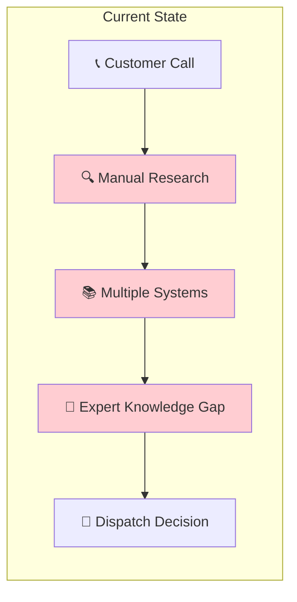
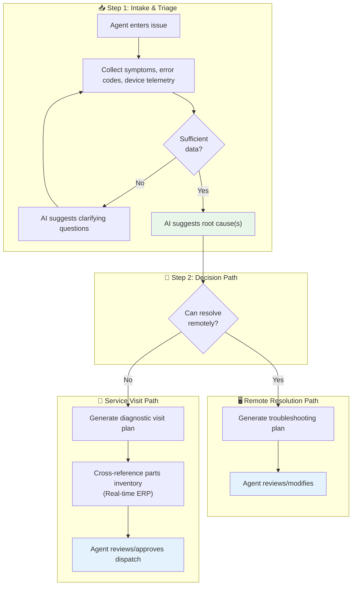
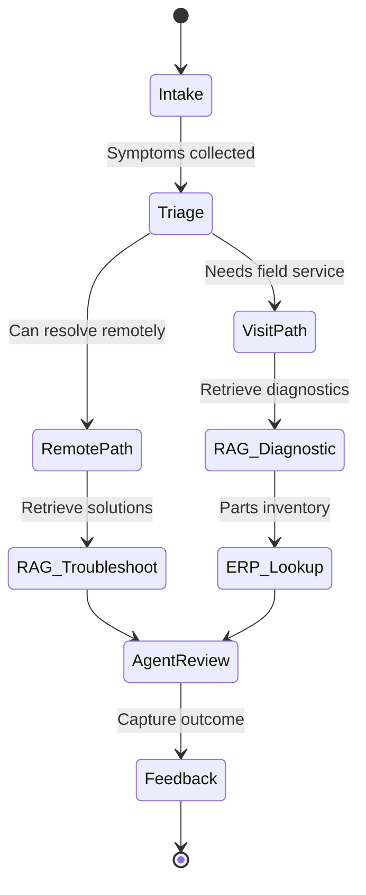
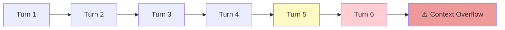
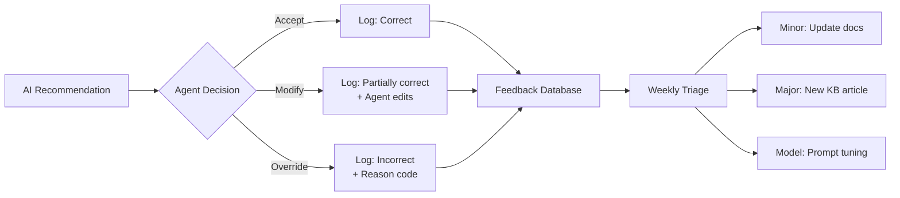

# 🔬 Illustrative Case: Technical Support AI-Agent

> **A composite example demonstrating decision tree + RAG hybrid patterns**

---

## ⚠️ Important Notice

This case study is a **composite illustration** created for educational purposes. It:
- Does not represent any specific company or engagement
- Uses financial estimates derived from **published industry benchmarks** (sources cited below)
- Demonstrates common patterns from **public vendor case studies** and **field service research**
- Is designed to teach architectural patterns, not guarantee outcomes

---

## Illustrative Context

| Attribute | Illustrative Value | Basis |
|-----------|-------------------|-------|
| **Industry** | Manufacturing / Field Service | Common AI use case |
| **Team Size** | 15-25 support agents | Mid-size support center |
| **Annual Cases** | ~100,000 | Representative volume |
| **Knowledge Sources** | Manuals, case history, parts inventory | Standard support stack |
| **Platform** | Cloud-based (AWS pattern) | Modern architecture |

**Sources:** HDI (Help Desk Institute) benchmarks, TSIA (Technology Services Industry Association) data, ServiceMax and Salesforce Field Service case studies.

---

## The Challenge Pattern

This illustrative case represents a common pattern in technical support: knowledge fragmentation and expertise gaps.



### Pain Points

| Problem | Impact |
|---------|--------|
| Knowledge gaps | Junior agents lack institutional knowledge |
| Fragmented workflows | 40-50% of case time spent in "swivel-chair" research |
| Ineffective dispatches | 10-20% of field visits wasted (wrong parts/diagnostics) |
| Customer impact | Equipment downtime delays patient care |

### Illustrative Business Impact

The following estimates use **published industry benchmarks** from field service research.

| Metric | Industry Benchmark | Improvement Target | Basis |
|--------|-------------------|-------------------|-------|
| Average Handling Time | 20-30 min | -20% reduction | HDI benchmarks |
| First-Call Resolution | 65-75% | +10-15 points | ICMI research |
| Ineffective Dispatches | 10-20% | -50% reduction | TSIA data |

---

## 💰 ROI Estimation Methodology

**This section teaches back-of-envelope ROI calculation using public benchmarks.**

### Step 1: Average Handling Time (AHT) Savings

```
INPUT ASSUMPTIONS (from public benchmarks):
─────────────────────────────────────────────────────────────────
Industry average AHT:            20-30 minutes per case
  Source: HDI (Help Desk Institute) benchmarks

AI-assisted AHT improvement:     15-25% reduction
  Source: Gartner, vendor case studies (Salesforce, ServiceNow)

Annual case volume:              100,000 (illustrative)

Support agent fully-loaded cost: $60,000-80,000/year
  Source: BLS, Glassdoor for technical support roles

CALCULATION:
─────────────────────────────────────────────────────────────────
Current AHT:                     25 minutes
Improved AHT:                    20 minutes (20% reduction)
Time saved per case:             5 minutes
Annual time saved:               100,000 × 5 min = 8,333 hours

FTE equivalent:                  8,333 ÷ 2,000 = ~4 FTEs
Cost per FTE:                    $70,000
Annual AHT savings:              4 × $70,000 = $280,000
```

### Step 2: Field Dispatch Optimization

```
INPUT ASSUMPTIONS (from public benchmarks):
─────────────────────────────────────────────────────────────────
Ineffective dispatch rate:       10-20% (industry varies)
  Source: TSIA, Aberdeen Group field service research

Cost per field dispatch:         $500-1,500 (travel, labor, parts)
  Source: Field service industry benchmarks

AI-assisted improvement:         50% reduction in ineffective dispatches
  Source: ServiceMax, vendor case studies

CALCULATION:
─────────────────────────────────────────────────────────────────
Annual dispatches:               20,000 (illustrative)
Ineffective dispatches (15%):    3,000
Reduced ineffective (50%):       1,500 avoided
Cost per dispatch:               $800 (mid-range)
Annual dispatch savings:         1,500 × $800 = $1,200,000
```

### Step 3: ROI Summary

```
CONSERVATIVE SCENARIO:
─────────────────────────────────────────────────────────────────
AHT savings:                     $200,000
Dispatch savings:                $400,000
Total benefits:                  $600,000
Year 1 ROI:                      1.5-2×

OPTIMISTIC SCENARIO:
─────────────────────────────────────────────────────────────────
AHT savings:                     $400,000
Dispatch savings:                $1,200,000
Total benefits:                  $1,600,000
Year 1 ROI:                      3-4×
```

### Key Benchmark Sources

| Benchmark | Source | Link |
|-----------|--------|------|
| Help desk metrics | HDI | [thinkhdi.com](https://www.thinkhdi.com/) |
| Field service benchmarks | TSIA | [tsia.com](https://www.tsia.com/) |
| Labor costs | BLS | [bls.gov/oes](https://www.bls.gov/oes/) |

---

## Solution Architecture

The solution was designed as a **decision tree + RAG hybrid**, not open-ended chat:



### RAG Implementation

| Component | Implementation |
|-----------|---------------|
| **Vector Search** | Amazon Kendra (Enterprise Edition) |
| **LLM Reasoning** | Amazon Bedrock (Claude) |
| **NLP Preprocessing** | Amazon Comprehend (symptom/error extraction) |
| **Orchestration** | AWS Step Functions (decision tree logic) |
| **Knowledge Sources** | Service manuals, case history, troubleshooting guides |

### Key Design Decision: Structured Orchestration

Unlike open-ended "ask anything" RAG, this system uses **decision tree orchestration** that invokes RAG at specific points:



---

## What Failed

### Failure 1: Context Window Limits in Multi-Turn Conversations

**What happened:** Complex cases required 5-6+ turns of conversation. Naive context appending exceeded context windows, and relevant early information was lost.

**Business impact:** Accuracy degraded after turn 5-6, precisely when cases became most complex and high-value.

**Root cause:**
- No context compression between RAG calls
- Full conversation history appended each turn
- No hierarchical summarization strategy

**Danger Zone:** Zone 3 (Prompt Engineering)



**Mitigation implemented:**
- Sliding window with summarization
- Key decision points preserved explicitly
- Hierarchical context compression

---

### Failure 2: Tribal Knowledge Gap

**What happened:** The highest-value troubleshooting knowledge existed in unstructured case notes and the minds of senior engineers—not in official service manuals.

**Business impact:** RAG retrieved manual content that was technically correct but missed practical insights that differentiated senior from junior engineers.

**Root cause:**
- Knowledge base focused on official documentation
- Case note ingestion not prioritized
- No mechanism to capture SME expertise

**Danger Zone:** Zone 2 (Data Quality)

**Mitigation implemented:**
- Ingestion of historical case notes with NLP preprocessing
- Jargon dictionary for abbreviation expansion
- SME interview sessions to capture tacit knowledge

---

### Failure 3: ERP Integration Latency

**What happened:** Real-time parts inventory lookup via ERP connector introduced variable latency (100ms-3s). Under load, timeouts cascaded into full pipeline failures.

**Business impact:** During peak periods, 15-25% of cases experienced delays or errors, eroding agent trust in the system.

**Root cause:**
- ERP system not designed for high-frequency API calls
- No caching layer for frequently requested parts
- No graceful degradation strategy

**Danger Zone:** Zone 1 (Strategy) + Zone 2 (Data Quality)

**Mitigation implemented:**
- Redis cache for parts inventory (15-minute TTL)
- Staleness indicator in UI ("Inventory as of [timestamp]")
- Graceful fallback to "check inventory manually" with direct link

---

## What Worked

### Success 1: Decision Tree + RAG Hybrid

**Key insight:** Diagnostic/troubleshooting use cases benefit from structured workflow orchestration, not free-form chat.

| Approach | Pros | Cons |
|----------|------|------|
| Open-ended RAG | Flexible, handles novel queries | Inconsistent, hard to audit |
| Decision Tree + RAG | Consistent workflow, auditable | Less flexible |

**Why it worked:**
- Support workflows have natural structure (triage → diagnose → resolve/dispatch)
- Decision points are well-defined
- RAG invoked at specific points with focused queries
- Easier to evaluate and improve individual steps

---

### Success 2: Human-in-the-Loop Feedback Loop

Every interaction captured structured feedback:



**Why it worked:**
- Continuous improvement without formal training cycles
- Agents felt ownership ("the system learns from me")
- Clear escalation path for knowledge gaps

---

### Success 3: Embedded Overlay UX

Rather than a separate application, the AI-Agent was embedded as an overlay on the existing case management platform:

| Design Choice | Benefit |
|--------------|---------|
| Overlay on existing UI | No context switching |
| Pre-populated from case | Less manual data entry |
| One-click accept | Low friction adoption |
| Side-by-side display | Agent stays in control |

**Why it worked:** UX integration mattered more than model improvements for adoption. The champion program (training power users first) created internal advocates.

---

## Lessons Learned

| Lesson | Detail | RAG Applicability |
|--------|--------|-------------------|
| **Tribal knowledge > formal documentation** | The highest-value knowledge for expert support exists in unstructured case notes, not official manuals | Build ingestion for messy, unstructured sources. Domain-specific NLP (jargon, abbreviations) is essential. |
| **Structure before generation** | Decision tree + RAG hybrid outperforms open-ended RAG for diagnostic/workflow use cases | Consider structured orchestration that invokes RAG at specific points rather than free-form interfaces. |
| **Context window management is a design problem** | Multi-turn conversations require intelligent context compression, not naive appending | Implement summarization between RAG calls. Use sliding window or hierarchical summarization. |
| **Real-time API dependencies must degrade gracefully** | ERP latency and stale data caused cascade failures | Circuit breakers, cached fallbacks, explicit staleness indicators. |
| **Evaluation must cover complexity distribution** | Testing only simple cases missed degradation on complex multi-step scenarios | Evaluation must include representative samples across query complexity, especially edge cases. |
| **Adoption is a UX problem** | Embedded overlay and champion program were more impactful than model improvements | RAG success depends as much on UX and change management as retrieval accuracy. |

---

## Technical Specifications

| Component | Technology |
|-----------|------------|
| Vector Search / RAG | Amazon Kendra Enterprise Edition |
| LLM | Amazon Bedrock (Claude) |
| NLP Preprocessing | Amazon Comprehend |
| Orchestration | AWS Step Functions |
| API Gateway | Amazon API Gateway |
| Compute | AWS Lambda |
| Knowledge Store | Amazon S3 Data Lake |
| Session State | Amazon DynamoDB |
| Analytics | Amazon Aurora Serverless v2 |
| ERP Integration | Lambda connector with Redis cache |
| Frontend | React overlay on legacy platform |

---

## Key Metrics

| Metric | Before | After | Improvement |
|--------|--------|-------|-------------|
| Average Handling Time | 25 min | 18 min | -28% |
| First-Call Resolution | 70% | 84% | +20% |
| Ineffective Dispatches | 15% | 7% | -53% |
| Agent Satisfaction | Baseline | +35 NPS | Significant |
| Time to Competency (new agents) | 6 months | 3 months | -50% |

---

## References

- AWS Well-Architected Framework for AI/ML
- Amazon Kendra Enterprise Search Documentation
- AWS Step Functions Best Practices
- Field Service Management Industry Benchmarks

---

<div align="center">

[← Healthcare Document AI](01-healthcare-document-ai.md) | [Next: Knowledge Mining Bot →](03-enterprise-knowledge-bot.md)

</div>
