# 🔬 Case Study: Technical Support AI-Agent

> **Intelligent Support Co-Pilot for a Global Medical Device Manufacturer**

---

## Context

| Attribute | Details |
|-----------|---------|
| **Industry** | Medical Technology / Healthcare Equipment |
| **Organization Scale** | 15-25 agent regional support center |
| **Volume** | 75,000-125,000 annual service cases |
| **Knowledge Base** | Service manuals, troubleshooting guides, historical cases, parts inventory |
| **Cloud Platform** | AWS |

---

## The Challenge

The technical support center handles complex service cases for diagnostic imaging and laboratory equipment deployed in hospitals and clinics. Cases range from remote troubleshooting to dispatching field engineers.

```mermaid
flowchart LR
    subgraph Current["Current State"]
        A["📞 Customer Call"] --> B["🔍 Manual Research"]
        B --> C["📚 Multiple Systems"]
        C --> D["🧠 Expert Knowledge Gap"]
        D --> E["🚗 Dispatch Decision"]
    end
    
    style B fill:#ffcdd2
    style C fill:#ffcdd2
    style D fill:#ffcdd2
```

### Pain Points

| Problem | Impact |
|---------|--------|
| Knowledge gaps | Junior agents lack institutional knowledge |
| Fragmented workflows | 40-50% of case time spent in "swivel-chair" research |
| Ineffective dispatches | 10-20% of field visits wasted (wrong parts/diagnostics) |
| Customer impact | Equipment downtime delays patient care |

### Business Impact

| Metric | Baseline | Target | Annual Value |
|--------|----------|--------|--------------|
| Average Handling Time | 20-30 min/case | 15-25 min | $300K-500K savings |
| First-Call Resolution | 65-75% | 80-90% | Customer satisfaction |
| Ineffective Dispatches | 10-20% | 5-10% | $400K-700K savings |
| **Total Opportunity** | | | **$700K-1.2M annually** |

---

## Solution Architecture

The solution was designed as a **decision tree + RAG hybrid**, not open-ended chat:

### RAG Implementation

| Component | Implementation |
|-----------|---------------|
| **Vector Search** | Amazon Kendra (Enterprise Edition) |
| **LLM Reasoning** | Amazon Bedrock (Claude) |
| **NLP Preprocessing** | Amazon Comprehend (symptom/error extraction) |
| **Orchestration** | AWS Step Functions (decision tree logic) |
| **Knowledge Sources** | Service manuals, case history, troubleshooting guides |

### Key Design Decision: Structured Orchestration

Unlike open-ended "ask anything" RAG, this system uses **decision tree orchestration** that invokes RAG at specific points:

---

## What Failed

### Failure 1: Context Window Limits in Multi-Turn Conversations

**What happened:** Complex cases required 5-6+ turns of conversation. Naive context appending exceeded context windows, and relevant early information was lost.

**Business impact:** Accuracy degraded after turn 5-6, precisely when cases became most complex and high-value.

**Root cause:**
- No context compression between RAG calls
- Full conversation history appended each turn
- No hierarchical summarization strategy

**Danger Zone:** Zone 3 (Prompt Engineering)

```mermaid
flowchart LR
    A["Turn 1"] --> B["Turn 2"]
    B --> C["Turn 3"]
    C --> D["Turn 4"]
    D --> E["Turn 5"]
    E --> F["Turn 6"]
    F --> G["⚠️ Context Overflow"]
    
    style E fill:#fff9c4
    style F fill:#ffcdd2
    style G fill:#ef9a9a
```

**Mitigation implemented:**
- Sliding window with summarization
- Key decision points preserved explicitly
- Hierarchical context compression

---

### Failure 2: Tribal Knowledge Gap

**What happened:** The highest-value troubleshooting knowledge existed in unstructured case notes and the minds of senior engineers—not in official service manuals.

**Business impact:** RAG retrieved manual content that was technically correct but missed practical insights that differentiated senior from junior engineers.

**Root cause:**
- Knowledge base focused on official documentation
- Case note ingestion not prioritized
- No mechanism to capture SME expertise

**Danger Zone:** Zone 2 (Data Quality)

**Mitigation implemented:**
- Ingestion of historical case notes with NLP preprocessing
- Jargon dictionary for abbreviation expansion
- SME interview sessions to capture tacit knowledge

---

### Failure 3: ERP Integration Latency

**What happened:** Real-time parts inventory lookup via ERP connector introduced variable latency (100ms-3s). Under load, timeouts cascaded into full pipeline failures.

**Business impact:** During peak periods, 15-25% of cases experienced delays or errors, eroding agent trust in the system.

**Root cause:**
- ERP system not designed for high-frequency API calls
- No caching layer for frequently requested parts
- No graceful degradation strategy

**Danger Zone:** Zone 1 (Strategy) + Zone 2 (Data Quality)

**Mitigation implemented:**
- Redis cache for parts inventory (15-minute TTL)
- Staleness indicator in UI ("Inventory as of [timestamp]")
- Graceful fallback to "check inventory manually" with direct link

---

## What Worked

### Success 1: Decision Tree + RAG Hybrid

**Key insight:** Diagnostic/troubleshooting use cases benefit from structured workflow orchestration, not free-form chat.

| Approach | Pros | Cons |
|----------|------|------|
| Open-ended RAG | Flexible, handles novel queries | Inconsistent, hard to audit |
| Decision Tree + RAG | Consistent workflow, auditable | Less flexible |

**Why it worked:**
- Support workflows have natural structure (triage → diagnose → resolve/dispatch)
- Decision points are well-defined
- RAG invoked at specific points with focused queries
- Easier to evaluate and improve individual steps

---

### Success 2: Human-in-the-Loop Feedback Loop

Every interaction captured structured feedback:

**Why it worked:**
- Continuous improvement without formal training cycles
- Agents felt ownership ("the system learns from me")
- Clear escalation path for knowledge gaps

---

### Success 3: Embedded Overlay UX

Rather than a separate application, the AI-Agent was embedded as an overlay on the existing case management platform:

| Design Choice | Benefit |
|--------------|---------|
| Overlay on existing UI | No context switching |
| Pre-populated from case | Less manual data entry |
| One-click accept | Low friction adoption |
| Side-by-side display | Agent stays in control |

**Why it worked:** UX integration mattered more than model improvements for adoption. The champion program (training power users first) created internal advocates.

---

## Lessons Learned

| Lesson | Detail | RAG Applicability |
|--------|--------|-------------------|
| **Tribal knowledge > formal documentation** | The highest-value knowledge for expert support exists in unstructured case notes, not official manuals | Build ingestion for messy, unstructured sources. Domain-specific NLP (jargon, abbreviations) is essential. |
| **Structure before generation** | Decision tree + RAG hybrid outperforms open-ended RAG for diagnostic/workflow use cases | Consider structured orchestration that invokes RAG at specific points rather than free-form interfaces. |
| **Context window management is a design problem** | Multi-turn conversations require intelligent context compression, not naive appending | Implement summarization between RAG calls. Use sliding window or hierarchical summarization. |
| **Real-time API dependencies must degrade gracefully** | ERP latency and stale data caused cascade failures | Circuit breakers, cached fallbacks, explicit staleness indicators. |
| **Evaluation must cover complexity distribution** | Testing only simple cases missed degradation on complex multi-step scenarios | Evaluation must include representative samples across query complexity, especially edge cases. |
| **Adoption is a UX problem** | Embedded overlay and champion program were more impactful than model improvements | RAG success depends as much on UX and change management as retrieval accuracy. |

---

## Technical Specifications

| Component | Technology |
|-----------|------------|
| Vector Search / RAG | Amazon Kendra Enterprise Edition |
| LLM | Amazon Bedrock (Claude) |
| NLP Preprocessing | Amazon Comprehend |
| Orchestration | AWS Step Functions |
| API Gateway | Amazon API Gateway |
| Compute | AWS Lambda |
| Knowledge Store | Amazon S3 Data Lake |
| Session State | Amazon DynamoDB |
| Analytics | Amazon Aurora Serverless v2 |
| ERP Integration | Lambda connector with Redis cache |
| Frontend | React overlay on legacy platform |

---

## Key Metrics

| Metric | Before | After | Improvement |
|--------|--------|-------|-------------|
| Average Handling Time | 25 min | 18 min | -28% |
| First-Call Resolution | 70% | 84% | +20% |
| Ineffective Dispatches | 15% | 7% | -53% |
| Agent Satisfaction | Baseline | +35 NPS | Significant |
| Time to Competency (new agents) | 6 months | 3 months | -50% |

---

## References

- AWS Well-Architected Framework for AI/ML
- Amazon Kendra Enterprise Search Documentation
- AWS Step Functions Best Practices
- Field Service Management Industry Benchmarks

---

[← Healthcare Document AI](01-healthcare-document-ai.md) | [Next: Knowledge Mining Bot →](03-enterprise-knowledge-bot.md)

