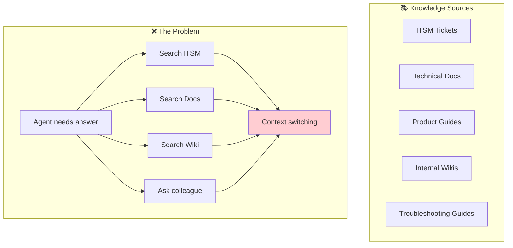
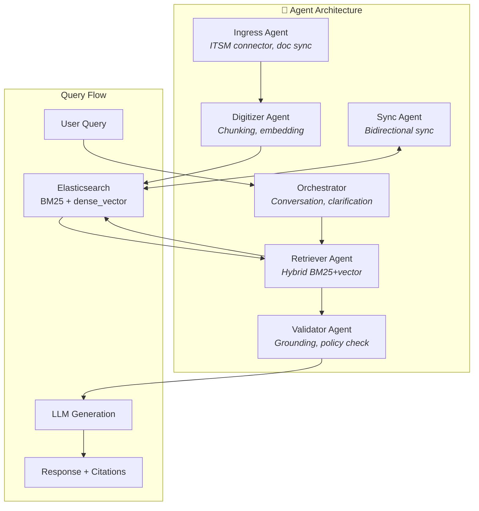
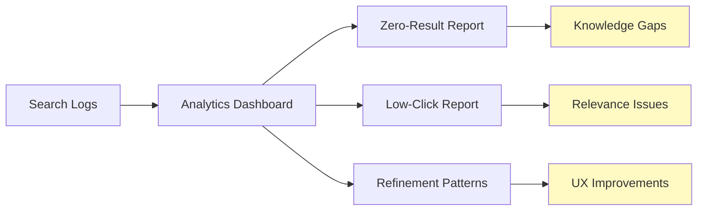

# 💼 Case Study: Enterprise Knowledge Mining Bot

> **L2 Support Knowledge Chatbot for an Enterprise SaaS Company**

---

## Context

| Attribute | Details |
|-----------|---------|
| **Industry** | Technology / Enterprise SaaS |
| **Team Size** | 10-20 person L2 customer support team |
| **Knowledge Sources** | ITSM tickets, technical docs, product guides, internal wikis |
| **Query Volume** | 150-400 queries/day across the team |
| **Dataset Scale** | 10K-100K documents/tickets |
| **Search Platform** | Elasticsearch (managed cloud) |

---

## The Challenge

L2 support agents needed to quickly find answers across fragmented knowledge sources to resolve escalated customer issues.



### Pain Points

| Problem | Impact |
|---------|--------|
| Fragmented knowledge | Multiple systems to search |
| Stale information | Outdated docs still appearing |
| Query intent mismatch | Search returns related but unhelpful results |
| No institutional memory | Senior agent knowledge not captured |

---

## Solution Architecture

The solution used a **multi-agent RAG architecture** with Elasticsearch as the search backbone:



### Key Design Decisions

| Decision | Rationale |
|----------|-----------|
| **Elasticsearch over dedicated vector DB** | Hybrid BM25 + vector in single engine; better for 10K-100K scale |
| **ITSM certified connector** | Real-time ticket sync with production track record |
| **Source-aware chunking** | Different strategies for tickets vs. docs vs. wikis |
| **Built-in analytics** | Search usage patterns reveal knowledge gaps |

---

## What Failed

### Failure 1: Uniform Chunking Destroyed Value

**What happened:** Initial implementation used the same 512-token chunking for all sources. This broke the semantic structure of different document types.

| Source | Problem |
|--------|---------|
| ITSM tickets | Split resolution notes from problem description |
| Documentation | Broke section context |
| Wikis | Lost header hierarchy |

**Business impact:** Retrieval accuracy was 15-20% below expectations. Agents stopped trusting search results.

**Root cause:**
- "One size fits all" chunking strategy
- No field boundary preservation for structured data
- No metadata enrichment

**Danger Zone:** Zone 2 (Data Quality)

**Mitigation implemented:**

```python
def chunk_by_source(document):
    if document.type == "ticket":
        # Chunk by field, preserve structure
        return {
            "problem": document.description,
            "resolution": document.resolution_notes,
            "comments": chunk_comments(document.comments),
            "metadata": document.metadata
        }
    elif document.type == "documentation":
        # Chunk by section headers
        return markdown_header_splitter(document.content)
    elif document.type == "wiki":
        # Preserve hierarchy
        return hierarchical_chunker(document.content)
```

---

### Failure 2: Stale Data Erosion of Trust

**What happened:** Batch sync ran nightly, but ITSM tickets were updated throughout the day. Agents found outdated resolution status, eroding trust in the system.

**Business impact:** Adoption dropped 40% in first month. Agents reverted to manual searches.

**Root cause:**
- Sync frequency based on infrastructure costs, not user expectations
- No freshness indicators on search results
- No event-driven sync for high-priority updates

**Danger Zone:** Zone 2 (Data Quality)

**Key insight:** *Freshness is a trust issue, not just a data issue.* Users will abandon a system that gives outdated answers, regardless of accuracy on fresh data.

**Mitigation implemented:**
- Event-driven sync for ticket status changes
- Visible "Last updated: [timestamp]" on all results
- Freshness boost in ranking (newer content ranked higher)

---

### Failure 3: Query Intent Mismatch

**What happened:** Static 50/50 BM25/vector fusion produced mediocre results for all query types. Lookup queries (ticket numbers, error codes) needed exact match; research queries needed semantic understanding.

**Business impact:** Neither query type was well-served. Precision suffered on lookups; recall suffered on research.

**Root cause:**
- No query classification
- Fixed hybrid weights regardless of query type
- No dynamic adjustment based on query characteristics

**Danger Zone:** Zone 3 (Prompt Engineering)

**Mitigation implemented:**

```python
def classify_and_search(query: str):
    # Detect query intent
    if contains_ticket_id(query) or contains_error_code(query):
        # Lookup query: boost BM25
        return hybrid_search(query, bm25_weight=0.8, vector_weight=0.2)
    elif is_how_to_question(query):
        # Research query: boost vector
        return hybrid_search(query, bm25_weight=0.3, vector_weight=0.7)
    else:
        # Balanced
        return hybrid_search(query, bm25_weight=0.5, vector_weight=0.5)
```

---

## What Worked

### Success 1: Elasticsearch for Hybrid Search

**Decision:** Use Elasticsearch with native vector capabilities instead of a dedicated vector database.

| Factor | Elasticsearch | Dedicated Vector DB |
|--------|--------------|---------------------|
| Hybrid search | Native BM25 + kNN | Vector-only (usually) |
| Scale fit | Optimal for 10K-100K | Optimized for billions |
| ITSM integration | Certified connectors | Custom required |
| Analytics | Built-in | Requires stitching |
| Cost | Predictable | Variable |

**Why it worked:** For this scale (10K-100K documents), Elasticsearch's hybrid capabilities were sufficient, and the operational simplicity (single search engine) reduced complexity.

---

### Success 2: Analytics-Driven Knowledge Gap Detection

**Key insight:** Search analytics revealed patterns that static evaluation couldn't capture.

| Metric | Insight |
|--------|---------|
| Zero-result queries | Knowledge gaps to fill |
| Low-click queries | Results exist but don't match intent |
| Repeated queries | High-value topics for documentation |
| Query refinement patterns | UI/UX friction points |



**Why it worked:** Analytics surfaced system weaknesses faster than curated test sets. The feedback loop drove continuous improvement.

---

### Success 3: Citation and Source Transparency

Every response included:
- Source document link
- Relevant excerpt highlighted
- Confidence indicator
- "Was this helpful?" feedback

**Why it worked:** Transparency built trust. Agents could verify answers and report issues with specific sources.

---

## Lessons Learned

| Lesson | Detail | RAG Applicability |
|--------|--------|-------------------|
| **Source-aware chunking is non-negotiable** | Tickets, docs, wikis have different semantic structures. Uniform chunking destroys the most valuable information. | Design chunking strategies per source type. Preserve field boundaries in structured data. |
| **Query intent classification before retrieval** | Different query types need different retrieval strategies. Static weights fail both. | Implement lightweight query classifier to adjust retrieval parameters based on intent. |
| **Freshness is a trust issue** | Users abandon systems with outdated answers, regardless of accuracy on fresh data. | Design sync frequency based on user expectations. Display freshness indicators. |
| **Analytics reveal what evaluation misses** | Search analytics surfaced patterns static datasets couldn't capture. | Invest in analytics and usage monitoring from day one. |
| **Hybrid search needs dynamic weighting** | Static fusion produces mediocre results. Different queries need different blends. | Implement dynamic weighting based on query characteristics. |

---

## Platform Selection Rationale

| Criteria | Elasticsearch | Cloud-Native Search | Dedicated Vector DB |
|----------|--------------|---------------------|---------------------|
| Hybrid search | ✅ Native BM25 + kNN | ⚠️ Newer features | ❌ Vector-only |
| ITSM integration | ✅ Certified connector | ⚠️ Custom required | ❌ Custom required |
| Analytics | ✅ Built-in dashboards | ⚠️ Requires stitching | ❌ Minimal |
| Scale fit (10K-100K) | ✅ Optimal | ✅ Good | ⚠️ Over-engineered |
| Cost predictability | ✅ Predictable | ⚠️ Pay-per-use spikes | ⚠️ Premium tiers |

**Decision:** Elasticsearch selected for hybrid search maturity, ITSM integration, and built-in analytics.

---

## Technical Specifications

| Component | Technology |
|-----------|------------|
| Search Engine | Elasticsearch (managed cloud) |
| Embedding | Elasticsearch learned sparse encoder |
| LLM | Cloud-hosted GPT-4 via inference API |
| Hybrid Search | BM25 + dense_vector with RRF |
| Ingestion | Elasticsearch ingest pipelines |
| ITSM Sync | Certified connector |
| Backend | Python FastAPI |
| Frontend | React chat interface |
| Analytics | Elasticsearch dashboards |

---

## Key Metrics

| Metric | Before | After | Improvement |
|--------|--------|-------|-------------|
| Time to find answer | 8-12 min | 2-4 min | -65% |
| Search satisfaction | 45% | 78% | +73% |
| Zero-result queries | 25% | 8% | -68% |
| Ticket resolution time | Baseline | -18% | Significant |
| Knowledge gap detection | Manual | Automated | Continuous |

---

## References

- Elasticsearch Dense Vector Search Documentation
- Elasticsearch Reciprocal Rank Fusion
- ITSM Integration Best Practices
- Search Analytics and Observability Patterns

---

<div align="center">

[← Technical Support Agent](02-medtech-support-agent.md) | [Back to Case Studies →](README.md)

</div>
