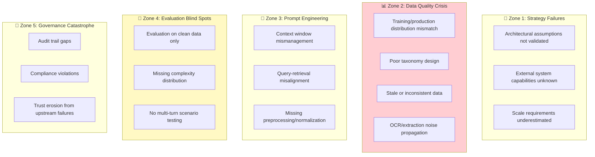

# 📋 Illustrative Case Studies

> **Composite examples designed to teach RAG implementation patterns, with transparent estimation methodology.**

---

## ⚠️ About These Case Studies

### Composite & Illustrative Nature

These case studies are **composite illustrations** designed to teach RAG implementation patterns. They are constructed from:

1. **Published industry research** — Benchmarks from AHIMA, AHA, MGMA, Gartner, and analyst firms
2. **Open-source documentation** — Patterns from Microsoft, AWS, Google published case studies
3. **Academic literature** — Peer-reviewed research on RAG systems ([see references](../resources/academic-references.md))
4. **Community knowledge** — Patterns shared in public forums and conferences

### What This Means

| Aspect | Clarification |
|--------|---------------|
| **Companies** | No real company is represented; industries are illustrative |
| **Financial figures** | Calculated from public benchmarks using transparent methodology |
| **Technical details** | Reflect common architectural patterns from published sources |
| **Outcomes** | Illustrative of what's possible based on vendor case studies |

### Using These Studies

✅ **Use these to:**
- Understand common failure patterns and solutions
- Learn back-of-envelope ROI estimation methodology
- Identify questions to ask in your own context
- See how public benchmarks can inform business cases

❌ **Do not use these to:**
- Guarantee specific outcomes to stakeholders
- Justify budgets without your own analysis
- Replace proper due diligence and planning

---

## Case Studies

| # | Case Study | Industry | Theme | Key Learning |
|---|------------|----------|-------|--------------|
| 1 | [Healthcare Document AI](01-healthcare-document-ai.md) | Healthcare | Document classification | ROI estimation from public benchmarks |
| 2 | [Technical Support Agent](02-medtech-support-agent.md) | Manufacturing | Decision tree + RAG | Structured orchestration patterns |
| 3 | [Knowledge Mining Bot](03-enterprise-knowledge-bot.md) | Enterprise SaaS | Hybrid search | Platform selection criteria |

---

## The 5 Danger Zones Framework

Across all case studies, failures cluster into five distinct "danger zones":

### Danger Zone Distribution Across Case Studies

| Danger Zone | Occurrences | Key Pattern |
|-------------|-------------|-------------|
| **Zone 1: Strategy** | 2 | Architectural assumptions about external systems not validated until production |
| **Zone 2: Data Quality** | 7 | **Dominant failure zone.** Taxonomy design, distribution mismatch, chunking, stale data, OCR noise |
| **Zone 3: Prompt Engineering** | 4 | Context window management, query-retrieval alignment, preprocessing failures |
| **Zone 4: Evaluation** | 5 | Evaluation on clean/curated data that fails to represent production complexity |
| **Zone 5: Governance** | 3 | Trust and compliance issues from upstream failures |

> **Key Insight:** Zone 2 (Data Quality) is responsible for the majority of production failures. Investing in data quality upfront has the highest ROI.

---

## Cross-Cutting Lessons

### From All Case Studies

| Lesson | Detail | RAG Applicability |
|--------|--------|-------------------|
| **Taxonomy design is a data quality issue** | Categories designed for humans often confuse AI classifiers | Metadata taxonomy directly impacts retrieval quality |
| **Training data must represent production** | Curated "golden sets" produce misleadingly high accuracy | Evaluation datasets must include messy real-world queries |
| **Deterministic before semantic** | Exact identifier lookup before vector similarity | Hybrid retrieval outperforms pure semantic search |
| **Confidence scoring is essential** | Without calibrated confidence, no effective HITL | RAG systems need retrieval confidence for triage |
| **Integration latency is the hidden killer** | API rate limits discovered in production | Design for latency, rate limits, graceful degradation |
| **Frame AI as augmentation** | Positioning as tool that frees staff for high-value work | Adoption depends on positioning as augmentation |
| **Freshness is a trust issue** | Users abandon systems with outdated answers | Sync frequency based on user expectations |
| **Structure before generation** | Decision tree + RAG hybrid outperforms open-ended RAG | Consider structured orchestration for workflows |

---

## Using These Case Studies

### For ML/AI Engineers
Focus on the technical architecture sections and failure root causes. Pay attention to:
- Chunking and retrieval decisions
- Integration patterns with external systems
- Evaluation approaches (or lack thereof)

### For Solution Architects
Focus on the system design patterns and what worked. Pay attention to:
- HITL (Human-in-the-Loop) design patterns
- Confidence-based routing
- Platform and service selection

### For Technical Leaders
Focus on the business impact and lessons learned. Pay attention to:
- ROI framing (revenue recapture vs cost reduction)
- Risk mitigation strategies
- Adoption and change management

---

## Contributing Case Studies

We welcome anonymized case studies from your production experience. See [CONTRIBUTING.md](../CONTRIBUTING.md) for guidelines on:
- Required elements
- Anonymization requirements
- Formatting standards

---

## Academic & Industry References

The patterns and statistics in these case studies are supported by:

- **S&P Global Market Intelligence** (2025) — 42% AI project abandonment rate (↑ from 17% in 2024)
- **RAND Corporation** (2024) — 80%+ AI project failure rate (2× non-AI IT projects)
- **MIT NANDA** (2025) — 95% of GenAI pilots report zero measurable P&L impact
- **Gartner Research** (2024) — 30% GenAI PoC abandonment prediction; only 48% reach production
- **McKinsey State of AI** (2025) — 88% AI usage but only 39% report enterprise EBIT impact
- **Stanford HAI AI Index** (2025) — $109B US private AI investment; AI incidents rose 56% YoY
- **TMLS Insights** — RAG implementation patterns
- **Industry benchmarks** — Healthcare denial rates, support center metrics

---

[← Back to Main](../README.md)

