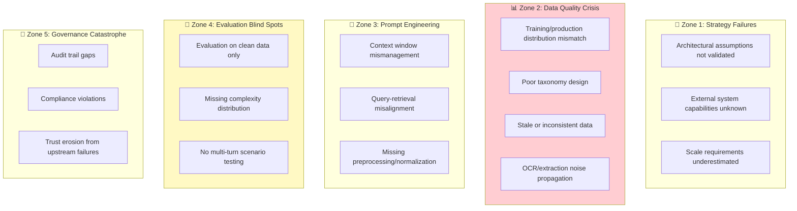

# 📋 Case Studies

> **Real-world production experiences with anonymized details. Learn from actual failures and successes.**

---

## Overview

These case studies are drawn from actual enterprise RAG deployments. Details have been anonymized to protect confidential information while preserving the technical lessons.

Each case study includes:
- ✅ Business context and scale
- ❌ What failed and root cause analysis
- ✅ What worked and why
- 🔧 Technical architecture patterns
- 📚 Lessons with RAG applicability

---

## Case Studies

| # | Case Study | Industry | Scale | Key Theme |
|---|------------|----------|-------|-----------|
| 1 | [Healthcare Document AI](01-healthcare-document-ai.md) | Healthcare | 8-12K docs/month | Document classification + RAG-adjacent patterns |
| 2 | [Technical Support Agent](02-medtech-support-agent.md) | Medical Devices | 75-125K cases/year | Decision tree + RAG hybrid |
| 3 | [Knowledge Mining Bot](03-enterprise-knowledge-bot.md) | Enterprise SaaS | 10K-100K docs | ITSM integration + hybrid search |

---

## The 5 Danger Zones Framework

Across all case studies, failures cluster into five distinct "danger zones":

### Danger Zone Distribution Across Case Studies

| Danger Zone | Occurrences | Key Pattern |
|-------------|-------------|-------------|
| **Zone 1: Strategy** | 2 | Architectural assumptions about external systems not validated until production |
| **Zone 2: Data Quality** | 7 | **Dominant failure zone.** Taxonomy design, distribution mismatch, chunking, stale data, OCR noise |
| **Zone 3: Prompt Engineering** | 4 | Context window management, query-retrieval alignment, preprocessing failures |
| **Zone 4: Evaluation** | 5 | Evaluation on clean/curated data that fails to represent production complexity |
| **Zone 5: Governance** | 3 | Trust and compliance issues from upstream failures |

> **Key Insight:** Zone 2 (Data Quality) is responsible for the majority of production failures. Investing in data quality upfront has the highest ROI.

---

## Cross-Cutting Lessons

### From All Case Studies

| Lesson | Detail | RAG Applicability |
|--------|--------|-------------------|
| **Taxonomy design is a data quality issue** | Categories designed for humans often confuse AI classifiers | Metadata taxonomy directly impacts retrieval quality |
| **Training data must represent production** | Curated "golden sets" produce misleadingly high accuracy | Evaluation datasets must include messy real-world queries |
| **Deterministic before semantic** | Exact identifier lookup before vector similarity | Hybrid retrieval outperforms pure semantic search |
| **Confidence scoring is essential** | Without calibrated confidence, no effective HITL | RAG systems need retrieval confidence for triage |
| **Integration latency is the hidden killer** | API rate limits discovered in production | Design for latency, rate limits, graceful degradation |
| **Frame AI as augmentation** | Positioning as tool that frees staff for high-value work | Adoption depends on positioning as augmentation |
| **Freshness is a trust issue** | Users abandon systems with outdated answers | Sync frequency based on user expectations |
| **Structure before generation** | Decision tree + RAG hybrid outperforms open-ended RAG | Consider structured orchestration for workflows |

---

## Using These Case Studies

### For ML/AI Engineers
Focus on the technical architecture sections and failure root causes. Pay attention to:
- Chunking and retrieval decisions
- Integration patterns with external systems
- Evaluation approaches (or lack thereof)

### For Solution Architects
Focus on the system design patterns and what worked. Pay attention to:
- HITL (Human-in-the-Loop) design patterns
- Confidence-based routing
- Platform and service selection

### For Technical Leaders
Focus on the business impact and lessons learned. Pay attention to:
- ROI framing (revenue recapture vs cost reduction)
- Risk mitigation strategies
- Adoption and change management

---

## Contributing Case Studies

We welcome anonymized case studies from your production experience. See [CONTRIBUTING.md](../CONTRIBUTING.md) for guidelines on:
- Required elements
- Anonymization requirements
- Formatting standards

---

## Academic & Industry References

The patterns and statistics in these case studies are supported by:

- **PIMCO 2025 Analysis** — 42% AI project failure rate, $13.8B at risk
- **Gartner Research** — Enterprise AI adoption patterns
- **TMLS Insights** — RAG implementation patterns
- **Industry benchmarks** — Healthcare denial rates, support center metrics

---

[← Back to Main](../README.md)

