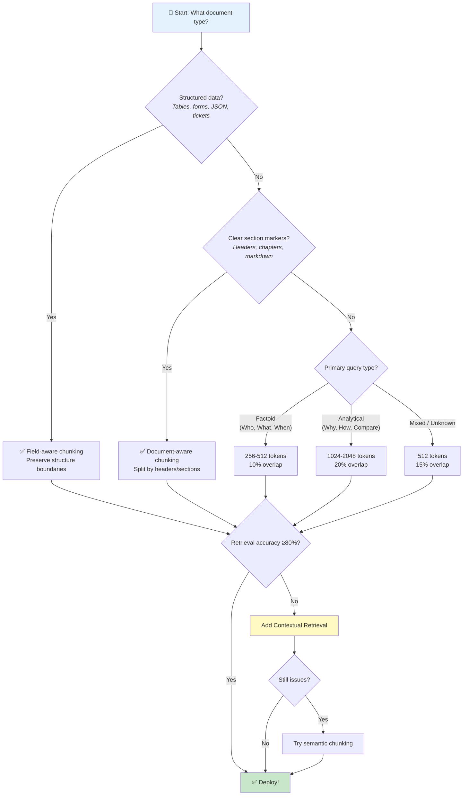

# 🌳 Chunking Decision Tree

> **Quick reference for selecting the right chunking strategy**

---

## Decision Flowchart



---

## Quick Reference Table

| Document Type | Strategy | Size | Overlap | Key Consideration |
|--------------|----------|------|---------|-------------------|
| **ITSM tickets** | Field-aware | By field | N/A | Keep description/resolution together |
| **Technical docs** | Header-based | By section | N/A | Preserve hierarchy |
| **FAQs** | Q&A pairs | Per pair | N/A | Keep question with answer |
| **Legal contracts** | Clause-based | By clause | 10% | Exact references matter |
| **Product manuals** | Section-based | 512-1024 | 15% | Step sequences intact |
| **Research papers** | Semantic | Variable | 20% | Concept boundaries |
| **Code files** | AST-based | By function | 0% | Syntax-aware splitting |
| **Chat logs** | Turn-based | By turn | Context | Conversation flow |

---

## Size Guidelines

```
┌─────────────────────────────────────────────────────────────────┐
│                    CHUNK SIZE SPECTRUM                          │
├─────────────────────────────────────────────────────────────────┤
│                                                                 │
│  128     256     512     1024    2048    4096                  │
│   │       │       │        │       │       │                   │
│   ▼       ▼       ▼        ▼       ▼       ▼                   │
│  ┌─┐     ┌──┐    ┌───┐    ┌────┐  ┌─────┐ ┌──────┐            │
│  │ │     │  │    │   │    │    │  │     │ │      │            │
│  └─┘     └──┘    └───┘    └────┘  └─────┘ └──────┘            │
│   │       │       │        │       │       │                   │
│   │       │       │        │       │       │                   │
│ Precise  Facts   General  Analysis Deep    Full               │
│ lookup          purpose           dive    context             │
│                                                                 │
│ ←── Higher Precision          Higher Recall ──→                │
│                                                                 │
└─────────────────────────────────────────────────────────────────┘
```

---

## Anti-Patterns to Avoid

| ❌ Don't | ✅ Do Instead |
|----------|--------------|
| Fixed-size without overlap | Add 10-20% overlap |
| Same strategy for all docs | Match strategy to document type |
| Chunks > 2048 tokens | Split into smaller semantic units |
| Chunks < 128 tokens | Increase to preserve context |
| Hardcode without measuring | Iterate based on retrieval metrics |

---

## Contextual Retrieval Checklist

Add Contextual Retrieval when:

- [ ] Retrieval accuracy < 80%
- [ ] Chunks lose document context
- [ ] Many similar documents in corpus
- [ ] Users report "found but not helpful" results

**Implementation cost:** ~$1 per million tokens (one-time)  
**Expected improvement:** 49-67% retrieval failure reduction

---

## Platform-Specific Notes

### AWS Bedrock Knowledge Bases
```
Supports: FIXED_SIZE, SEMANTIC, HIERARCHICAL, NONE
Recommended: SEMANTIC with maxTokens=512
```

### Azure AI Search
```
Use Document Intelligence for structure detection
Chunk by detected sections/headers
```

### Google Vertex AI
```
Automatic chunking with configurable size
Set chunk_size=500 as baseline
```

---

<div align="center">

[← Back to Cheatsheets](../README.md#-cheatsheets)

</div>
