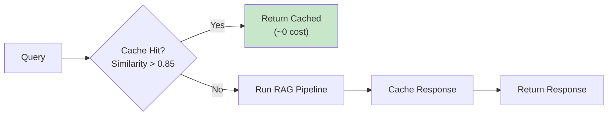
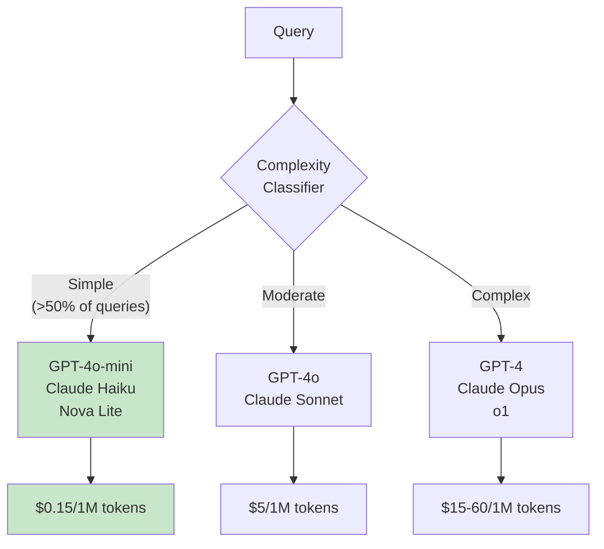

# 💰 Cost Optimization Cheatsheet

> **From $18K/month to sustainable production — lever-by-lever savings guide**

---

## The Problem

RAG costs grow **exponentially**, not linearly:

```
┌─────────────────────────────────────────────────────────────────┐
│                    COST GROWTH PATTERN                          │
├─────────────────────────────────────────────────────────────────┤
│                                                                 │
│  Cost                                                           │
│   │                                                    💥       │
│   │                                              ●              │
│   │                                        ●                    │
│   │                                   ●                         │
│   │                              ●                              │
│   │                         ●                                   │
│   │                    ●                                        │
│   │               ●                                             │
│   │          ●                                                  │
│   │     ●                                                       │
│   │●                                                            │
│   └────────────────────────────────────────────────── Scale     │
│                                                                 │
│   Real case: Azure deployment reached $18K/month                │
│   After optimization: ~$3K/month (83% savings)                  │
│                                                                 │
└─────────────────────────────────────────────────────────────────┘
```

---

## Cost Levers Summary

| Lever | Savings | Effort | Priority |
|-------|---------|--------|----------|
| **Semantic Caching** | 18-68% | Medium | 🔴 High |
| **Model Routing** | 30-80% | Medium | 🔴 High |
| **Prompt Optimization** | Up to 35% | Low | 🟡 Medium |
| **Batch Inference** | 50% | Low | 🟡 Medium |
| **Vector Quantization** | 4-8x storage | Low | 🟡 Medium |
| **Right-sized Infra** | 20-50% | High | 🟡 Medium |

**Combined stack savings: 70-85%**

---

## Lever 1: Semantic Caching (18-68% savings)

**How it works:** Cache query-response pairs indexed by embedding similarity. Similar queries return cached responses.



### Implementation Options

| Tool | Type | Best For |
|------|------|----------|
| **GPTCache** | Open-source | Self-hosted, full control |
| **Redis Semantic Cache** | Managed | Redis ecosystem |
| **Bedrock Prompt Caching** | AWS | Bedrock users (90% on cached) |
| **Azure OpenAI Caching** | Azure | Azure OpenAI users |

### Key Settings

| Parameter | Recommended | Notes |
|-----------|-------------|-------|
| Similarity threshold | 0.85 | Lower = more hits, less accuracy |
| Cache TTL | 24-72 hours | Match data freshness requirements |
| Max cache size | Based on budget | LRU eviction |

### Code Example

```python
from gptcache import cache
from gptcache.embedding import Onnx
from gptcache.similarity_evaluation import OnnxModelEvaluation

# Initialize cache
cache.init(
    embedding_func=Onnx(),
    similarity_evaluation=OnnxModelEvaluation(),
    similarity_threshold=0.85
)

# Use with your LLM calls
@cache.cached
def query_rag(question: str) -> str:
    # Your RAG pipeline
    return response
```

---

## Lever 2: Model Routing (30-80% savings)

**How it works:** Route simple queries to cheaper models, reserve expensive models for complex reasoning.



### Cost Comparison

| Model | Input (per 1M) | Output (per 1M) | Relative Cost |
|-------|---------------|-----------------|---------------|
| GPT-4o-mini | $0.15 | $0.60 | 1x |
| Claude Haiku | $0.25 | $1.25 | ~2x |
| GPT-4o | $5.00 | $15.00 | ~30x |
| Claude Sonnet | $3.00 | $15.00 | ~25x |
| GPT-4 Turbo | $10.00 | $30.00 | ~60x |
| Claude Opus | $15.00 | $75.00 | ~100x |

### Routing Classifier

```python
def classify_complexity(query: str, context_length: int) -> str:
    """Simple rule-based complexity classifier."""
    
    # Complex indicators
    complex_words = ["analyze", "compare", "synthesize", "evaluate", "why"]
    multi_hop = any(w in query.lower() for w in ["and also", "in addition", "furthermore"])
    long_context = context_length > 4000
    
    # Simple indicators
    simple_patterns = ["what is", "when did", "who is", "where is"]
    is_simple = any(query.lower().startswith(p) for p in simple_patterns)
    
    if is_simple and not long_context:
        return "simple"  # Use cheap model
    elif any(w in query.lower() for w in complex_words) or multi_hop:
        return "complex"  # Use expensive model
    else:
        return "moderate"  # Use mid-tier model
```

---

## Lever 3: Prompt Optimization (Up to 35% savings)

### Techniques

| Technique | Savings | Description |
|-----------|---------|-------------|
| **Concise instructions** | 10-20% | Remove verbose preambles |
| **Context pruning** | 15-25% | Remove low-relevance chunks |
| **LLMLingua** | 20-35% | Automatic prompt compression |
| **Summary-based context** | 30-50% | Summarize before passing |

### Before/After Example

```
❌ BEFORE (428 tokens):
"You are a helpful AI assistant. Your task is to help users find 
information in our knowledge base. Please be thorough and accurate 
in your responses. Make sure to cite your sources. If you don't 
know something, say so. Here is some context that might be relevant:

[Context 1]: The company was founded in 2010 by John Smith. It has 
grown to become a leading provider of enterprise software solutions...
[Context 2]: Our return policy allows customers to return products...
[Context 3]: The company headquarters is located in San Francisco...

Based on the above context, please answer the following question:
What is the return policy?"

✅ AFTER (156 tokens):
"Answer based on context. Cite sources. Say 'unknown' if not found.

Context:
- Return policy: 30-day full refund for unused items.
- Contact support@company.com for returns.

Question: What is the return policy?"
```

---

## Lever 4: Batch Inference (50% savings)

**When to use:** Non-real-time workloads (nightly reports, bulk processing)

| Provider | Batch Discount | Latency |
|----------|---------------|---------|
| AWS Bedrock | 50% | 24-hour SLA |
| OpenAI | 50% | 24-hour window |
| Anthropic | Contact sales | Varies |

### AWS Bedrock Batch Example

```python
import boto3

bedrock = boto3.client('bedrock-runtime')

# Submit batch job
response = bedrock.create_model_invocation_job(
    modelId='anthropic.claude-3-sonnet',
    jobName='nightly-processing',
    inputDataConfig={
        's3InputDataConfig': {
            's3Uri': 's3://bucket/inputs/'
        }
    },
    outputDataConfig={
        's3OutputDataConfig': {
            's3Uri': 's3://bucket/outputs/'
        }
    }
)
```

---

## Lever 5: Vector Storage Optimization

### Quantization Savings

| Precision | Storage | Accuracy Loss | Savings |
|-----------|---------|---------------|---------|
| float32 | 100% | Baseline | - |
| float16 | 50% | Minimal | 2x |
| int8 | 25% | 1-2% | 4x |
| Binary | 3% | 5-10% | 32x |

### Platform Cost Comparison

| Service | Pricing Model | ~Cost at 1M vectors |
|---------|--------------|---------------------|
| **Pinecone** | Per-vector | ~$70/month |
| **Weaviate Cloud** | Per-dimension | ~$50/month |
| **Qdrant Cloud** | Per-cluster | ~$30/month |
| **OpenSearch Serverless** | Compute + Storage | ~$700/month (HA) |
| **AWS S3 Vectors** | Pay-as-you-go | ~$70/month |
| **Azure AI Search Basic** | Flat tier | ~$75/month |

### Quick Wins

```python
# 1. Use int8 quantization
index = create_index(
    dimensions=1536,
    metric="cosine",
    quantization="int8"  # 4x storage savings
)

# 2. Reduce embedding dimensions
from sentence_transformers import SentenceTransformer

# Use smaller model (384 vs 1536 dimensions)
model = SentenceTransformer('all-MiniLM-L6-v2')  # 384 dims, still good quality

# 3. Deduplicate before indexing
from datasketch import MinHash, MinHashLSH

lsh = MinHashLSH(threshold=0.9, num_perm=128)
# Deduplicate similar documents before embedding
```

---

## Cost Monitoring Dashboard

Track these metrics:

| Metric | Formula | Alert Threshold |
|--------|---------|-----------------|
| Cost per query | Total cost / query count | >50% above baseline |
| Cache hit rate | Cached / Total queries | <30% (investigate) |
| Model mix | Queries per model tier | <50% on cheap tier |
| Token efficiency | Tokens used / Tokens needed | >1.5x (optimize prompts) |

---

## Quick Wins Checklist

### This Week (Low Effort)
- [ ] Enable prompt caching (if available)
- [ ] Implement model routing (simple classifier)
- [ ] Trim verbose prompts
- [ ] Enable int8 quantization

### This Month (Medium Effort)
- [ ] Implement semantic caching
- [ ] Build complexity classifier
- [ ] Set up cost monitoring
- [ ] Batch non-urgent workloads

### This Quarter (High Effort)
- [ ] Optimize vector storage (right-size)
- [ ] Implement LLMLingua compression
- [ ] Fine-tune smaller model for common queries
- [ ] Re-architect for cost efficiency

---

## Platform-Specific Tips

### AWS
- Use S3 Vectors for vector storage (90% cheaper than OpenSearch)
- Enable Bedrock prompt caching
- Use Intelligent Prompt Routing (auto 30% savings)

### Azure
- Use AI Search Basic tier (~$75/month includes vectors)
- Enable Azure OpenAI prompt caching
- Use GPT-4o-mini for simple queries

### GCP
- Use Vertex AI batch predictions
- Enable caching for Gemini
- Consider Gemini Flash for cost-sensitive workloads

---

<div align="center">

[← Back to Cheatsheets](../README.md#-cheatsheets)

</div>
