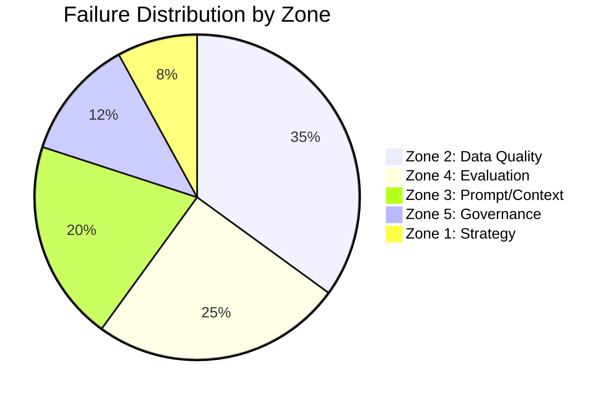

# 🚨 Danger Zones Checklist

> **Pre-flight checklist before RAG production deployment**

---

## Overview

Based on analysis of enterprise RAG deployments, failures cluster into 5 danger zones. Use this checklist to assess your system before production.

---

## Zone 1: Strategy Failures (8%)

*Architectural assumptions not validated until too late*

### Pre-Production Checklist

- [ ] **External API dependencies validated under load**
  - Rate limits documented
  - Timeout behaviors tested
  - Fallback strategies implemented

- [ ] **Scale requirements estimated and tested**
  - Peak query volume defined
  - Storage growth projected
  - Cost at scale calculated

- [ ] **Integration points confirmed**
  - Authentication working
  - Data formats validated
  - Error handling tested

- [ ] **Success criteria defined**
  - Measurable KPIs established
  - Baseline metrics captured
  - Evaluation framework in place

### Red Flags 🚩
- "We'll figure out scale later"
- "The API should handle it"
- "Integration is straightforward"

---

## Zone 2: Data Quality Crisis (35%)

*The dominant failure zone — most RAG failures trace here*

### Pre-Production Checklist

- [ ] **Training/production distribution match**
  - Production data analyzed
  - Edge cases represented
  - Data augmentation applied

- [ ] **Taxonomy design validated**
  - Categories semantically distinct
  - No overlapping catch-alls
  - Tested with actual classifiers

- [ ] **Chunking strategy appropriate**
  - Document types analyzed
  - Chunk sizes tested
  - Overlap configured

- [ ] **Data freshness strategy defined**
  - Sync frequency determined
  - Staleness indicators implemented
  - Event-driven updates for critical data

- [ ] **Data quality pipeline exists**
  - Deduplication
  - Format normalization
  - Noise handling (OCR errors, etc.)

### Red Flags 🚩
- "We used a curated test set"
- "One chunking strategy for everything"
- "Nightly batch sync is fine"
- "The taxonomy worked for humans"

---

## Zone 3: Prompt/Context Engineering (20%)

*What context reaches the LLM matters as much as retrieval*

### Pre-Production Checklist

- [ ] **Context window management tested**
  - Multi-turn conversations handled
  - Summarization strategy implemented
  - Context overflow prevented

- [ ] **Query preprocessing exists**
  - Normalization applied
  - Expansion/rewriting tested
  - Intent classification working

- [ ] **Prompt templates validated**
  - Grounding instructions included
  - Citation format specified
  - Edge cases handled

- [ ] **Context assembly tested**
  - Relevance ordering implemented
  - Lost-in-middle mitigated
  - Source diversity considered

### Red Flags 🚩
- "Just append everything to context"
- "The prompt worked in testing"
- "Multi-turn will work the same"

---

## Zone 4: Evaluation Blind Spots (25%)

*Most RAG systems in production lack systematic evaluation (industry surveys consistently show the majority have no automated quality monitoring)*

### Pre-Production Checklist

- [ ] **RAG Triad implemented**
  - Answer Relevancy measured
  - Faithfulness measured
  - Context Relevancy measured

- [ ] **Golden dataset created**
  - 50+ QA pairs minimum
  - Complexity distribution representative
  - Ground truth validated

- [ ] **Evaluation covers production diversity**
  - Simple queries included
  - Complex multi-step queries included
  - Edge cases included
  - Adversarial queries included

- [ ] **Regression testing automated**
  - CI/CD integration
  - Nightly runs
  - Alert thresholds defined

- [ ] **Per-component metrics tracked**
  - Retrieval metrics separate
  - Generation metrics separate
  - End-to-end metrics tracked

### Red Flags 🚩
- "It worked in demos"
- "We'll add evaluation later"
- "Manual testing is sufficient"
- "The team reviewed the outputs"

---

## Zone 5: Governance Catastrophe (12%)

*Trust and compliance failures from upstream issues*

### Pre-Production Checklist

- [ ] **Audit trail complete**
  - All queries logged
  - All responses logged
  - All sources tracked

- [ ] **Citation/attribution working**
  - Sources linked in responses
  - Confidence indicated
  - "I don't know" handled

- [ ] **Compliance requirements met**
  - Data handling validated
  - PII protection verified
  - Retention policies applied

- [ ] **User feedback captured**
  - Rating mechanism exists
  - Issue reporting available
  - Feedback reviewed regularly

- [ ] **Escalation paths defined**
  - Human review triggers clear
  - Override mechanisms exist
  - Incident response documented

### Red Flags 🚩
- "Trust but don't verify"
- "Users will report issues"
- "Compliance is someone else's problem"

---

## Severity Assessment

For each zone, rate your risk:

| Zone | Low Risk | Medium Risk | High Risk |
|------|----------|-------------|-----------|
| **Strategy** | All validated | Some assumptions | Major unknowns |
| **Data Quality** | Production-representative | Gaps identified | Curated only |
| **Prompt/Context** | Fully tested | Edge cases pending | Basic testing |
| **Evaluation** | Automated CI/CD | Manual testing | No framework |
| **Governance** | Complete audit trail | Partial logging | No governance |

---

## Go/No-Go Decision

### ✅ GO: Ready for Production
- All Zone 2 (Data Quality) items checked
- All Zone 4 (Evaluation) items checked
- No High Risk in any zone
- Fallback strategies defined

### ⚠️ CONDITIONAL: Limited Rollout
- Most items checked
- Some Medium Risk acceptable
- Monitoring in place
- Quick rollback available

### ❌ NO-GO: Not Ready
- Any High Risk in Zone 2 or Zone 4
- Missing evaluation framework
- No fallback strategies
- Critical integrations untested

---

## Quick Remediation Priorities

If you're not ready, fix in this order:

1. **Evaluation framework** (Zone 4) — You can't improve what you don't measure
2. **Data quality pipeline** (Zone 2) — Garbage in, garbage out
3. **Fallback strategies** (Zone 1) — Graceful degradation
4. **Audit logging** (Zone 5) — You'll need it for debugging
5. **Context management** (Zone 3) — Multi-turn will break

---

[← Back to Cheatsheets](../README.md#-cheatsheets)

