# 📏 Evaluation Metrics Quick Reference

> **The RAG Triad and beyond — metrics every RAG system should track**

---

## The RAG Triad (Minimum Viable Evaluation)

```mermaid
flowchart TD
    subgraph Triad["📐 RAG Triad"]
        AR["🎯 Answer Relevancy"]
        F["📌 Faithfulness"]
        CR["📚 Context Relevancy"]
    end
    
    Q[Query] --> AR
    Q --> CR
    AR --> R[Response]
    F --> R
    CR --> D[Retrieved Docs]
    F --> D
```



| Metric | Question Answered | Requires Ground Truth? | Target |
|--------|------------------|----------------------|--------|
| **Answer Relevancy** | Is the response relevant to the question? | No | ≥ 0.8 |
| **Faithfulness** | Is the response grounded in retrieved context? | No | ≥ 0.85 |
| **Context Relevancy** | Is the retrieved context relevant to the question? | No | ≥ 0.75 |

---

## Extended Metrics

### Retrieval Metrics

| Metric | What It Measures | When to Use |
|--------|-----------------|-------------|
| **Context Precision** | Are highly relevant docs ranked first? | Ranking quality matters |
| **Context Recall** | Did we retrieve all relevant info? | Requires ground truth |
| **Hit Rate** | Did top-K contain a relevant doc? | Simple retrieval check |
| **MRR (Mean Reciprocal Rank)** | How high is the first relevant doc? | Ranking evaluation |

### Generation Metrics

| Metric | What It Measures | When to Use |
|--------|-----------------|-------------|
| **Factual Correctness** | Is the response factually accurate? | Requires ground truth |
| **Answer Completeness** | Does response fully answer the query? | Complex queries |
| **Semantic Similarity** | How close to ideal answer? | Reference-based eval |
| **Toxicity/Safety** | Does response contain harmful content? | User-facing systems |

---

## Quick Implementation

### RAGAS

```python
from ragas import evaluate
from ragas.metrics import (
    answer_relevancy,
    faithfulness,
    context_precision,
    context_recall,
)
from datasets import Dataset

# Prepare your data
data = {
    "question": ["What is the return policy?"],
    "answer": ["30-day full refund available."],
    "contexts": [["Returns accepted within 30 days for full refund."]],
    "ground_truth": ["Customers can return items within 30 days."]  # Optional
}

dataset = Dataset.from_dict(data)

# Evaluate
results = evaluate(
    dataset,
    metrics=[
        answer_relevancy,
        faithfulness,
        context_precision,
        context_recall,
    ]
)

print(results)
```

### DeepEval

```python
from deepeval import evaluate
from deepeval.metrics import (
    AnswerRelevancyMetric,
    FaithfulnessMetric,
    ContextualRelevancyMetric,
)
from deepeval.test_case import LLMTestCase

# Create test case
test_case = LLMTestCase(
    input="What is the return policy?",
    actual_output="We offer a 30-day full refund at no extra cost.",
    retrieval_context=[
        "All customers are eligible for a 30 day full refund at no extra cost."
    ]
)

# Define metrics with thresholds
metrics = [
    AnswerRelevancyMetric(threshold=0.7),
    FaithfulnessMetric(threshold=0.7),
    ContextualRelevancyMetric(threshold=0.7),
]

# Run evaluation
evaluate(test_cases=[test_case], metrics=metrics)
```

---

## Metric Selection Guide


---

## Thresholds by Use Case

| Use Case | Answer Relevancy | Faithfulness | Context Relevancy |
|----------|-----------------|--------------|-------------------|
| **Customer Support** | ≥ 0.75 | ≥ 0.80 | ≥ 0.70 |
| **Healthcare/Legal** | ≥ 0.85 | ≥ 0.95 | ≥ 0.85 |
| **Internal Knowledge** | ≥ 0.70 | ≥ 0.75 | ≥ 0.65 |
| **Research/Academic** | ≥ 0.80 | ≥ 0.90 | ≥ 0.80 |
| **E-commerce** | ≥ 0.75 | ≥ 0.80 | ≥ 0.70 |

---

## Golden Dataset Guidelines

### Minimum Requirements

| Attribute | Recommendation |
|-----------|---------------|
| **Size** | 50+ QA pairs minimum, 200+ for production |
| **Diversity** | Cover all query types and topics |
| **Complexity** | Include simple, moderate, and complex queries |
| **Edge cases** | 10-15% should be challenging |
| **Ground truth** | Validated by domain experts |

### Distribution Template

```
Query Complexity:
├── Simple (40%)      - Single fact lookup
├── Moderate (35%)    - Multi-step reasoning
├── Complex (15%)     - Multi-hop, synthesis
└── Edge cases (10%)  - Adversarial, ambiguous
```

---

## CI/CD Integration

### GitHub Actions Example

```yaml
name: RAG Evaluation
on: [push, pull_request]

jobs:
  evaluate:
    runs-on: ubuntu-latest
    steps:
      - uses: actions/checkout@v3
      
      - name: Run RAG evaluation
        run: |
          pip install ragas deepeval
          python evaluate_rag.py
      
      - name: Check thresholds
        run: |
          python check_thresholds.py --min-faithfulness 0.8
```

### Threshold Check Script

```python
import sys
import json

def check_thresholds(results_file, thresholds):
    with open(results_file) as f:
        results = json.load(f)
    
    failed = []
    for metric, min_value in thresholds.items():
        if results.get(metric, 0) < min_value:
            failed.append(f"{metric}: {results[metric]:.2f} < {min_value}")
    
    if failed:
        print("❌ Threshold violations:")
        for f in failed:
            print(f"  - {f}")
        sys.exit(1)
    else:
        print("✅ All thresholds passed")

# Usage
check_thresholds("results.json", {
    "answer_relevancy": 0.75,
    "faithfulness": 0.80,
    "context_relevancy": 0.70
})
```

---

## Operational Metrics (Production)

Don't forget non-ML metrics:

| Metric | Target | Why It Matters |
|--------|--------|----------------|
| **Latency (p95)** | < 3s | User experience |
| **Throughput** | > 10 QPS | Scale handling |
| **Cost per query** | Track trend | Budget management |
| **Cache hit rate** | > 30% | Cost efficiency |
| **Error rate** | < 1% | Reliability |
| **User satisfaction** | Track trend | Real-world quality |

---

## Tool Comparison

| Feature | RAGAS | DeepEval | AutoRAG |
|---------|-------|----------|---------|
| Reference-free | ✅ | ✅ | ✅ |
| CI/CD integration | Manual | ✅ Native | Manual |
| Synthetic data gen | ✅ | ✅ | ✅ |
| Red-teaming | ❌ | ✅ 40+ vulnerabilities | ❌ |
| Pipeline optimization | ❌ | ❌ | ✅ AutoML-style |
| License | Apache 2.0 | Apache 2.0 | Apache 2.0 |

---

<div align="center">

[← Back to Cheatsheets](../README.md#-cheatsheets)

</div>
