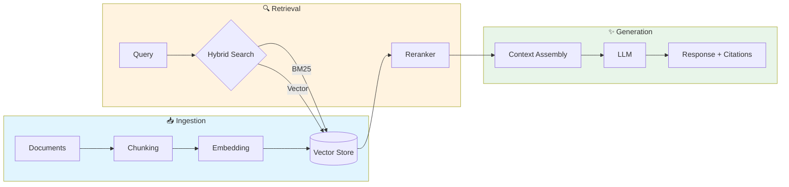
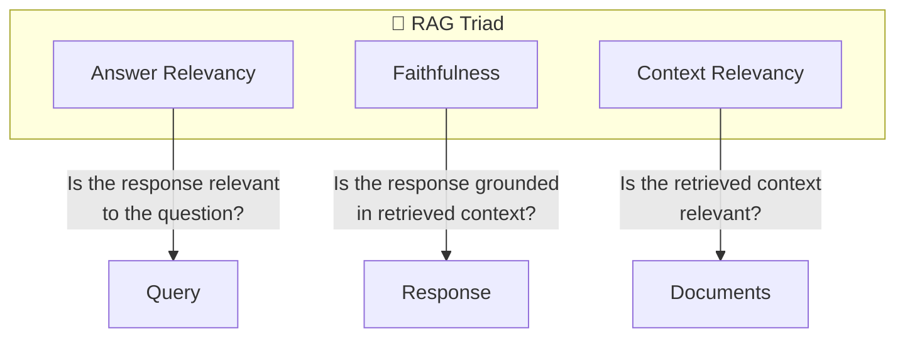

<div align="center">

# 🔍 RAG Production Guide

### A Practitioner's Handbook for Building RAG Systems That Actually Work

[](LICENSE)
[](../CONTRIBUTING.md)
[](https://github.com/MarioLazo/rag-production-guide/graphs/contributors)

**80%+ of AI projects fail: twice the rate of conventional IT projects.** This guide shows you how to beat those odds.

[Why RAG Fails](#-why-rag-fails) •
[Architecture](#️-architecture) •
[Case Studies](#-illustrative-case-studies) •
[Cheatsheets](#-cheatsheets) •
[Platform Guides](#️-platform-guides) •
[Contributing](#-contributing) •
[Disclaimers](#️-disclaimers)

</div>

---

## 📖 About This Guide

Whether you're an ML engineer debugging retrieval issues, an architect evaluating platforms, or a technical leader building the business case for RAG, this guide meets you where you are.

This repository distills findings from **30+ authoritative sources**, including research from IBM, OpenAI, Anthropic, Microsoft, AWS, Google, NVIDIA, and leading open-source frameworks, combined with patterns from published case studies and industry benchmarks.

> **The core insight:** The "vector DB + LLM" recipe that dominates blog posts fails in practice. Success requires **modular architecture**, **hybrid retrieval**, **rigorous evaluation**, and **deliberate cost engineering**.

<br>
<br>

## 🎯 How to Use This Guide

### ⚡ Quick Start (30 min)
1. [Executive Summary](01-executive-summary.md), Why 80% fail
2. [Danger Zones Checklist](../cheatsheets/danger-zones-checklist.md), Pre-flight check
3. One [Case Study](case-studies/) of your choice

### 📖 Core Concepts (2-3 hours)
1. [Failure Modes](02-failure-modes.md) → [Chunking](03-chunking-strategies.md) → [Hybrid Search](04-hybrid-search.md)
2. [Evaluation Framework](07-evaluation-framework.md)
3. [Cost Engineering](08-cost-engineering.md)

### 🧠 Deep Dive (Full day)
Follow the [Documentation Index](README.md) for the complete learning path with all 8 core documents, platform guides, and case studies.

### Who This Is For

| Role | What You'll Get |
|------|-----------------|
| 🔧 **ML/AI Engineers** | Implementation patterns, code examples, evaluation frameworks |
| 🏗️ **Solution Architects** | Architecture decisions, platform comparisons, integration patterns |
| 📊 **Technical Leaders** | ROI frameworks, risk assessment, vendor evaluation criteria |

<br>
<br>

## 🚨 Why RAG Fails

<div align="center">

```text
┌─────────────────────────────────────────────────────────────────┐
│                    THE STARK REALITY                            │
├─────────────────────────────────────────────────────────────────┤
│  📉 80%+ of AI projects fail (2× the rate of non-AI IT)         │
│  📉 48% never reach production                                  │
│  📉 42% of AI projects abandoned in 2025 (↑ from 17% in 2024)   │
│  📉 95% of GenAI pilots report zero measurable P&L impact       │
└─────────────────────────────────────────────────────────────────┘
```
*Sources: RAND Corporation 2024, Gartner 2024, S&P Global 2025, MIT NANDA 2025*

</div>

<br>
<br>

### 🔍 The Blind Spots

These failures don't throw errors. They don't show up in logs. They just **quietly deliver wrong answers** while your metrics look fine.

<table>
<tr>
<th>#</th>
<th>Blind Spot</th>
<th>What Goes Wrong</th>
<th>Smell Test 👃</th>
</tr>
<tr>
<td>1</td>
<td><b>📄 Insufficient or inconsistent sources</b></td>
<td>The data sources do not have the information intended or are inconsistent in material ways</td>
<td><i>"X = P..." but "When Y is Z, X is non-P"</i></td>
</tr>
<tr>
<td>2</td>
<td><b>🔍 Missed Retrieval</b></td>
<td>The required information isn't retrieved due to, for example, semantic collapse</td>
<td><i>"I know we have a doc about this..."</i></td>
</tr>
<tr>
<td>3</td>
<td><b>🎯 Context Misalignment</b></td>
<td>Retrieved docs, even if related, do not fully answer the question</td>
<td><i>"Well, sort of, but not really..."</i></td>
</tr>
<tr>
<td>4</td>
<td><b>📅 Stale Indexes</b></td>
<td>Outdated info served as current truth</td>
<td><i>"That price/policy changed weeks ago"</i></td>
</tr>
<tr>
<td>5</td>
<td><b>👻 Context utilization failure</b></td>
<td>Critical info in context is ignored, for example, due to its position</td>
<td><i>"The answer was RIGHT THERE in the context"</i></td>
</tr>
<tr>
<td>6</td>
<td><b>🎭 Hallucination</b></td>
<td>Whether context is correct or not, LLM confidently makes stuff up</td>
<td><i>"Where did it get THAT from?!"</i></td>
</tr>
<tr>
<td>7</td>
<td><b>🫠 Answer Irrelevance</b></td>
<td>Context is correct and sufficient, but the response contains parts that not address the query</td>
<td><i>"That's not what I asked"</i></td>
</tr>
<tr>
<td>8</td>
<td><b>🙈 Answer Incompleteness</b></td>
<td>Context is correct and sufficient, but the response is not answering the complete question.</td>
<td><i>"Correct, but still misses the main point"</i></td>
</tr>
</table>

<details>
<summary><b>🍕 ELI5: The Pizza Delivery Analogy</b></summary>

<br/>

Imagine your RAG system is a pizza delivery service:

| Blind Spot | Pizza Analogy |
|--------|--------------|
| **Insufficient or inconsistent sources** | The menu says "gluten-free crust available" but the kitchen says they stopped carrying it last month |
| **Missed Retrieval** | You ordered pepperoni, they have pepperoni, but the kitchen can't find it so they send you plain cheese |
| **Context Misalignment** | You asked for "something spicy" and got a pizza with hot sauce packets on the side (technically spicy, not what you meant) |
| **Stale Indexes** | Menu says $12, but price went up to $15 last month, now you're arguing at checkout |
| **Hallucination** | You asked about gluten-free options, they confidently say "yes!" (there are none) |
| **Context utilization failure** | They read your note but ignored half the toppings you listed |
| **Answer Irrelevance** | You asked for pepperoni, they delivered pepperoni, plus a detailed history of Italian cheese-making |
| **Answer Incompleteness** | You asked for a half-pepperoni half-veggie pizza, they only made the pepperoni half |

</details>

#### ⚡ Quick Links

| I want to... | Go here |
|-------------|---------|
| Understand the blind spots in depth | [🔍 Blind Spots Deep Dive](02a-seven-blind-spots-deep-dive.md) |
| Run a quick health check | [👃 RAG Smell Test](../cheatsheets/rag-smell-test.md) |
| See real failure case studies | [Deep Dive → Case Studies](02a-seven-blind-spots-deep-dive.md#case-studies-why-ai-assistants-seem-stupid) |
| Get the full diagnostic checklist | [Deep Dive → Checklist](02a-seven-blind-spots-deep-dive.md#-interactive-diagnostic-checklist) |

<br>
<br>

## 🏗️ Architecture

### The Modular RAG Pattern



### Key Architectural Insights

| Component | Recommendation | Why |
|-----------|---------------|-----|
| **Chunking** | 400-512 tokens, 10-20% overlap | Most failures trace back to chunking decisions |
| **Search** | Hybrid BM25 + Vector with RRF | Pure vector search has fundamental bottlenecks |
| **Reranking** | Cross-encoder on top-20 results | 49-67% retrieval failure reduction |
| **Context** | Contextual Retrieval preprocessing | Single highest-ROI improvement available |

> 📚 **Deep Dives:**
> - [Chunking Strategies](03-chunking-strategies.md)
> - [Hybrid Search](04-hybrid-search.md)
> - [Mental Models & First Principles](05-mental-models.md)
> - [Advanced Patterns](06-advanced-patterns.md)

<br>
<br>

## 📋 Illustrative Case Studies

Composite examples designed to teach RAG patterns with transparent ROI methodology. Each case study includes:
- 📊 Public benchmark-based estimates (sources cited)
- ❌ Common failure patterns and root causes
- ✅ Solution patterns and lessons learned
- 💰 Back-of-envelope ROI calculation methodology

| Case Study | Industry Pattern | Key Learning |
|------------|-----------------|--------------|
| [Healthcare Document Processing](../case-studies/01-healthcare-document-ai.md) | Document Classification | ROI estimation from public benchmarks |
| [Technical Support AI-Agent](../case-studies/02-medtech-support-agent.md) | Field Service / Support | Decision tree + RAG hybrid architecture |
| [Enterprise Knowledge Mining](../case-studies/03-enterprise-knowledge-bot.md) | Enterprise Search | Hybrid search and platform selection |

> 📚 **Framework:** [The 5 Danger Zones](../case-studies/README.md#the-5-danger-zones-framework)

<br>
<br>

## 📊 Cheatsheets

Quick-reference guides for common decisions:

| Cheatsheet | Description |
|------------|-------------|
| [👃 RAG Smell Test](../cheatsheets/rag-smell-test.md) | 5-minute health check, is something off? ⭐ NEW |
| [🌳 Chunking Decision Tree](../cheatsheets/chunking-decision-tree.md) | Visual guide for chunk size selection |
| [⚖️ Hybrid Search Weights](../cheatsheets/hybrid-search-weights.md) | Domain-specific BM25/vector weights |
| [🚨 Danger Zones Checklist](../cheatsheets/danger-zones-checklist.md) | Pre-flight checklist before production |
| [📏 Evaluation Metrics](../cheatsheets/evaluation-metrics.md) | RAG Triad + extended metrics |
| [💰 Cost Optimization](../cheatsheets/cost-optimization.md) | From $18K/month to sustainable |

<br>
<br>

## ☁️ Platform Guides

Practical implementation guidance for major platforms:

| Platform | Guide | Key Services |
|----------|-------|--------------|
|  | [AWS Bedrock](platform-guides/aws-bedrock.md) | Bedrock, Kendra, OpenSearch, S3 Vectors |
|  | [Azure AI](platform-guides/azure-ai-search.md) | AI Search, OpenAI Service, Document Intelligence |
|  | [Google Vertex AI](platform-guides/gcp-vertex-ai.md) | Vertex AI Search, Gemini, Document AI |
|  | [Databricks](platform-guides/databricks-mosaic.md) | Mosaic AI, Vector Search, MLflow |
|  | [UiPath](platform-guides/uipath-automation.md) | AI Center, Document Understanding, Orchestrator |

<br>
<br>

## 📈 Evaluation Framework

The industry-standard **RAG Triad**:



| Tool | Stars | Best For |
|------|-------|----------|
| [RAGAS](https://github.com/explodinggradients/ragas) | ~12K | Reference-free evaluation, synthetic test data |
| [DeepEval](https://github.com/confident-ai/deepeval) | ~12K | CI/CD integration, 50+ metrics, red-teaming |
| [AutoRAG](https://github.com/Marker-Inc-Korea/AutoRAG) | ~5K | AutoML-style pipeline optimization |

> 📚 **Deep Dive:** [Evaluation Framework](07-evaluation-framework.md)

<br>
<br>

## 💰 Cost Engineering

RAG costs grow **exponentially**, not linearly. A documented case reached **$18K/month** before optimization.

| Optimization | Savings | Implementation |
|-------------|---------|----------------|
| **Semantic Caching** | 18-68% | Cache query-response pairs by embedding similarity |
| **Model Routing** | 30-80% | Route simple queries to cheaper models |
| **Prompt Optimization** | Up to 35% | Concise instructions, context pruning |
| **Batch Inference** | 50% | Non-real-time workloads |

**Total potential savings: 70-85%** with the full optimization stack.

> 📚 **Deep Dive:** [Cost Engineering](08-cost-engineering.md)

<br>
<br>

## 🤝 Contributing

We welcome contributions from the community! This guide improves with diverse production experiences, and we especially value insights from **practitioners in the trenches** and **researchers pushing the boundaries**.

Your personal and lived experience matters, whether you've shipped RAG systems at scale, recovered from spectacular failures, or discovered novel techniques worth sharing.

### Ways to Contribute

| Contribution | Description |
|--------------|-------------|
| 🐛 **Report Issues** | Found errors or outdated information? Let us know |
| 📝 **Share Case Studies** | Add anonymized stories from your production experience |
| 🔧 **Improve Examples** | Enhance platform-specific implementations |
| 🔬 **Add Research** | Link relevant papers or share experimental findings |
| 🌐 **Translate** | Help make this guide accessible in other languages |
| 📊 **Visualize** | Add diagrams, flowcharts, or decision trees |

See [CONTRIBUTING.md](../CONTRIBUTING.md) for detailed guidelines.

<br>
<br>

## 🙏 Acknowledgments

This guide stands on the shoulders of giants. We're deeply grateful to:

### Open Source Community
- **[RAGFlow](https://github.com/infiniflow/ragflow)** by InfiniFlow: Production-ready RAG with deep document understanding
- **[RAGAS](https://github.com/explodinggradients/ragas)** by Exploding Gradients: Reference-free evaluation framework
- **[DeepEval](https://github.com/confident-ai/deepeval)** by Confident AI: Production testing with 50+ metrics
- **[AutoRAG](https://github.com/Marker-Inc-Korea/AutoRAG)** by Marker Inc: AutoML-style pipeline optimization
- **[Athina AI Cookbooks](https://github.com/athina-ai/rag-cookbooks)**: Complete taxonomy from Naive → Agentic

### Enterprise & Research
- **Microsoft**: Azure AI Search, GraphRAG, GPT-RAG patterns
- **AWS**: Bedrock samples, RAG reference architectures
- **Google**: Vertex AI: Gemini integration patterns
- **Databricks**: GenAI Cookbook, MLflow evaluation
- **NVIDIA**: GPU-accelerated RAG blueprints
- **IBM**: Granite community cookbooks

See [ACKNOWLEDGMENTS.md](../ACKNOWLEDGMENTS.md) for the complete list.

<br>
<br>

## 📚 Resources

- [Official Vendor Repositories](../resources/official-vendor-repos.md)
- [Community Projects](../resources/community-repos.md)
- [Further Reading](../resources/further-reading.md)
- [Glossary](../resources/glossary.md)

<br>
<br>

## ⚠️ Disclaimers

<details>
<summary><b>📚 Educational Content</b></summary>

This guide is provided for **educational and informational purposes only**. It does not constitute professional advice. Before making significant technology or business decisions, consult with qualified professionals appropriate to your situation.
</details>

<details>
<summary><b>🔬 Curated Knowledge, Not Proprietary Information</b></summary>

This guide is a **curated synthesis** of:
- **Peer-reviewed academic research**: Published papers from EACL, ICLR, NAACL, TACL, and other venues ([see references](../resources/academic-references.md))
- **Open-source frameworks**: Publicly available GitHub repositories from Microsoft, AWS, Google, and the community
- **Industry benchmarks**: Published statistics from S&P Global, RAND Corporation, MIT NANDA, Gartner, McKinsey, Stanford HAI, AHIMA, AHA, and other research organizations
- **Community knowledge**: Patterns shared by practitioners in public forums, conferences, and published case studies

**No proprietary or confidential information is included.** All sources are publicly available and cited.
</details>

<details>
<summary><b>🎭 Composite Case Studies</b></summary>

The case studies in this guide are **composite illustrations** created for educational purposes. They:
- **Do not represent any specific company** or client engagement
- **Combine patterns** observed across multiple public sources and industry research
- **Use modified details** including scale, timelines, and technical specifics
- **Employ illustrative financial estimates** based on published industry benchmarks

Any resemblance to actual organizations is coincidental.
</details>

<details>
<summary><b>💰 Financial Estimates</b></summary>

All financial figures (costs, savings, ROI) are **illustrative estimates** based on:
- Published industry benchmarks (cited in each case study)
- Back-of-envelope calculation methodology (shown transparently)
- Conservative ranges rather than point estimates

**Your actual results will vary** based on your specific context, implementation quality, organizational factors, and market conditions. These figures are intended to teach estimation methodology, not to guarantee outcomes.
</details>

<details>
<summary><b>📜 No Warranty</b></summary>

This content is provided "as is" without warranty of any kind, express or implied. The authors and contributors are not liable for any damages arising from the use of this information.
</details>

<br>
<br>

## 📜 License

This project is licensed under the MIT License, see the [LICENSE](LICENSE) file for details.

<br>
<br>

<div align="center">

**Built with ❤️ by practitioners, for practitioners**

[⬆ Back to Top](#-rag-production-guide)

</div>
