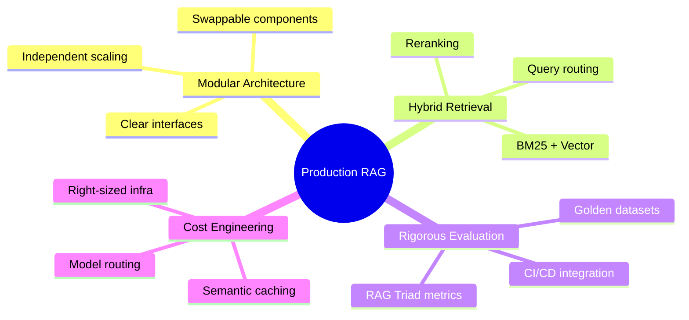
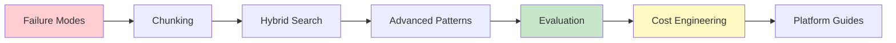

# 📋 Executive Summary

> **80%+ of AI projects fail — twice the rate of conventional IT projects (RAND 2024). RAG systems are no exception. They fail not because the technology is flawed, but because teams treat it as a plug-and-play solution rather than a precision engineering challenge.**

🍕 <b>Wait, what's RAG again?</b>

 

**RAG = Retrieval-Augmented Generation**

Think of ChatGPT as a really smart person who read the entire internet up until 2023. They're brilliant, but:
- They don't know what happened yesterday
- They've never read YOUR company's documents
- They might confidently make stuff up

**RAG is like giving that smart person a search engine and your company's filing cabinet.** Now when you ask a question, they:
1. **Search** for relevant documents first
2. **Read** the specific info they found  
3. **Answer** based on what they just read

That's it. Search → Read → Answer. The "Retrieval" part is the search, the "Generation" part is the answer.

**Why it fails:** Turns out, building a good search system for an AI is really hard. Most of the failures happen in the search step, not the answer step.

---

## The Problem

The data is stark:

| Metric | Value | Source |
|--------|-------|--------|
| AI project failure rate | **80%+** (2× non-AI IT projects) | RAND Corporation 2024 |
| Projects that never reach production | **48%** | Gartner 2024 |
| AI projects abandoned in 2025 | **42%** (↑ from 17% in 2024) | S&P Global 2025 |
| GenAI pilots with zero P&L impact | **95%** | MIT NANDA 2025 |
| Organizations reporting negative AI impacts | **51%** | McKinsey 2025 |

The pattern is consistent across all major research: deployment ≠ value creation. High performers are **2× more likely to redesign workflows before selecting AI tools** (McKinsey 2025).

---

## Why This Guide Exists

The "vector DB + LLM" recipe that dominates blog posts and tutorials fails in practice. Success requires:

---

## Who This Guide Is For

### 🔧 ML/AI Engineers

**What you'll learn:**
- Implementation patterns for chunking, retrieval, and generation
- Code examples for evaluation (RAGAS, DeepEval)
- Platform-specific configurations (AWS, Azure, GCP, Databricks, UiPath)

**Start with:** [Chunking Strategies](03-chunking-strategies.md), [Evaluation Framework](07-evaluation-framework.md)

### 🏗️ Solution Architects

**What you'll learn:**
- Architecture decisions and trade-offs
- Integration patterns with enterprise systems
- Platform selection criteria
- Failure mode analysis and mitigation

**Start with:** [Failure Modes](02-failure-modes.md), [Advanced Patterns](06-advanced-patterns.md)

### 📊 Technical Leaders

**What you'll learn:**
- ROI frameworks for RAG investments
- Risk assessment checklists
- Vendor evaluation criteria
- Cost optimization strategies

**Start with:** [Cost Engineering](08-cost-engineering.md), [Case Studies](../case-studies/)

---

## The Three Insights That Matter Most

Based on synthesis of 30+ authoritative sources (2024-2026):

### 1. Contextual Retrieval is the Single Highest-ROI Improvement

Most teams haven't implemented Anthropic's Contextual Retrieval pattern, which achieves:
- **49% reduction** in retrieval failures (standalone)
- **67% reduction** when combined with reranking
- **~$1 per million tokens** one-time preprocessing cost

🍕 <b>Plain English: What's Contextual Retrieval?</b>

 

Imagine you have a company wiki, and somewhere in the middle of a 50-page document it says:

> *"Revenue increased 15% year-over-year."*

If someone asks "Did ACME Corp's revenue grow?", the AI might not find that sentence because it doesn't mention "ACME Corp"—it's just floating there without context.

**Contextual Retrieval fixes this** by adding a little intro to each chunk before storing it:

> *"This chunk is from ACME Corp's 2024 Annual Report, specifically the Financial Performance section. Revenue increased 15% year-over-year."*

Now when someone searches, the chunk actually contains the relevant keywords. It's like adding a sticky note to every page saying "this page is about X from document Y."

**Why it's the highest ROI:** It's a one-time preprocessing step that makes EVERYTHING more findable. Do it once, benefit forever.

### 2. The Evaluation Gap is the Primary Risk

**Most RAG systems lack systematic evaluation** (industry surveys suggest the majority of production deployments have no automated quality monitoring), yet the tools are mature, free, and integrate into CI/CD in hours:
- RAGAS for reference-free evaluation
- DeepEval for pytest-like testing
- Both Apache 2.0 licensed

🍕 <b>Plain English: What's the "Evaluation Gap"?</b>

 

Most RAG systems are like restaurants that never check if customers like the food.

The chef (your AI) makes dishes (answers), but:
- Nobody tastes the food before serving
- There's no comment card
- You only find out something's wrong when customers stop coming

**The evaluation gap means:** You deployed an AI that answers questions, but you have no idea if the answers are actually correct. You're flying blind.

**Why it matters:** Your RAG system could be giving wrong answers 40% of the time and you'd never know until someone complains. Or worse, until they make a bad decision based on bad info.

**The good news:** There are free tools (RAGAS, DeepEval) that can automatically check if your answers are correct. Most people just... don't use them.

### 3. Cost Optimization is a Design-Time Decision

The difference between **$18K/month** and **$3K/month** is architectural:
- Semantic caching layers
- Model routing
- Right-sized infrastructure

Not incremental tuning after deployment.

🍕 <b>Plain English: Why $18K vs $3K?</b>

 

Every time someone asks your RAG system a question, you're paying:
- 💰 To turn the question into numbers (embedding)
- 💰 To search your database
- 💰 To have the AI write an answer (the expensive part!)

**The $18K approach:** Every question, no matter how simple, goes through the full expensive pipeline. "What time do you close?" costs the same as "Explain quantum physics."

**The $3K approach:**
- **Caching:** "What time do you close?" was asked 50 times today. Answer it once, reuse the answer.
- **Model routing:** Simple questions → cheap/fast model. Complex questions → expensive/smart model.
- **Right-sizing:** Don't use a $0.03/query model when a $0.001/query model works fine.

**Key insight:** This has to be designed in from the start. Bolting it on later is 10x harder.

---

## How to Use This Guide

### Quick Reference

| Need | Go To |
|------|-------|
| Understand why RAG fails | [Failure Modes](02-failure-modes.md) |
| Choose chunk sizes | [Chunking Decision Tree](../cheatsheets/chunking-decision-tree.md) |
| Configure hybrid search | [Hybrid Search](04-hybrid-search.md) |
| Evaluate your system | [Evaluation Framework](07-evaluation-framework.md) |
| Optimize costs | [Cost Engineering](08-cost-engineering.md) |
| See real examples | [Case Studies](../case-studies/) |
| Platform-specific guidance | [Platform Guides](platform-guides/) |

### Recommended Reading Order

---

## Key Statistics Reference

| Topic | Key Number | Context |
|-------|------------|---------|
| Chunking | **80%** | Percentage of RAG failures traced to chunking decisions |
| Chunk size | **400-512 tokens** | Recommended starting point with 10-20% overlap |
| Semantic collapse | **>0.65** | Inter-document similarity threshold causing degradation |
| Query routing | **18%** | Relative accuracy gain from intent routing |
| Contextual Retrieval | **49-67%** | Retrieval failure reduction |
| Hybrid search alpha | **0.6** | Optimal fixed weighting (favoring BM25 slightly) |
| Evaluation threshold | **85-90%** | Recommended benchmark accuracy |
| Cost optimization | **70-85%** | Potential savings with full optimization stack |

---

## Next Steps

1. **Assess your current state** — Use the [Danger Zones Checklist](../cheatsheets/danger-zones-checklist.md)
2. **Identify quick wins** — Contextual Retrieval and evaluation are low-effort, high-impact
3. **Build incrementally** — Start with hybrid search, add complexity only when metrics justify it

---

[← Back to Main](../README.md) | [Next: Failure Modes →](02-failure-modes.md)

