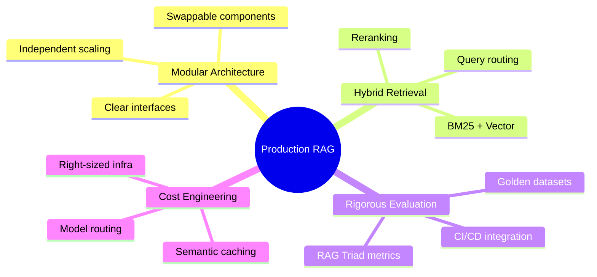
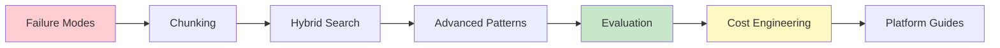

# 📋 Executive Summary

> **RAG systems fail in production 80% of the time not because the technology is flawed, but because teams treat it as a plug-and-play solution rather than a precision engineering challenge.**

---

## The Problem

The data is stark:

| Metric | Value | Source |
|--------|-------|--------|
| Enterprise RAG project failure rate | **80%** | TMLS Insights 2025 |
| Projects that never reach production | **40-60%** | Industry analysis |
| AI projects failed in 2025 | **42%** (2.5× increase from 2024) | PIMCO 2025 |
| Enterprise AI spending at risk | **$13.8 billion** | PIMCO 2025 |

The pattern is consistent: *"A lot of my client conversations start by 'hey, we have this vector db + LLM RAG thing and it's not working.'"* — TMLS Insights

---

## Why This Guide Exists

The "vector DB + LLM" recipe that dominates blog posts and tutorials fails in practice. Success requires:

---

## Who This Guide Is For

### 🔧 ML/AI Engineers

**What you'll learn:**
- Implementation patterns for chunking, retrieval, and generation
- Code examples for evaluation (RAGAS, DeepEval)
- Platform-specific configurations (AWS, Azure, GCP, Databricks, UiPath)

**Start with:** [Chunking Strategies](03-chunking-strategies.md), [Evaluation Framework](07-evaluation-framework.md)

### 🏗️ Solution Architects

**What you'll learn:**
- Architecture decisions and trade-offs
- Integration patterns with enterprise systems
- Platform selection criteria
- Failure mode analysis and mitigation

**Start with:** [Failure Modes](02-failure-modes.md), [Advanced Patterns](06-advanced-patterns.md)

### 📊 Technical Leaders

**What you'll learn:**
- ROI frameworks for RAG investments
- Risk assessment checklists
- Vendor evaluation criteria
- Cost optimization strategies

**Start with:** [Cost Engineering](08-cost-engineering.md), [Case Studies](../case-studies/)

---

## The Three Insights That Matter Most

Based on synthesis of 30+ authoritative sources (2024-2026):

### 1. Contextual Retrieval is the Single Highest-ROI Improvement

Most teams haven't implemented Anthropic's Contextual Retrieval pattern, which achieves:
- **49% reduction** in retrieval failures (standalone)
- **67% reduction** when combined with reranking
- **~$1 per million tokens** one-time preprocessing cost

### 2. The Evaluation Gap is the Primary Risk

**70% of RAG systems lack systematic evaluation**, yet the tools are mature, free, and integrate into CI/CD in hours:
- RAGAS for reference-free evaluation
- DeepEval for pytest-like testing
- Both Apache 2.0 licensed

### 3. Cost Optimization is a Design-Time Decision

The difference between **$18K/month** and **$3K/month** is architectural:
- Semantic caching layers
- Model routing
- Right-sized infrastructure

Not incremental tuning after deployment.

---

## How to Use This Guide

### Quick Reference

| Need | Go To |
|------|-------|
| Understand why RAG fails | [Failure Modes](02-failure-modes.md) |
| Choose chunk sizes | [Chunking Decision Tree](../cheatsheets/chunking-decision-tree.md) |
| Configure hybrid search | [Hybrid Search](04-hybrid-search.md) |
| Evaluate your system | [Evaluation Framework](07-evaluation-framework.md) |
| Optimize costs | [Cost Engineering](08-cost-engineering.md) |
| See real examples | [Case Studies](../case-studies/) |
| Platform-specific guidance | [Platform Guides](platform-guides/) |

### Recommended Reading Order

---

## Key Statistics Reference

| Topic | Key Number | Context |
|-------|------------|---------|
| Chunking | **80%** | Percentage of RAG failures traced to chunking decisions |
| Chunk size | **400-512 tokens** | Recommended starting point with 10-20% overlap |
| Semantic collapse | **>0.65** | Inter-document similarity threshold causing degradation |
| Query routing | **18%** | Relative accuracy gain from intent routing |
| Contextual Retrieval | **49-67%** | Retrieval failure reduction |
| Hybrid search alpha | **0.6** | Optimal fixed weighting (favoring BM25 slightly) |
| Evaluation threshold | **85-90%** | Recommended benchmark accuracy |
| Cost optimization | **70-85%** | Potential savings with full optimization stack |

---

## Next Steps

1. **Assess your current state** — Use the [Danger Zones Checklist](../cheatsheets/danger-zones-checklist.md)
2. **Identify quick wins** — Contextual Retrieval and evaluation are low-effort, high-impact
3. **Build incrementally** — Start with hybrid search, add complexity only when metrics justify it

---

[← Back to Main](../README.md) | [Next: Failure Modes →](02-failure-modes.md)

