# 🚨 Failure Modes & How to Prevent Them

> **Production RAG failures cluster into three stages: Retrieval, Generation, and System-level. Understanding these failure modes is the first step to preventing them.**

<details>
<summary>🍕 <b>TL;DR: Where do RAG systems break?</b></summary>

<br/>

Think of RAG like ordering food through a confusing game of telephone:

**Stage 1: Retrieval (Finding the menu)**
- Did we find the right menu? (Or did we grab last year's?)
- Did we find the right PAGE of the menu? (Or just "something about food"?)

**Stage 2: Generation (Placing the order)**
- Did the AI read what we found? (Or make stuff up?)
- Did it read ALL of it? (Or just the first and last page?)

**Stage 3: System (The whole restaurant)**
- Can we tell if the food is actually good?
- Is the whole system working together?

**Most failures happen in Stage 1.** The AI is actually pretty good at answering questions—if you give it the right information. The problem is finding the right information in the first place.

</details>

---

## Overview: The Three Failure Stages

```mermaid
flowchart TD
    subgraph Stage1["🔍 RETRIEVAL STAGE"]
        R1[Missed Retrieval]
        R2[Context Misalignment]
        R3[Stale Indexes]
    end
    
    subgraph Stage2["✨ GENERATION STAGE"]
        G1[Hallucination]
        G2[Lost-in-the-Middle]
        G3[Parametric Override]
    end
    
    subgraph Stage3["⚙️ SYSTEM LEVEL"]
        S1[Semantic Collapse]
        S2[Compounding Errors]
        S3[No Evaluation]
    end
    
    Query[Query] --> Stage1
    Stage1 -->|"Failures here<br/>cascade down"| Stage2
    Stage2 --> Stage3
    Stage3 --> Response[Response]
    
    style Stage1 fill:#ffcdd2
    style Stage2 fill:#fff9c4
    style Stage3 fill:#ffccbc
```



---

## Stage 1: Retrieval Failures

### 1.1 Missed Retrieval

**What happens:** Relevant documents exist in the knowledge base but don't surface in retrieval results.

**Root causes:**
| Cause | Description | Mitigation |
|-------|-------------|------------|
| Vocabulary mismatch | Query uses different terms than documents | Hybrid search (BM25 + vector) |
| Chunk boundary issues | Relevant info split across chunks | Overlapping chunks, larger context |
| Embedding model limitations | Model doesn't capture domain semantics | Domain-specific fine-tuning |
| Top-K too restrictive | Relevant docs ranked just below cutoff | Increase K, add reranking |

**Detection:**
```python
# RAGAS context recall metric
from ragas.metrics import context_recall
# Requires ground truth - measures what % of relevant info was retrieved
```

**Industry benchmark:** Context recall should be >85% for production systems.

---

### 1.2 Context Misalignment

**What happens:** Retrieved documents are topically related but don't actually answer the query intent.

**Example:**
```
Query: "What is the return policy for damaged items?"
Retrieved: "Our standard return policy allows returns within 30 days..."
Problem: Document discusses standard returns, not damaged item returns
```

**Root causes:**
| Cause | Description | Mitigation |
|-------|-------------|------------|
| Intent ambiguity | Query has multiple interpretations | Query classification/routing |
| Semantic similarity ≠ relevance | High cosine similarity doesn't mean relevant | Cross-encoder reranking |
| Missing query expansion | Single query misses relevant angles | RAG Fusion with multiple queries |

**Detection:**
```python
# RAGAS context precision metric
from ragas.metrics import context_precision
# Measures whether retrieved context is actually relevant to the question
```

---

### 1.3 Stale Indexes

**What happens:** Knowledge base contains outdated information that contradicts current reality.

**Business impact:** Users lose trust immediately when they receive outdated information. Trust recovery is much harder than trust maintenance.

**Root causes:**
| Cause | Description | Mitigation |
|-------|-------------|------------|
| Batch ingestion delays | Documents updated but not re-indexed | Event-driven ingestion |
| No freshness metadata | Can't distinguish old from new | Timestamp-based filtering |
| Incremental update failures | Delta updates fail silently | Monitoring and alerting |

**Mitigation pattern:**


---

## Stage 2: Generation Failures

### 2.1 Hallucination (Fabrication)

**What happens:** LLM generates content that is not grounded in the retrieved context.

**Types:**
| Type | Description | Example |
|------|-------------|---------|
| **Intrinsic** | Contradicts retrieved context | Context says "30 days", response says "60 days" |
| **Extrinsic** | Adds information not in context | Response includes statistics not in any source |

**Root causes:**
- Retrieved context is insufficient
- LLM's parametric knowledge overrides context
- Prompt doesn't emphasize grounding

**Mitigation:**
```
System prompt addition:
"Only use information from the provided context. 
If the context doesn't contain the answer, say 'I don't have information about that.'
Never make up information."
```

**Detection:**
```python
# DeepEval faithfulness metric
from deepeval.metrics import FaithfulnessMetric
metric = FaithfulnessMetric(threshold=0.7)
# Measures whether claims in response are supported by context
```

---

### 2.2 Lost-in-the-Middle Effect

**What happens:** LLMs disproportionately attend to information at the beginning and end of context windows, ignoring the middle.

```mermaid
graph LR
    subgraph Context["Context Window"]
        A["🟢 Beginning<br/>HIGH attention"]
        B["🟡 Middle<br/>LOW attention"]
        C["🟢 End<br/>HIGH attention"]
    end
```



**Research finding:** *"Lost in the Middle: How Language Models Use Long Contexts"* (TACL 2024) demonstrated significant accuracy drops for information in the middle positions.

**Mitigation strategies:**
| Strategy | Description |
|----------|-------------|
| Relevance-based ordering | Put most relevant chunks first |
| Context compression | Summarize less relevant chunks |
| Multiple retrievals | Break into smaller context windows |
| Structured prompting | Use clear section markers |

---

### 2.3 Parametric Knowledge Override

**What happens:** LLM's pre-trained knowledge overrides information from retrieved context, especially when context contradicts common knowledge.

**Example:**
```
Context: "Our company's fiscal year ends on March 31st."
Query: "When does the fiscal year end?"
Response: "The fiscal year typically ends on December 31st."
(LLM ignored context, used general knowledge)
```

**Mitigation:**
- Explicit instructions to prefer context over prior knowledge
- Include citations in responses to anchor to sources
- Use smaller, instruction-tuned models that follow directions better

---

## Stage 3: System-Level Failures

### 3.1 Semantic Collapse

**What happens:** When inter-document similarity exceeds ~0.65, retrieval quality degrades non-linearly. Documents become too similar to distinguish.


**Root causes:**
- Redundant documents in knowledge base
- Over-chunking creating similar fragments
- Embedding model saturation

**Detection:**
```python
# Calculate pairwise similarity distribution
import numpy as np
from sklearn.metrics.pairwise import cosine_similarity

similarities = cosine_similarity(embeddings)
# Alert if mean similarity > 0.65 or if >20% of pairs exceed 0.7
```

**Mitigation:**
- Deduplicate documents before ingestion
- Use larger, semantically distinct chunks
- Apply document-level clustering and sampling

---

### 3.2 Compounding Errors

**What happens:** Errors compound across sequential processing layers. A system with 95% accuracy per layer achieves only 81% accuracy across 5 layers.

| Layers | Per-Layer Accuracy | End-to-End Accuracy |
|--------|-------------------|---------------------|
| 1 | 95% | 95% |
| 2 | 95% | 90.25% |
| 3 | 95% | 85.74% |
| 4 | 95% | 81.45% |
| 5 | 95% | **77.38%** |


**Implications:**
- Fewer, higher-quality processing steps beat more steps
- Each additional layer must justify its error contribution
- End-to-end evaluation is essential, not just component metrics

---

### 3.3 No Evaluation

**What happens:** Most RAG systems in production lack systematic evaluation frameworks (industry surveys consistently show the majority of deployments have no automated quality monitoring).

**Consequences:**
- Degradation goes unnoticed until users complain
- No baseline for measuring improvements
- Impossible to A/B test changes safely

**The RAG Triad (minimum viable evaluation):**

```mermaid
flowchart TD
    subgraph Triad["📐 RAG Triad"]
        AR["Answer Relevancy<br/><i>Is response relevant to query?</i>"]
        F["Faithfulness<br/><i>Is response grounded in context?</i>"]
        CR["Context Relevancy<br/><i>Is context relevant to query?</i>"]
    end
```



**Implementation:**
```python
from deepeval import evaluate
from deepeval.metrics import (
    AnswerRelevancyMetric,
    FaithfulnessMetric,
    ContextualRelevancyMetric
)
from deepeval.test_case import LLMTestCase

test_case = LLMTestCase(
    input="What is the return policy?",
    actual_output="We offer a 30-day full refund.",
    retrieval_context=["Customers get 30 day full refund."]
)

evaluate(
    test_cases=[test_case],
    metrics=[
        AnswerRelevancyMetric(threshold=0.7),
        FaithfulnessMetric(threshold=0.7),
        ContextualRelevancyMetric(threshold=0.7)
    ]
)
```

---

## The Seven Silent Killers: Summary

| # | Killer | Stage | Detection | Quick Win |
|---|--------|-------|-----------|-----------|
| 1 | Missed Retrieval | Retrieval | Context recall metric | Hybrid search |
| 2 | Context Misalignment | Retrieval | Context precision metric | Query routing |
| 3 | Stale Indexes | Retrieval | Timestamp monitoring | Event-driven updates |
| 4 | Hallucination | Generation | Faithfulness metric | Grounding prompts |
| 5 | Lost-in-the-Middle | Generation | Position-aware testing | Relevance ordering |
| 6 | Semantic Collapse | System | Similarity distribution | Deduplication |
| 7 | No Evaluation | System | (Meta-problem) | RAG Triad + CI/CD |

> 🔪 **Want more?** See the **[Seven Silent Killers Deep Dive](02a-seven-silent-killers-deep-dive.md)** for:
> - Detailed examples across industries (Healthcare, Legal, Finance, E-commerce)
> - Real-world case studies explaining why AI assistants seem "stupid"
> - Interactive diagnostic checklist for auditing your RAG system
> - Code examples for detection and prevention

---

## The Single Biggest Improvement

**Query intent routing** produces an **18% relative accuracy gain** from even a simple keyword-based classifier running in under 1ms.

A DEV Community case study showed progression from **58% baseline to 83%** by layering:
1. Query routing
2. Validation
3. Self-correction

**Lesson:** Invest in pre-retrieval intelligence before optimizing retrieval itself.

---

## References

- *"Lost in the Middle: How Language Models Use Long Contexts"* — TACL 2024
- *"RAG Isn't Dead, It's Just Rarely Built Right"* — TMLS Insights 2025
- *"RAGAS: Automated Evaluation of Retrieval Augmented Generation"* — EACL 2024
- PIMCO 2025 AI Project Analysis
- Anthropic Contextual Retrieval Research (September 2024)

---

<div align="center">

[← Executive Summary](01-executive-summary.md) | [Next: Chunking Strategies →](03-chunking-strategies.md)

</div>
