# 🔪 The Seven Silent Killers: A Deep Dive

> **Why your RAG system seems "stupid" and how to fix it. A practical guide with real failure scenarios, diagnostic tools, and battle-tested solutions.**

<details>
<summary>🍕 <b>New here? The 1-minute version</b></summary>

<br/>

**Your RAG system doesn't crash. It doesn't throw errors. It just gives wrong answers—confidently.**

That's why these problems are "silent killers." The system keeps running, looking fine in the logs, while users get frustrated and lose trust.

**Quick mental model (pizza delivery analogy):**

| What Went Wrong | Pizza Version | RAG Version |
|-----------------|--------------|-------------|
| **Missed Retrieval** | Kitchen has pepperoni, can't find it, sends cheese | Doc exists, search doesn't find it |
| **Context Misalignment** | "Something spicy" → hot sauce packets | Related docs, wrong answer |
| **Stale Indexes** | Menu says $12, price is $15 | Outdated info served as truth |
| **Hallucination** | "Yes we have gluten-free!" (they don't) | AI makes stuff up |
| **Lost-in-the-Middle** | "No olives, extra cheese, NO OLIVES" → olives | Critical info ignored |
| **Semantic Collapse** | All pizzas labeled "pizza" | Can't distinguish documents |
| **No Evaluation** | Never ask "how was it?" | No way to measure quality |

**This guide:** Deep analysis of each killer + real case studies + diagnostic checklist.

For the quick version, see the [RAG Smell Test](../cheatsheets/rag-smell-test.md) (5 minutes).

</details>

---

## Why "Silent"?

These killers are silent because:
- ❌ They don't throw errors
- ❌ They don't show up in logs  
- ❌ They don't trigger alerts
- ✅ They just quietly deliver **wrong, incomplete, or outdated answers**

Your users notice. Your metrics (if you have them) might show a dip. But the system keeps running, confidently wrong.

---

## Table of Contents

1. [Missed Retrieval](#1-missed-retrieval---the-needle-in-the-haystack-problem)
2. [Context Misalignment](#2-context-misalignment---right-ballpark-wrong-answer)
3. [Stale Indexes](#3-stale-indexes---the-time-traveler-problem)
4. [Hallucination](#4-hallucination---confident-fabrication)
5. [Lost-in-the-Middle](#5-lost-in-the-middle---the-attention-blindspot)
6. [Semantic Collapse](#6-semantic-collapse---when-everything-looks-the-same)
7. [No Evaluation](#7-no-evaluation---the-meta-killer)
8. [Case Studies: Why AI Assistants Seem "Stupid"](#case-studies-why-ai-assistants-seem-stupid)
9. [Interactive Diagnostic Checklist](#-interactive-diagnostic-checklist)
10. [Quick Reference: Killer Interactions](#killer-interactions-the-cascade-effect)

---

# 1. Missed Retrieval — The Needle in the Haystack Problem

## What's Happening

The document you need **exists** in your knowledge base, but retrieval doesn't find it. The system returns other documents instead, and the LLM tries to answer based on incomplete information.

```
You: "What's our policy on working from another country?"
RAG: "Our remote work policy allows employees to work from home..."

📁 Meanwhile, buried in HR docs: "International Remote Work Policy v2.3"
    → Never retrieved because query said "another country" not "international"
```

## Why This Kills Silently

- No error is thrown — retrieval "succeeded" (it returned *something*)
- Similarity scores look fine (0.75+ on irrelevant docs)
- The LLM generates a confident, plausible (but incomplete) answer

## Real-World Examples

| Industry | Query | What Got Retrieved | What Was Missed | Why |
|----------|-------|-------------------|-----------------|-----|
| **HR** | "maternity leave for adoptive parents" | Standard maternity leave policy | Adoption-specific leave addendum | "Adoption" ≠ "maternity" in embedding space |
| **Legal** | "force majeure in vendor contracts" | General contract templates | Pandemic-specific force majeure clause (2020) | Temporal gap in training data |
| **Engineering** | "how to handle null pointer in async code" | Sync null handling | Async-specific patterns in different doc section | Chunk split the async context |
| **Finance** | "depreciation for software assets" | Hardware depreciation rules | Intangible asset guidelines (separate doc) | "Software" closer to hardware than intangibles |
| **Support** | "refund for subscription bought with gift card" | Standard refund policy | Gift card purchase exceptions | Edge case in separate FAQ |

## The Vocabulary Mismatch Problem

This is the #1 cause of missed retrieval:

```
User vocabulary        vs.     Document vocabulary
─────────────────────────────────────────────────
"cancel"               →       "terminate"
"broken"               →       "defective" / "malfunction"  
"cost"                 →       "pricing" / "fee structure"
"fire someone"         →       "terminate employment"
"work from Bali"       →       "international remote work"
"the new iPhone"       →       "device model A2849"
```

## Detection

```python
# Context Recall: What % of relevant info was actually retrieved?
from ragas.metrics import context_recall

# Requires ground truth dataset
# Score < 0.85 = You have a missed retrieval problem

# Quick diagnostic without ground truth:
def missed_retrieval_diagnostic(query, retrieved_docs, all_docs):
    """
    Sample check: Does BM25 find docs that vector search missed?
    If yes, you have vocabulary mismatch issues.
    """
    from rank_bm25 import BM25Okapi
    
    # Tokenize all docs
    tokenized = [doc.split() for doc in all_docs]
    bm25 = BM25Okapi(tokenized)
    
    # Get BM25 top results
    bm25_scores = bm25.get_scores(query.split())
    bm25_top = set(np.argsort(bm25_scores)[-10:])
    
    # Compare with vector retrieval results
    vector_top = set(retrieved_doc_indices)
    
    # Docs BM25 found but vector missed = vocabulary mismatch candidates
    missed_by_vector = bm25_top - vector_top
    return missed_by_vector
```

## Fixes (By Effort Level)

### 🟢 Quick Wins (Hours)
| Fix | How | Impact |
|-----|-----|--------|
| **Increase top-K** | Retrieve 20 instead of 5, then rerank | Catches edge cases |
| **Hybrid search** | `0.7 * vector + 0.3 * BM25` | Vocabulary coverage |
| **Query expansion** | Add synonyms before search | Term matching |

### 🟡 Medium Effort (Days)
| Fix | How | Impact |
|-----|-----|--------|
| **Reranking layer** | Cross-encoder after initial retrieval | Precision boost |
| **Domain synonyms** | Maintain synonym dictionary for your domain | Vocabulary alignment |
| **Chunk overlap** | 20% overlap between chunks | Context preservation |

### 🔴 Deep Fixes (Weeks)
| Fix | How | Impact |
|-----|-----|--------|
| **Fine-tune embeddings** | Train on your domain data | Semantic understanding |
| **HyDE** | Generate hypothetical doc, then search | Query-doc alignment |
| **Multi-vector (ColBERT)** | Token-level matching | Fine-grained retrieval |

## Anti-Patterns to Avoid

```
❌ "Just increase top-K to 50" 
   → More noise, slower, doesn't fix root cause

❌ "Our embedding model is state-of-the-art"
   → SOTA on benchmarks ≠ SOTA on YOUR domain

❌ "Users should phrase queries better"
   → Your system should handle natural language

❌ "We'll add the missing doc to the prompt"
   → Doesn't scale, band-aid fix
```

---

# 2. Context Misalignment — Right Ballpark, Wrong Answer

## What's Happening

Retrieved documents are **topically related** but don't actually answer the specific question. High similarity scores mask the mismatch.

```
You: "What happens if I miss the deadline to enroll in benefits?"
RAG: "Benefits enrollment is open from Nov 1-15 each year..."

📁 The doc explains WHEN to enroll
❌ But you asked what happens if you MISS it
→ Grace period policy exists in a different section
```

## Why This Kills Silently

- Retrieval metrics look great (high similarity!)
- The response sounds relevant (it's about benefits!)
- But it fundamentally misunderstands the **intent**

## The Intent Taxonomy

Most queries have one of these intents:

| Intent Type | Example Query | What User Needs |
|-------------|---------------|-----------------|
| **Factual** | "What is X?" | Definition, explanation |
| **Procedural** | "How do I X?" | Step-by-step instructions |
| **Troubleshooting** | "Why isn't X working?" | Diagnosis, fix |
| **Comparative** | "X vs Y?" | Differences, trade-offs |
| **Conditional** | "What if X?" | Edge cases, exceptions |
| **Temporal** | "When does X?" | Dates, deadlines, timing |
| **Eligibility** | "Can I X?" | Rules, requirements |

**Context misalignment happens when retrieval matches topic but not intent.**

## Real-World Examples

| Query | Retrieved | The Problem | User Got |
|-------|-----------|-------------|----------|
| "Can I expense meals when working from home?" | Meal expense policy for business travel | Location context mismatch | Travel meal rules (irrelevant) |
| "Why is my API returning 429?" | API rate limiting documentation | User wants FIX, got EXPLANATION | What 429 means (they know that) |
| "Python async vs threading for I/O" | Threading tutorial | Missing the COMPARISON intent | How threading works (not comparison) |
| "Cancel order placed by mistake" | Order cancellation process | Missing the URGENCY/MISTAKE context | Standard cancel (with fees) |
| "Laptop won't turn on after update" | How to install updates | TROUBLESHOOTING ≠ PROCEDURAL | Wrong direction entirely |

## Detection

```python
# Context Precision: Is retrieved context actually relevant?
from ragas.metrics import context_precision

# Cross-encoder check for semantic relevance vs just similarity
from sentence_transformers import CrossEncoder
model = CrossEncoder('cross-encoder/ms-marco-MiniLM-L-6-v2')

def check_alignment(query, retrieved_docs):
    """
    Cross-encoder gives relevance score, not just similarity.
    High cosine similarity + low cross-encoder score = misalignment
    """
    scores = model.predict([(query, doc) for doc in retrieved_docs])
    
    alignment_issues = []
    for i, (doc, score) in enumerate(zip(retrieved_docs, scores)):
        if score < 0.5:  # Cross-encoder thinks it's not relevant
            alignment_issues.append({
                'doc_index': i,
                'relevance_score': score,
                'likely_issue': 'Topic match, intent mismatch'
            })
    return alignment_issues
```

## The Query Classification Solution

**Best ROI fix for context misalignment:**

```python
# Simple intent classifier (can be rule-based or ML)
INTENT_PATTERNS = {
    'troubleshooting': ['not working', 'error', 'failed', 'issue', 'problem', 'broken', 'won\'t', 'can\'t'],
    'procedural': ['how to', 'how do i', 'steps to', 'process for', 'way to'],
    'conditional': ['what if', 'what happens if', 'in case of', 'when', 'if i'],
    'comparative': ['vs', 'versus', 'difference between', 'compare', 'better'],
    'eligibility': ['can i', 'am i able', 'eligible', 'allowed to', 'permitted'],
}

def classify_intent(query):
    query_lower = query.lower()
    for intent, patterns in INTENT_PATTERNS.items():
        if any(p in query_lower for p in patterns):
            return intent
    return 'factual'  # default

def route_query(query, intent):
    """Route to intent-specific document collections or add filters"""
    if intent == 'troubleshooting':
        return search(query, filter={'doc_type': ['faq', 'troubleshooting', 'known_issues']})
    elif intent == 'procedural':
        return search(query, filter={'doc_type': ['how-to', 'guide', 'tutorial']})
    # ... etc
```

## Fixes

### 🟢 Quick Wins
- **Add reranking**: Cross-encoder after vector retrieval
- **Query classification**: Route by intent
- **Boost doc types**: Prefer FAQ for questions, guides for "how to"

### 🟡 Medium Effort
- **RAG Fusion**: Generate multiple query variations
- **Faceted search**: Filter by intent/category before vector search
- **Query rewriting**: LLM reformulates vague queries

### 🔴 Deep Fixes
- **Intent-aware embeddings**: Fine-tune with intent labels
- **Multi-stage retrieval**: Coarse → Fine → Rerank
- **User feedback loop**: Learn from "this didn't help" signals

---

# 3. Stale Indexes — The Time Traveler Problem

## What's Happening

Your knowledge base contains outdated information. The system confidently serves yesterday's (or last year's) answers to today's questions.

```
You: "What's the current price of the Pro plan?"
RAG: "The Pro plan is $29/month..."

📁 Reality: Price changed to $39/month two weeks ago
💀 But the vector index still has the old pricing page embedded
```

## Why This Kills Silently

- The retrieval works perfectly (found the pricing doc!)
- The generation is faithful (accurately quoted the doc!)
- Everything looks correct... except it's **obsolete**

## The Staleness Spectrum

| Staleness Level | Example | Detection Difficulty | Risk |
|-----------------|---------|---------------------|------|
| **Minutes** | Stock prices, live scores | Easy (timestamps) | Low for most apps |
| **Hours** | News, social trends | Medium | Moderate |
| **Days** | Product inventory, schedules | Medium | High |
| **Weeks** | Pricing, policies | Hard (no visible date) | Very High |
| **Months** | Documentation, processes | Very Hard | Critical |
| **Years** | Outdated guides still indexed | Easy once noticed | Embarrassing |

## Real-World Examples

| Domain | Stale Content | User Impact | How Long Undetected |
|--------|--------------|-------------|---------------------|
| **E-commerce** | "Ships in 2-3 days" (now 5-7) | Customer complaints | 3 weeks |
| **HR** | Old PTO policy (pre-acquisition) | Employees confused | 6 months |
| **Compliance** | 2023 regulations (2024 in effect) | Audit failures | Until audit |
| **Product** | Deprecated API endpoints | Integration failures | 2 months |
| **Support** | Old troubleshooting (bug fixed) | Wasted user time | 4 months |
| **Legal** | Old contract template | Bad contracts signed | Until lawsuit |

## The Silent Staleness Pattern

```mermaid
flowchart TD
    A[Doc Updated in Source] --> B{Ingestion Pipeline}
    B -->|"❌ Batch job failed"| C[Index Not Updated]
    B -->|"❌ Webhook missed"| C
    B -->|"❌ No trigger exists"| C
    C --> D[Queries Return Old Version]
    D --> E[Users Get Outdated Info]
    E --> F[No Error Logged]
    F --> G[Problem Invisible for Weeks]
```



## Detection

```python
# Freshness monitoring
from datetime import datetime, timedelta

def staleness_audit(vector_db_client):
    """Check for potentially stale documents"""
    
    issues = []
    
    # Get all documents with metadata
    docs = vector_db_client.get_all_with_metadata()
    
    for doc in docs:
        # Check 1: Missing timestamp (can't verify freshness)
        if 'last_updated' not in doc.metadata:
            issues.append({
                'doc_id': doc.id,
                'issue': 'NO_TIMESTAMP',
                'risk': 'Cannot verify freshness'
            })
            continue
            
        # Check 2: Document older than threshold
        last_updated = doc.metadata['last_updated']
        age_days = (datetime.now() - last_updated).days
        
        if age_days > 90:
            issues.append({
                'doc_id': doc.id,
                'issue': 'STALE',
                'age_days': age_days,
                'risk': 'High' if age_days > 180 else 'Medium'
            })
            
        # Check 3: Source has newer version
        if 'source_url' in doc.metadata:
            source_modified = get_source_last_modified(doc.metadata['source_url'])
            if source_modified > last_updated:
                issues.append({
                    'doc_id': doc.id,
                    'issue': 'SOURCE_UPDATED',
                    'source_date': source_modified,
                    'index_date': last_updated,
                    'risk': 'Critical'
                })
    
    return issues

# Run weekly
staleness_report = staleness_audit(my_vector_db)
```

## Fixes

### 🟢 Quick Wins
| Fix | Implementation | Effort |
|-----|----------------|--------|
| **Timestamp all docs** | Add `indexed_at`, `source_updated_at` metadata | 1 day |
| **Freshness boost** | Multiply relevance by recency factor | Hours |
| **"As of" in responses** | Include date in LLM output | Hours |

### 🟡 Medium Effort
| Fix | Implementation | Effort |
|-----|----------------|--------|
| **Change detection** | Hash source docs, re-index on change | 1 week |
| **Event-driven ingestion** | Webhooks from source systems | 1-2 weeks |
| **Staleness alerts** | Monitor docs without updates > X days | Days |

### 🔴 Deep Fixes
| Fix | Implementation | Effort |
|-----|----------------|--------|
| **Real-time sync** | CDC (Change Data Capture) pipeline | 1 month |
| **Version control** | Keep history, serve latest by default | 2 weeks |
| **Source of truth validation** | Periodically verify index vs source | Ongoing |

## Architecture Pattern: Event-Driven Freshness


---

# 4. Hallucination — Confident Fabrication

## What's Happening

The LLM generates information that is not in the retrieved context. It sounds authoritative, but it's made up.

```
You: "What certifications does our product have?"
Context: "Our product meets ISO 9001 standards."
RAG: "Our product is certified for ISO 9001, SOC 2, and HIPAA compliance."

❌ SOC 2 and HIPAA were never mentioned
💀 LLM filled in "reasonable" certifications from its training data
```

## Why This Kills Silently

- Response is fluent and confident
- Most of the answer might be correct
- Fabricated parts blend seamlessly with real info
- Users can't distinguish grounded vs hallucinated content

## Hallucination Taxonomy

| Type | Description | Example | Danger Level |
|------|-------------|---------|--------------|
| **Intrinsic** | Contradicts the context | Context: "30 days" → Response: "60 days" | 🔴 Critical |
| **Extrinsic** | Adds info not in context | Invents statistics, names, dates | 🔴 Critical |
| **Paraphrase drift** | Subtly changes meaning | "May cause" → "Causes" | 🟡 Medium |
| **Confidence inflation** | Hedged → Definitive | "Possibly X" → "Definitely X" | 🟡 Medium |
| **Entity confusion** | Swaps similar entities | Wrong product, wrong person | 🔴 Critical |
| **Temporal confusion** | Wrong time attribution | "In 2023" when context says 2022 | 🟡 Medium |

## Real-World Examples

| Scenario | Context Said | LLM Generated | Impact |
|----------|--------------|---------------|--------|
| **Medical** | "Consult a doctor before use" | "Safe for daily use" | Patient harm |
| **Legal** | "Contract may be terminated" | "Contract allows termination" | Legal exposure |
| **Finance** | "Past performance data" | Added future projections | Compliance violation |
| **Product** | "Feature available in Enterprise" | "Feature available in all plans" | Sales issues |
| **HR** | "Up to 15 days PTO" | "15 days PTO guaranteed" | Employee disputes |
| **Support** | Docs mention workaround | Invented a "fix" that doesn't exist | Frustrated users |

## The "Reasonable Guess" Trap

LLMs hallucinate more when:
- Context is sparse or ambiguous
- Question seems like it should have an answer
- Domain has common patterns (the LLM guesses the pattern)

```
Context: "Our SaaS product helps teams collaborate."

Q: "What integrations do you support?"
A: "We integrate with Slack, Microsoft Teams, Jira, and Asana."

❌ None of these were in the context
❌ But they're "reasonable" for a collaboration SaaS
❌ User might believe it and be disappointed
```

## Detection

```python
from deepeval.metrics import FaithfulnessMetric
from deepeval.test_case import LLMTestCase

def hallucination_check(query, response, context):
    """
    Check if response is grounded in context
    """
    test_case = LLMTestCase(
        input=query,
        actual_output=response,
        retrieval_context=context
    )
    
    metric = FaithfulnessMetric(
        threshold=0.7,
        model="gpt-4",  # Judge model
        include_reason=True
    )
    
    metric.measure(test_case)
    
    return {
        'score': metric.score,
        'is_faithful': metric.is_successful(),
        'reason': metric.reason,
        'claims_analysis': metric.claims  # Individual claim verdicts
    }

# More granular: Claim-level verification
def verify_claims(response, context):
    """Break response into claims, verify each"""
    
    # Step 1: Extract claims from response
    claims = extract_claims(response)  # Use LLM or NLI model
    
    # Step 2: Check each claim against context
    results = []
    for claim in claims:
        verdict = check_entailment(claim, context)  # NLI model
        results.append({
            'claim': claim,
            'verdict': verdict,  # SUPPORTED, CONTRADICTED, NOT_MENTIONED
            'evidence': find_supporting_text(claim, context)
        })
    
    return results
```

## Fixes

### 🟢 Quick Wins
| Fix | Implementation |
|-----|----------------|
| **Grounding prompt** | "Only use information from the provided context. If not found, say 'I don't have that information.'" |
| **Lower temperature** | Use temp=0.1-0.3 for factual responses |
| **Citation requirement** | "Quote the relevant text that supports your answer" |
| **Confidence calibration** | "Express uncertainty when context is ambiguous" |

### Example Grounding Prompt
```
You are a helpful assistant that answers questions based ONLY on the provided context.

RULES:
1. Only state facts that are explicitly mentioned in the context
2. If the context doesn't contain the answer, say "I don't have information about that in my sources"
3. Never invent statistics, dates, names, or other specifics
4. If context is ambiguous, acknowledge the ambiguity
5. Use phrases like "According to the documentation..." to anchor your response

CONTEXT:
{context}

QUESTION: {query}
```

### 🟡 Medium Effort
| Fix | Implementation |
|-----|----------------|
| **Claim verification layer** | Post-process, check each claim against context |
| **Self-consistency** | Generate 3 responses, flag disagreements |
| **Retrieval augmented verification** | Re-retrieve to verify generated claims |

### 🔴 Deep Fixes
| Fix | Implementation |
|-----|----------------|
| **Fine-tune for faithfulness** | Train on grounded response examples |
| **Constrained decoding** | Only allow tokens that appear in context |
| **Multi-model consensus** | Multiple LLMs must agree |

---

# 5. Lost-in-the-Middle — The Attention Blindspot

## What's Happening

LLMs pay more attention to the beginning and end of their context window, often ignoring information in the middle. Critical details get overlooked.

```
Context: [Doc1: intro] [Doc2: setup] [Doc3: THE ANSWER] [Doc4: related] [Doc5: summary]

Position:    1          2            3                    4              5
Attention:   HIGH       Medium       LOW                  Medium         HIGH

💀 Doc3 has the answer but sits in the attention blindspot
```

## Why This Kills Silently

- All relevant documents ARE retrieved ✓
- The answer IS in the context ✓  
- But the model "skims over" middle sections
- Response draws from beginning/end, missing the key info

## The Research

From "Lost in the Middle" (Liu et al., 2024):
- Performance drops 10-25% for information in middle positions
- Effect is worse with longer contexts
- Even state-of-the-art models exhibit this bias

```
Typical attention distribution across 10 documents:

Position:  1     2     3     4     5     6     7     8     9    10
Attention: 18%   12%   8%    5%    4%    4%    5%    8%    14%  22%
           ████  ███   ██    █     █     █     █     ██    ███  █████
           
           ^-- Beginning bias                    End bias --^
                        ^-- Middle blindspot --^
```

## Real-World Examples

| Scenario | Where Answer Was | What Model Used | Result |
|----------|------------------|-----------------|--------|
| 10 support tickets, resolution in #5 | Middle | First complaint + last status | Missed the actual fix |
| 5 policy docs, exception in #3 | Middle | General rules from #1 and #5 | Gave wrong answer |
| Code context, bug fix in middle function | Middle | Imports + exports | Missed the logic error |
| Long email thread, key decision in middle | Middle | Original email + latest reply | Wrong context |
| Multiple product specs, key diff in #4 | Middle | First and last products | Missed differentiation |

## Detection

```python
def test_position_sensitivity(rag_system, test_cases):
    """
    Test if your system has lost-in-the-middle bias
    """
    results = []
    
    for test in test_cases:
        # Test with answer in different positions
        for position in ['first', 'middle', 'last']:
            # Reorder context to put answer at position
            reordered_context = reorder_context(
                test.context, 
                test.answer_doc, 
                target_position=position
            )
            
            response = rag_system.query(test.query, reordered_context)
            correct = test.expected_answer in response
            
            results.append({
                'query': test.query,
                'answer_position': position,
                'correct': correct
            })
    
    # Analyze position bias
    by_position = group_by(results, 'answer_position')
    return {
        'first_accuracy': accuracy(by_position['first']),
        'middle_accuracy': accuracy(by_position['middle']),
        'last_accuracy': accuracy(by_position['last']),
        'position_bias': first_accuracy - middle_accuracy  # Should be ~0
    }
```

## Fixes

### 🟢 Quick Wins
| Fix | Implementation |
|-----|----------------|
| **Relevance-based ordering** | Most relevant docs first, not by retrieval order |
| **Reduce context** | Fewer, more relevant docs > many docs |
| **Section markers** | `### MOST RELEVANT ###` around key content |

### Ordering Strategy
```python
def order_by_relevance(query, retrieved_docs, scores):
    """
    Order documents by relevance score (highest first)
    Puts most important information in high-attention positions
    """
    sorted_pairs = sorted(zip(scores, retrieved_docs), reverse=True)
    return [doc for score, doc in sorted_pairs]

def sandwich_ordering(query, retrieved_docs, scores):
    """
    Alternative: Put most relevant at start AND end
    Medium relevance in middle
    """
    sorted_pairs = sorted(zip(scores, retrieved_docs), reverse=True)
    high_relevance = sorted_pairs[:len(sorted_pairs)//3]
    mid_relevance = sorted_pairs[len(sorted_pairs)//3:2*len(sorted_pairs)//3]
    low_relevance = sorted_pairs[2*len(sorted_pairs)//3:]
    
    # Sandwich: high, mid, high
    return high_relevance + mid_relevance + low_relevance[::-1]
```

### 🟡 Medium Effort
| Fix | Implementation |
|-----|----------------|
| **Context compression** | Summarize less relevant docs |
| **Multi-turn retrieval** | Break into multiple smaller context calls |
| **Explicit highlighting** | Bold/emphasize key passages |

### 🔴 Deep Fixes
| Fix | Implementation |
|-----|----------------|
| **Chunked reasoning** | Process each doc separately, then synthesize |
| **Map-reduce** | Summarize each chunk, then summarize summaries |
| **Attention steering** | Fine-tune to attend uniformly |

---

# 6. Semantic Collapse — When Everything Looks the Same

## What's Happening

When documents in your index are too similar to each other (similarity > 0.65), the embedding space becomes "crowded." Retrieval can't distinguish between documents, returning near-random results from the similar cluster.

```
Your embedding space (healthy):
    
    Doc A •                    • Doc D
              • Doc B
                        • Doc C
                                    • Doc E
    
Your embedding space (collapsed):
    
                    •••••  ← All docs clustered here
                    •••••
                    
💀 Query lands in cluster, retrieval picks arbitrarily
```

## Why This Kills Silently

- Retrieval returns results (not empty!)
- Similarity scores are high (looks successful!)
- But results are essentially random within the cluster
- Different runs of same query might give different docs

## Real-World Examples

| Domain | Why Collapse Happens | Symptom |
|--------|---------------------|---------|
| **FAQs** | All follow same template: "Q: ... A: ..." | Any FAQ matches any question |
| **Legal contracts** | Boilerplate language dominates | All clauses seem equally relevant |
| **API docs** | Same structure: endpoint, params, response | All endpoints match all queries |
| **Product descriptions** | Same format, similar attributes | Similar products indistinguishable |
| **Code documentation** | Repeated patterns, imports, boilerplate | Functions all cluster together |
| **Support tickets** | Templated responses | All tickets look alike |

## The Collapse Threshold

```
Mean Pairwise Similarity:
    
    0.0 - 0.3: Very diverse (possibly too sparse)
    0.3 - 0.5: Healthy diversity ✓
    0.5 - 0.65: Getting crowded ⚠️
    0.65+: Semantic collapse 💀
    
% of pairs with similarity > 0.7:
    < 5%: Healthy ✓
    5-15%: Warning ⚠️
    > 15%: Collapse likely 💀
```

## Detection

```python
import numpy as np
from sklearn.metrics.pairwise import cosine_similarity

def semantic_collapse_analysis(embeddings, doc_ids=None):
    """
    Comprehensive check for semantic collapse
    """
    # Calculate full similarity matrix
    sim_matrix = cosine_similarity(embeddings)
    
    # Remove diagonal (self-similarity = 1.0)
    mask = ~np.eye(sim_matrix.shape[0], dtype=bool)
    pairwise_sims = sim_matrix[mask]
    
    analysis = {
        'num_documents': len(embeddings),
        'mean_similarity': pairwise_sims.mean(),
        'median_similarity': np.median(pairwise_sims),
        'std_similarity': pairwise_sims.std(),
        'max_similarity': pairwise_sims.max(),
        'pct_above_0.7': (pairwise_sims > 0.7).sum() / len(pairwise_sims) * 100,
        'pct_above_0.8': (pairwise_sims > 0.8).sum() / len(pairwise_sims) * 100,
        'pct_above_0.9': (pairwise_sims > 0.9).sum() / len(pairwise_sims) * 100,
    }
    
    # Risk assessment
    if analysis['mean_similarity'] > 0.65:
        analysis['risk_level'] = 'HIGH'
        analysis['recommendation'] = 'Significant semantic collapse detected. Consider deduplication and re-chunking.'
    elif analysis['mean_similarity'] > 0.5:
        analysis['risk_level'] = 'MEDIUM'
        analysis['recommendation'] = 'Moderate similarity. Monitor and consider diversity-aware retrieval.'
    else:
        analysis['risk_level'] = 'LOW'
        analysis['recommendation'] = 'Healthy diversity in embedding space.'
    
    # Find most similar pairs (potential duplicates)
    if doc_ids is not None:
        high_sim_pairs = []
        for i in range(len(embeddings)):
            for j in range(i+1, len(embeddings)):
                if sim_matrix[i,j] > 0.85:
                    high_sim_pairs.append({
                        'doc1': doc_ids[i],
                        'doc2': doc_ids[j],
                        'similarity': sim_matrix[i,j]
                    })
        analysis['near_duplicates'] = sorted(high_sim_pairs, key=lambda x: -x['similarity'])[:20]
    
    return analysis

# Run the analysis
result = semantic_collapse_analysis(all_embeddings, all_doc_ids)
print(f"Risk Level: {result['risk_level']}")
print(f"Mean Similarity: {result['mean_similarity']:.3f}")
print(f"% above 0.7: {result['pct_above_0.7']:.1f}%")
```

## Fixes

### 🟢 Quick Wins
| Fix | Implementation |
|-----|----------------|
| **Deduplication** | Remove near-duplicate documents (sim > 0.9) |
| **MMR retrieval** | Maximal Marginal Relevance for diversity |
| **Larger chunks** | Combine small similar chunks |

### Maximal Marginal Relevance
```python
def mmr_retrieval(query_embedding, doc_embeddings, doc_ids, k=5, lambda_param=0.5):
    """
    MMR balances relevance with diversity
    lambda_param: 0=max diversity, 1=max relevance
    """
    query_sim = cosine_similarity([query_embedding], doc_embeddings)[0]
    selected = []
    remaining = list(range(len(doc_ids)))
    
    for _ in range(k):
        mmr_scores = []
        for idx in remaining:
            relevance = query_sim[idx]
            
            # Diversity: how different from already selected
            if selected:
                selected_embeddings = doc_embeddings[selected]
                max_sim_to_selected = cosine_similarity(
                    [doc_embeddings[idx]], selected_embeddings
                ).max()
            else:
                max_sim_to_selected = 0
            
            # MMR score: balance relevance and diversity
            mmr = lambda_param * relevance - (1 - lambda_param) * max_sim_to_selected
            mmr_scores.append((idx, mmr))
        
        # Select highest MMR score
        best_idx = max(mmr_scores, key=lambda x: x[1])[0]
        selected.append(best_idx)
        remaining.remove(best_idx)
    
    return [doc_ids[i] for i in selected]
```

### 🟡 Medium Effort
| Fix | Implementation |
|-----|----------------|
| **Hierarchical indexing** | Cluster docs, search within relevant clusters |
| **Metadata filtering** | Filter by category before vector search |
| **Chunk differentiation** | Add unique headers/context to each chunk |

### 🔴 Deep Fixes
| Fix | Implementation |
|-----|----------------|
| **Domain-specific embeddings** | Fine-tune to distinguish your documents |
| **Contrastive learning** | Train on similar vs different doc pairs |
| **Hybrid representations** | Combine dense + sparse for differentiation |

---

# 7. No Evaluation — The Meta-Killer

## What's Happening

You have no systematic way to measure whether your RAG system is working correctly. You only discover problems when users complain (or worse, silently leave).

```
Timeline of unmonitored RAG system:

Week 1: System deployed, works well
Week 4: Embedding model updated, quality drops 15%
Week 8: New docs indexed with wrong format, retrieval degrades
Week 12: Users start complaining
Week 14: Support tickets spike
Week 16: "Why is our AI so bad??"

💀 Problems invisible for 15 weeks
```

## Why This Kills Silently

This is the **meta-killer** because it enables all other killers:
- Can't detect missed retrieval → No recall metric
- Can't detect misalignment → No precision metric
- Can't detect staleness → No freshness monitoring
- Can't detect hallucination → No faithfulness metric
- Can't detect degradation → No baseline comparison

## The Evaluation Maturity Model

| Level | Name | Characteristics | Detection Time |
|-------|------|-----------------|----------------|
| **0** | None | No evaluation, YOLO deployment | User complaints (weeks/months) |
| **1** | Vibes | Occasional manual spot checks | Manual discovery (days/weeks) |
| **2** | Offline | Periodic test suite runs | Batch detection (hours/days) |
| **3** | Online | Real-time metrics + dashboards | Near real-time (minutes/hours) |
| **4** | Continuous | CI/CD + automated regression | Before deployment |
| **5** | Adversarial | Red teaming + edge case testing | Proactive discovery |

**Reality:** Industry surveys suggest the **majority of production RAG systems operate at Level 0 or 1** — flying blind without systematic quality measurement.

## Real-World Impact

| Company Type | What Happened | Undetected Duration | Cost |
|--------------|---------------|---------------------|------|
| Fintech | Regulatory info outdated | 4 months | $1.2M fines |
| Healthcare | Drug interaction info wrong | 2 months | Near-miss incidents |
| E-commerce | Product recs degraded 30% | 6 weeks | $500K revenue loss |
| SaaS | Support bot accuracy dropped | 3 months | 15% increase in tickets |
| Legal | Wrong case law citations | 5 weeks | Malpractice exposure |

## The RAG Evaluation Triad

**Minimum viable evaluation** requires these three metrics:

```mermaid
flowchart TD
    subgraph Triad["📐 The RAG Triad"]
        F["Faithfulness<br/>Is response grounded in context?"]
        CR["Context Relevancy<br/>Is retrieved context useful?"]
        AR["Answer Relevancy<br/>Does response address the query?"]
    end
    
    Query --> CR
    CR --> F
    F --> AR
    AR --> Response
```



| Metric | Measures | Threshold | Catches |
|--------|----------|-----------|---------|
| **Faithfulness** | Response grounded in context | > 0.7 | Hallucination |
| **Context Relevancy** | Retrieved docs are relevant | > 0.7 | Misalignment, Missed retrieval |
| **Answer Relevancy** | Response answers the question | > 0.8 | Poor generation |

## Implementation

```python
# Minimum viable evaluation pipeline
from deepeval import evaluate
from deepeval.metrics import (
    FaithfulnessMetric,
    ContextualRelevancyMetric,
    AnswerRelevancyMetric
)
from deepeval.test_case import LLMTestCase

class RAGEvaluator:
    def __init__(self, faithfulness_threshold=0.7, 
                 context_threshold=0.7, 
                 answer_threshold=0.8):
        self.metrics = [
            FaithfulnessMetric(threshold=faithfulness_threshold),
            ContextualRelevancyMetric(threshold=context_threshold),
            AnswerRelevancyMetric(threshold=answer_threshold)
        ]
    
    def evaluate_single(self, query, response, context):
        """Evaluate a single RAG interaction"""
        test_case = LLMTestCase(
            input=query,
            actual_output=response,
            retrieval_context=context if isinstance(context, list) else [context]
        )
        
        results = {}
        for metric in self.metrics:
            metric.measure(test_case)
            results[metric.__class__.__name__] = {
                'score': metric.score,
                'passed': metric.is_successful(),
                'reason': getattr(metric, 'reason', None)
            }
        
        return results
    
    def evaluate_batch(self, test_cases):
        """Evaluate a batch of test cases"""
        return evaluate(test_cases=test_cases, metrics=self.metrics)
    
    def get_summary(self, results):
        """Get aggregate metrics for monitoring"""
        return {
            metric_name: {
                'avg_score': np.mean([r[metric_name]['score'] for r in results]),
                'pass_rate': np.mean([r[metric_name]['passed'] for r in results])
            }
            for metric_name in results[0].keys()
        }

# Usage
evaluator = RAGEvaluator()

# Evaluate every Nth query in production
if random.random() < 0.05:  # 5% sampling
    eval_result = evaluator.evaluate_single(query, response, context)
    log_to_monitoring(eval_result)
```

## Dashboard Metrics to Track

| Metric | How | Alert Threshold |
|--------|-----|-----------------|
| Faithfulness score | DeepEval/RAGAS | < 0.6 |
| Context relevancy | DeepEval/RAGAS | < 0.6 |
| Answer relevancy | DeepEval/RAGAS | < 0.7 |
| Latency P95 | APM | > 3s |
| Retrieval empty rate | Count empty retrievals | > 5% |
| User satisfaction | Thumbs up/down | < 70% positive |
| Escalation rate | Transferred to human | > 20% |
| Query-over-query repeat | Same user, same question | > 10% |

---

# Case Studies: Why AI Assistants Seem "Stupid"

> **"Why doesn't Copilot/ChatGPT/our-RAG find the right content?"**

These case studies explain the common patterns behind AI assistant failures.

> ⚠️ **Note:** These case studies are **composite illustrations** designed for educational purposes. They combine patterns observed across multiple public sources and practitioner experiences. Details including company types, timelines, and financial figures are illustrative estimates based on industry benchmarks. Any resemblance to specific companies is coincidental. For methodology, see [Academic References](../resources/academic-references.md#-estimation-methodology-sources).

---

## Case Study 1: The Invisible Update

### Scenario
**Company:** E-commerce platform  
**System:** Customer support chatbot

**The Incident:**
- Shipping policy changed from "free shipping over $50" to "free shipping over $75"
- Chatbot kept telling customers $50 threshold for 3 weeks
- Customer complaints spiked
- Support team overwhelmed with "but the bot said..." tickets

**Root Cause Analysis:**

```
                    [Silent Killer: Stale Indexes]
                              ↓
Policy updated in CMS → Webhook to indexer (FAILED SILENTLY)
                              ↓
                    Vector DB still had old policy
                              ↓
                    Customers got wrong information
                              ↓
                    [Silent Killer: No Evaluation]
                              ↓
                    No freshness monitoring to catch this
```

**Why It Seemed "Stupid":**
- The bot gave a confident, correct-looking answer
- The answer was factually accurate... for the OLD policy
- No indication the information might be outdated

**Fix Applied:**
1. Added `last_modified` metadata to all documents
2. Responses now include "According to our policy as of [date]..."
3. Alert if any doc is >7 days old without refresh check
4. Webhook failure alerting added

---

## Case Study 2: The Vocabulary Gap

### Scenario
**Company:** Enterprise software  
**System:** Internal Copilot for employee questions

**The Incident:**
- Employee asked: "How do I set up SSO with Google?"
- Copilot returned: Generic SSO documentation
- Actual setup guide existed but used term "SAML authentication"
- Employee gave up, filed IT ticket

**Root Cause Analysis:**

```
                    [Silent Killer: Missed Retrieval]
                              ↓
Query: "SSO with Google" 
              ↓
Embedding model: General purpose (not trained on enterprise auth)
              ↓
"SSO" and "SAML" are distant in embedding space
              ↓
Google-specific SAML guide not retrieved
              ↓
Generic SSO overview returned instead
```

**Why It Seemed "Stupid":**
- The document EXISTED in the knowledge base
- A human searching for "SSO Google" would find it
- But embedding model didn't connect the terminology

**Fix Applied:**
1. Added hybrid search (BM25 catches "Google" keyword match)
2. Created synonym mapping: SSO → SAML, single sign-on, federated auth
3. Enhanced doc titles with multiple terminology variations

---

## Case Study 3: The Middle Child

### Scenario
**Company:** Legal tech  
**System:** Contract analysis RAG

**The Incident:**
- User asked about termination clause in a 50-page contract
- System retrieved 8 relevant sections
- Actual termination clause was in chunk 5 of 8
- Response summarized chunks 1, 2, 7, 8 — missed the key clause

**Root Cause Analysis:**

```
                    [Silent Killer: Lost-in-the-Middle]
                              ↓
8 chunks retrieved, all scored 0.75-0.85 similarity
                              ↓
Context: [chunk1] [chunk2] [chunk3] [chunk4] [ANSWER] [chunk6] [chunk7] [chunk8]
                              ↓
LLM attention concentrated on beginning and end
                              ↓
Critical termination clause (chunk 5) overlooked
                              ↓
Response synthesized from surrounding context
```

**Why It Seemed "Stupid":**
- All the right information WAS retrieved
- The answer WAS in the context
- But position killed it

**Fix Applied:**
1. Sort chunks by relevance score (highest first)
2. Reduce from 8 chunks to 4 (more focused context)
3. Add explicit markers: `[MOST RELEVANT TO QUERY:]`

---

## Case Study 4: The Confident Fabricator

### Scenario
**Company:** Healthcare information platform  
**System:** Medical information chatbot

**The Incident:**
- User asked: "What are the side effects of Drug X with blood thinners?"
- Context mentioned Drug X side effects (general)
- Context mentioned blood thinner interactions (general)
- Bot combined them and INVENTED a specific interaction that doesn't exist

**Root Cause Analysis:**

```
                    [Silent Killer: Hallucination]
                              ↓
Context 1: "Drug X may cause dizziness, nausea..."
Context 2: "Blood thinners can interact with many medications..."
                              ↓
Neither mentions specific Drug X + blood thinner interaction
                              ↓
LLM "helpfully" synthesized a plausible-sounding interaction
                              ↓
Response: "Drug X may increase bleeding risk with blood thinners"
                              ↓
❌ THIS WAS NOT IN THE CONTEXT
```

**Why It Seemed "Stupid":**
- Response was medically plausible (many drugs DO interact this way)
- Both topics WERE in the context
- But the specific claim was fabricated

**Fix Applied:**
1. Added strict grounding prompt: "ONLY state facts explicitly in context"
2. Required inline citations for medical claims
3. Added claim verification layer (NLI model)
4. Response now includes: "I found information about [X] and [Y] separately, but I don't have specific information about their interaction together. Please consult a healthcare provider."

---

## Case Study 5: The Collapse Zone

### Scenario
**Company:** SaaS documentation  
**System:** Product documentation assistant

**The Incident:**
- User asked: "How do I create a new project?"
- Got instructions for "Create a new workspace" instead
- Both docs exist, both are correct, but wrong one returned
- Happened randomly — sometimes right, sometimes wrong

**Root Cause Analysis:**

```
                    [Silent Killer: Semantic Collapse]
                              ↓
Documentation style very consistent:
  - "Creating a new project: Click Settings > Projects > New..."
  - "Creating a new workspace: Click Settings > Workspaces > New..."
  - "Creating a new team: Click Settings > Teams > New..."
                              ↓
All "Creating a new X" docs are 0.89+ similarity
                              ↓
Query "create new project" matches all nearly equally
                              ↓
Retrieval returns semi-random selection from cluster
```

**Why It Seemed "Stupid":**
- The exact document existed
- Query was perfectly clear
- But embedding space couldn't distinguish

**Fix Applied:**
1. Added unique headers: "PROJECT CREATION GUIDE" vs "WORKSPACE SETUP GUIDE"
2. Implemented MMR retrieval for diversity
3. Added metadata filtering: user could specify context area
4. Restructured docs to have more unique phrasing per feature

---

## Case Study 6: The Misdirect

### Scenario
**Company:** Fintech app  
**System:** Customer support chatbot

**The Incident:**
- User asked: "I accidentally sent money to the wrong person, can I get it back?"
- Bot returned: "How to send money to friends and family"
- User was asking for REVERSAL, got INSTRUCTIONS

**Root Cause Analysis:**

```
                    [Silent Killer: Context Misalignment]
                              ↓
Query intent: Troubleshooting / Reversal / Help
Retrieved docs intent: Instructional / How-to
                              ↓
High keyword overlap: "send money", "person"
                              ↓
Embedding saw topic match (money transfer)
Embedding missed intent mismatch (do vs undo)
                              ↓
User frustrated, escalated to human
```

**Why It Seemed "Stupid":**
- The response WAS about money transfers
- Keywords DID match
- But intent was completely wrong

**Fix Applied:**
1. Added intent classification layer:
   - "accidentally", "wrong", "mistake" → troubleshooting intent
   - "how to", "can I" → procedural intent
2. Routed troubleshooting queries to FAQ/support docs
3. Added reranker that considers query structure, not just keywords

---

# 📋 Interactive Diagnostic Checklist

Use this checklist to audit your RAG system for the Seven Silent Killers.

---

## Pre-Audit Setup

```
Before starting, gather:
□ Access to your vector database
□ Sample of 50-100 recent queries
□ Access to monitoring/logs
□ List of recent content updates
□ User feedback data (if available)
```

---

## 1. Missed Retrieval Audit

### Quick Checks
| Check | How to Test | Pass | Fail |
|-------|-------------|------|------|
| □ **Vocabulary coverage test** | Search for document using user language vs. document language | Both find it | Only exact terms work |
| □ **Synonym handling** | Query with synonyms of key terms | Returns same docs | Different/no results |
| □ **Hybrid search enabled** | Check if BM25 + vector is configured | Yes | Vector only |
| □ **Chunk overlap** | Verify chunks have 10-20% overlap | Yes | No overlap |

### Deep Checks
```
□ Run context recall metric on test set
  Score: _____ (target: >0.85)
  
□ Compare BM25 vs vector retrieval on 20 queries
  Agreement rate: _____% (target: >80%)
  
□ Check top-K setting
  Current K: _____ (recommendation: 10-20 before reranking)
  
□ Evaluate embedding model domain fit
  Is it trained on similar content? □ Yes □ No
```

### Red Flags 🚩
```
□ Users frequently rephrase same question
□ Retrieval scores are high but user satisfaction is low
□ BM25 finds documents that vector search misses
□ Domain-specific terminology causes misses
```

---

## 2. Context Misalignment Audit

### Quick Checks
| Check | How to Test | Pass | Fail |
|-------|-------------|------|------|
| □ **Intent preservation** | Test troubleshooting vs how-to queries | Correct doc types | Mixed up |
| □ **Reranker present** | Is there a cross-encoder reranking step? | Yes | No |
| □ **Query classification** | Are queries routed by intent? | Yes | No |
| □ **Faceted filtering** | Can queries be filtered by category? | Yes | No |

### Deep Checks
```
□ Run context precision metric on test set
  Score: _____ (target: >0.75)
  
□ Manual review: 20 queries with high retrieval score but wrong answer
  Pattern identified: _________________________
  
□ Cross-encoder vs bi-encoder comparison
  Rerank improves: _____% of queries
```

### Red Flags 🚩
```
□ Retrieved docs are topically related but don't answer the question
□ Same docs returned for very different queries
□ Users say "that's not what I asked"
□ High similarity scores, low user ratings
```

---

## 3. Stale Indexes Audit

### Quick Checks
| Check | How to Test | Pass | Fail |
|-------|-------------|------|------|
| □ **Timestamp metadata** | Do all docs have last_updated? | >95% yes | Many missing |
| □ **Source sync check** | Compare 10 source docs vs indexed version | All match | Discrepancies |
| □ **Update pipeline** | Is there event-driven or scheduled reindexing? | Yes | Manual only |
| □ **Freshness monitoring** | Alert for stale documents? | Yes | No |

### Deep Checks
```
□ Document age distribution
  0-7 days: _____%
  7-30 days: _____%
  30-90 days: _____%
  90+ days: _____% (investigate these)
  
□ Recent updates audit
  Last 10 source changes: How many reflected in index?
  ___/10 within 24 hours
  
□ Ingestion failure rate
  Last 30 days: _____ failures (target: 0)
```

### Red Flags 🚩
```
□ Users report outdated information
□ Recently changed docs still serve old content
□ No timestamp metadata on documents
□ Ingestion pipeline has silent failures
□ Last successful full reindex: >30 days ago
```

---

## 4. Hallucination Audit

### Quick Checks
| Check | How to Test | Pass | Fail |
|-------|-------------|------|------|
| □ **Grounding prompt** | Does system prompt emphasize using only context? | Yes | No |
| □ **Citation requirement** | Are responses required to cite sources? | Yes | No |
| □ **Temperature setting** | What's the LLM temperature? | <0.3 | >0.7 |
| □ **"I don't know" handling** | Does system admit when it doesn't know? | Yes | Makes stuff up |

### Deep Checks
```
□ Run faithfulness metric on test set
  Score: _____ (target: >0.7)
  
□ Manual claim verification (20 responses)
  Claims supported by context: ___/___
  Claims contradicting context: ___/___ (should be 0)
  Claims not in context: ___/___ (extrinsic hallucination)
  
□ Edge case testing
  - Query about topic not in knowledge base
    Response: □ Admits no info □ Makes something up
  
  - Query with partial context
    Response: □ Acknowledges gaps □ Fills in gaps
```

### Red Flags 🚩
```
□ Responses include statistics/dates not in context
□ Confident answers when context is ambiguous
□ Entity names/proper nouns not in sources
□ "According to..." claims that can't be verified
□ Consistent details that were never provided
```

---

## 5. Lost-in-the-Middle Audit

### Quick Checks
| Check | How to Test | Pass | Fail |
|-------|-------------|------|------|
| □ **Context ordering** | Are retrieved docs sorted by relevance? | Yes | Arbitrary order |
| □ **Context size** | How many chunks in typical context? | <6 | >10 |
| □ **Section markers** | Are important sections marked? | Yes | No |
| □ **Compression** | Are less relevant chunks summarized? | Yes | All full length |

### Deep Checks
```
□ Position sensitivity test
  Same query, answer in different positions:
  - First position accuracy: _____%
  - Middle position accuracy: _____%
  - Last position accuracy: _____%
  
  Difference (first - middle): _____% (should be <5%)
  
□ Context length analysis
  Average context tokens: _____
  Recommendation: Keep under 4000 tokens if possible
```

### Red Flags 🚩
```
□ Responses draw mostly from first/last chunks
□ Critical information frequently in middle positions
□ Very long contexts (>10 chunks)
□ Accuracy varies based on doc position
```

---

## 6. Semantic Collapse Audit

### Quick Checks
| Check | How to Test | Pass | Fail |
|-------|-------------|------|------|
| □ **Similarity distribution** | Mean pairwise similarity of embeddings | <0.5 | >0.65 |
| □ **Near-duplicate count** | Pairs with similarity >0.9 | <1% | >5% |
| □ **Diversity retrieval** | Is MMR or similar used? | Yes | No |
| □ **Cluster analysis** | Are docs clustered by topic? | Healthy clusters | One big cluster |

### Deep Checks
```
□ Full similarity analysis
  Mean pairwise similarity: _____
  % pairs above 0.7: _____% (target: <10%)
  % pairs above 0.8: _____% (target: <5%)
  % pairs above 0.9: _____% (target: <1%)
  
□ Effective dimensionality
  Intrinsic dimensionality estimate: _____
  (Very low = collapse)
  
□ Query consistency test
  Same query 10 times: 
  Same top result: ___/10 (should be 10/10)
```

### Red Flags 🚩
```
□ Same query returns different docs on different runs
□ Many near-duplicate documents (>0.9 similarity)
□ Can't distinguish between similar documents
□ All docs in a category cluster together
□ Template-heavy documents
```

---

## 7. Evaluation Gaps Audit

### Quick Checks
| Check | How to Test | Pass | Fail |
|-------|-------------|------|------|
| □ **Evaluation exists** | Any systematic evaluation? | Yes | No |
| □ **Metrics tracked** | Are core RAG metrics measured? | Yes | No |
| □ **Monitoring dashboard** | Real-time quality visibility? | Yes | No |
| □ **Regression testing** | Tests run before deployment? | Yes | No |

### Deep Checks
```
□ Current evaluation maturity level (0-5): _____
  0 = None
  1 = Manual spot checks
  2 = Periodic offline eval
  3 = Real-time monitoring
  4 = CI/CD integration
  5 = Adversarial testing
  
□ Metrics currently tracked
  □ Faithfulness
  □ Context relevancy
  □ Answer relevancy
  □ Latency
  □ User feedback
  □ Retrieval empty rate
  □ Escalation rate
  
□ Alert thresholds defined
  □ Yes, with automated alerting
  □ Defined but no automation
  □ Not defined
```

### Red Flags 🚩
```
□ No way to know if quality degraded
□ Find out about issues from user complaints
□ No baseline metrics to compare against
□ Changes deployed without evaluation
□ Can't A/B test improvements
```

---

## Audit Summary

### Scoring

For each killer, rate the severity:

| Killer | Evidence Found | Severity (1-5) | Priority |
|--------|----------------|----------------|----------|
| 1. Missed Retrieval | | | |
| 2. Context Misalignment | | | |
| 3. Stale Indexes | | | |
| 4. Hallucination | | | |
| 5. Lost-in-the-Middle | | | |
| 6. Semantic Collapse | | | |
| 7. No Evaluation | | | |

### Severity Scale
- **1 - None:** No evidence of this issue
- **2 - Minor:** Rare occurrences, low impact
- **3 - Moderate:** Regular occurrences, medium impact
- **4 - Significant:** Frequent occurrences, high impact
- **5 - Critical:** Pervasive, severely impacting system quality

### Priority Matrix

```
                        IMPACT
                Low            High
           ┌─────────────┬─────────────┐
    High   │   Monitor   │  FIX NOW    │
  EFFORT   │   (backlog) │  (critical) │
           ├─────────────┼─────────────┤
    Low    │   Ignore    │  Quick Win  │
           │   (for now) │  (do first) │
           └─────────────┴─────────────┘
```

### Recommended Fix Order

1. **Quick Wins First:** Low effort + high impact
2. **Critical Issues:** High effort + high impact  
3. **Monitoring:** Always implement evaluation (#7) early
4. **Systematic:** Work through remaining issues

---

## Killer Interactions: The Cascade Effect

The Silent Killers don't operate in isolation. They interact and compound:


**Key Insight:** Fixing #7 (No Evaluation) has the highest leverage because it helps you detect ALL other killers.

---

## Quick Reference Card

| # | Killer | 1-Line Detection | 1-Line Fix |
|---|--------|------------------|------------|
| 1 | Missed Retrieval | BM25 finds docs vector misses | Add hybrid search |
| 2 | Context Misalignment | High similarity, wrong answer | Add reranking |
| 3 | Stale Indexes | Source newer than index | Event-driven updates |
| 4 | Hallucination | Claims not in context | Grounding prompt |
| 5 | Lost-in-Middle | Position affects accuracy | Relevance ordering |
| 6 | Semantic Collapse | Mean similarity >0.65 | Dedupe + MMR |
| 7 | No Evaluation | No quality metrics | Implement RAG Triad |

---

## References & Attribution

This deep dive synthesizes concepts and research from multiple sources:

### Academic Research
- **Lost in the Middle Effect:** Liu et al., *"Lost in the Middle: How Language Models Use Long Contexts"* (TACL 2024) — [arXiv:2307.03172](https://arxiv.org/abs/2307.03172)
- **RAG Triad Metrics:** Es et al., *"RAGAS: Automated Evaluation of Retrieval Augmented Generation"* (EACL 2024) — [arXiv:2309.15217](https://arxiv.org/abs/2309.15217)
- **HyDE:** Gao et al., *"Precise Zero-Shot Dense Retrieval without Relevance Labels"* (arXiv 2022) — [arXiv:2212.10496](https://arxiv.org/abs/2212.10496)

### Industry Research
- **Contextual Retrieval:** Anthropic, *"Introducing Contextual Retrieval"* (September 2024) — [anthropic.com](https://www.anthropic.com/news/contextual-retrieval)
- **AI/RAG Failure Rates:** 
  - S&P Global Market Intelligence, *Voice of the Enterprise: AI & ML, Use Cases 2025* (March 2025) — [CIO Dive](https://www.ciodive.com/news/AI-project-fail-data-SPGlobal/742590/)
  - RAND Corporation, *The Root Causes of Failure for AI Projects* (2024) — [RAND](https://www.rand.org/pubs/research_reports/RRA2680-1.html)
  - MIT NANDA, *The GenAI Divide: State of AI in Business 2025* (July 2025) — [Fortune](https://fortune.com/2025/08/18/mit-report-95-percent-generative-ai-pilots-at-companies-failing-cfo/)
  - Gartner GenAI PoC Analysis (July 2024) — [Gartner Newsroom](https://www.gartner.com/en/newsroom/press-releases/2024-07-29-gartner-predicts-30-percent-of-generative-ai-projects-will-be-abandoned-after-proof-of-concept-by-end-of-2025)
- **Semantic Collapse Thresholds:** Practitioner experience and vector database documentation

### Original Content
The "Seven Silent Killers" framework, "RAG Smell Test," case study patterns, and all 🍕 layman explanations are original educational content created for this guide.

For complete academic citations, see [Academic References](../resources/academic-references.md).

---

<div align="center">

[← Back to Failure Modes](02-failure-modes.md) | [Next: Chunking Strategies →](03-chunking-strategies.md)

</div>
