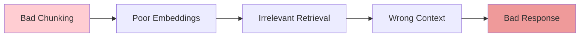

# 📄 Chunking Strategies

> **Most RAG failures can be traced back to chunking decisions.** Poor chunking leads to missed retrieval, context misalignment, and semantic collapse — three of the seven silent killers. This section provides actionable guidance for getting chunking right.

<details>
<summary>🍕 <b>Hold up—what's "chunking"?</b></summary>

<br/>

**Chunking = cutting documents into bite-sized pieces**

AI can't read a 500-page PDF all at once. So we cut it into smaller pieces called "chunks"—maybe a paragraph each—and store those pieces separately.

When someone asks a question, we find the relevant chunks and give just those to the AI.

**Why it's tricky:** 

Imagine you're cutting a newspaper into pieces for a scrapbook:
- Cut too small (individual words) → loses meaning: "The" "cat" "sat" "on" "the" "mat"
- Cut too big (entire pages) → hard to find specific things
- Cut at wrong spots → "The cat sat on" | "the mat" (split mid-thought!)

**The 80% stat means:** Most RAG failures happen because someone cut their documents wrong. Fix the chunking, fix the RAG.

</details>

---

## Why Chunking Matters

Chunking is the process of splitting documents into smaller pieces for embedding and retrieval. Poor chunking decisions cascade through the entire RAG pipeline:



**Research finding:** A 2025 CDC policy RAG study found:
- Naive fixed-size chunking: faithfulness scores of **0.47-0.51**
- Optimized semantic chunking: faithfulness scores of **0.79-0.82**

That's a **60% improvement** from chunking alone.

---

## Chunking Decision Tree

```mermaid
flowchart TD
    A["Start: What's your<br/>document type?"] --> B{Structured?}
    
    B -->|"Yes<br/>(Tables, Forms, JSON)"| C["Field-aware chunking<br/>Preserve structure"]
    B -->|"No<br/>(Prose, PDFs)"| D{Query type?}
    
    D -->|"Factoid queries<br/>(Who, What, When)"| E["256-512 tokens"]
    D -->|"Analytical queries<br/>(Why, How, Compare)"| F["1024+ tokens"]
    D -->|"Mixed"| G["512 tokens default"]
    
    E --> H{Retrieval<br/>accuracy OK?}
    F --> H
    G --> H
    C --> H
    
    H -->|"No, <80%"| I["Add Contextual<br/>Retrieval"]
    H -->|"Yes, ≥80%"| J["✅ Deploy"]
    
    I --> K{Still<br/>issues?}
    K -->|"Yes"| L["Try semantic<br/>chunking"]
    K -->|"No"| J
    
    L --> J
    
    style J fill:#c8e6c9
    style A fill:#e3f2fd
```



---

## Chunking Strategies Compared

### 1. Fixed-Size Chunking

**How it works:** Split text at fixed character/token intervals.

```python
from langchain.text_splitter import RecursiveCharacterTextSplitter

splitter = RecursiveCharacterTextSplitter(
    chunk_size=512,      # Target size in tokens
    chunk_overlap=50,    # 10% overlap
    separators=["\n\n", "\n", ". ", " ", ""]
)
chunks = splitter.split_text(document)
```

| Pros | Cons |
|------|------|
| Simple, predictable | Breaks semantic units |
| Fast processing | No awareness of content |
| Easy to debug | May split mid-sentence |

**When to use:** Starting point for any project. Graduate to semantic chunking only when metrics justify complexity.

---

### 2. Semantic Chunking

**How it works:** Split based on semantic boundaries (paragraphs, sections, topic shifts).

```python
from langchain_experimental.text_splitter import SemanticChunker
from langchain_openai import OpenAIEmbeddings

splitter = SemanticChunker(
    embeddings=OpenAIEmbeddings(),
    breakpoint_threshold_type="percentile",
    breakpoint_threshold_amount=95
)
chunks = splitter.split_text(document)
```

| Pros | Cons |
|------|------|
| Preserves meaning | Requires embedding calls |
| Better retrieval quality | Variable chunk sizes |
| Respects document structure | More complex pipeline |

**When to use:** When fixed-size chunking produces poor retrieval metrics despite tuning.

<details>
<summary>🍕 <b>Plain English: Semantic vs Fixed-Size</b></summary>

<br/>

**Fixed-size chunking:** "Cut every 500 characters, no matter what."

It's like a paper cutter that chops every 3 inches. Fast and predictable, but might cut through the middle of a sentence or split a paragraph about "why our product is great" into two useless halves.

**Semantic chunking:** "Cut at natural breaks—where the topic changes."

It's like a human with scissors who reads the text and cuts between sections. Takes longer, but each piece makes sense on its own.

**The trade-off:**
- Fixed-size: Fast, cheap, dumb
- Semantic: Slow, expensive, smart

**Rule of thumb:** Start with fixed-size. Only upgrade to semantic if you're seeing problems and have the time/budget.

</details>

---

### 3. Document-Aware Chunking

**How it works:** Use document structure (headers, sections, tables) to define chunk boundaries.

```python
from langchain.text_splitter import MarkdownHeaderTextSplitter

headers_to_split_on = [
    ("#", "Header 1"),
    ("##", "Header 2"),
    ("###", "Header 3"),
]

splitter = MarkdownHeaderTextSplitter(
    headers_to_split_on=headers_to_split_on
)
chunks = splitter.split_text(markdown_doc)
```

| Pros | Cons |
|------|------|
| Preserves logical structure | Requires structured input |
| Metadata-rich chunks | Not applicable to all docs |
| Excellent for documentation | May produce uneven sizes |

**When to use:** Technical documentation, wikis, markdown content with clear structure.

---

### 4. Agentic Chunking (Advanced)

**How it works:** Use an LLM to determine optimal chunk boundaries based on content understanding.

```python
# Pseudo-code for agentic chunking
def agentic_chunk(document: str, llm) -> list[str]:
    prompt = """
    Analyze this document and identify natural semantic boundaries.
    Return a list of chunk boundaries that:
    1. Keep related concepts together
    2. Don't split important context
    3. Create self-contained units of meaning
    """
    boundaries = llm.invoke(prompt + document)
    return split_at_boundaries(document, boundaries)
```

| Pros | Cons |
|------|------|
| Highest quality boundaries | Expensive (LLM calls) |
| Content-aware decisions | Slow processing |
| Handles complex docs | Non-deterministic |

**When to use:** High-value documents where quality justifies cost (legal, medical, financial).

---

## Recommended Settings by Use Case

| Use Case | Chunk Size | Overlap | Strategy |
|----------|------------|---------|----------|
| **Factoid Q&A** | 256-512 tokens | 10% | Fixed-size |
| **Technical docs** | 512-768 tokens | 15% | Document-aware |
| **Analytical queries** | 1024-2048 tokens | 20% | Semantic |
| **Legal/Medical** | Variable | N/A | Agentic |
| **Code repositories** | By function/class | 0% | AST-based |

---

## Contextual Retrieval: The Game Changer

**Anthropic's Contextual Retrieval** (September 2024) is the highest-impact, lowest-complexity improvement available.

### The Problem It Solves

Raw chunks lose document context:

```
Original document: "ACME Corp Annual Report 2024..."
[Many pages later]
Chunk: "Revenue increased 15% year-over-year."

Problem: Which company? What year? What division?
```

### The Solution

Prepend a 50-100 token context snippet to each chunk before embedding:

```python
def add_context(chunk: str, full_document: str, llm) -> str:
    prompt = f"""
    <document>
    {full_document}
    </document>
    
    Here is the chunk we want to situate:
    <chunk>
    {chunk}
    </chunk>
    
    Please give a short succinct context to situate this chunk 
    within the overall document for improving search retrieval.
    Answer only with the succinct context and nothing else.
    """
    
    context = llm.invoke(prompt)
    return f"{context}\n\n{chunk}"
```

### Results

| Configuration | Retrieval Failure Reduction |
|--------------|----------------------------|
| Contextual Retrieval alone | **49%** |
| Contextual Retrieval + Reranking | **67%** |

**Cost:** ~$1.02 per million document tokens (with prompt caching)

### Implementation Tips

1. **Use prompt caching** — The full document is repeated for each chunk
2. **Batch processing** — Process chunks in parallel
3. **Cache results** — Context only needs to be generated once per chunk
4. **Keep context concise** — 50-100 tokens is sufficient

---

## Anti-Patterns to Avoid

### ❌ Anti-Pattern 1: Fixed-Size Without Overlap

```python
# BAD: No overlap
chunks = [text[i:i+500] for i in range(0, len(text), 500)]

# GOOD: 10-20% overlap
splitter = RecursiveCharacterTextSplitter(
    chunk_size=500,
    chunk_overlap=75  # 15% overlap
)
```

**Why it fails:** Relevant information often spans chunk boundaries.

---

### ❌ Anti-Pattern 2: One Size Fits All

```python
# BAD: Same chunking for everything
def chunk_all_docs(docs):
    return [split_500(doc) for doc in docs]

# GOOD: Document-type-aware chunking
def chunk_document(doc):
    if doc.type == "markdown":
        return markdown_splitter.split(doc)
    elif doc.type == "code":
        return ast_splitter.split(doc)
    else:
        return default_splitter.split(doc)
```

**Why it fails:** Different document types have different optimal chunking strategies.

---

### ❌ Anti-Pattern 3: Chunks Too Large

```python
# BAD: 4000 token chunks
splitter = RecursiveCharacterTextSplitter(chunk_size=4000)

# GOOD: Start smaller, increase if needed
splitter = RecursiveCharacterTextSplitter(chunk_size=512)
```

**Why it fails:** Large chunks dilute embedding specificity, reducing retrieval precision.

---

### ❌ Anti-Pattern 4: Chunks Too Small

```python
# BAD: 50 token chunks
splitter = RecursiveCharacterTextSplitter(chunk_size=50)

# GOOD: Minimum 256 tokens for meaningful context
splitter = RecursiveCharacterTextSplitter(chunk_size=256)
```

**Why it fails:** Small chunks lose surrounding context necessary for understanding.

---

## Platform-Specific Chunking

### AWS Bedrock Knowledge Bases

```python
# Bedrock supports multiple chunking strategies
chunking_config = {
    "chunkingStrategy": "SEMANTIC",  # or "FIXED_SIZE", "NONE"
    "semanticChunkingConfiguration": {
        "maxTokens": 512,
        "bufferSize": 50,
        "breakpointPercentileThreshold": 95
    }
}
```

### Azure AI Search

```python
# Azure Document Intelligence + AI Search
from azure.ai.documentintelligence import DocumentIntelligenceClient

# Use layout model for structure-aware chunking
poller = client.begin_analyze_document(
    "prebuilt-layout",
    document,
    output_content_format="markdown"
)
# Then chunk by markdown headers
```

### Google Vertex AI

```python
# Vertex AI Search handles chunking automatically
# Configure via console or API
corpus_config = {
    "chunk_size": 500,
    "chunk_overlap": 50,
    "include_metadata": True
}
```

---

## Measuring Chunking Quality

### Metrics to Track

| Metric | Target | How to Measure |
|--------|--------|----------------|
| Context Recall | >85% | RAGAS with ground truth |
| Context Precision | >80% | RAGAS |
| Chunk Size Distribution | Low variance | Histogram analysis |
| Retrieval Latency | <200ms | End-to-end timing |

### Debugging Poor Chunking

```python
# Analyze chunk statistics
def analyze_chunks(chunks):
    sizes = [len(c.split()) for c in chunks]
    return {
        "count": len(chunks),
        "mean_size": np.mean(sizes),
        "std_size": np.std(sizes),
        "min_size": min(sizes),
        "max_size": max(sizes),
        "size_variance": np.var(sizes)
    }

# High variance suggests inconsistent chunking
```

---

## Quick Reference

| Situation | Recommendation |
|-----------|---------------|
| Starting a new project | 512 tokens, 10% overlap, RecursiveCharacterTextSplitter |
| Poor factoid retrieval | Decrease to 256-384 tokens |
| Poor analytical retrieval | Increase to 1024+ tokens |
| Structured documents | Use document-aware chunking |
| Retrieval accuracy <80% | Add Contextual Retrieval |
| High-value documents | Consider agentic chunking |

---

## References

- Anthropic, *"Contextual Retrieval"* (September 2024)
- CDC Policy RAG Study (2025)
- LangChain Text Splitters Documentation
- LlamaIndex Node Parser Documentation

---

<div align="center">

[← Failure Modes](02-failure-modes.md) | [Next: Hybrid Search →](04-hybrid-search.md)

</div>
