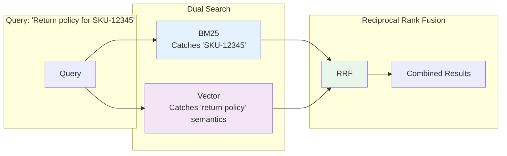
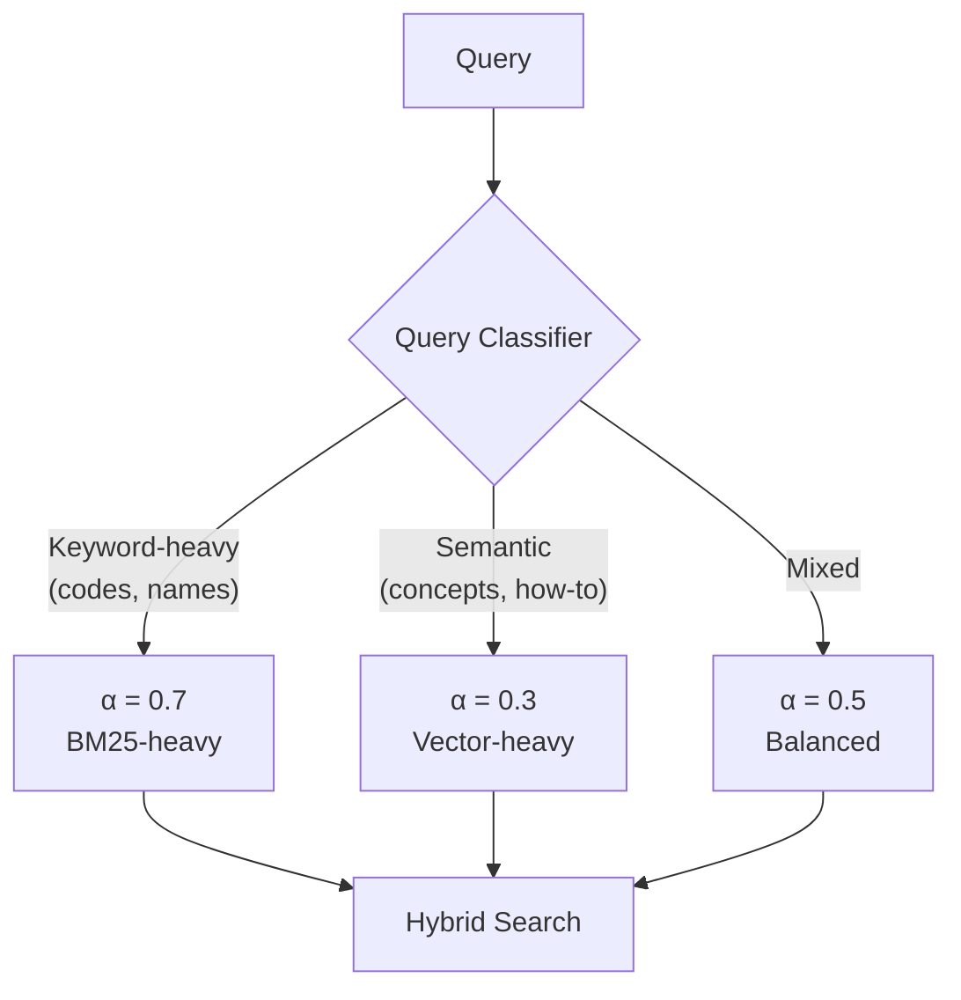
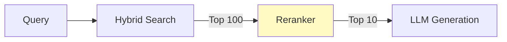

# 🔍 Hybrid Search

> **Pure vector search has fundamental bottlenecks. The industry consensus for 2025-2026 is hybrid BM25 + vector search with Reciprocal Rank Fusion (RRF).**

---

## Why Hybrid Search?

Vector search alone fails in predictable ways:

| Failure Mode | Example | Solution |
|-------------|---------|----------|
| Exact match misses | Product code "SKU-12345" | BM25 keyword matching |
| Proper noun confusion | "John Smith" vs "Jane Smith" | Exact term matching |
| Numeric precision | "Section 4.2.1" vs "Section 4.2.2" | Keyword filtering |
| Rare term retrieval | Specialized jargon | BM25 IDF weighting |



---

## Reciprocal Rank Fusion (RRF)

RRF combines ranked lists without requiring score normalization:

```
RRF_score(d) = Σ 1/(k + rank_i(d))
```

Where:
- `k` = 60 (recommended constant)
- `rank_i(d)` = rank of document d in result list i

### Why RRF Works

| Property | Benefit |
|----------|---------|
| Score-agnostic | BM25 (0-100) and cosine (0-1) combine naturally |
| Tuning-free | k=60 works well across domains |
| Rank-based | Robust to score distribution differences |

### Implementation

```python
def reciprocal_rank_fusion(
    results_lists: list[list[str]], 
    k: int = 60
) -> list[tuple[str, float]]:
    """
    Combine multiple ranked result lists using RRF.
    
    Args:
        results_lists: List of ranked document ID lists
        k: Constant (default 60)
    
    Returns:
        List of (doc_id, rrf_score) tuples, sorted by score
    """
    scores = {}
    
    for results in results_lists:
        for rank, doc_id in enumerate(results, start=1):
            if doc_id not in scores:
                scores[doc_id] = 0
            scores[doc_id] += 1 / (k + rank)
    
    return sorted(scores.items(), key=lambda x: x[1], reverse=True)

# Usage
bm25_results = ["doc_a", "doc_b", "doc_c", "doc_d"]
vector_results = ["doc_c", "doc_a", "doc_e", "doc_b"]

fused = reciprocal_rank_fusion([bm25_results, vector_results])
# Returns: [("doc_a", 0.032), ("doc_c", 0.032), ("doc_b", 0.031), ...]
```

---

## Domain-Specific Weighting

While RRF is score-agnostic, you can still weight by adjusting retrieved counts:

| Domain | BM25 Weight | Vector Weight | Rationale |
|--------|-------------|---------------|-----------|
| **Legal/Financial** | 70% | 30% | Exact clause and code matching critical |
| **Customer Support** | 30% | 70% | Varied phrasing, semantic understanding |
| **Technical Docs** | 50% | 50% | Balance precision with comprehension |
| **Healthcare** | 65% | 35% | Exact codes plus semantic context |
| **E-commerce** | 60% | 40% | SKUs, product names + descriptions |
| **Research/Academic** | 40% | 60% | Concepts matter more than exact terms |

### Implementing Weighted Hybrid Search

```python
def weighted_hybrid_search(
    query: str,
    bm25_weight: float = 0.5,
    vector_weight: float = 0.5,
    top_k: int = 20
) -> list[Document]:
    """
    Perform weighted hybrid search.
    """
    # Adjust retrieval counts based on weights
    bm25_k = int(top_k * (bm25_weight / (bm25_weight + vector_weight)) * 2)
    vector_k = int(top_k * (vector_weight / (bm25_weight + vector_weight)) * 2)
    
    # Retrieve from both
    bm25_results = bm25_search(query, k=bm25_k)
    vector_results = vector_search(query, k=vector_k)
    
    # Fuse with RRF
    fused = reciprocal_rank_fusion([
        [d.id for d in bm25_results],
        [d.id for d in vector_results]
    ])
    
    return get_documents(fused[:top_k])
```

---

## Dynamic Alpha Tuning

A 2025 arXiv paper found that **dynamic per-query adjustment** significantly outperforms fixed weighting.

### The Approach



### Query Classification Features

| Feature | Indicates | Weight Adjustment |
|---------|-----------|-------------------|
| Contains quotes | Exact phrase match needed | ↑ BM25 |
| Contains numbers | IDs, dates, quantities | ↑ BM25 |
| Question words (why, how) | Semantic understanding | ↑ Vector |
| Short query (<4 words) | Likely keyword search | ↑ BM25 |
| Long query (>10 words) | Likely semantic search | ↑ Vector |

```python
def classify_query_intent(query: str) -> str:
    """Simple rule-based query classifier."""
    query_lower = query.lower()
    
    # Keyword indicators
    has_quotes = '"' in query
    has_numbers = any(c.isdigit() for c in query)
    has_codes = bool(re.search(r'[A-Z]{2,}-\d+', query))
    
    # Semantic indicators
    question_words = ['why', 'how', 'explain', 'compare', 'describe']
    is_question = any(w in query_lower for w in question_words)
    is_long = len(query.split()) > 8
    
    keyword_score = sum([has_quotes, has_numbers, has_codes])
    semantic_score = sum([is_question, is_long])
    
    if keyword_score > semantic_score:
        return "keyword"  # Use α = 0.7
    elif semantic_score > keyword_score:
        return "semantic"  # Use α = 0.3
    else:
        return "mixed"  # Use α = 0.5
```

---

## Platform Implementations

### AWS OpenSearch

```python
# OpenSearch hybrid search with neural plugin
query = {
    "query": {
        "hybrid": {
            "queries": [
                {
                    "match": {
                        "content": {
                            "query": user_query
                        }
                    }
                },
                {
                    "neural": {
                        "content_embedding": {
                            "query_text": user_query,
                            "model_id": "your-model-id",
                            "k": 100
                        }
                    }
                }
            ]
        }
    },
    "search_pipeline": {
        "phase_results_processors": [
            {
                "normalization-processor": {
                    "normalization": {"technique": "min_max"},
                    "combination": {
                        "technique": "arithmetic_mean",
                        "parameters": {"weights": [0.4, 0.6]}
                    }
                }
            }
        ]
    }
}
```

### Azure AI Search

```python
from azure.search.documents import SearchClient
from azure.search.documents.models import VectorizableTextQuery

# Azure AI Search hybrid query
results = search_client.search(
    search_text=user_query,  # BM25
    vector_queries=[
        VectorizableTextQuery(
            text=user_query,
            k_nearest_neighbors=50,
            fields="content_vector"
        )
    ],
    query_type="semantic",  # Adds semantic ranking
    semantic_configuration_name="my-semantic-config",
    top=10
)
```

### Google Vertex AI Search

```python
from google.cloud import discoveryengine_v1 as discoveryengine

# Vertex AI Search handles hybrid automatically
search_request = discoveryengine.SearchRequest(
    serving_config=serving_config,
    query=user_query,
    page_size=10,
    content_search_spec=discoveryengine.SearchRequest.ContentSearchSpec(
        search_result_mode="DOCUMENTS",
        snippet_spec=discoveryengine.SearchRequest.ContentSearchSpec.SnippetSpec(
            return_snippet=True
        )
    ),
    # Hybrid is automatic with relevance tuning
)
```

### Elasticsearch

```python
# Elasticsearch 8.x with RRF
query = {
    "retriever": {
        "rrf": {
            "retrievers": [
                {
                    "standard": {
                        "query": {
                            "match": {
                                "content": user_query
                            }
                        }
                    }
                },
                {
                    "knn": {
                        "field": "content_vector",
                        "query_vector_builder": {
                            "text_embedding": {
                                "model_id": "my-embedding-model",
                                "model_text": user_query
                            }
                        },
                        "k": 100,
                        "num_candidates": 200
                    }
                }
            ],
            "rank_constant": 60,
            "rank_window_size": 100
        }
    }
}
```

---

## Adding Reranking

Hybrid search retrieves candidates; reranking improves final ordering.



### Cross-Encoder Reranking

```python
from sentence_transformers import CrossEncoder

# Load reranker model
reranker = CrossEncoder('cross-encoder/ms-marco-MiniLM-L-6-v2')

def rerank_results(query: str, documents: list[str], top_k: int = 10):
    """Rerank documents using cross-encoder."""
    pairs = [[query, doc] for doc in documents]
    scores = reranker.predict(pairs)
    
    # Sort by score
    ranked = sorted(
        zip(documents, scores), 
        key=lambda x: x[1], 
        reverse=True
    )
    return [doc for doc, score in ranked[:top_k]]
```

### Cohere Rerank API

```python
import cohere

co = cohere.Client('your-api-key')

def cohere_rerank(query: str, documents: list[str], top_k: int = 10):
    """Rerank using Cohere's API."""
    response = co.rerank(
        query=query,
        documents=documents,
        top_n=top_k,
        model='rerank-english-v3.0'
    )
    return [documents[r.index] for r in response.results]
```

---

## Performance Benchmarks

Typical production latencies at 100K documents:

| Configuration | Latency (p95) |
|--------------|---------------|
| BM25 only | 20-40ms |
| Vector only | 30-60ms |
| Hybrid (no rerank) | 70-110ms |
| Hybrid + Rerank (top-20) | 150-250ms |

### Optimization Tips

1. **Limit reranking candidates** — Rerank top-20, not top-100
2. **Use approximate kNN** — HNSW is faster than exact
3. **Parallel retrieval** — Run BM25 and vector in parallel
4. **Cache embeddings** — Don't re-embed repeated queries
5. **Quantization** — Use int8 vectors for 4x storage savings

---

## Anti-Patterns

### ❌ Naive Score Averaging

```python
# BAD: Raw score averaging
final_score = (bm25_score + vector_score) / 2

# BM25 scores range 0-100
# Cosine similarity ranges 0-1
# This creates nonsensical combinations!
```

### ❌ Over-Retrieving

```python
# BAD: Retrieve everything, hope reranker fixes it
results = hybrid_search(query, k=1000)  # Too many!
reranked = rerank(results)[:10]

# GOOD: Retrieve focused set
results = hybrid_search(query, k=50)  # Reasonable
reranked = rerank(results)[:10]
```

### ❌ Ignoring Query Type

```python
# BAD: Same weights for all queries
def search(query):
    return hybrid_search(query, alpha=0.5)  # Always 50/50

# GOOD: Adapt to query type
def search(query):
    intent = classify_query(query)
    alpha = {"keyword": 0.7, "semantic": 0.3, "mixed": 0.5}[intent]
    return hybrid_search(query, alpha=alpha)
```

---

## Quick Reference

| Decision | Recommendation |
|----------|---------------|
| Starting hybrid search | RRF with k=60, equal weights |
| Legal/financial domain | 70% BM25, 30% vector |
| Customer support | 30% BM25, 70% vector |
| Adding reranking | Top-20 candidates, cross-encoder |
| Performance issues | Parallel retrieval, limit candidates |

---

## References

- *"Dynamic Alpha Tuning for Hybrid Search"* — arXiv 2025
- DeepMind Vector Search Analysis
- Elasticsearch RRF Documentation
- Azure AI Search Hybrid Query Guide
- OpenSearch Neural Search Plugin

---

<div align="center">

[← Chunking Strategies](03-chunking-strategies.md) | [Next: Advanced Patterns →](05-advanced-patterns.md)

</div>
