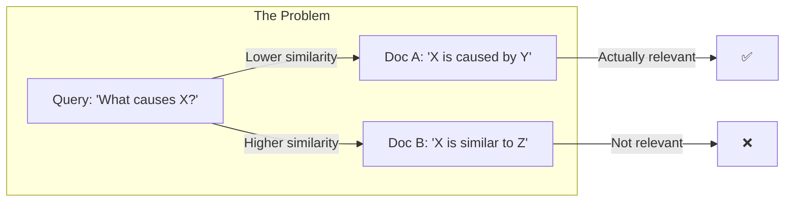
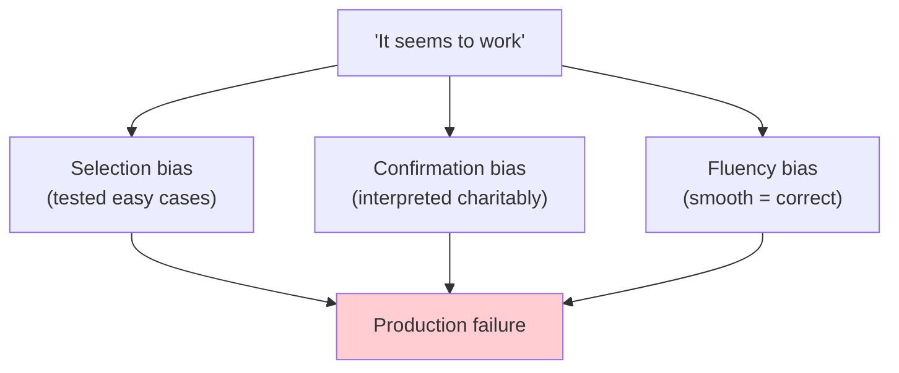
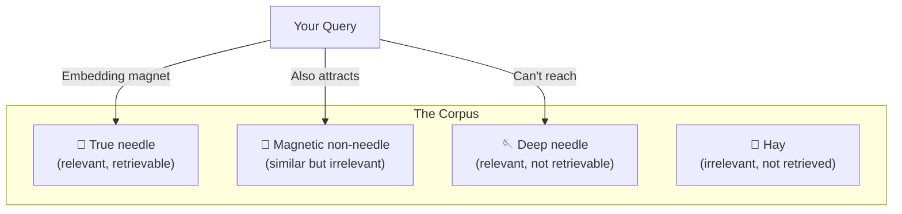
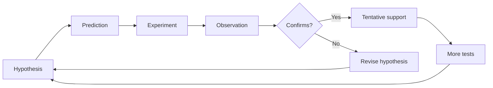
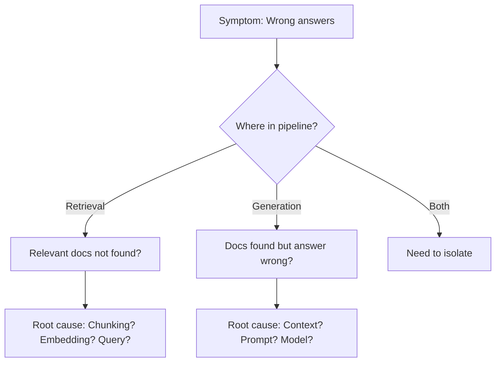
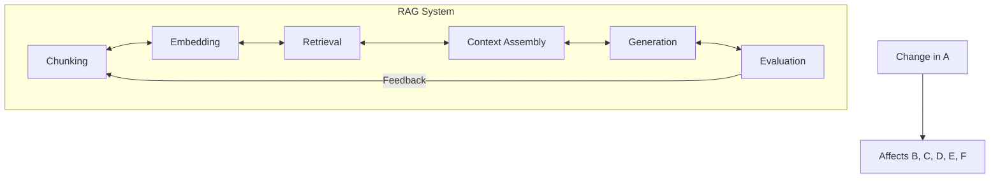

# 🧠 Mental Models & First Principles for RAG

> **Think clearly about RAG problems by reasoning from first principles, not by analogy.**

---

## Why Mental Models Matter

Most RAG failures stem from **pattern matching without understanding**:
- "We used 512 tokens because that's what the tutorial said"
- "We picked vector search because everyone uses it"
- "We added more context because the answers were wrong"

First principles thinking asks: **What is fundamentally true, and what can we build from there?**

<br>
<br>

## The RAG First Principles

### Principle 1: Information Retrieval is Lossy

```
┌─────────────────────────────────────────────────────────────────┐
│                    THE COMPRESSION PROBLEM                      │
├─────────────────────────────────────────────────────────────────┤
│                                                                 │
│   Full Document (10,000 tokens)                                │
│         ↓                                                       │
│   Chunking (loses structure)                                    │
│         ↓                                                       │
│   Embedding (768-1536 dimensions)                               │
│         ↓                                                       │
│   Vector similarity (single score)                              │
│         ↓                                                       │
│   Top-K selection (loses alternatives)                          │
│         ↓                                                       │
│   Context window (loses overflow)                               │
│         ↓                                                       │
│   LLM attention (loses middle)                                  │
│         ↓                                                       │
│   Response (fraction of original)                               │
│                                                                 │
└─────────────────────────────────────────────────────────────────┘
```

**First principle:** Every step in RAG loses information. Your job is to minimize loss at each step and ensure the *right* information survives.

**Questions to ask:**
- What information am I losing at this step?
- Is the lost information ever needed?
- Can I preserve it differently?

<br>
<br>

### Principle 2: Relevance ≠ Similarity

**The fundamental confusion:** Vector similarity measures how *alike* two pieces of text are, not how *useful* one is for answering a question about the other.


```mermaid
flowchart LR
    subgraph Problem["The Problem"]
        A["Query: 'What causes X?'"]
        B["Doc A: 'X is caused by Y'"]
        C["Doc B: 'X is similar to Z'"]
    end
    
    A -->|"Lower similarity"| B
    A -->|"Higher similarity"| C
    
    B -->|"Actually relevant"| D["✅"]
    C -->|"Not relevant"| E["❌"]
```

<details>
<summary>🍕 <b>Plain English: The Dating App Problem</b></summary>

<br/>

Imagine a dating app that matches people by profile similarity:

**You:** "I love hiking, hate loud bars, looking for something serious."

**Match A:** "I love hiking, hate loud bars, looking for something serious." 
→ 99% similar! 

**Match B:** "I love cooking for two, quiet evenings at home, want to build a life together."
→ 40% similar? Different words!

But Match B might actually be MORE compatible. They want the same THINGS, they just DESCRIBE them differently.

**This is RAG's problem:**
- High similarity = "these texts use similar words"
- High relevance = "this text actually answers your question"

Your question: "What causes headaches?"  
Similar doc: "Headaches are painful."  
Relevant doc: "Dehydration, stress, and poor sleep are common headache triggers."

The similar doc is about headaches. The relevant doc ANSWERS the question. They're not the same thing!

</details>

**First principle:** Similarity is a proxy for relevance, not relevance itself. The proxy fails when:
- Query and answer use different vocabulary
- Similar documents discuss different aspects
- The answer requires reasoning, not matching

**Questions to ask:**
- Am I measuring similarity or relevance?
- When does my similarity proxy break down?
- How can I add relevance signals beyond similarity?

<br>
<br>

### Principle 3: The Generation Doesn't Know What It Doesn't Know

**The hallucination problem from first principles:**

```
LLM Training Objective: Predict the next token that is statistically likely
                        given the context.

RAG Requirement:        Generate text that is factually grounded in
                        retrieved context.

The Mismatch:           Statistical likelihood ≠ Factual grounding
```

<details>
<summary>🍕 <b>Plain English: The Confident Bullshitter</b></summary>

<br/>

LLMs are like that friend who ALWAYS has an answer, even when they definitely shouldn't.

**You:** "What's the capital of Freedonia?"  
**That friend:** "Oh, it's obviously Marxburg. Founded in 1847, beautiful architecture."

Freedonia is a fictional country from a Marx Brothers movie. Your friend just made everything up, but they sounded SO confident.

**How LLMs work:** They predict "what word probably comes next." Not "what word is TRUE", just what word is LIKELY given the pattern.

If you ask about a made-up thing, the LLM thinks: "When people talk about countries, they usually have capitals, and capitals have names, and...", and just fills in plausible-sounding nonsense.

**RAG is supposed to fix this** by saying "only use THIS information to answer." But the LLM doesn't actually UNDERSTAND that rule, it just sees more text and does its normal "predict likely words" thing.

**The danger:** It has no "I don't know" instinct. Admitting ignorance is not statistically likely in its training data, confident answers are.

</details>

**First principle:** LLMs are trained to produce *plausible* text, not *true* text. RAG attempts to ground plausibility in retrieved facts, but the LLM has no internal mechanism to distinguish "in context" from "in training data."

**Questions to ask:**
- How do I know this answer came from context vs. training?
- What happens when context is insufficient?
- How do I make grounding explicit?

<br>
<br>

### Principle 4: Evaluation is the Only Source of Truth

**The dangerous assumption:** "It seems to work" based on a few examples.

**First principle:** Human intuition about language model quality is unreliable. We're biased toward:
- Fluent text (even if wrong)
- Confident tone (even if fabricated)
- Lengthy responses (even if padded)


```mermaid
flowchart TD
    A["'It seems to work'"] --> B["Selection bias<br/>(tested easy cases)"]
    A --> C["Confirmation bias<br/>(interpreted charitably)"]
    A --> D["Fluency bias<br/>(smooth = correct)"]
    
    B --> E["Production failure"]
    C --> E
    D --> E
    
    style E fill:#ffcdd2
```

**Questions to ask:**
- How would I know if this is actually working?
- What does "working" mean, precisely?
- How do I measure it without fooling myself?

<br>
<br>

## Mental Models by Problem Domain

### Mental Model 1: Chunking as Signal Preservation

**The model:** Think of chunking as a **signal processing problem**. Your document is a signal; chunking is sampling. Sample too coarsely (large chunks) and you lose high-frequency detail. Sample too finely (small chunks) and you lose low-frequency context.

```
Document Signal
    │
    ├── High-frequency: Specific facts, numbers, names
    │   → Need smaller chunks to preserve
    │
    └── Low-frequency: Themes, relationships, narrative
        → Need larger chunks to preserve
```

**Application:**
- Factoid queries need high-frequency preservation → smaller chunks
- Analytical queries need low-frequency preservation → larger chunks
- Mixed queries need hybrid approaches

**Key insight:** There's no "correct" chunk size, only chunk sizes appropriate for your signal and your sampling requirements.

<br>
<br>

### Mental Model 2: Retrieval as Needle-in-Haystack with Noisy Magnets

**The model:** You're searching for needles (relevant info) in a haystack (corpus) using magnets (embeddings). But:
- Your magnet isn't perfectly calibrated to your needles
- The haystack contains magnetic materials that aren't needles
- Some needles are deeper than your magnet can reach


```mermaid
flowchart TD
    subgraph Haystack["The Corpus"]
        A["🧲 True needle<br/>(relevant, retrievable)"]
        B["📎 Magnetic non-needle<br/>(similar but irrelevant)"]
        C["🪡 Deep needle<br/>(relevant, not retrievable)"]
        D["🌾 Hay<br/>(irrelevant, not retrieved)"]
    end
    
    E["Your Query"] -->|"Embedding magnet"| A
    E -->|"Also attracts"| B
    E -->|"Can't reach"| C
```

**Application:**
- Improve your magnet: Better embeddings, domain fine-tuning
- Remove magnetic non-needles: Deduplication, filtering
- Reach deeper needles: Query expansion, multiple queries
- Accept you can't find everything: Design for graceful failure

<br>
<br>

### Mental Model 3: Context as Cognitive Bandwidth

**The model:** The LLM's context window is like working memory, limited cognitive bandwidth. Everything you put in competes for attention.

```
┌─────────────────────────────────────────────────────────────────┐
│                    CONTEXT ATTENTION BUDGET                     │
├─────────────────────────────────────────────────────────────────┤
│                                                                 │
│   Total attention: 100 units                                    │
│                                                                 │
│   ┌──────────────────────────────────────────────────────────┐ │
│   │ System prompt (20)  │ Chunk 1 (15) │ Chunk 2 (10) │ ... │ │
│   └──────────────────────────────────────────────────────────┘ │
│                                                                 │
│   Problem: More context → Less attention per item               │
│   Problem: Position matters (beginning/end favored)             │
│   Problem: Irrelevant context dilutes signal                    │
│                                                                 │
└─────────────────────────────────────────────────────────────────┘
```

**Application:**
- Less is often more: Fewer, more relevant chunks beat many chunks
- Position matters: Put critical info first or last
- Relevance is mandatory: Irrelevant context actively hurts
- Summarization preserves bandwidth: Compress low-priority info

<br>
<br>

### Mental Model 4: Evaluation as Scientific Method

**The model:** RAG development should follow the scientific method, not intuition.


```mermaid
flowchart LR
    A["Hypothesis"] --> B["Prediction"]
    B --> C["Experiment"]
    C --> D["Observation"]
    D --> E{"Confirms?"}
    E -->|"Yes"| F["Tentative support"]
    E -->|"No"| G["Revise hypothesis"]
    G --> A
    F --> H["More tests"]
    H --> A
```

**Application:**
- **Hypothesis:** "Larger chunks will improve analytical query accuracy"
- **Prediction:** "Accuracy on analytical test set will increase by >5%"
- **Experiment:** A/B test with controlled evaluation
- **Observation:** Measure actual accuracy change
- **Conclusion:** Accept, reject, or refine hypothesis

**Anti-pattern:** "I tried larger chunks and it seemed better" (no measurement, no control, no falsifiability)

<br>
<br>

### Mental Model 5: Cost as Constraint, Not Afterthought

**The model:** Cost is a first-class design constraint, like latency or accuracy. Optimizing later is 10x harder than designing for cost from the start.

```
┌─────────────────────────────────────────────────────────────────┐
│                    COST COMPOUNDS EXPONENTIALLY                 │
├─────────────────────────────────────────────────────────────────┤
│                                                                 │
│   Tokens in → Cost                                              │
│   Users → Tokens → Cost                                         │
│   Features → Queries/user → Tokens → Cost                       │
│   Scale → Users → Features → Queries → Tokens → Cost            │
│                                                                 │
│   Each layer multiplies, not adds.                              │
│                                                                 │
└─────────────────────────────────────────────────────────────────┘
```

**Application:**
- Design with cost constraints from day one
- Build caching and routing into architecture, not as patches
- Measure cost per query as a first-class metric
- Set cost budgets before scaling

<br>
<br>

## First Principles Decision Framework

When facing any RAG decision, work through these questions:

### 1. What Am I Actually Trying to Achieve?

```
❌ "I need better RAG"
✅ "I need to reduce incorrect answers about product specifications by 50%"
```

Define success in measurable, specific terms.

### 2. What Are the Fundamental Constraints?

| Constraint | Questions |
|------------|-----------|
| **Latency** | What's the maximum acceptable response time? |
| **Cost** | What's the budget per query? Per month? |
| **Accuracy** | What error rate is acceptable? For which error types? |
| **Scale** | How many queries? How much data? |
| **Compliance** | What data can/can't be processed? Stored? Logged? |

### 3. What Are the Root Causes?


```mermaid
flowchart TD
    A["Symptom: Wrong answers"] --> B{"Where in pipeline?"}
    B -->|"Retrieval"| C["Relevant docs not found?"]
    B -->|"Generation"| D["Docs found but answer wrong?"]
    B -->|"Both"| E["Need to isolate"]
    
    C --> F["Root cause: Chunking? Embedding? Query?"]
    D --> G["Root cause: Context? Prompt? Model?"]
```

Don't fix symptoms. Find root causes.

### 4. What's the Simplest Solution?

**Occam's Razor for RAG:**
- Before adding complexity, exhaust simple options
- Before adding components, tune existing ones
- Before building custom, try off-the-shelf

```
Complexity ladder:
1. Better prompts (free)
2. Better chunking (low cost)
3. Hybrid search (medium cost)
4. Reranking (medium cost)
5. Fine-tuned embeddings (high cost)
6. Custom models (very high cost)
```

### 5. How Will I Know If It Worked?

Before implementing any change:
- Define the metric you'll measure
- Establish the current baseline
- Set the target improvement
- Plan the A/B test or evaluation

<br>
<br>

## Applying First Principles: Case Examples

### Case: "Our RAG gives wrong answers"

**Pattern matching approach:** "Add more context, use a better model, try different embeddings"

**First principles approach:**
1. **Define "wrong":** Factually incorrect? Incomplete? Irrelevant?
2. **Isolate the failure:** Is retrieval finding relevant docs? Is generation using them correctly?
3. **Identify root cause:** Is it a chunking problem? Embedding problem? Prompt problem?
4. **Measure baseline:** What's the current accuracy on a representative test set?
5. **Targeted fix:** Address the specific root cause
6. **Verify improvement:** Did the metric actually improve?

<br>
<br>

### Case: "Our RAG is too slow"

**Pattern matching approach:** "Use a faster model, reduce context, add caching"

**First principles approach:**
1. **Measure the breakdown:** Where is time spent? Embedding? Retrieval? Generation?
2. **Identify the bottleneck:** Which component contributes most to latency?
3. **Understand the constraint:** What latency is actually required? By whom?
4. **Targeted optimization:** Focus on the bottleneck, not everything
5. **Trade-off analysis:** What quality am I willing to sacrifice for speed?

<br>
<br>

### Case: "Our RAG costs too much"

**Pattern matching approach:** "Use a cheaper model, reduce queries"

**First principles approach:**
1. **Decompose costs:** What percentage is embedding? Retrieval? Generation? Storage?
2. **Identify cost drivers:** Which queries cost most? Why?
3. **Question necessity:** Do all queries need the same treatment?
4. **Design for efficiency:** Caching, routing, batching as architecture
5. **Measure cost per value:** Cost per successful resolution, not per query

<br>
<br>

## The Meta-Model: Think in Systems

**The ultimate mental model:** RAG is a system of interacting components. Optimizing components in isolation often degrades system performance.


```mermaid
flowchart TD
    subgraph System["RAG System"]
        A["Chunking"] <--> B["Embedding"]
        B <--> C["Retrieval"]
        C <--> D["Context Assembly"]
        D <--> E["Generation"]
        E <--> F["Evaluation"]
    end
    
    F -->|"Feedback"| A
    
    G["Change in A"] --> H["Affects B, C, D, E, F"]
```

**Implications:**
- Changing chunk size affects embedding quality, retrieval results, and context assembly
- Improving retrieval may overwhelm context limits
- Better generation may expose retrieval weaknesses
- Always evaluate end-to-end, not component-by-component

<br>
<br>

## Summary: The First Principles Checklist

Before making any RAG decision, ask:

- [ ] What am I fundamentally trying to achieve?
- [ ] What information am I losing and is that acceptable?
- [ ] Am I measuring similarity or relevance?
- [ ] How will I know if this actually works?
- [ ] What's the simplest solution that could work?
- [ ] How does this affect the rest of the system?
- [ ] What are my real constraints (latency, cost, accuracy)?
- [ ] Am I reasoning from first principles or copying patterns?

<br>
<br>

<div align="center">

[← Hybrid Search](04-hybrid-search.md) | [Next: Advanced Patterns →](06-advanced-patterns.md)

</div>
