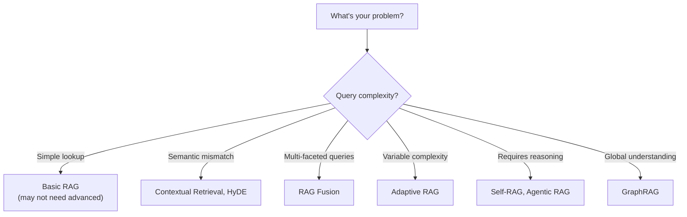
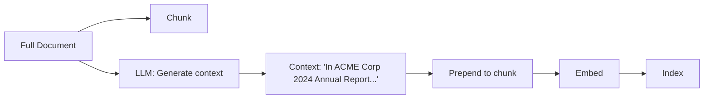
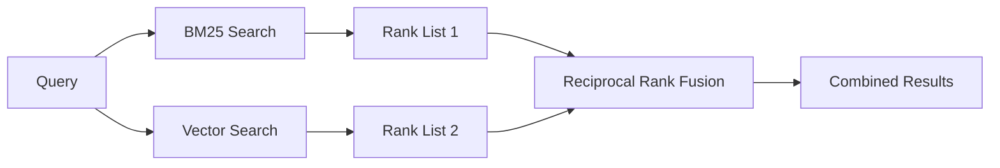
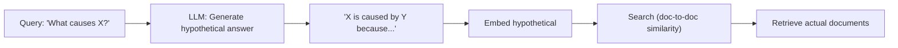
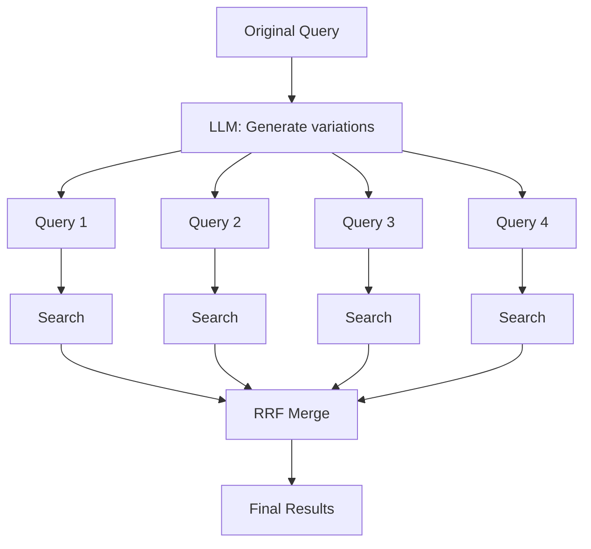
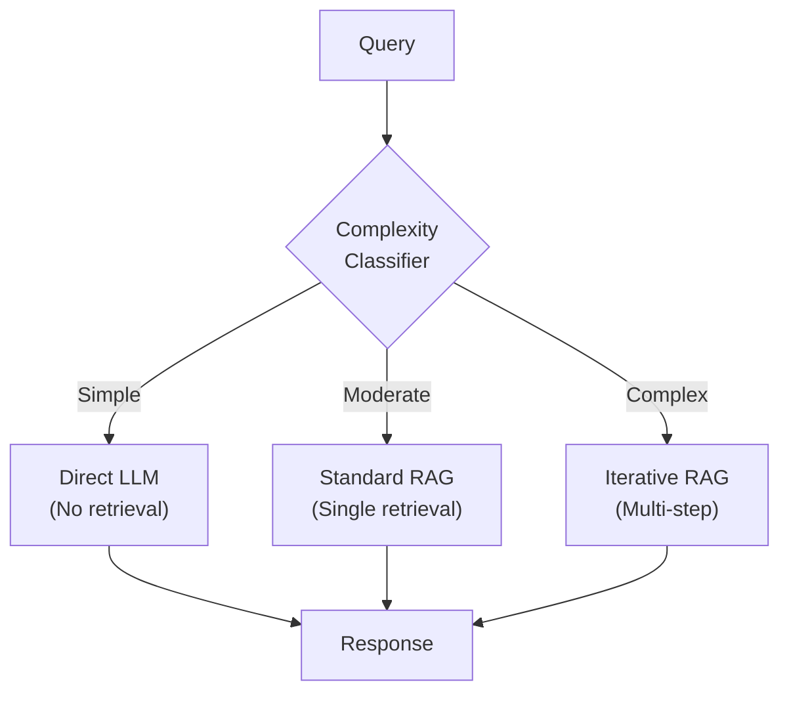
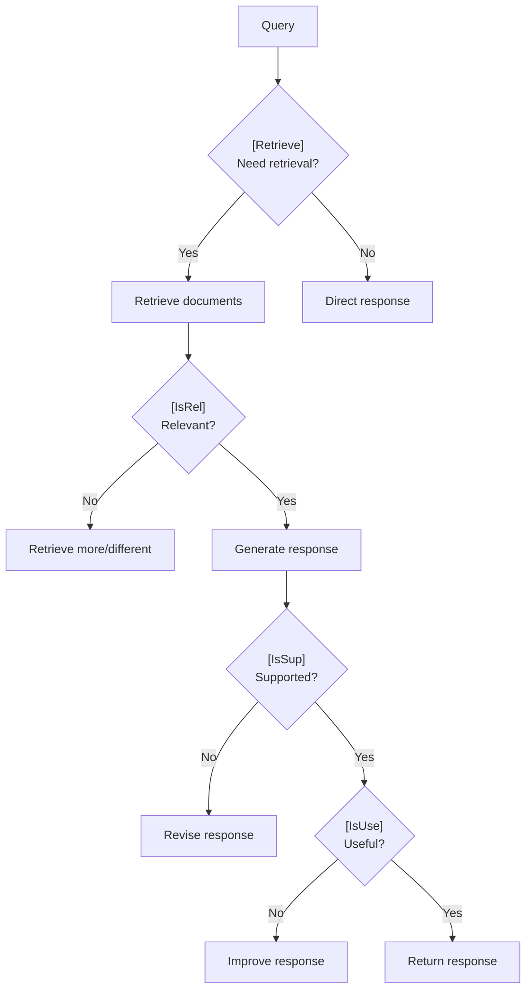
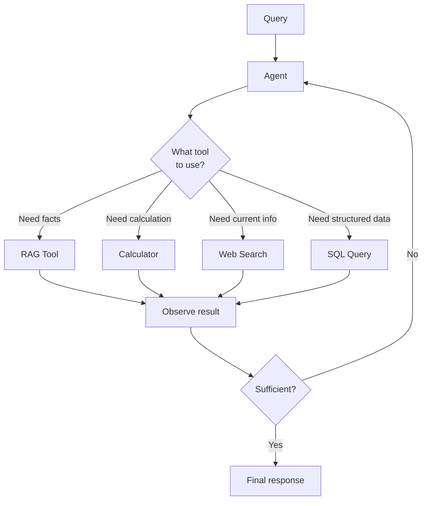
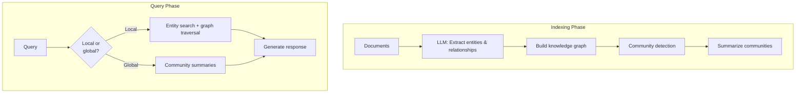
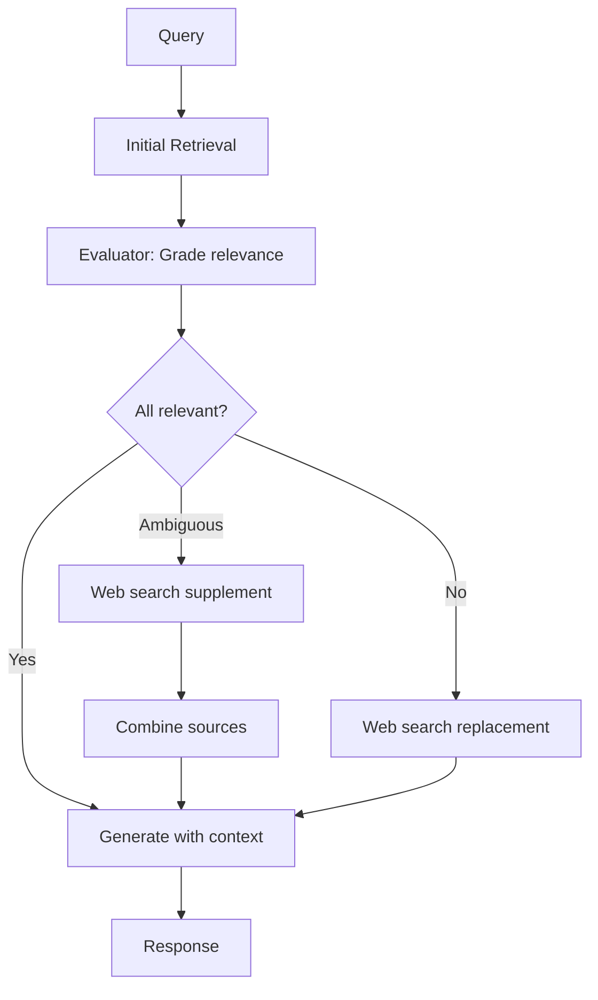

# 🔬 Advanced RAG Patterns

> **Nine patterns that separate production RAG from tutorials, with first principles for when to use each.**

---

## Pattern Selection Framework

Before diving into patterns, understand this mental model:



**First principle:** Add complexity only when simpler approaches fail. Each pattern has costs (latency, compute, maintenance). Justify the cost with measured improvement.

---

## Pattern 1: Contextual Retrieval

**The problem it solves:** Chunks lose document context when embedded in isolation.

**First principles reasoning:**
- Embeddings capture the chunk's content, not its role in the document
- "Revenue increased 15%" means nothing without knowing which company, which year
- Adding context before embedding preserves this information

### How It Works



### Implementation

```python
def add_contextual_prefix(chunk: str, full_document: str, llm) -> str:
    prompt = f"""
    <document>
    {full_document[:10000]}  # First 10K chars for context
    </document>
    
    <chunk>
    {chunk}
    </chunk>
    
    Provide a brief context (2-3 sentences) to situate this chunk 
    within the document. Focus on: document type, subject, and 
    any identifiers (company, date, section) relevant to this chunk.
    """
    context = llm.invoke(prompt)
    return f"{context}\n\n{chunk}"
```

### When to Use

| Use When | Avoid When |
|----------|------------|
| Documents have structure (reports, manuals) | Self-contained documents (FAQs) |
| Chunks reference entities defined elsewhere | Small corpus with unique chunks |
| Retrieval accuracy < 80% | Already achieving target accuracy |

### Cost-Benefit

| Cost | Benefit |
|------|---------|
| ~$1 per million doc tokens | 49% retrieval failure reduction |
| One-time preprocessing | 67% with reranking |
| Increased storage (context + chunk) | Significant accuracy improvement |

**Verdict:** Highest ROI pattern. Implement before trying complex alternatives.

---

## Pattern 2: Hybrid Search with RRF

**The problem it solves:** Vector search misses exact matches; keyword search misses semantics.

**First principles reasoning:**
- Vectors capture meaning but lose exact terms
- Keywords capture exact terms but miss synonyms
- Combining both covers more failure modes

### How It Works



### The RRF Formula

```
RRF_score(doc) = Σ 1/(k + rank_in_list)

Where k = 60 (standard constant)
```

**Why RRF works:** It's rank-based, not score-based. No need to normalize BM25 (0-100) and cosine similarity (0-1).

### When to Use

| Use When | Avoid When |
|----------|------------|
| Queries mix keywords and concepts | Pure semantic queries only |
| Corpus has identifiers, codes, names | Fully unstructured creative content |
| Single retrieval method underperforms | Latency is critical (adds ~30ms) |

See [Hybrid Search](04-hybrid-search.md) for domain-specific weights.

---

## Pattern 3: HyDE (Hypothetical Document Embeddings)

**The problem it solves:** Query embeddings don't match document embeddings well.

**First principles reasoning:**
- Queries are short; documents are long
- Queries ask questions; documents state facts
- Embedding a hypothetical answer bridges this gap

### How It Works



### Implementation

```python
def hyde_search(query: str, llm, embedder, index) -> list:
    # Generate hypothetical document
    prompt = f"""
    Write a short passage that would answer this question:
    {query}
    
    Write as if you're an expert explaining to a colleague.
    """
    hypothetical = llm.invoke(prompt)
    
    # Embed the hypothetical (not the query)
    embedding = embedder.embed(hypothetical)
    
    # Search with document-like embedding
    results = index.search(embedding, k=10)
    return results
```

### When to Use

| Use When | Avoid When |
|----------|------------|
| Query-document vocabulary gap | Queries match document style |
| Short queries, long documents | Latency-critical (adds LLM call) |
| Conceptual/explanatory queries | Exact match queries (use hybrid) |

### Cost-Benefit

| Cost | Benefit |
|------|---------|
| +1 LLM call per query | Better semantic alignment |
| +100-500ms latency | Improved recall for conceptual queries |

---

## Pattern 4: RAG Fusion

**The problem it solves:** Single query perspective misses relevant documents.

**First principles reasoning:**
- One query captures one angle
- Multi-faceted questions have multiple angles
- Multiple query variations improve recall

### How It Works



### Implementation

```python
def rag_fusion(query: str, llm, retriever, n_queries: int = 4) -> list:
    # Generate query variations
    prompt = f"""
    Generate {n_queries} different ways to ask this question,
    each emphasizing a different aspect or using different terminology:
    
    Original: {query}
    """
    variations = llm.invoke(prompt).split('\n')
    
    # Retrieve for each variation
    all_results = []
    for q in [query] + variations:
        results = retriever.search(q, k=10)
        all_results.append(results)
    
    # Merge with RRF
    return reciprocal_rank_fusion(all_results)
```

### When to Use

| Use When | Avoid When |
|----------|------------|
| Complex, multi-faceted queries | Simple factoid queries |
| Low recall with single query | Latency-critical applications |
| Diverse vocabulary in corpus | Small, homogeneous corpus |

---

## Pattern 5: Adaptive RAG

**The problem it solves:** Simple queries don't need complex pipelines; complex queries need more.

**First principles reasoning:**
- Not all queries are equal
- Over-processing simple queries wastes resources
- Under-processing complex queries fails users
- Route queries to appropriate complexity

### How It Works



### Implementation

```python
def adaptive_rag(query: str, classifier, llm, retriever) -> str:
    complexity = classifier.classify(query)
    
    if complexity == "simple":
        # Direct LLM response (no retrieval)
        return llm.invoke(query)
    
    elif complexity == "moderate":
        # Standard single-shot RAG
        docs = retriever.search(query, k=5)
        return generate_with_context(query, docs, llm)
    
    else:  # complex
        # Iterative RAG with self-correction
        return iterative_rag(query, retriever, llm, max_iterations=3)
```

### Complexity Signals

| Signal | Indicates |
|--------|-----------|
| Single entity, direct question | Simple |
| "How to" with clear scope | Moderate |
| Multiple entities, comparisons | Complex |
| "Why" requiring reasoning | Complex |
| Multi-step instructions | Complex |

---

## Pattern 6: Self-RAG

**The problem it solves:** RAG systems can't self-assess retrieval quality or response correctness.

**First principles reasoning:**
- Standard RAG blindly uses retrieved content
- No mechanism to say "retrieval was poor, try again"
- No mechanism to say "response isn't grounded, revise"
- Adding reflection tokens enables self-correction

### How It Works (ICLR 2024)

The model learns four reflection tokens:
- `[Retrieve]`: Should I retrieve for this query?
- `[IsRel]`: Is retrieved content relevant?
- `[IsSup]`: Is my response supported by context?
- `[IsUse]`: Is my response useful?



### When to Use

| Use When | Avoid When |
|----------|------------|
| High accuracy requirements | Latency-critical (adds iterations) |
| Can fine-tune models | Using API-only models |
| Fact-checking applications | Creative/generative tasks |

### Results

- 81% on fact-checking (vs 71% baseline)
- Requires fine-tuning with reflection tokens

---

## Pattern 7: Agentic RAG

**The problem it solves:** Static retrieval can't handle queries requiring tools, multiple sources, or dynamic decisions.

**First principles reasoning:**
- Some queries need calculation, not retrieval
- Some queries need multiple knowledge sources
- Some queries need iterative refinement
- An agent can dynamically choose actions

### How It Works



### Implementation (LangGraph)

```python
from langgraph.graph import StateGraph

def create_rag_agent():
    graph = StateGraph(AgentState)
    
    # Define nodes
    graph.add_node("router", route_query)
    graph.add_node("retriever", retrieve_documents)
    graph.add_node("calculator", calculate)
    graph.add_node("web_search", search_web)
    graph.add_node("generator", generate_response)
    
    # Define edges
    graph.add_conditional_edges("router", decide_tool)
    graph.add_edge("retriever", "generator")
    graph.add_edge("calculator", "generator")
    graph.add_edge("web_search", "generator")
    
    return graph.compile()
```

### When to Use

| Use When | Avoid When |
|----------|------------|
| Queries need multiple capabilities | Simple factoid retrieval |
| Dynamic tool selection required | Predictable query patterns |
| Complex reasoning chains | Latency-critical (agents are slow) |

---

## Pattern 8: GraphRAG

**The problem it solves:** Vector RAG fails on global queries over large document collections.

**First principles reasoning:**
- Vector search finds locally similar content
- "What are the main themes?" requires global understanding
- Knowledge graphs capture entity relationships
- Combining graphs with vectors enables both local and global queries

### How It Works



### Query Types

| Query Type | Approach | Example |
|------------|----------|---------|
| **Local** | Entity lookup + neighborhood | "What did Company X do in Q3?" |
| **Global** | Community summaries | "What are the main themes in these reports?" |

### When to Use

| Use When | Avoid When |
|----------|------------|
| Large document collections (100+) | Small, focused corpus |
| Need global/thematic queries | Only local factoid queries |
| Entities have relationships | Unstructured, relationship-free content |
| Can afford indexing cost | Real-time indexing required |

### Cost-Benefit

| Cost | Benefit |
|------|---------|
| Expensive indexing (LLM calls per doc) | Global query capability |
| Graph storage and maintenance | Entity relationship reasoning |
| Complex pipeline | Multi-hop query support |

---

## Pattern 9: CRAG (Corrective RAG)

**The problem it solves:** Retrieved documents may be irrelevant, requiring correction before generation.

**First principles reasoning:**
- Retrieval isn't always successful
- Generating from irrelevant content produces hallucinations
- A correction step can detect and fix retrieval failures

### How It Works



### Implementation

```python
def corrective_rag(query: str, retriever, evaluator, web_search, llm) -> str:
    # Initial retrieval
    docs = retriever.search(query, k=5)
    
    # Evaluate relevance
    relevance_scores = [evaluator.grade(query, doc) for doc in docs]
    
    if all(s > 0.7 for s in relevance_scores):
        # All relevant - proceed
        return generate(query, docs, llm)
    
    elif any(s > 0.5 for s in relevance_scores):
        # Mixed - supplement with web search
        web_docs = web_search.search(query)
        combined = docs + web_docs
        return generate(query, combined, llm)
    
    else:
        # All irrelevant - replace with web search
        web_docs = web_search.search(query)
        return generate(query, web_docs, llm)
```

---

## Pattern Selection Matrix

| Pattern | Latency | Complexity | Best For |
|---------|---------|------------|----------|
| **Contextual Retrieval** | Low | Low | All RAG (start here) |
| **Hybrid Search** | Low | Low | Mixed query types |
| **HyDE** | Medium | Low | Conceptual queries |
| **RAG Fusion** | Medium | Medium | Multi-faceted queries |
| **Adaptive RAG** | Variable | Medium | Mixed complexity |
| **Self-RAG** | High | High | High-accuracy needs |
| **Agentic RAG** | High | High | Multi-tool queries |
| **GraphRAG** | High | Very High | Global understanding |
| **CRAG** | Medium | Medium | Unreliable retrieval |

---

## First Principles Pattern Selection

Ask these questions in order:

1. **Have I implemented the basics well?**
   - Hybrid search, good chunking, evaluation
   - If no, do that first

2. **What's the specific failure mode?**
   - Match the pattern to the failure, not the hype

3. **What's the latency/cost budget?**
   - Eliminate patterns that exceed budget

4. **Can I measure improvement?**
   - Set up evaluation before implementing

5. **What's the simplest pattern that addresses the failure?**
   - Start simple, add complexity only if needed

---

<div align="center">

[← Mental Models](05-mental-models.md) | [Next: Evaluation Framework →](07-evaluation-framework.md)

</div>
