# 📏 Evaluation Framework

> **You can't improve what you don't measure. 70% of RAG systems lack systematic evaluation—don't be one of them.**

---

## First Principles of RAG Evaluation

### Why Most Evaluation Fails


### The Fundamental Evaluation Questions

| Question | What It Measures | Why It Matters |
|----------|-----------------|----------------|
| Did we retrieve the right information? | Retrieval quality | Wrong context → wrong answer |
| Did the response use the retrieved information? | Faithfulness | Ignoring context → hallucination |
| Did the response answer the question? | Relevance | Accurate but off-topic → useless |
| Is the response correct? | Correctness | Ultimate goal |

---

## The RAG Triad: Minimum Viable Evaluation

```mermaid
flowchart TD
    subgraph Triad["📐 The RAG Triad"]
        AR["🎯 Answer Relevancy<br/><i>Does response address the query?</i>"]
        F["📌 Faithfulness<br/><i>Is response grounded in context?</i>"]
        CR["📚 Context Relevancy<br/><i>Is retrieved context relevant?</i>"]
    end
    
    Q["Query"] --> AR
    Q --> CR
    AR --> R["Response"]
    F --> R
    CR --> D["Retrieved Docs"]
    F --> D
```



### Metric Definitions

| Metric | Formula (Conceptual) | Range | Target |
|--------|---------------------|-------|--------|
| **Answer Relevancy** | Semantic similarity(response, query intent) | 0-1 | ≥ 0.8 |
| **Faithfulness** | Claims in response supported by context / Total claims | 0-1 | ≥ 0.85 |
| **Context Relevancy** | Relevant sentences / Total sentences in context | 0-1 | ≥ 0.75 |

### Key Insight: Reference-Free Evaluation

The RAG Triad can be computed **without ground truth answers**:
- Uses LLM-as-judge to assess quality
- Enables evaluation at scale
- No manual labeling required for most metrics

---

## Extended Metrics

### Retrieval Metrics

| Metric | What It Measures | Requires Ground Truth? |
|--------|-----------------|----------------------|
| **Context Recall** | % of relevant info retrieved | Yes |
| **Context Precision** | % of retrieved content that's relevant | No |
| **Hit Rate** | Did top-K include a relevant doc? | Yes |
| **MRR** | Rank of first relevant doc | Yes |
| **NDCG** | Ranking quality | Yes |

### Generation Metrics

| Metric | What It Measures | Requires Ground Truth? |
|--------|-----------------|----------------------|
| **Factual Correctness** | Accuracy vs known facts | Yes |
| **Answer Completeness** | Coverage of expected points | Yes |
| **Semantic Similarity** | Closeness to ideal answer | Yes |
| **Response Conciseness** | Information density | No |

### Safety Metrics

| Metric | What It Measures |
|--------|-----------------|
| **Toxicity** | Harmful content |
| **Bias** | Unfair treatment of groups |
| **PII Leakage** | Personal data exposure |
| **Jailbreak Resistance** | Prompt injection safety |

---

## Implementation with RAGAS

📁 **Repository:** [explodinggradients/ragas](https://github.com/explodinggradients/ragas)

### Basic Evaluation

```python
from ragas import evaluate
from ragas.metrics import (
    answer_relevancy,
    faithfulness,
    context_precision,
    context_recall,
)
from datasets import Dataset

# Prepare evaluation data
eval_data = {
    "question": [
        "What is the return policy?",
        "How do I reset my password?",
    ],
    "answer": [
        "You can return items within 30 days for a full refund.",
        "Go to Settings > Security > Reset Password.",
    ],
    "contexts": [
        ["Our return policy allows 30-day returns with full refund."],
        ["To reset password: Settings > Security > Reset Password."],
    ],
    "ground_truth": [  # Optional, for recall metrics
        "30-day return policy with full refund.",
        "Reset via Settings > Security > Reset Password.",
    ]
}

dataset = Dataset.from_dict(eval_data)

# Run evaluation
results = evaluate(
    dataset,
    metrics=[
        answer_relevancy,
        faithfulness,
        context_precision,
        context_recall,
    ]
)

print(results)
# {'answer_relevancy': 0.92, 'faithfulness': 0.95, ...}
```

### Synthetic Test Data Generation

```python
from ragas.testset.generator import TestsetGenerator
from ragas.testset.evolutions import simple, reasoning, multi_context

# Generate test questions from your documents
generator = TestsetGenerator.from_langchain(
    generator_llm=llm,
    critic_llm=llm,
    embeddings=embeddings,
)

testset = generator.generate_with_langchain_docs(
    documents=docs,
    test_size=50,
    distributions={simple: 0.5, reasoning: 0.25, multi_context: 0.25}
)
```

---

## Implementation with DeepEval

📁 **Repository:** [confident-ai/deepeval](https://github.com/confident-ai/deepeval)

### Pytest-Style Testing

```python
import pytest
from deepeval import assert_test
from deepeval.test_case import LLMTestCase
from deepeval.metrics import (
    AnswerRelevancyMetric,
    FaithfulnessMetric,
    ContextualRelevancyMetric,
)

def test_rag_response():
    test_case = LLMTestCase(
        input="What is the return policy?",
        actual_output="We offer 30-day returns with full refund.",
        retrieval_context=[
            "Return policy: 30 days, full refund, no questions asked."
        ]
    )
    
    metrics = [
        AnswerRelevancyMetric(threshold=0.7),
        FaithfulnessMetric(threshold=0.8),
        ContextualRelevancyMetric(threshold=0.7),
    ]
    
    assert_test(test_case, metrics)
```

### Batch Evaluation

```python
from deepeval import evaluate
from deepeval.test_case import LLMTestCase
from deepeval.metrics import FaithfulnessMetric

# Create test cases
test_cases = [
    LLMTestCase(
        input=row["question"],
        actual_output=row["answer"],
        retrieval_context=row["contexts"]
    )
    for row in eval_dataset
]

# Evaluate
results = evaluate(
    test_cases=test_cases,
    metrics=[FaithfulnessMetric(threshold=0.7)]
)
```

### Red-Teaming (Safety Testing)

```python
from deepeval.red_teaming import RedTeamer

red_teamer = RedTeamer(
    target_model=your_rag_system,
    attack_types=[
        "prompt_injection",
        "jailbreak",
        "pii_extraction",
    ]
)

results = red_teamer.attack()
```

---

## Building a Golden Dataset

### First Principles Approach

**Why you need one:**
- Consistent baseline for comparison
- Catches regressions
- Enables A/B testing
- Documents expected behavior

**What to include:**

```
Golden Dataset Distribution:
├── Simple queries (40%)
│   └── Single fact lookup, clear answer
├── Moderate queries (35%)
│   └── Multi-step, some reasoning
├── Complex queries (15%)
│   └── Multi-hop, synthesis required
└── Edge cases (10%)
    └── Adversarial, ambiguous, out-of-scope
```

### Creating High-Quality Test Cases

```python
# Structure of a good test case
test_case = {
    # Input
    "query": "What is the late payment penalty?",
    "query_type": "factoid",  # factoid, analytical, comparative, etc.
    "complexity": "simple",    # simple, moderate, complex
    
    # Expected retrieval
    "relevant_doc_ids": ["doc_123", "doc_456"],
    "required_info": ["5% penalty", "after 30 days"],
    
    # Expected output
    "ground_truth": "Late payments incur a 5% penalty after 30 days.",
    "key_claims": ["5% penalty", "30 day grace period"],
    
    # Metadata
    "created_by": "domain_expert",
    "created_date": "2025-01-15",
    "last_validated": "2025-02-01",
}
```

### Minimum Dataset Size

| Purpose | Minimum Size | Recommended |
|---------|-------------|-------------|
| Sanity check | 10 | - |
| Development iteration | 50 | 100 |
| Production validation | 100 | 200+ |
| Comprehensive testing | 200 | 500+ |

---

## CI/CD Integration

### GitHub Actions Example

```yaml
name: RAG Evaluation

on:
  push:
    branches: [main]
  pull_request:
    branches: [main]

jobs:
  evaluate:
    runs-on: ubuntu-latest
    steps:
      - uses: actions/checkout@v3
      
      - name: Set up Python
        uses: actions/setup-python@v4
        with:
          python-version: '3.11'
      
      - name: Install dependencies
        run: |
          pip install deepeval ragas
      
      - name: Run RAG evaluation
        env:
          OPENAI_API_KEY: ${{ secrets.OPENAI_API_KEY }}
        run: |
          python -m pytest tests/test_rag.py -v
      
      - name: Check thresholds
        run: |
          python scripts/check_thresholds.py \
            --min-faithfulness 0.8 \
            --min-relevancy 0.75 \
            --fail-on-regression
```

### Threshold Checking Script

```python
import json
import sys

def check_thresholds(results_file: str, thresholds: dict) -> bool:
    with open(results_file) as f:
        results = json.load(f)
    
    failures = []
    for metric, min_value in thresholds.items():
        actual = results.get(metric, 0)
        if actual < min_value:
            failures.append(f"{metric}: {actual:.3f} < {min_value}")
    
    if failures:
        print("❌ Threshold violations:")
        for f in failures:
            print(f"  - {f}")
        return False
    
    print("✅ All thresholds passed")
    return True

if __name__ == "__main__":
    thresholds = {
        "faithfulness": 0.80,
        "answer_relevancy": 0.75,
        "context_relevancy": 0.70,
    }
    
    success = check_thresholds("eval_results.json", thresholds)
    sys.exit(0 if success else 1)
```

---

## Evaluation Anti-Patterns

### ❌ Anti-Pattern 1: Testing Only Easy Cases

```python
# BAD: Only simple factoid queries
test_queries = [
    "What is the phone number?",
    "What are the office hours?",
]

# GOOD: Distribution of complexity
test_queries = {
    "simple": ["What is the phone number?", ...],        # 40%
    "moderate": ["How do I file a claim?", ...],         # 35%
    "complex": ["Compare plan A and B coverage", ...],   # 15%
    "edge_case": ["asdf;lkj inject prompt", ...],        # 10%
}
```

### ❌ Anti-Pattern 2: Evaluating Components in Isolation

```python
# BAD: Only measuring retrieval
retrieval_accuracy = evaluate_retrieval(queries)
# "Retrieval looks good, ship it!"

# GOOD: End-to-end evaluation
results = evaluate_end_to_end(queries)
# Catches: retrieval good but context assembly fails
# Catches: retrieval good but generation ignores context
```

### ❌ Anti-Pattern 3: No Baseline Comparison

```python
# BAD: Just checking if metrics are "good enough"
if faithfulness > 0.8:
    print("Good!")

# GOOD: Comparing to baseline
baseline = load_baseline_results()
current = run_evaluation()

for metric in metrics:
    delta = current[metric] - baseline[metric]
    if delta < -0.02:  # 2% regression
        raise RegressionError(f"{metric} regressed by {delta}")
```

### ❌ Anti-Pattern 4: LLM Judging Its Own Output

```python
# BAD: Using same model to generate and evaluate
llm = OpenAI("gpt-4")
response = llm.generate(query, context)
score = llm.evaluate(response)  # Self-evaluation bias!

# GOOD: Different model for evaluation
generator = OpenAI("gpt-4")
evaluator = OpenAI("gpt-4-turbo")  # Different model
# Or: Use specialized evaluation models
```

---

## Evaluation Metrics by Use Case

| Use Case | Primary Metrics | Threshold |
|----------|----------------|-----------|
| **Customer Support** | Faithfulness, Answer Relevancy | 0.8, 0.75 |
| **Healthcare/Legal** | Faithfulness, Factual Correctness | 0.95, 0.95 |
| **Technical Docs** | Context Recall, Completeness | 0.85, 0.80 |
| **Research Assistant** | Context Precision, Answer Relevancy | 0.80, 0.85 |
| **E-commerce** | Answer Relevancy, Response Time | 0.75, <2s |

---

## Continuous Evaluation Strategy


---

## Summary: Evaluation Checklist

Before going to production:

- [ ] RAG Triad implemented (Answer Relevancy, Faithfulness, Context Relevancy)
- [ ] Golden dataset created (50+ cases minimum)
- [ ] Complexity distribution representative
- [ ] Edge cases included (adversarial, ambiguous)
- [ ] Baseline metrics established
- [ ] Thresholds defined per metric
- [ ] CI/CD integration working
- [ ] Regression detection enabled
- [ ] Production sampling planned

---

<div align="center">

[← Advanced Patterns](06-advanced-patterns.md) | [Next: Cost Engineering →](08-cost-engineering.md)

</div>
