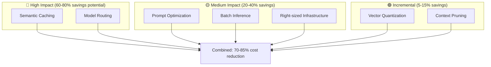
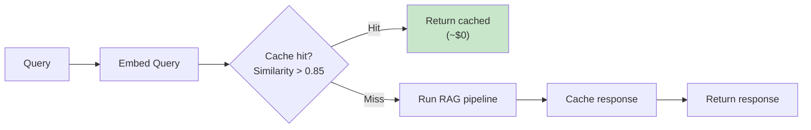
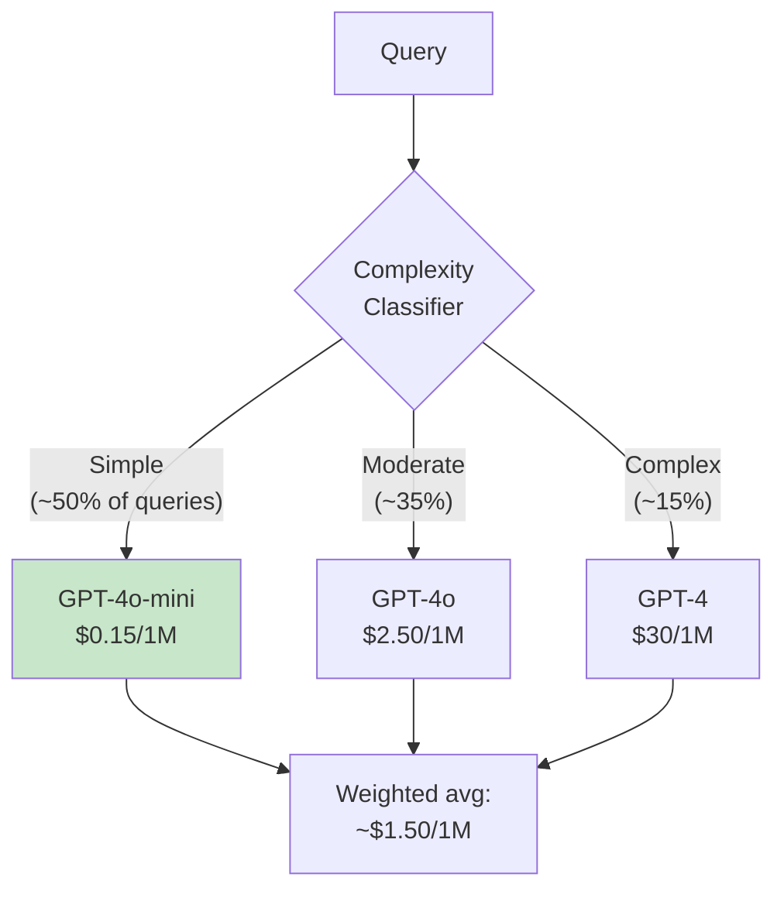

# 💰 Cost Engineering

> **The difference between $18K/month and $3K/month is architectural, not incremental. Design for cost from day one.**

<details>
<summary>🍕 <b>Plain English: Why does RAG cost so much?</b></summary>

<br/>

**You think:** "One question = one API call = a few cents"

**Reality:** "One question = search + read 5 documents + generate answer + maybe retry"

And then multiply that by users:

```
1 question
  × 5 documents in context
  × 2,000 tokens per document  
  × $0.01 per 1K tokens
  = $0.10 per question

Now: 1,000 users × 20 questions/day
  = 20,000 questions/day
  = $2,000/day
  = $60,000/month 😱
```

**It's like a restaurant:** You think you're paying for one meal. But you're also paying for:
- The menu being printed (embedding)
- The waiter walking over 5 times (retrieval)
- The chef tasting the dish (quality check)
- The dishwashing (cleanup)

**The $18K → $3K story:** Teams optimize by:
- **Caching:** "What are your hours?" asked 100 times? Answer once, reuse.
- **Routing:** Simple question → cheap model. Hard question → expensive model.
- **Batching:** Group requests together instead of one at a time.

The key: These decisions are ARCHITECTURE, not afterthoughts. Build them in from day one.

</details>

---

## First Principles of RAG Costs

### Why Costs Compound Exponentially

```
┌─────────────────────────────────────────────────────────────────┐
│                    COST MULTIPLICATION                          │
├─────────────────────────────────────────────────────────────────┤
│                                                                 │
│   Base: 1 query = X tokens                                      │
│                                                                 │
│   Layer 1: Context retrieval                                    │
│            1 query → 5 chunks → 5X context tokens               │
│                                                                 │
│   Layer 2: Generation                                           │
│            System prompt + context + query → 6X input           │
│            Response → +1X output                                │
│                                                                 │
│   Layer 3: Iteration                                            │
│            Self-correction, re-retrieval → 2-3X multiplier      │
│                                                                 │
│   Layer 4: Scale                                                │
│            Users × queries/user × features → 100-1000X          │
│                                                                 │
│   Result: 1 token base → 10,000+ token reality                  │
│                                                                 │
└─────────────────────────────────────────────────────────────────┘
```

### The Cost Equation

```
Monthly Cost = (Queries × Tokens/Query × $/Token) 
             + Vector Storage 
             + Compute Infrastructure
             + (Hidden: Embedding, Reranking, Caching infra)
```

**Real example documented:**
- Unoptimized Azure deployment: **$18K/month**
- After optimization: **~$3K/month** (83% reduction)

---

## Cost Optimization Levers



---

## Lever 1: Semantic Caching (18-68% Savings)

<details>
<summary>🍕 <b>Plain English: What's Semantic Caching?</b></summary>

<br/>

**Normal caching:** "If someone asks the EXACT same question, give them the saved answer."

Problem: People don't ask things the exact same way.
- "What are your hours?"
- "When are you open?"
- "What time do you close?"

These are different strings, so normal caching treats them as 3 separate questions. Three API calls. Three charges.

**Semantic caching:** "If someone asks a SIMILAR question, give them the saved answer."

```
Question: "What are your hours?"
→ Pay for answer, save it

Question: "When are you open?"  
→ System: "This is 92% similar to a cached question"
→ Return cached answer, $0

Question: "What time do you close?"
→ System: "This is 87% similar to a cached question"  
→ Return cached answer, $0
```

**The magic:** Instead of matching exact text, it matches meaning. "Hours" and "open" and "close" all cluster together in the semantic space.

**Savings:** If 50% of your questions are variations of common ones, you just cut your API costs in half.

</details>

### First Principles

- Many queries are semantically similar
- Identical/similar queries don't need fresh LLM calls
- Cache query-response pairs indexed by embedding similarity

### How It Works



### Implementation Options

| Tool | Type | Best For |
|------|------|----------|
| **GPTCache** | Open-source | Self-hosted, full control |
| **Redis Semantic Cache** | Managed | Redis ecosystem |
| **Bedrock Prompt Caching** | AWS native | 90% on cached portions |
| **Azure OpenAI Cache** | Azure native | Azure users |

### Key Parameters

| Parameter | Recommended | Trade-off |
|-----------|-------------|-----------|
| Similarity threshold | 0.85-0.90 | Lower = more hits, less accuracy |
| Cache TTL | 24-72 hours | Match data freshness needs |
| Cache size | Budget-based | LRU eviction for overflow |

### Expected Results

| Workload Type | Cache Hit Rate | Cost Reduction |
|--------------|---------------|----------------|
| Customer support (repetitive) | 40-60% | 35-55% |
| Internal search (varied) | 20-35% | 18-30% |
| Research (unique) | 10-20% | 8-18% |

---

## Lever 2: Model Routing (30-80% Savings)

<details>
<summary>🍕 <b>Plain English: What's Model Routing?</b></summary>

<br/>

**The problem:** You're paying for a brain surgeon to put on Band-Aids.

GPT-4 costs ~100x more than GPT-4o-mini. But for "What are your store hours?"—you don't need the expensive model.

**Model routing:** Use the right model for the job.

```
"What time do you close?"
    → Simple question → Cheap model (GPT-4o-mini) → $0.0001

"Compare our Q3 performance to competitors and suggest strategies"
    → Complex analysis → Expensive model (GPT-4) → $0.01
```

**The math:**
- Without routing: All queries use GPT-4 → $30 per million tokens
- With routing: 
  - 50% simple → $0.15 per million
  - 35% medium → $2.50 per million
  - 15% complex → $30 per million
  - **Average: ~$5 per million** (6x cheaper!)

**It's like:** Using a taxi for airport trips but walking to the corner store. Match the transportation to the trip.

</details>

### First Principles

- Not all queries need the most capable (expensive) model
- Simple queries can use cheap models with equal quality
- Route by complexity to match cost to need

### The Cost Differential

| Model | Input $/1M | Output $/1M | Relative |
|-------|-----------|-------------|----------|
| GPT-4o-mini | $0.15 | $0.60 | 1x |
| Claude Haiku | $0.25 | $1.25 | ~2x |
| GPT-4o | $2.50 | $10.00 | ~15x |
| Claude Sonnet | $3.00 | $15.00 | ~20x |
| GPT-4 | $30.00 | $60.00 | ~100x |
| Claude Opus | $15.00 | $75.00 | ~125x |

### Routing Strategy



### Simple Classifier

```python
def classify_complexity(query: str, context_length: int) -> str:
    # Simple heuristics
    query_lower = query.lower()
    
    # Complex indicators
    complex_words = ["analyze", "compare", "synthesize", "evaluate", 
                     "why", "explain the relationship"]
    requires_reasoning = any(w in query_lower for w in complex_words)
    long_context = context_length > 4000
    
    # Simple indicators
    simple_patterns = ["what is", "when", "where", "who", "how much"]
    is_simple = any(query_lower.startswith(p) for p in simple_patterns)
    short_query = len(query.split()) < 8
    
    if is_simple and short_query and not long_context:
        return "simple"
    elif requires_reasoning or long_context:
        return "complex"
    else:
        return "moderate"
```

### AWS Intelligent Prompt Routing

```python
# Bedrock's built-in intelligent routing
response = bedrock.invoke_model(
    modelId="amazon.bedrock.intelligent-prompt-router",
    body=json.dumps({
        "prompt": query,
        "routing_strategy": "cost_optimized"  # or "quality_optimized"
    })
)
# Automatically selects cheapest model that meets quality threshold
```

---

## Lever 3: Prompt Optimization (Up to 35% Savings)

### First Principles

- Every token costs money
- Verbose prompts waste tokens
- Redundant context wastes tokens
- Optimal prompts are concise and precise

### Before/After Example

```
❌ BEFORE (847 tokens):
"""
You are a helpful, knowledgeable, and friendly AI assistant. Your primary 
task is to help users find accurate information from our company's knowledge 
base. Please be thorough and accurate in your responses. Always make sure to 
cite your sources when providing information. If you don't know something or 
if the information isn't available in the provided context, please say so 
honestly rather than making up information.

Here is some context that might be relevant to answering the user's question:

[Context 1]: The company was founded in 2010 by John Smith in San Francisco. 
It started as a small startup with just 5 employees and has grown to become 
a leading provider of enterprise software solutions. The company's mission is 
to simplify complex business processes through innovative technology.

[Context 2]: Our standard return policy allows customers to return any product 
within 30 days of purchase for a full refund. The product must be in its 
original condition with all tags attached. Shipping costs for returns are the 
responsibility of the customer unless the item was defective or we made an 
error with the order.

[Context 3]: The company headquarters is located at 123 Main Street, San 
Francisco, CA 94105. Our office hours are Monday through Friday, 9 AM to 6 PM 
Pacific Time. We are closed on major US holidays.

Based on all of the above context, please carefully consider the following 
question and provide a helpful, accurate response:

Question: What is the return policy?
"""

✅ AFTER (156 tokens):
"""
Answer using only the context. Cite sources. Say "unknown" if not found.

Context:
- Return policy: 30-day returns, full refund, original condition required
- Customer pays return shipping unless defective/error

Question: What is the return policy?
"""

Savings: 82% token reduction
```

### Optimization Techniques

| Technique | Savings | Effort |
|-----------|---------|--------|
| Remove verbose instructions | 20-40% | Low |
| Prune irrelevant context | 30-50% | Medium |
| Use abbreviations/shorthand | 10-20% | Low |
| Summarize instead of full text | 40-60% | Medium |
| LLMLingua compression | 20-35% | Medium |

### LLMLingua Example

```python
from llmlingua import PromptCompressor

compressor = PromptCompressor(
    model_name="microsoft/llmlingua-2-bert-base-multilingual-cased-meetingbank"
)

compressed = compressor.compress_prompt(
    original_prompt,
    rate=0.5,  # Target 50% of original
    force_tokens=["Question:", "Context:"],  # Preserve these
)

# Achieves 2-10x compression with minimal quality loss
```

---

## Lever 4: Batch Inference (50% Savings)

### First Principles

- Real-time inference has premium pricing
- Non-urgent queries can wait
- Batch processing gets discounts

### Use Cases for Batching

| Use Case | Latency Tolerance | Batch Candidate? |
|----------|-------------------|------------------|
| Live chat support | < 3 seconds | ❌ No |
| Document processing | Hours | ✅ Yes |
| Nightly reports | Next morning | ✅ Yes |
| Content generation | Minutes-hours | ✅ Yes |
| Search indexing | Hours | ✅ Yes |

### AWS Bedrock Batch

```python
import boto3

bedrock = boto3.client('bedrock')

# Submit batch job
response = bedrock.create_model_invocation_job(
    modelId='anthropic.claude-3-sonnet',
    jobName='document-processing-batch',
    inputDataConfig={
        's3InputDataConfig': {
            's3Uri': 's3://bucket/inputs/'
        }
    },
    outputDataConfig={
        's3OutputDataConfig': {
            's3Uri': 's3://bucket/outputs/'
        }
    }
)

# 50% discount vs on-demand pricing
```

### OpenAI Batch API

```python
from openai import OpenAI

client = OpenAI()

# Create batch
batch = client.batches.create(
    input_file_id="file-abc123",
    endpoint="/v1/chat/completions",
    completion_window="24h"  # Results within 24 hours
)

# 50% discount on input/output tokens
```

---

## Lever 5: Vector Storage Optimization

### Cost Comparison

| Service | Pricing Model | 1M Vectors Cost |
|---------|--------------|-----------------|
| Pinecone Starter | Free | $0 |
| Pinecone Standard | Per-vector | ~$70/month |
| Weaviate Cloud | Per-dimension | ~$50/month |
| Qdrant Cloud | Per-cluster | ~$30/month |
| OpenSearch Serverless | Compute + storage | ~$700/month (HA) |
| **AWS S3 Vectors** | Pay-as-you-go | ~$70/month |
| **Azure AI Search Basic** | Flat tier | ~$75/month |

### Quantization Savings

| Precision | Storage | Accuracy Loss | Savings |
|-----------|---------|---------------|---------|
| float32 | 100% | Baseline | - |
| float16 | 50% | Minimal | 2x |
| int8 | 25% | 1-2% | 4x |
| Binary | 3% | 5-10% | 32x |

```python
# Example: int8 quantization in Pinecone
index = pinecone.create_index(
    name="my-index",
    dimension=1536,
    metric="cosine",
    spec=ServerlessSpec(
        cloud="aws",
        region="us-east-1"
    ),
    # Enable quantization
    pods=1,
    pod_type="p1.x1",
    metadata_config={"indexed": []},
    quantization="int8"  # 4x storage savings
)
```

---

## Cost Monitoring Dashboard

### Metrics to Track

| Metric | Formula | Alert If |
|--------|---------|----------|
| Cost per query | Total cost / queries | >50% above baseline |
| Tokens per query | Total tokens / queries | Trending up |
| Cache hit rate | Cached / total | <30% |
| Model mix | % per model tier | <50% on cheap tier |
| Cost per success | Cost / successful resolutions | Trending up |

### Example Dashboard Queries

```sql
-- Daily cost breakdown
SELECT 
    date,
    SUM(input_tokens * input_price) as input_cost,
    SUM(output_tokens * output_price) as output_cost,
    SUM(embedding_tokens * embed_price) as embedding_cost,
    COUNT(*) as query_count,
    SUM(cost) / COUNT(*) as cost_per_query
FROM rag_queries
GROUP BY date
ORDER BY date DESC;

-- Cost by query complexity
SELECT 
    complexity_tier,
    AVG(total_tokens) as avg_tokens,
    AVG(cost) as avg_cost,
    COUNT(*) as query_count
FROM rag_queries
GROUP BY complexity_tier;
```

---

## Complete Optimization Stack

### Implementation Priority

| Week | Lever | Expected Savings | Effort |
|------|-------|-----------------|--------|
| 1 | Prompt optimization | 20-35% | Low |
| 2 | Model routing | 30-50% | Medium |
| 3 | Semantic caching | 18-40% | Medium |
| 4 | Batch non-urgent | 10-20% | Low |
| 5 | Vector optimization | 10-30% | Medium |

### Combined Effect

```
Starting cost: $18,000/month

After prompt optimization:   $12,600  (-30%)
After model routing:         $6,300   (-50%)
After caching:               $4,200   (-33%)
After batching:              $3,500   (-17%)
After vector optimization:   $3,000   (-14%)

Final: $3,000/month (83% total reduction)
```

---

## Platform-Specific Tips

### AWS
- Use S3 Vectors (90% cheaper than OpenSearch Serverless)
- Enable Bedrock prompt caching
- Use Intelligent Prompt Routing
- Batch with model invocation jobs

### Azure
- AI Search Basic tier includes vectors (~$75/month flat)
- Enable Azure OpenAI prompt caching
- Use GPT-4o-mini for simple queries
- Batch with Azure OpenAI batch API

### GCP
- Use Gemini Flash (10x cheaper than Pro)
- Batch with Vertex AI batch predictions
- Consider BigQuery for vector storage (existing customers)

### Databricks
- Use Provisioned Throughput for predictable costs
- MLflow for experiment tracking (included)
- Unity Catalog for governance (included)

---

## First Principles Cost Review

Before any deployment, ask:

1. **What's the cost per query at scale?**
   - Not dev costs, production at 10x-100x volume

2. **Which queries can be cached?**
   - What's the expected cache hit rate?

3. **Which queries need expensive models?**
   - Can most use cheaper alternatives?

4. **What can be batched?**
   - Identify non-real-time workloads

5. **What's the cost monitoring plan?**
   - How will you detect cost anomalies?

---

<div align="center">

[← Evaluation Framework](07-evaluation-framework.md) | [Next: Metadata & Knowledge Layers →](09-metadata-and-knowledge-layers.md)

</div>
