# 🏷️ Metadata Strategy & Knowledge Layers

> **Metadata is the difference between a pile of documents and an organized knowledge base. Without it, your RAG system is searching blind.**

<details>
<summary>🍕 <b>Plain English: Why metadata matters</b></summary>

<br/>

Imagine you walk into a pizza shop and every box is plain white — no labels, no dates, no markings. You don't know which box has pepperoni, which one was made today, and which one has been sitting there since last Tuesday.

**That's your RAG system without metadata.**

Now imagine every box has a label: "Pepperoni, made 2 hours ago, for dine-in, certified gluten-free." Suddenly you can:
- Find the right pizza instantly (filtering)
- Skip the stale ones (freshness)
- Match dietary needs (domain classification)
- Know which kitchen made it (source authority)

**Metadata is the label on the box.** It doesn't change the pizza inside, but it makes the difference between a great experience and food poisoning.

</details>

---

## Why Metadata Is a Force Multiplier

Most teams treat metadata as an afterthought — something to "add later." This is a mistake. Metadata captured at ingestion time is cheap. Metadata reconstructed after the fact is expensive, unreliable, and often impossible.

| Without Metadata | With Metadata |
|-----------------|---------------|
| Search returns 20 results, all technically relevant | Search returns 5 results, filtered to your department and time range |
| Stale docs silently override current ones | Freshness scoring surfaces the latest version |
| No way to explain *why* a result was chosen | Full audit trail from source to response |
| Every query searches the entire knowledge base | Smart routing narrows scope before search begins |

### The Metadata Equation

```
Retrieval Quality = Search Relevance × Metadata Precision
```

Even perfect semantic search degrades if it can't distinguish a draft from a final version, an internal memo from an official policy, or a document from 2019 from one updated last week.

---

## Metadata Taxonomy: What to Capture

Think of metadata in four layers, from basic to advanced:

### Layer 1: Source Metadata (Capture at Ingestion)

This is the "birth certificate" for every document. Capture it automatically when documents enter your system.

| Field | Description | Example | Why It Matters |
|-------|-------------|---------|----------------|
| `source_uri` | Where the document came from | `s3://docs/policy-v3.pdf` | Deduplication, audit trail |
| `source_type` | Category of source | `policy`, `faq`, `transcript` | Query routing, filtering |
| `created_at` | When the document was created | `2025-01-15T10:30:00Z` | Freshness scoring |
| `last_modified` | When last updated | `2025-06-01T14:00:00Z` | Staleness detection |
| `author` | Who created it | `legal-team` | Authority weighting |
| `version` | Document version | `3.2` | Supersession logic |
| `access_level` | Who can see it | `internal`, `public` | Security filtering |

<details>
<summary>🍕 <b>Pizza analogy: The pizza box label</b></summary>

<br/>

This is the basic info printed on every pizza box: what's inside, when it was made, who made it, and whether it's for dine-in or delivery. You'd never ship a pizza without this — don't ship documents without it either.

</details>

### Layer 2: Content Metadata (Enrich During Processing)

This metadata is derived from the document content itself. It answers: "What is this document actually about?"

| Field | Description | How to Extract | Example |
|-------|-------------|----------------|---------|
| `topics` | Key topics covered | LLM extraction or classifier | `["return-policy", "refunds"]` |
| `entities` | Named entities mentioned | NER model or LLM | `["ACME Corp", "Q3 2025"]` |
| `domain` | Business domain | Classifier | `legal`, `engineering`, `hr` |
| `language` | Document language | Detection library | `en`, `es`, `fr` |
| `summary` | Brief content summary | LLM summarization | "Q3 earnings report showing..." |
| `confidence` | Extraction confidence | OCR/parser output | `0.95` |

```python
def enrich_content_metadata(chunk: str, llm) -> dict:
    """Extract content metadata from a chunk using an LLM."""
    prompt = f"""Analyze this text and extract:
    1. Primary topics (2-5 keywords)
    2. Named entities (people, orgs, dates, products)
    3. Business domain (one of: legal, engineering, hr, finance, support, general)
    4. One-sentence summary

    Text: {chunk}

    Return as JSON."""

    response = llm.invoke(prompt)
    return parse_json(response)
```

### Layer 3: Retrieval Metadata (Capture at Query Time)

This metadata is generated during retrieval and helps downstream components make better decisions.

| Field | Description | Example |
|-------|-------------|---------|
| `retrieval_score` | Similarity/relevance score | `0.87` |
| `retrieval_method` | How it was found | `hybrid_search`, `keyword_only` |
| `retrieval_rank` | Position in result set | `3 of 20` |
| `reranker_score` | Score after reranking | `0.92` |
| `query_match_type` | How query matched | `semantic`, `exact_keyword`, `entity_match` |

### Layer 4: Generation Metadata (Capture at Response Time)

This metadata tracks what happened after retrieval — critical for feedback loops and debugging.

| Field | Description | Example |
|-------|-------------|---------|
| `chunks_used` | Which chunks the LLM actually cited | `[chunk_42, chunk_87]` |
| `chunks_provided` | Total chunks in context | `5` |
| `generation_model` | Which model generated the response | `claude-sonnet-4-20250514` |
| `response_confidence` | Model's self-assessed confidence | `high`, `medium`, `low` |
| `latency_ms` | End-to-end response time | `1240` |
| `token_count` | Tokens consumed | `{prompt: 3200, completion: 450}` |

---

## Metadata-Driven Retrieval Patterns

### Pattern 1: Freshness-Weighted Search

Don't just find relevant documents — find *current* relevant documents.

```python
def freshness_weighted_search(query: str, vector_db, decay_rate: float = 0.1):
    """Combine semantic relevance with document freshness."""
    results = vector_db.search(query, top_k=20)

    for result in results:
        age_days = (datetime.now() - result.metadata["last_modified"]).days
        freshness_score = math.exp(-decay_rate * age_days / 365)
        result.final_score = result.similarity_score * 0.7 + freshness_score * 0.3

    return sorted(results, key=lambda r: r.final_score, reverse=True)[:10]
```

<details>
<summary>🍕 <b>Pizza analogy: The freshness rule</b></summary>

<br/>

If two pizzas score equally on "what the customer wants," but one was made 5 minutes ago and the other is from yesterday — you serve the fresh one. That's freshness-weighted search.

Decay rate controls how aggressively you penalize staleness. A news site might have a fast decay (yesterday's news is old). A legal firm might have a slow decay (a 2-year-old contract is still valid).

</details>

### Pattern 2: Authority-Based Boosting

Not all sources are created equal. An official policy document should outrank a Slack message on the same topic.

```python
AUTHORITY_WEIGHTS = {
    "official_policy": 1.0,
    "approved_documentation": 0.9,
    "internal_wiki": 0.7,
    "meeting_notes": 0.5,
    "chat_transcript": 0.3,
}

def authority_boosted_search(query: str, results: list) -> list:
    """Boost results based on source authority."""
    for result in results:
        source_type = result.metadata.get("source_type", "general")
        authority = AUTHORITY_WEIGHTS.get(source_type, 0.5)
        result.final_score = result.similarity_score * 0.6 + authority * 0.4
    return sorted(results, key=lambda r: r.final_score, reverse=True)
```

### Pattern 3: Scoped Search with Pre-Filtering

Use metadata to narrow the search space *before* vector similarity runs. This is faster and more precise.

```python
def scoped_search(query: str, vector_db, user_context: dict) -> list:
    """Filter by metadata before semantic search."""
    filters = {
        "access_level": {"$in": user_context["permissions"]},
        "domain": user_context.get("department", None),
        "last_modified": {"$gte": user_context.get("min_date", "2020-01-01")},
    }
    # Remove None filters
    filters = {k: v for k, v in filters.items() if v is not None}

    return vector_db.search(
        query=query,
        top_k=10,
        filter=filters  # Metadata pre-filter
    )
```

### Pattern 4: Version-Aware Retrieval

When documents have multiple versions, always surface the latest unless explicitly asked for history.

```python
def version_aware_search(query: str, results: list) -> list:
    """Deduplicate results by source, keeping latest version."""
    latest_by_source = {}
    for result in results:
        source = result.metadata.get("source_uri")
        version = result.metadata.get("version", "0")
        if source not in latest_by_source or version > latest_by_source[source].metadata["version"]:
            latest_by_source[source] = result
    return list(latest_by_source.values())
```

---

## Building a Semantic / Knowledge Layer

### What Is a Knowledge Layer?

A knowledge layer sits between your raw documents and your retrieval system. It structures information into entities, relationships, and concepts — transforming a document pile into a connected knowledge base.

<details>
<summary>🍕 <b>Pizza analogy: The difference between a pantry and a recipe book</b></summary>

<br/>

Your raw documents are like a pantry full of ingredients — flour, sauce, cheese, pepperoni. They're all there, but you have to figure out what goes together.

A **knowledge layer** is like adding a recipe book on top. Now you know:
- Mozzarella **goes with** tomato sauce (relationship)
- Pepperoni **is a type of** topping (taxonomy)
- Margherita **requires** basil, mozzarella, and tomato (entity connections)
- "Hawaiian" **is controversial** among pizza purists (contextual note)

Without the recipe book, you might put chocolate on a pepperoni pizza because they were sitting next to each other on the shelf. With it, you understand what actually goes together and why.

</details>

### When You Need a Knowledge Layer

| Signal | Example | Why Basic RAG Fails |
|--------|---------|---------------------|
| Questions about relationships | "Who reports to the VP of Engineering?" | Vector search finds people docs but can't traverse org charts |
| Aggregation queries | "How many products are in the Beta category?" | Embeddings capture meaning, not structure |
| Multi-hop reasoning | "What's the policy for teams whose manager left?" | Requires connecting Policy → Team → Manager → Status |
| Concept hierarchies | "Show me all cardiovascular medications" | Need to know that "ACE inhibitors" *are* cardiovascular medications |

### Knowledge Layer Architecture

```mermaid
flowchart TD
    subgraph Sources["📄 Raw Documents"]
        A[PDFs]
        B[Wikis]
        C[Databases]
    end

    subgraph Extraction["🔍 Entity Extraction"]
        D["Named Entity Recognition"]
        E["Relationship Extraction"]
        F["Taxonomy Classification"]
    end

    subgraph KnowledgeLayer["🧠 Knowledge Layer"]
        G["Entity Store<br/>(People, Products, Policies)"]
        H["Relationship Graph<br/>(reports-to, depends-on, supersedes)"]
        I["Concept Taxonomy<br/>(Category hierarchies)"]
    end

    subgraph Retrieval["🔍 Enhanced Retrieval"]
        J["Vector Search<br/>(semantic)"]
        K["Graph Traversal<br/>(relationships)"]
        L["Taxonomy Expansion<br/>(concept broadening)"]
    end

    Sources --> Extraction
    Extraction --> KnowledgeLayer
    KnowledgeLayer --> Retrieval
```



### Entity Extraction Pipeline

```python
def extract_entities_and_relationships(document: str, llm) -> dict:
    """Extract structured knowledge from a document."""
    prompt = f"""Analyze this document and extract:

    1. ENTITIES: Named things (people, organizations, products, policies, dates)
       Format: {{"name": "...", "type": "...", "description": "..."}}

    2. RELATIONSHIPS: How entities connect to each other
       Format: {{"source": "...", "relationship": "...", "target": "..."}}

    3. CONCEPTS: Abstract topics or categories
       Format: {{"concept": "...", "parent_concept": "..."}}

    Document:
    {document}

    Return as JSON with keys: entities, relationships, concepts"""

    result = llm.invoke(prompt)
    return parse_json(result)


# Example output:
# {
#   "entities": [
#     {"name": "Return Policy v3", "type": "policy", "description": "30-day return..."},
#     {"name": "Customer Service", "type": "department", "description": "Handles returns..."}
#   ],
#   "relationships": [
#     {"source": "Return Policy v3", "relationship": "owned_by", "target": "Customer Service"},
#     {"source": "Return Policy v3", "relationship": "supersedes", "target": "Return Policy v2"}
#   ],
#   "concepts": [
#     {"concept": "return_policy", "parent_concept": "customer_policies"}
#   ]
# }
```

### Graph-Enhanced Retrieval

Combine vector search with knowledge graph traversal for queries that require understanding relationships.

```python
def graph_enhanced_retrieval(query: str, vector_db, knowledge_graph) -> list:
    """Combine vector search with knowledge graph traversal."""
    # Step 1: Standard vector search
    vector_results = vector_db.search(query, top_k=10)

    # Step 2: Extract entities from query
    query_entities = extract_entities(query)

    # Step 3: Traverse knowledge graph for related entities
    related_entities = set()
    for entity in query_entities:
        neighbors = knowledge_graph.get_neighbors(entity, max_hops=2)
        related_entities.update(neighbors)

    # Step 4: Fetch chunks associated with related entities
    graph_results = vector_db.search_by_entity(
        entities=list(related_entities),
        top_k=5
    )

    # Step 5: Merge and deduplicate
    all_results = merge_results(vector_results, graph_results)
    return all_results[:10]
```

### Knowledge Layer Maintenance

A knowledge layer is not "set and forget." It requires ongoing maintenance — just like the documents it's built from.

| Maintenance Task | Frequency | Automated? |
|-----------------|-----------|------------|
| Entity extraction on new documents | Every ingestion | Yes |
| Relationship validation | Weekly | Partially — flag conflicts for human review |
| Stale entity detection | Weekly | Yes — cross-reference with source doc timestamps |
| Taxonomy updates | Monthly | No — requires domain expert input |
| Full graph rebuild | Quarterly | Yes, but schedule during off-peak |

**Cost consideration:** Entity extraction via LLM calls adds ingestion cost. Budget approximately 1-3 LLM calls per document for extraction. For a 10,000-document corpus, this is a one-time cost of ~$50-150 depending on document size and model choice, with incremental costs for new documents.

---

## Metadata Storage: Where to Put It

### Option 1: Vector Database Native Metadata

Most vector databases support metadata fields alongside embeddings. This is the simplest approach for filtering.

```python
# Example: Storing metadata in a vector DB (Pinecone-style)
vector_db.upsert(
    vectors=[{
        "id": "chunk_42",
        "values": embedding,
        "metadata": {
            "source_uri": "s3://docs/policy-v3.pdf",
            "source_type": "official_policy",
            "domain": "legal",
            "last_modified": "2025-06-01",
            "version": "3.0",
            "topics": ["return-policy", "refunds"],
            "access_level": "internal"
        }
    }]
)
```

### Option 2: External Knowledge Graph

For complex relationships, use a dedicated graph database (e.g., Neo4j, Amazon Neptune) alongside your vector store.

### Option 3: Hybrid Approach (Recommended for Production)

```
Vector DB       → Chunk embeddings + filterable metadata (Layer 1-2)
Graph Database  → Entity relationships + concept hierarchies (Knowledge Layer)
Logging Store   → Retrieval + generation metadata (Layer 3-4)
```

---

## Common Metadata Mistakes

| Mistake | Consequence | Fix |
|---------|-------------|-----|
| Not capturing metadata at ingestion | Expensive to reconstruct later | Build metadata extraction into ingestion pipeline from day one |
| Storing metadata in a separate system with no join | Metadata filtering becomes a bottleneck | Co-locate filterable metadata with embeddings |
| Treating all sources as equal authority | Slack messages outrank official policies | Implement authority weighting |
| Not tracking document versions | Outdated chunks persist indefinitely | Version-aware deduplication |
| Over-engineering the taxonomy | 200 categories nobody maintains | Start with 10-15 categories, expand based on actual query patterns |
| Ignoring generation metadata | Can't debug why answers go wrong | Log which chunks were used and how the model scored confidence |

---

## Implementation Checklist

Before going to production:

- [ ] Source metadata captured automatically at ingestion (Layer 1)
- [ ] Content metadata extracted for at least: topics, domain, entities (Layer 2)
- [ ] Freshness scoring implemented for time-sensitive domains
- [ ] Authority weighting configured for different source types
- [ ] Access control metadata enforced (users only see what they should)
- [ ] Version deduplication in place
- [ ] Retrieval metadata logged for debugging (Layer 3)
- [ ] Generation metadata logged for feedback loops (Layer 4)
- [ ] Knowledge layer evaluated for need (do your queries require relationship traversal?)
- [ ] Metadata maintenance schedule established

---

## References

### Academic Research
- Gao et al., *"Retrieval-Augmented Generation for Knowledge-Intensive NLP Tasks"* — NeurIPS 2020 — [arXiv:2005.11401](https://arxiv.org/abs/2005.11401)
- Edge et al., *"From Local to Global: A Graph RAG Approach to Query-Focused Summarization"* — Microsoft Research 2024 — [arXiv:2404.16130](https://arxiv.org/abs/2404.16130)

### Industry
- **Anthropic** (2024), *Contextual Retrieval* — [anthropic.com](https://www.anthropic.com/news/contextual-retrieval)
- **Microsoft** (2024), *GraphRAG: Unlocking LLM discovery on narrative private datasets* — [microsoft.com](https://www.microsoft.com/en-us/research/blog/graphrag-unlocking-llm-discovery-on-narrative-private-datasets/)

---

<div align="center">

[← Cost Engineering](08-cost-engineering.md) | [Next: Feedback Loops & Refinement →](10-feedback-loops-and-refinement.md)

</div>
