# 🔄 Feedback Loops & Refinement

> **A RAG system without a feedback loop is like a restaurant that never reads its reviews — it can't improve and doesn't know it's failing.**

<details>
<summary>🍕 <b>Plain English: What is a feedback loop?</b></summary>

<br/>

You order a pizza. It arrives with pineapple even though you asked for pepperoni. What happens next depends on whether the pizza shop has a feedback loop:

**Without a feedback loop:**
- You're annoyed, but the shop never hears about it
- Next customer gets the same wrong pizza
- The shop thinks they're doing great because nobody "officially" complained
- They keep losing customers and don't know why

**With a feedback loop:**
- You click "report an issue" on the app
- The shop sees: "Order #472: wrong topping, customer wanted pepperoni, got pineapple"
- They investigate: Ah, the order system maps "P" to "Pineapple" instead of "Pepperoni"
- They fix the mapping
- Future orders get it right

**That's the whole idea.** Capture what went wrong, figure out *why*, fix the root cause, and verify the fix worked. Then repeat forever.

The same thing applies to RAG: users get bad answers, you capture that signal, trace it back to the root cause (bad retrieval? bad chunking? bad prompt?), fix it, and measure improvement.

</details>

---

## Why Most RAG Systems Never Improve

Most teams build a RAG system, deploy it, and move on to the next project. The system slowly degrades and nobody notices until users stop trusting it.

```mermaid
flowchart TD
    subgraph NoLoop["❌ Without Feedback Loop"]
        A1["Deploy RAG"] --> B1["Users find issues"]
        B1 --> C1["Some complain, most leave"]
        C1 --> D1["Team doesn't know"]
        D1 --> E1["System degrades"]
        E1 --> F1["'RAG doesn't work'"]
    end

    subgraph WithLoop["✅ With Feedback Loop"]
        A2["Deploy RAG"] --> B2["Users find issues"]
        B2 --> C2["Feedback captured automatically"]
        C2 --> D2["Issues categorized and prioritized"]
        D2 --> E2["Root cause identified"]
        E2 --> F2["Fix deployed and measured"]
        F2 --> G2["System improves over time"]
        G2 --> B2
    end

    style F1 fill:#ffcdd2
    style G2 fill:#c8e6c9
```



### The Improvement Flywheel

When done right, feedback loops create a compounding advantage:

```
Better answers → More user trust → More usage → More feedback data
→ Better root cause analysis → Targeted fixes → Better answers → ...
```

---

## Two Types of Feedback

### Explicit Feedback: Users Tell You

This is the most direct signal — users actively indicate whether an answer was helpful.

| Mechanism | Signal Strength | Implementation Effort |
|-----------|----------------|----------------------|
| Thumbs up / thumbs down | Medium | Low — simple UI element |
| Star ratings (1-5) | Medium | Low — adds granularity |
| "Report incorrect answer" | High | Medium — needs categorization |
| User corrections ("Actually, the answer is...") | Very High | Medium — needs capture and storage |
| Escalation to human agent | Very High | High — needs routing infrastructure |

```python
def capture_explicit_feedback(interaction_id: str, feedback: dict):
    """Store explicit user feedback linked to the full interaction trace."""
    feedback_record = {
        "interaction_id": interaction_id,
        "timestamp": datetime.utcnow().isoformat(),
        "rating": feedback.get("rating"),           # thumbs_up, thumbs_down, 1-5
        "category": feedback.get("category"),        # wrong_answer, outdated, incomplete, irrelevant
        "user_correction": feedback.get("correction"),  # "The actual policy is..."
        "user_comment": feedback.get("comment"),

        # Link back to the full interaction for root cause analysis
        "query": feedback["original_query"],
        "response": feedback["original_response"],
        "chunks_used": feedback["chunks_used"],
        "retrieval_scores": feedback["retrieval_scores"],
    }
    feedback_store.insert(feedback_record)
```

<details>
<summary>🍕 <b>Pizza analogy: The comment card vs. the silent walkout</b></summary>

<br/>

Explicit feedback is the comment card on the table. Most people won't fill it out, but those who do give you gold — especially if they write *why* the pizza was bad ("crust was burnt," "wrong toppings," "arrived cold").

The trick is making it easy. A single "Was this helpful? Yes / No" button gets 10x more responses than a detailed survey form.

</details>

### Implicit Feedback: Actions Speak Louder

Users constantly tell you how they feel *through behavior* — even when they don't click a feedback button.

| Signal | What It Suggests | How to Capture |
|--------|-----------------|----------------|
| Query reformulation | First answer wasn't helpful | Detect same user rephrasing within session |
| Copy/paste from response | Answer was useful | Track clipboard events (with consent) |
| Time on response | Engagement level | Track dwell time |
| Follow-up questions | Answer was incomplete | Detect question chains |
| Abandonment | User gave up | Track sessions that end without resolution |
| "Let me talk to a human" | System failed | Track escalation requests |
| Same question from multiple users | Knowledge gap | Aggregate query patterns |

```python
def detect_implicit_signals(session: Session) -> list:
    """Analyze session behavior for implicit feedback signals."""
    signals = []

    # Detect query reformulation (same intent, different words)
    queries = session.get_queries()
    for i in range(1, len(queries)):
        similarity = compute_similarity(queries[i-1], queries[i])
        if similarity > 0.7:  # Same topic, rephrased
            signals.append({
                "type": "reformulation",
                "severity": "medium",
                "original_query": queries[i-1],
                "reformulated_query": queries[i],
                "interpretation": "User rephrased — first answer likely unhelpful"
            })

    # Detect abandonment
    if not session.has_resolution_signal():
        signals.append({
            "type": "abandonment",
            "severity": "high",
            "last_query": queries[-1] if queries else None,
            "interpretation": "User left without getting a useful answer"
        })

    return signals
```

---

## The Refinement Pipeline: From Feedback to Fixes

Capturing feedback is only half the battle. The real value comes from systematically turning feedback into improvements.

### Step 1: Categorize the Failure

Every piece of negative feedback should be classified by *where in the pipeline* the failure occurred.


<details>
<summary>🍕 <b>Pizza analogy: Diagnosing the complaint</b></summary>

<br/>

When a customer says "bad pizza," you need to figure out what went wrong:

| Complaint | Root Cause | Fix |
|-----------|-----------|-----|
| "I got the wrong pizza" | Kitchen grabbed wrong order | **Retrieval** — match orders to kitchens better |
| "The pizza was cold" | Delivery took too long | **System** — optimize delivery routes |
| "The toppings were weird" | Chef improvised | **Generation** — follow the recipe (prompt) |
| "This pizza has last week's specials" | Menu wasn't updated | **Freshness** — update more frequently |
| "You don't have my favorite topping" | Topping not available | **Coverage** — add it to inventory |

Same negative signal ("bad pizza"), five completely different fixes. That's why categorization matters.

</details>

### Step 2: Root Cause Analysis

For each failure category, drill into the specifics:

```python
def analyze_failure(feedback_record: dict) -> dict:
    """Trace a negative feedback back to its root cause."""
    analysis = {"interaction_id": feedback_record["interaction_id"]}

    # Check retrieval quality
    chunks_used = feedback_record["chunks_used"]
    retrieval_scores = feedback_record["retrieval_scores"]

    # Were the retrieved chunks relevant to the query?
    relevance_scores = evaluate_chunk_relevance(
        query=feedback_record["query"],
        chunks=chunks_used
    )

    if max(relevance_scores) < 0.5:
        analysis["failure_stage"] = "retrieval"
        analysis["root_cause"] = "No relevant chunks found"
        analysis["recommendation"] = "Check chunking strategy and embedding model"
    elif max(relevance_scores) > 0.7 and feedback_record["rating"] == "thumbs_down":
        analysis["failure_stage"] = "generation"
        analysis["root_cause"] = "Good chunks retrieved but answer was wrong"
        analysis["recommendation"] = "Review prompt template and context assembly"
    else:
        analysis["failure_stage"] = "relevance"
        analysis["root_cause"] = "Chunks were partially relevant but missed key info"
        analysis["recommendation"] = "Review query expansion and reranking"

    return analysis
```

### Step 3: Prioritize and Fix

Not all feedback deserves immediate action. Prioritize by impact and frequency.

| Priority | Criteria | Action |
|----------|----------|--------|
| **P0 — Critical** | Same wrong answer affecting many users | Fix immediately, add to golden dataset |
| **P1 — High** | Recurring failure pattern (>5 reports/week) | Root cause analysis, scheduled fix |
| **P2 — Medium** | Occasional failures in specific topics | Add to backlog, batch with related fixes |
| **P3 — Low** | Edge cases, rare queries | Monitor, fix if pattern emerges |

### Step 4: Verify the Fix

Every fix must be measured. Otherwise you're just guessing.

```python
def verify_fix(fix_description: str, affected_queries: list, eval_metrics: dict):
    """Run affected queries through the updated system and compare."""
    before_scores = eval_metrics["baseline"]

    # Run evaluation on affected queries with the new system
    after_scores = run_evaluation(affected_queries)

    improvement = {
        metric: after_scores[metric] - before_scores[metric]
        for metric in before_scores
    }

    # Check for regressions on unrelated queries
    regression_check = run_evaluation(golden_dataset)

    return {
        "fix": fix_description,
        "improvement": improvement,
        "regressions": {
            metric: regression_check[metric] - eval_metrics["golden_baseline"][metric]
            for metric in eval_metrics["golden_baseline"]
        }
    }
```

---

## Closed-Loop Improvement Patterns

### Pattern 1: Query Analytics → Chunking Refinement

Analyze what users actually search for and adjust chunking accordingly.

```python
def analyze_query_patterns(feedback_store, time_window_days: int = 30) -> dict:
    """Identify patterns in failed queries to guide chunking improvements."""
    failed_queries = feedback_store.get_negative_feedback(days=time_window_days)

    patterns = {
        "too_broad": [],     # Chunks too large, return irrelevant context
        "too_narrow": [],    # Chunks too small, miss complete answers
        "boundary_issues": [],  # Answer split across chunk boundaries
        "missing_context": [],  # Chunk lacks surrounding document context
    }

    for query_record in failed_queries:
        chunk_sizes = [len(c.split()) for c in query_record["chunks_used"]]
        avg_relevance = mean(query_record["relevance_scores"])

        if avg_relevance < 0.3 and mean(chunk_sizes) > 400:
            patterns["too_broad"].append(query_record)
        elif query_record.get("answer_completeness", 1) < 0.5:
            patterns["too_narrow"].append(query_record)

    return patterns
```

### Pattern 2: Feedback-Driven Golden Dataset Expansion

Every confirmed user correction is a free test case. Add it to your golden dataset.

```python
def expand_golden_dataset(feedback_store, golden_dataset):
    """Add confirmed user corrections to the evaluation dataset."""
    corrections = feedback_store.get_user_corrections(verified=True)

    for correction in corrections:
        test_case = {
            "query": correction["original_query"],
            "ground_truth": correction["user_provided_answer"],
            "source": "user_feedback",
            "created_date": correction["timestamp"],
            "failure_type": correction["failure_category"],
        }
        golden_dataset.add(test_case)

    return len(corrections)
```

<details>
<summary>🍕 <b>Pizza analogy: Learning from complaints to build your training manual</b></summary>

<br/>

Every time a customer says "I ordered pepperoni but got pineapple," you've just gained a free training example. Write it down:

- **Order:** "Pepperoni pizza" → **Should get:** Pepperoni pizza
- **Order:** "Margherita, no basil" → **Should get:** Margherita without basil

Over time, you build a training manual (golden dataset) full of real customer orders and the correct outcomes. New employees (new model versions) can be tested against this manual before they start making pizzas.

The best training manuals are written by customers, not managers.

</details>

### Pattern 3: Embedding & Retrieval Retuning

When feedback consistently shows retrieval failures in a specific domain, it may be time to adjust.

| Signal | Action | Frequency |
|--------|--------|-----------|
| >15% of queries in a domain get low retrieval scores | Review chunking strategy for that document set | Monthly review |
| Users consistently reformulate queries with jargon | Add domain synonyms to search configuration | As patterns emerge |
| New document types added (e.g., videos, tables) | Evaluate if current embedding model handles them | Per new content type |
| Retrieval scores gradually declining across the board | Check for semantic collapse (too many similar docs) | Weekly monitoring |

### Pattern 4: Prompt Refinement from Generation Failures

When retrieval is good but generation is bad, the fix is usually in the prompt.

```python
def analyze_generation_failures(feedback_store) -> dict:
    """Identify prompt improvement opportunities from generation failures."""
    gen_failures = feedback_store.get_failures(stage="generation")

    categories = {
        "hallucination": [],      # Model made stuff up despite good context
        "incomplete": [],         # Model missed info that was in context
        "wrong_format": [],       # Answer format doesn't match user need
        "too_verbose": [],        # Answer buries key info in filler
        "ignored_context": [],    # Model used parametric knowledge instead
    }

    for failure in gen_failures:
        # Classify using LLM analysis
        category = classify_generation_failure(
            query=failure["query"],
            context=failure["chunks_used"],
            response=failure["response"],
            user_feedback=failure["user_comment"]
        )
        categories[category].append(failure)

    # Recommend prompt changes based on most common category
    top_category = max(categories, key=lambda k: len(categories[k]))
    return {
        "top_failure_type": top_category,
        "count": len(categories[top_category]),
        "examples": categories[top_category][:5],
        "prompt_recommendation": get_prompt_fix(top_category)
    }
```

---

## Measuring Feedback Loop Effectiveness

### Key Metrics

| Metric | What It Measures | Target |
|--------|-----------------|--------|
| **Feedback capture rate** | % of interactions that generate a feedback signal | >10% explicit, >80% implicit |
| **Time to root cause** | How quickly you identify why failures happen | <1 week for P0/P1 |
| **Fix verification rate** | % of fixes that measurably improve metrics | >70% |
| **Regression rate** | % of fixes that break something else | <5% |
| **Golden dataset growth** | New test cases added per month from feedback | 10-20/month |
| **User satisfaction trend** | Thumbs-up rate over time | Increasing month-over-month |

### Feedback Loop Maturity Model

| Level | Description | Characteristics |
|-------|-------------|-----------------|
| **0 — No Feedback** | No signal captured | "It seems to work" |
| **1 — Basic Capture** | Thumbs up/down collected | Have data but don't act on it |
| **2 — Categorized** | Failures classified by stage | Know *where* things break |
| **3 — Root Cause** | Systematic analysis pipeline | Know *why* things break |
| **4 — Closed Loop** | Feedback drives automated fixes and evaluation | Continuously improving system |
| **5 — Predictive** | Anticipate failures before users notice | Proactive monitoring and alerting |

**Most production RAG systems are at Level 0 or 1.** Getting to Level 3 is a significant competitive advantage.

---

## Implementation Checklist

Before considering your feedback loop production-ready:

- [ ] Explicit feedback mechanism deployed (minimum: thumbs up/down)
- [ ] Implicit signals captured (reformulation, abandonment)
- [ ] Feedback linked to full interaction trace (query, chunks, response)
- [ ] Failure categorization pipeline in place (retrieval / relevance / generation / freshness / coverage)
- [ ] Priority framework defined (P0-P3)
- [ ] Golden dataset expanding from verified corrections
- [ ] Fix verification process (before/after measurement)
- [ ] Regression testing on golden dataset for every change
- [ ] Monthly feedback review meeting with the team
- [ ] Dashboard tracking feedback loop metrics

---

## References

### Academic Research
- Zhu et al., *"Active Learning for Natural Language Processing"* — EACL 2024
- Gao et al., *"Retrieval-Augmented Generation for Knowledge-Intensive NLP Tasks"* — NeurIPS 2020 — [arXiv:2005.11401](https://arxiv.org/abs/2005.11401)

### Industry
- **Anthropic** (2024), *Contextual Retrieval* — [anthropic.com](https://www.anthropic.com/news/contextual-retrieval)
- **Databricks** (2024), *GenAI Cookbook: Evaluation-Driven Development* — [GitHub](https://github.com/databricks/genai-cookbook)

---

<div align="center">

[← Metadata & Knowledge Layers](09-metadata-and-knowledge-layers.md) | [Next: Human-in-the-Loop →](11-human-in-the-loop.md)

</div>
