# 👤 Human-in-the-Loop & Retraining

> **AI handles the easy 80%. Humans handle the critical 20%. Knowing where to draw that line — and when to move it — is what separates production RAG from expensive demos.**

<details>
<summary>🍕 <b>Plain English: Why do we need humans in the loop?</b></summary>

<br/>

Imagine a pizza shop that's fully automated — robots take orders, make pizzas, and deliver them. Works great for standard orders: pepperoni, margherita, Hawaiian.

But what happens when:
- A customer orders "the thing I had last time but without the stuff my kid doesn't like" (ambiguous input)
- Someone has a severe nut allergy and asks "is this safe?" (high-stakes decision)
- A new menu item comes in that the robots have never seen before (novel situation)
- The robot accidentally puts anchovies on a birthday cake (confident but catastrophically wrong)

**You need a human for these moments.** Not for every pizza — that defeats the purpose of automation. But for the cases where getting it wrong is either:
1. **Dangerous** (healthcare, legal, financial)
2. **Confusing** (the system doesn't know what the user wants)
3. **Novel** (the system hasn't seen this before)

The goal isn't "humans check everything" — that doesn't scale. The goal is **smart routing**: let AI handle what it's good at, and bring humans in where they add the most value.

</details>

---

## When to Include Humans

Not every RAG response needs human review. The key is knowing *which* responses do.

### The Confidence-Risk Matrix


| Scenario | Confidence | Risk | Action |
|----------|-----------|------|--------|
| Common FAQ, clear answer | High | Low | Auto-approve — let AI handle it |
| Common FAQ, unclear answer | Low | Low | Auto-approve with "I'm not sure" caveat |
| Medical dosage question | High | High | Spot-check — sample and review |
| Medical question, uncertain answer | Low | High | **Always route to human** |
| Novel query the system hasn't seen | Low | Unknown | Route to human, use response for training |

<details>
<summary>🍕 <b>Pizza analogy: The escalation policy</b></summary>

<br/>

Think of your pizza shop's escalation policy:

- **Robot handles it:** "I'd like a large pepperoni." (Common order, low risk)
- **Robot handles it with a note:** "I'd like something cheesy." (Ambiguous but low risk — guess and add a note: "We made you a four-cheese pizza. Let us know if that's not right!")
- **Manager reviews:** "I need 200 pizzas for a corporate event by tomorrow." (High value, complex logistics)
- **Manager handles directly:** "I have a severe gluten allergy. What can I eat?" (High risk — getting this wrong could hurt someone)

The robot doesn't need to make *zero* mistakes. It needs to **know when it doesn't know** and escalate appropriately.

</details>

### Confidence Scoring: The Foundation of HITL

Your HITL system is only as good as your confidence scoring. If the system can't accurately assess its own certainty, it can't route effectively.

```python
def compute_response_confidence(
    query: str,
    response: str,
    retrieved_chunks: list,
    retrieval_scores: list
) -> dict:
    """Multi-signal confidence scoring for HITL routing."""

    signals = {}

    # Signal 1: Retrieval confidence
    # Are the retrieved chunks actually relevant?
    signals["retrieval_confidence"] = mean(retrieval_scores) if retrieval_scores else 0.0

    # Signal 2: Coverage confidence
    # Does the context contain enough info to answer?
    signals["coverage_confidence"] = assess_coverage(query, retrieved_chunks)

    # Signal 3: Consistency confidence
    # If we generate multiple answers, do they agree?
    responses = [generate_response(query, retrieved_chunks) for _ in range(3)]
    signals["consistency_confidence"] = compute_agreement(responses)

    # Signal 4: Hedging detection
    # Does the response contain uncertainty language?
    hedge_phrases = ["I'm not sure", "it appears", "possibly", "I don't have"]
    signals["hedging_score"] = any(
        phrase in response.lower() for phrase in hedge_phrases
    )

    # Composite confidence
    composite = (
        signals["retrieval_confidence"] * 0.3 +
        signals["coverage_confidence"] * 0.3 +
        signals["consistency_confidence"] * 0.3 +
        (0.0 if signals["hedging_score"] else 0.1)
    )

    return {
        "composite_confidence": composite,
        "signals": signals,
        "route": classify_route(composite, query)
    }


def classify_route(confidence: float, query: str) -> str:
    """Determine routing based on confidence and query risk."""
    risk_level = assess_query_risk(query)

    if risk_level == "high" and confidence < 0.8:
        return "human_required"
    elif risk_level == "high" and confidence >= 0.8:
        return "human_spot_check"
    elif confidence < 0.5:
        return "human_required"
    elif confidence < 0.7:
        return "auto_with_disclaimer"
    else:
        return "auto_approve"
```

---

## HITL Routing Architecture

### The Complete Flow

```mermaid
flowchart TD
    A["User Query"] --> B["RAG Pipeline"]
    B --> C["Response + Confidence Score"]
    C --> D{"Route Decision"}

    D -->|"High confidence + Low risk"| E["✅ Auto-approve<br/>Serve immediately"]
    D -->|"Medium confidence"| F["⚠️ Serve with disclaimer<br/>'I'm not fully certain...'"]
    D -->|"Low confidence OR High risk"| G["👤 Human Review Queue"]

    G --> H{"Human Action"}
    H -->|"Approve"| I["Serve response"]
    H -->|"Edit & approve"| J["Serve edited response"]
    H -->|"Reject & rewrite"| K["Serve human response"]
    H -->|"Escalate"| L["Route to specialist"]

    I --> M["📊 Log outcome"]
    J --> M
    K --> M
    M --> N["📈 Training Data"]

    style E fill:#c8e6c9
    style F fill:#fff9c4
    style G fill:#ffcdd2
    style N fill:#e1f5fe
```



### Queue Management

Human review queues need to be managed like any production system:

| Design Decision | Recommendation | Why |
|----------------|----------------|-----|
| **Queue priority** | Risk-weighted, not FIFO | A medical question shouldn't wait behind 50 FAQ reviews |
| **SLA targets** | <5 min for P0, <1 hr for P1, <24 hr for P2 | Users waiting for answers need timely responses |
| **Reviewer matching** | Route by domain expertise | A legal question shouldn't go to a support agent |
| **Batch vs. real-time** | Real-time for high-risk, batch for spot-checks | Balance urgency with reviewer efficiency |
| **Fallback** | If queue backs up, auto-serve with strong disclaimer | Better than infinite wait times |

### Human Task Design

The reviewer experience matters. Poorly designed review interfaces lead to reviewer fatigue, inconsistent decisions, and high turnover.

```
┌─────────────────────────────────────────────────────────┐
│  📋 REVIEW TASK #4821                    Priority: P1   │
├─────────────────────────────────────────────────────────┤
│                                                         │
│  User Query:                                            │
│  "What is the maximum dosage of metformin for           │
│   patients with renal impairment?"                      │
│                                                         │
│  AI Response:                                           │
│  "For patients with renal impairment, metformin         │
│   dosage should be reduced. The maximum recommended..." │
│                                                         │
│  Confidence: 0.62 (Medium)                              │
│  Risk Level: HIGH (medical dosage)                      │
│                                                         │
│  Retrieved Sources:                                     │
│  [1] Drug formulary v12.pdf (p.47) — Score: 0.84       │
│  [2] Renal dosing guidelines.pdf (p.12) — Score: 0.71  │
│  [3] Metformin monograph.pdf (p.3) — Score: 0.68       │
│                                                         │
│  ┌─────────┐ ┌─────────────┐ ┌──────────┐ ┌─────────┐ │
│  │ Approve │ │ Edit & Send │ │ Rewrite  │ │Escalate │ │
│  └─────────┘ └─────────────┘ └──────────┘ └─────────┘ │
│                                                         │
│  Feedback: [Why are you taking this action?         ]   │
│                                                         │
└─────────────────────────────────────────────────────────┘
```

**Key design principles:**
1. Show the query, AI response, *and* the source documents side-by-side
2. Make approve/edit/reject equally easy (don't bias toward approval)
3. Require a brief reason for rejections — this becomes training data
4. Track reviewer agreement rates (inter-annotator agreement)

---

## When to Retrain: The Trigger Framework

Retraining isn't something you do on a schedule. It's something you do when the data tells you to.

### Retraining Triggers

```mermaid
flowchart TD
    subgraph Triggers["🚨 Retraining Triggers"]
        T1["Human override rate > 20%"]
        T2["Evaluation metrics declining"]
        T3["New domain/topic emerging"]
        T4["Embedding drift detected"]
        T5["Knowledge base grew > 30%"]
    end

    subgraph Actions["🔧 Retraining Actions"]
        A1["Re-tune embedding model"]
        A2["Update chunking strategy"]
        A3["Refine prompt templates"]
        A4["Expand golden dataset"]
        A5["Rebuild knowledge graph"]
    end

    T1 --> A3
    T1 --> A4
    T2 --> A1
    T2 --> A2
    T3 --> A1
    T3 --> A5
    T4 --> A1
    T5 --> A2
    T5 --> A5
```



### Trigger Details

| Trigger | How to Detect | Severity | Action |
|---------|---------------|----------|--------|
| **Human override rate > 20%** | Track % of HITL-routed responses that humans reject or rewrite | High | The system is wrong too often. Analyze failure patterns, refine prompts, expand golden dataset. |
| **Evaluation metrics declining** | Weekly automated evaluation against golden dataset | High | Run root cause analysis. Is it retrieval, generation, or data quality? Fix the weakest link. |
| **New domain/topic cluster** | Monitor query logs for topics not in the knowledge base | Medium | Add new documents, extract entities, update taxonomy. May need embedding fine-tuning if domain language is specialized. |
| **Embedding drift** | Track mean retrieval scores over time; compare embedding distributions monthly | Medium | Re-embed corpus with updated model or fine-tune existing model on recent data. |
| **Knowledge base grew significantly (>30%)** | Track document count and distribution | Medium | Rebuild indexes, check for semantic collapse, validate chunking still appropriate for new content types. |
| **User trust declining** | Declining usage, increasing escalations, direct complaints | Critical | Full system audit. This is usually a lagging indicator — the root cause started weeks ago. |

<details>
<summary>🍕 <b>Pizza analogy: When to update the recipe</b></summary>

<br/>

You don't rewrite your pizza recipes every day. But you do when:

- **Customers keep sending pizzas back** (override rate too high) → Your recipes are wrong. Fix them.
- **Quality scores are dropping** (evaluation metrics declining) → Something changed. New oven? New ingredients? Investigate.
- **You added sushi to the menu** (new domain) → Your pizza-trained chefs need sushi training. You can't just wing it.
- **Your flour supplier changed** (embedding drift) → The base ingredient changed. Re-test everything.
- **You doubled your menu** (knowledge base grew) → Kitchen needs reorganization. What worked for 20 items doesn't work for 50.
- **Customers stopped coming** (user trust declining) → Emergency. Something is fundamentally broken. Full audit now.

</details>

### What "Retraining" Actually Means in Practice

"Retraining" in RAG doesn't always mean training a neural network from scratch. Most of the time, it's lighter-weight adjustments:

| Action | Effort | When to Use | Impact |
|--------|--------|-------------|--------|
| **Prompt refinement** | Low (hours) | Generation failures, format issues | Quick wins, targeted fixes |
| **Golden dataset expansion** | Low (ongoing) | Every confirmed correction | Better evaluation coverage |
| **Chunking strategy update** | Medium (days) | Retrieval failures across a document type | Requires re-ingestion |
| **Search config tuning** | Medium (days) | BM25/vector weight imbalance, reranking thresholds | Requires evaluation |
| **Knowledge graph update** | Medium (days) | New entities, changed relationships | Requires extraction pipeline run |
| **Embedding model fine-tuning** | High (weeks) | Domain-specific vocabulary not captured | Requires training data, GPU, re-embedding entire corpus |
| **Full pipeline rebuild** | Very High (weeks) | Architecture-level problems | Nuclear option — only when fundamentals are wrong |

```python
def recommend_retraining_action(diagnostics: dict) -> dict:
    """Recommend the lightest-weight fix that addresses the problem."""

    if diagnostics["failure_stage"] == "generation":
        return {
            "action": "prompt_refinement",
            "effort": "low",
            "description": "Adjust system prompt to address generation failures",
            "requires_human": False
        }

    if diagnostics["failure_stage"] == "retrieval" and diagnostics["scope"] == "narrow":
        return {
            "action": "chunking_update",
            "effort": "medium",
            "description": f"Re-chunk documents in '{diagnostics['affected_domain']}' domain",
            "requires_human": True,  # Human should validate new chunking
        }

    if diagnostics["failure_stage"] == "retrieval" and diagnostics["scope"] == "broad":
        return {
            "action": "embedding_fine_tuning",
            "effort": "high",
            "description": "Fine-tune embedding model on domain-specific data",
            "requires_human": True,  # Human annotators needed for training data
        }

    return {
        "action": "full_audit",
        "effort": "very_high",
        "description": "Comprehensive system review needed",
        "requires_human": True
    }
```

---

## Active Learning: Making Human Time Count

Active learning is about choosing *which* examples to show humans for maximum learning. Instead of randomly sampling responses for review, pick the ones where human feedback will improve the system the most.

### Uncertainty Sampling

Route the queries where the system is *most uncertain* to human reviewers. These are the examples that teach the system the most.

```python
def select_for_human_review(interaction_batch: list, budget: int) -> list:
    """Select the most valuable interactions for human review.

    Instead of random sampling, pick interactions where
    human feedback will teach the system the most.
    """
    scored = []
    for interaction in interaction_batch:
        value_score = 0

        # High value: System was uncertain
        if interaction["confidence"] < 0.6:
            value_score += 3

        # High value: Near decision boundary
        if 0.45 < interaction["confidence"] < 0.55:
            value_score += 2

        # High value: New topic cluster
        if interaction.get("is_novel_topic", False):
            value_score += 2

        # High value: Disagreement between retrieval methods
        if interaction.get("retrieval_method_disagreement", False):
            value_score += 1

        # High value: High-risk domain
        if interaction.get("risk_level") == "high":
            value_score += 2

        scored.append((value_score, interaction))

    # Return top-N most valuable for review
    scored.sort(key=lambda x: x[0], reverse=True)
    return [interaction for _, interaction in scored[:budget]]
```

<details>
<summary>🍕 <b>Pizza analogy: Training the new chef</b></summary>

<br/>

You're training a new chef. You have limited time with the head chef (expensive human expert). Which pizzas do you have the head chef review?

**Bad approach:** Have the head chef taste every single pizza (doesn't scale).

**Also bad:** Have the head chef taste random pizzas (wastes time on ones the new chef already gets right).

**Active learning approach:** Have the head chef taste:
- The pizzas the new chef was *least sure about* ("I think this needs more salt?")
- New recipes the chef hasn't made before ("First time making Detroit-style")
- High-stakes orders ("This is for the food critic")

This gives you maximum learning from minimum expert time.

</details>

### Annotation Guidelines

Human reviewers need clear, consistent guidelines. Without them, you get noisy labels that hurt more than they help.

| Guideline | Why It Matters |
|-----------|---------------|
| Define "correct" explicitly for your domain | One reviewer's "correct" shouldn't be another's "incorrect" |
| Provide examples of edge cases | Reduce ambiguity in borderline decisions |
| Track inter-annotator agreement | If reviewers disagree >20% of the time, your guidelines need work |
| Calibrate regularly | Monthly alignment sessions prevent reviewer drift |
| Separate "factually wrong" from "stylistically bad" | These require different fixes |

---

## HITL Across Platforms

Different platforms offer different HITL capabilities. Here's where each shines:

| Platform | HITL Capability | Best For |
|----------|----------------|----------|
| **UiPath Action Center** | Visual queue management, assignment rules, SLA tracking, mobile review | High-volume document processing, structured workflows |
| **Azure Logic Apps** | Approval workflows, Teams integration, email-based review | Enterprise environments already on Microsoft stack |
| **AWS Step Functions** | State machine workflows, Lambda-based routing, SNS notifications | Event-driven architectures, custom review UIs |
| **Databricks** | MLflow model registry, human evaluation tracking, notebook-based review | Data science teams, model experimentation |
| **Custom (recommended for mature teams)** | Full control over UI, routing logic, and data capture | Teams with specific domain requirements |

---

## Measuring HITL Effectiveness

| Metric | What It Measures | Target | Warning Sign |
|--------|-----------------|--------|-------------|
| **Override rate** | % of AI responses humans reject | 10-20% | >30% means system needs major fixes |
| **Agreement rate** | % of AI responses humans approve unchanged | 70-85% | <60% means routing thresholds are wrong |
| **Review latency** | Time from routing to human response | <SLA target | Growing queue = need more reviewers or better routing |
| **Reviewer consistency** | Agreement between different reviewers on same task | >80% | <70% means guidelines need improvement |
| **Automation rate trend** | % of queries handled without humans, over time | Increasing | Flat or declining means feedback loop isn't working |
| **Cost per review** | Fully loaded cost of human review | Decreasing | Increasing means you're routing too much or inefficiently |

### The Automation Rate Ladder

The ultimate goal is to *reduce* the need for human review over time — not by lowering quality, but by making the system smarter.

```
Month 1:  AI handles 60%, Humans review 40%
Month 3:  AI handles 72%, Humans review 28%  (feedback loop kicking in)
Month 6:  AI handles 82%, Humans review 18%  (golden dataset growing)
Month 12: AI handles 90%, Humans review 10%  (steady state for this domain)
```

**If your automation rate isn't improving, your feedback loop is broken.** Human reviews should be generating training data that makes the system better. If not, you're paying for human labor without getting compounding returns.

<details>
<summary>🍕 <b>Pizza analogy: Training wheels come off</b></summary>

<br/>

When you hire a new pizza chef, the head chef watches every pizza for the first week. By week four, they only spot-check. By month three, the new chef only needs help with new recipes or unusual orders.

If the head chef is *still* watching every pizza after six months, either:
1. The training isn't working (feedback loop broken)
2. The job is too hard to automate (reconsider approach)
3. You're not applying what you learn from reviews (not closing the loop)

The right answer is almost never "just keep reviewing forever at the same rate."

</details>

---

## Implementation Checklist

Before going to production with HITL:

- [ ] Confidence scoring implemented with multiple signals (not just retrieval score)
- [ ] Risk classification defined for your domain (what's high-risk vs. low-risk?)
- [ ] Routing thresholds set and validated (start conservative, loosen as you gain confidence)
- [ ] Human review queue with priority, SLA, and reviewer matching
- [ ] Review interface shows query, response, AND source documents
- [ ] Every human decision captured as training data (approved, edited, rejected + reason)
- [ ] Active learning strategy for selecting review candidates
- [ ] Annotation guidelines documented and reviewers calibrated
- [ ] Retraining triggers defined and monitored
- [ ] Automation rate tracked and trending upward
- [ ] Monthly review of HITL metrics with the team

---

## References

### Academic Research
- Settles, B., *"Active Learning Literature Survey"* — University of Wisconsin-Madison, 2009 — [PDF](http://burrsettles.com/pub/settles.activelearning.pdf)
- Monarch, R., *"Human-in-the-Loop Machine Learning"* — Manning Publications, 2021

### Industry
- **UiPath** (2024), *AI Center and Action Center Documentation* — [docs.uipath.com](https://docs.uipath.com)
- **Microsoft** (2024), *Azure AI Studio: Human Review Workflows* — [learn.microsoft.com](https://learn.microsoft.com/en-us/azure/ai-studio/)
- **AWS** (2024), *Step Functions for ML Workflows* — [aws.amazon.com](https://aws.amazon.com/step-functions/)

---

<div align="center">

[← Feedback Loops & Refinement](10-feedback-loops-and-refinement.md) | [Back to Documentation Index →](README.md)

</div>
