```mermaid
flowchart LR
    A[01 Executive Summary] --> B[02 Failure Modes]
    B --> C[03 Chunking]
    C --> D[04 Hybrid Search]
    D --> E[05 Mental Models]
    E --> F[06 Advanced Patterns]
    F --> G[07 Evaluation]
    G --> H[08 Cost Engineering]
    
    H --> I[Platform Guides]
    
    style A fill:#e3f2fd
    style G fill:#c8e6c9
    style H fill:#fff9c4
```

# 📚 Documentation Index

> **Core documentation for building production RAG systems**

---

## 🎯 Learning Paths

Choose your path based on your role and time available:

### ⚡ Quick Start (30 minutes)
For a rapid overview of key concepts:
1. [Executive Summary](01-executive-summary.md) — Why 80% fail, key insights
2. [Danger Zones Checklist](../cheatsheets/danger-zones-checklist.md) — Pre-flight check
3. One [Case Study](../case-studies/) of your choice

### 📖 Core Concepts (2-3 hours)
For a solid foundation:
1. [Executive Summary](01-executive-summary.md)
2. [Failure Modes](02-failure-modes.md)
3. [Chunking Strategies](03-chunking-strategies.md)
4. [Hybrid Search](04-hybrid-search.md)
5. [Evaluation Framework](07-evaluation-framework.md)

### 🧠 Deep Dive (Full day)
For comprehensive understanding:
1. All core docs (01-08) in order
2. All case studies
3. Relevant platform guide
4. Cheatsheets for reference

---

## 📑 Core Documents

| # | Document | Description | Reading Time |
|---|----------|-------------|--------------|
| 01 | [Executive Summary](01-executive-summary.md) | Why RAG fails, who this is for, key insights | 10 min |
| 02 | [Failure Modes](02-failure-modes.md) | The 7 silent killers across 3 failure stages | 15 min |
| 03 | [Chunking Strategies](03-chunking-strategies.md) | Most failures start here; decision framework | 15 min |
| 04 | [Hybrid Search](04-hybrid-search.md) | BM25 + Vector search with RRF fusion | 12 min |
| 05 | [Mental Models](05-mental-models.md) | First principles thinking for RAG | 15 min |
| 06 | [Advanced Patterns](06-advanced-patterns.md) | 9 patterns from Contextual Retrieval to GraphRAG | 20 min |
| 07 | [Evaluation Framework](07-evaluation-framework.md) | RAG Triad, RAGAS, DeepEval, CI/CD integration | 15 min |
| 08 | [Cost Engineering](08-cost-engineering.md) | From $18K/month to sustainable production | 12 min |

---

## ☁️ Platform Guides

| Platform | Guide | Key Focus |
|----------|-------|-----------|
|  | [AWS Bedrock](platform-guides/aws-bedrock.md) | Knowledge Bases, OpenSearch, S3 Vectors |
|  | [Azure AI Search](platform-guides/azure-ai-search.md) | Hybrid search, semantic ranking, GraphRAG |
|  | [GCP Vertex AI](platform-guides/gcp-vertex-ai.md) | Vertex AI Search, Gemini, grounding |
|  | [Databricks](platform-guides/databricks-mosaic.md) | Lakehouse RAG, MLflow, Vector Search |
|  | [UiPath](platform-guides/uipath-automation.md) | Automation + RAG integration |

---

## 🔗 Related Sections

| Section | Description |
|---------|-------------|
| [Case Studies](../case-studies/) | 3 illustrative examples with ROI methodology |
| [Cheatsheets](../cheatsheets/) | Quick reference guides |
| [Resources](../resources/) | Academic references, vendor repos, glossary |

---

## 📊 Document Dependencies

---

[← Back to Main](../README.md)

