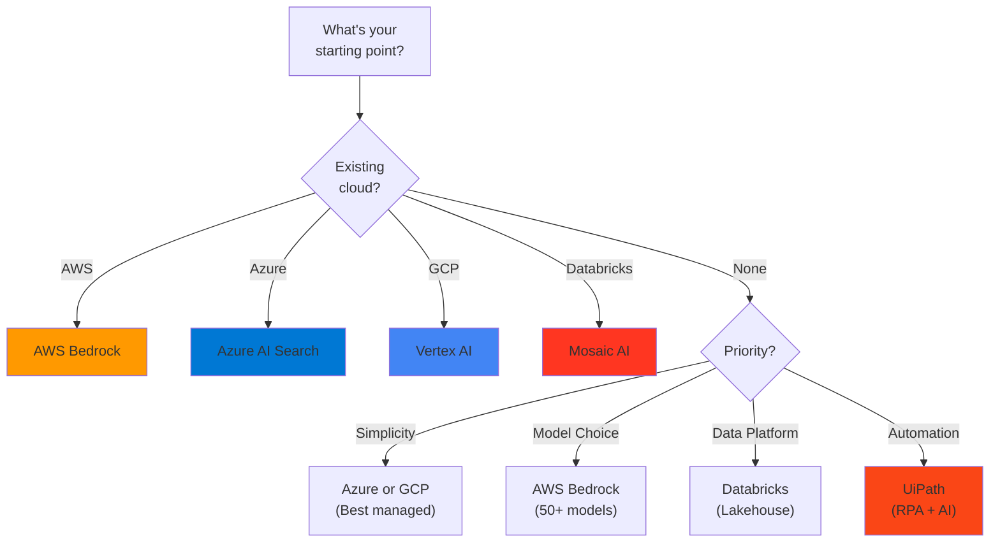

# ☁️ Platform Guides

> **Practical RAG implementation guidance for major cloud and automation platforms**

---

## Overview

Each guide provides:
- 🔗 Links to official repositories (no reinventing the wheel)
- 🏗️ Architecture decision guidance
- 💰 Cost considerations
- ⚠️ Common pitfalls to avoid

---

## Available Guides

| Platform | Guide | Primary Repository |
|----------|-------|-------------------|
|  | [AWS Bedrock](aws-bedrock.md) | [amazon-bedrock-samples](https://github.com/aws-samples/amazon-bedrock-samples) |
|  | [Azure AI Search](azure-ai-search.md) | [azure-search-openai-demo](https://github.com/Azure-Samples/azure-search-openai-demo) |
|  | [Google Vertex AI](gcp-vertex-ai.md) | [generative-ai](https://github.com/GoogleCloudPlatform/generative-ai) |
|  | [Databricks Mosaic AI](databricks-mosaic.md) | [genai-cookbook](https://github.com/databricks/genai-cookbook) |
|  | [UiPath Automation](uipath-automation.md) | [UiPath Docs](https://docs.uipath.com/) |

---

## Quick Comparison

| Capability | AWS | Azure | GCP | Databricks | UiPath |
|------------|-----|-------|-----|------------|--------|
| **Managed RAG** | Bedrock KB | AI Search | Vertex AI Search | Vector Search | Via Integration |
| **Vector Search** | OpenSearch, S3 Vectors | AI Search | Vector Search | Mosaic AI | External |
| **Foundation Models** | Claude, Llama, Titan, Nova | GPT-4, GPT-4o | Gemini | DBRX, Llama | External |
| **Document Processing** | Textract | Document Intelligence | Document AI | Spark | Document Understanding |
| **Hybrid Search** | OpenSearch | Built-in | Limited | Custom | Via Integration |
| **GraphRAG** | Custom | microsoft/graphrag | Custom | Custom | Custom |
| **HITL Native** | Step Functions | Logic Apps | Workflows | Jobs | Action Center |

---

## Choosing a Platform

---

## Cross-Platform Considerations

### What's Portable
- ✅ Chunking strategies
- ✅ Evaluation frameworks (RAGAS, DeepEval)
- ✅ Prompt engineering patterns
- ✅ LangChain / LlamaIndex abstractions

### What's Platform-Specific
- ❌ Vector database APIs
- ❌ Managed RAG configurations
- ❌ Pricing models
- ❌ Security/compliance certifications

---

## Best Practices (All Platforms)

1. **Start with official samples** — Don't reinvent the wheel
2. **Implement evaluation early** — Platform-agnostic tools work everywhere
3. **Plan for hybrid search** — Check platform support upfront
4. **Monitor costs** — Token costs compound quickly
5. **Design for portability** — Use abstraction layers where possible

---

[← Back to Documentation](../README.md)

