# ☁️ RAG on AWS (Bedrock & Beyond)

> **Official resources and architectural guidance for building RAG on Amazon Web Services**

---

## 🔗 Official Repositories

| Repository | Description | Start Here |
|------------|-------------|------------|
| [**aws-samples/amazon-bedrock-samples**](https://github.com/aws-samples/amazon-bedrock-samples) | Comprehensive Bedrock examples including Knowledge Bases, RAG patterns, agents, and RAGAS evaluation | ⭐ Primary reference |
| [**aws-samples/rag-using-langchain-amazon-bedrock-and-opensearch**](https://github.com/aws-samples/rag-using-langchain-amazon-bedrock-and-opensearch) | Production RAG with LangChain integration | LangChain users |
| [**aws-samples/amazon-bedrock-workshop**](https://github.com/aws-samples/amazon-bedrock-workshop) | Hands-on workshop materials | Learning |
| [**aws-samples/generative-ai-cdk-constructs**](https://github.com/aws-samples/generative-ai-cdk-constructs) | CDK constructs for RAG deployment | Infrastructure as Code |

---

## 🏗️ Architecture Options

```mermaid
flowchart TD
    subgraph Managed["🟢 Fully Managed"]
        A["Amazon Q Business"]
    end
    
    subgraph SemiManaged["🟡 Semi-Managed"]
        B["Bedrock Knowledge Bases"]
        C["Amazon Kendra"]
    end
    
    subgraph Custom["🔴 Full Control"]
        D["OpenSearch + Bedrock"]
        E["Aurora pgvector + Bedrock"]
        F["S3 Vectors + Bedrock"]
    end
    
    A -->|"Simplest"| G["Enterprise Search/Chat"]
    B -->|"Recommended"| H["RAG Applications"]
    C -->|"Enterprise Search"| I["Document Search"]
    D -->|"Scale + Features"| J["Custom RAG"]
    E -->|"Existing PostgreSQL"| J
    F -->|"Cost Optimized"| J
```

### Decision Guide

| Option | Best For | Complexity | Cost |
|--------|----------|------------|------|
| **Amazon Q Business** | Enterprise search, quick deployment | Low | Per-user pricing |
| **Bedrock Knowledge Bases** | Most RAG use cases | Medium | Pay-per-use |
| **Amazon Kendra** | Enterprise search without custom vectors | Medium | Index-based |
| **OpenSearch Serverless** | High scale, advanced features | High | ~$700/mo minimum (HA) |
| **S3 Vectors** (new) | Cost-optimized vector storage | Medium | Pay-per-use, up to 90% savings |

---

## 🚀 Quick Start: Bedrock Knowledge Bases

The recommended path for most RAG applications. See the official samples:

📁 **Repository:** [amazon-bedrock-samples/knowledge-bases](https://github.com/aws-samples/amazon-bedrock-samples/tree/main/knowledge-bases)

### Key Features
- Managed chunking strategies (fixed, semantic, hierarchical)
- Built-in vector store options (OpenSearch Serverless, Aurora, Pinecone, Redis)
- Automatic embedding generation
- Retrieval API with citations
- Agents integration

### Sample Notebooks
| Notebook | Purpose |
|----------|---------|
| `0_create_ingest_documents_test_kb.ipynb` | Create and test Knowledge Base |
| `1_managed-rag-kb-retrieve-generate-api.ipynb` | Retrieve and Generate API |
| `2_customized-rag-retreive-api-langchain.ipynb` | Custom RAG with LangChain |
| `3_customized-rag-retreive-api-llamaindex.ipynb` | Custom RAG with LlamaIndex |

---

## 📊 Key Services Reference

| Service | Purpose | Documentation |
|---------|---------|---------------|
| **Amazon Bedrock** | Foundation models (Claude, Llama, Titan, Nova) | [Bedrock Docs](https://docs.aws.amazon.com/bedrock/) |
| **Bedrock Knowledge Bases** | Managed RAG | [KB Docs](https://docs.aws.amazon.com/bedrock/latest/userguide/knowledge-base.html) |
| **Amazon Titan Embeddings** | Text embeddings | [Titan Docs](https://docs.aws.amazon.com/bedrock/latest/userguide/titan-embedding-models.html) |
| **Amazon Kendra** | Enterprise search | [Kendra Docs](https://docs.aws.amazon.com/kendra/) |
| **OpenSearch Serverless** | Vector search at scale | [OpenSearch Docs](https://docs.aws.amazon.com/opensearch-service/) |
| **S3 Vectors** | Cost-effective vector storage | [S3 Vectors Docs](https://docs.aws.amazon.com/AmazonS3/latest/userguide/s3-vectors.html) |

---

## 💰 Cost Considerations

### Bedrock Pricing (as of 2025)
| Model | Input (per 1M tokens) | Output (per 1M tokens) |
|-------|----------------------|------------------------|
| Claude 3 Haiku | $0.25 | $1.25 |
| Claude 3 Sonnet | $3.00 | $15.00 |
| Claude 3 Opus | $15.00 | $75.00 |
| Titan Text Embeddings v2 | $0.02 | - |
| Nova Lite | $0.06 | $0.24 |
| Nova Pro | $0.80 | $3.20 |

### Cost Optimization
- **Prompt Caching**: Up to 90% savings on cached portions (5-minute window)
- **Batch Inference**: 50% discount for non-real-time workloads
- **Intelligent Prompt Routing**: Automatic model selection, up to 30% savings
- **S3 Vectors**: Up to 90% cheaper than OpenSearch Serverless

See our [Cost Optimization Cheatsheet](../../cheatsheets/cost-optimization.md) for detailed strategies.

---

## 🔧 Integration Patterns

### With LangChain
📁 [amazon-bedrock-samples/langchain](https://github.com/aws-samples/amazon-bedrock-samples/tree/main/knowledge-bases/features-examples/04-infrastructure/e2e_rag_using_bedrock_kb_cdk)

### With LlamaIndex
📁 [amazon-bedrock-samples/llamaindex](https://github.com/aws-samples/amazon-bedrock-samples/tree/main/knowledge-bases)

### Evaluation with RAGAS
📁 [amazon-bedrock-samples/evaluation](https://github.com/aws-samples/amazon-bedrock-samples/tree/main/knowledge-bases/features-examples/03-advanced-concepts/evaluation)

---

## ⚠️ Common Pitfalls

| Pitfall | Solution | Reference |
|---------|----------|-----------|
| OpenSearch Serverless minimum cost (~$700/mo) | Consider S3 Vectors for smaller workloads | [S3 Vectors announcement](https://aws.amazon.com/blogs/aws/amazon-s3-vectors-in-preview/) |
| Knowledge Base sync delays | Use incremental sync for near-real-time | KB docs |
| Context window limits | Implement sliding window summarization | See [Failure Modes](../02-failure-modes.md) |
| No hybrid search in KB | Use custom OpenSearch implementation | [OpenSearch samples](https://github.com/aws-samples/rag-using-langchain-amazon-bedrock-and-opensearch) |

---

## 📚 Additional Resources

- [AWS Generative AI Blog](https://aws.amazon.com/blogs/machine-learning/category/artificial-intelligence/generative-ai/)
- [Bedrock User Guide](https://docs.aws.amazon.com/bedrock/latest/userguide/)
- [AWS re:Invent RAG Sessions](https://www.youtube.com/results?search_query=aws+reinvent+rag)
- [AWS Solutions Library - Generative AI](https://aws.amazon.com/solutions/generative-ai/)

---

[← Platform Guides](../README.md) | [Azure AI →](azure-ai-search.md)

