# 🔷 RAG on Azure (AI Search & OpenAI)

> **Official resources and architectural guidance for building RAG on Microsoft Azure**

---

## 🔗 Official Repositories

| Repository | Description | Start Here |
|------------|-------------|------------|
| [**Azure-Samples/azure-search-openai-demo**](https://github.com/Azure-Samples/azure-search-openai-demo) | The gold standard Azure RAG reference. Hybrid search, semantic ranking, multimodal, one-command deploy | ⭐ Primary reference |
| [**microsoft/graphrag**](https://github.com/microsoft/graphrag) | Knowledge graph-augmented RAG for complex queries | Advanced use cases |
| [**Azure/GPT-RAG**](https://github.com/Azure/GPT-RAG) | Enterprise-scale secure RAG with Landing Zone patterns | Enterprise deployments |
| [**microsoft/sample-app-aoai-chatGPT**](https://github.com/microsoft/sample-app-aoai-chatGPT) | Simple chat application with Azure OpenAI | Quick prototypes |
| [**microsoft/semantic-kernel**](https://github.com/microsoft/semantic-kernel) | SDK for LLM orchestration with RAG patterns | .NET/Python SDK users |

---

## 🏗️ Architecture Options

```mermaid
flowchart TD
    subgraph Managed["🟢 Managed Solutions"]
        A["Azure AI Studio"]
        B["Microsoft Copilot Studio"]
    end
    
    subgraph Recommended["🟡 Recommended Pattern"]
        C["Azure AI Search + Azure OpenAI"]
    end
    
    subgraph Advanced["🔴 Advanced"]
        D["GraphRAG"]
        E["Custom with Cosmos DB"]
    end
    
    A -->|"No-code/Low-code"| F["Enterprise Chat"]
    B -->|"Copilot Builder"| F
    C -->|"Most RAG apps"| G["Production RAG"]
    D -->|"Complex reasoning"| H["Multi-hop Q&A"]
    E -->|"Full control"| G
```



### Decision Guide

| Option | Best For | Complexity | Pricing |
|--------|----------|------------|---------|
| **Azure AI Studio** | Rapid prototyping, managed experience | Low | Consumption-based |
| **AI Search + OpenAI** | Production RAG applications | Medium | Tier-based + tokens |
| **GraphRAG** | Complex, multi-hop reasoning | High | Compute + storage |
| **Cosmos DB + OpenAI** | Global distribution, custom schemas | High | RU-based |

---

## 🚀 Quick Start: Azure Search OpenAI Demo

The most complete Azure RAG reference implementation:

📁 **Repository:** [Azure-Samples/azure-search-openai-demo](https://github.com/Azure-Samples/azure-search-openai-demo)

### Features Included
- ✅ Hybrid search (BM25 + vector)
- ✅ Semantic ranking
- ✅ Document Intelligence integration
- ✅ Multimodal (images, PDFs)
- ✅ Authentication (Azure AD)
- ✅ One-command deployment (`azd up`)
- ✅ Multiple UI options

### Deployment
```bash
# Clone and deploy
git clone https://github.com/Azure-Samples/azure-search-openai-demo
cd azure-search-openai-demo
azd auth login
azd up
```

### Architecture from the Demo
```
┌─────────────────────────────────────────────────────────────────┐
│                     Azure Search OpenAI Demo                    │
├─────────────────────────────────────────────────────────────────┤
│  Frontend (React) → Backend (Python/FastAPI)                    │
│       ↓                      ↓                                  │
│  Azure Static     Azure Container Apps                          │
│  Web Apps         or App Service                                │
│                          ↓                                      │
│              ┌───────────┴───────────┐                          │
│              ↓                       ↓                          │
│      Azure AI Search         Azure OpenAI                       │
│   (Hybrid + Semantic)      (GPT-4, Embeddings)                  │
│              ↓                                                  │
│      Azure Blob Storage                                         │
│        (Documents)                                              │
└─────────────────────────────────────────────────────────────────┘
```

---

## 📊 Key Services Reference

| Service | Purpose | Documentation |
|---------|---------|---------------|
| **Azure AI Search** | Hybrid search with semantic ranking | [AI Search Docs](https://learn.microsoft.com/azure/search/) |
| **Azure OpenAI Service** | GPT-4, embeddings, fine-tuning | [OpenAI Service Docs](https://learn.microsoft.com/azure/ai-services/openai/) |
| **Azure AI Document Intelligence** | Document parsing (PDFs, images) | [Doc Intelligence Docs](https://learn.microsoft.com/azure/ai-services/document-intelligence/) |
| **Azure Blob Storage** | Document storage | [Blob Storage Docs](https://learn.microsoft.com/azure/storage/blobs/) |
| **Azure AI Studio** | Unified AI development environment | [AI Studio Docs](https://learn.microsoft.com/azure/ai-studio/) |

---

## 💰 Cost Considerations

### Azure AI Search Pricing

| Tier | Price/Month | Replicas | Partitions | Best For |
|------|-------------|----------|------------|----------|
| **Free** | $0 | 1 | 1 | Development |
| **Basic** | ~$75 | 3 | 1 | Small production |
| **Standard S1** | ~$250 | 12 | 12 | Medium workloads |
| **Standard S2** | ~$1,000 | 12 | 12 | Large workloads |

**Key insight:** Basic tier (~$75/month) includes vectors, semantic ranker, and the full modern API. No per-query charges.

### Azure OpenAI Pricing (as of 2025)
| Model | Input (per 1M tokens) | Output (per 1M tokens) |
|-------|----------------------|------------------------|
| GPT-4o | $2.50 | $10.00 |
| GPT-4o-mini | $0.15 | $0.60 |
| text-embedding-3-small | $0.02 | - |
| text-embedding-3-large | $0.13 | - |

---

## 🔧 Key Patterns

### Hybrid Search Configuration
📁 [azure-search-openai-demo/app/backend/approaches](https://github.com/Azure-Samples/azure-search-openai-demo/tree/main/app/backend/approaches)

### Semantic Ranking
Built into Azure AI Search. Enable in index configuration:
```json
{
  "semantic": {
    "configurations": [{
      "name": "my-semantic-config",
      "prioritizedFields": {
        "contentFields": [{ "fieldName": "content" }],
        "titleField": { "fieldName": "title" }
      }
    }]
  }
}
```

### Document Intelligence Integration
📁 [azure-search-openai-demo/scripts/prepdocs.py](https://github.com/Azure-Samples/azure-search-openai-demo/blob/main/scripts/prepdocs.py)

---

## 🧠 Advanced: GraphRAG

For complex, multi-hop reasoning over document collections:

📁 **Repository:** [microsoft/graphrag](https://github.com/microsoft/graphrag)

### When to Use GraphRAG
- Global queries ("What are the main themes across all documents?")
- Multi-hop reasoning ("How does X relate to Y through Z?")
- Complex analytical questions
- Large document collections with interconnected concepts

### When NOT to Use GraphRAG
- Simple factoid retrieval
- Real-time queries (indexing is expensive)
- Small document sets (<100 docs)

---

## ⚠️ Common Pitfalls

| Pitfall | Solution | Reference |
|---------|----------|-----------|
| Semantic ranker limits (1000 chars) | Chunk appropriately | [Semantic ranking docs](https://learn.microsoft.com/azure/search/semantic-search-overview) |
| Cold start latency | Provision dedicated capacity | AI Search scaling |
| Document Intelligence costs | Batch processing, caching | See [Cost Optimization](../../cheatsheets/cost-optimization.md) |
| Index size limits by tier | Plan capacity upfront | Tier comparison |

---

## 📚 Additional Resources

- [Azure AI Search Blog](https://azure.microsoft.com/blog/tag/azure-ai-search/)
- [Azure OpenAI Samples](https://github.com/Azure-Samples?q=openai)
- [Microsoft Learn: Build AI Apps](https://learn.microsoft.com/training/paths/create-azure-ai-services-solutions/)
- [RAG with Azure AI Search](https://learn.microsoft.com/azure/search/retrieval-augmented-generation-overview)

---

<div align="center">

[← AWS Bedrock](aws-bedrock.md) | [GCP Vertex AI →](gcp-vertex-ai.md)

</div>
