# 🧱 RAG on Databricks (Mosaic AI)

> **Official resources and architectural guidance for building RAG on Databricks Lakehouse**

---

## 🔗 Official Repositories

| Repository | Description | Start Here |
|------------|-------------|------------|
| [**databricks/genai-cookbook**](https://github.com/databricks/genai-cookbook) | Comprehensive GenAI patterns on Lakehouse architecture | ⭐ Primary reference |
| [**databricks-demos/llm-rag-chatbot**](https://github.com/databricks-demos/llm-rag-chatbot) | End-to-end RAG chatbot with MLflow evaluation | Production pattern |
| [**databricks/databricks-ml-examples**](https://github.com/databricks/databricks-ml-examples) | ML examples including embeddings | Components |

---

## 🏗️ Architecture: The Lakehouse RAG Pattern

Databricks uniquely positions RAG within the Lakehouse architecture:

```mermaid
flowchart TD
    subgraph Ingestion["📥 Data Ingestion"]
        A["Unity Catalog<br/>(Governance)"]
        B["Delta Lake<br/>(Documents)"]
    end
    
    subgraph Processing["⚙️ Processing"]
        C["Databricks Jobs<br/>(Chunking, Embedding)"]
        D["Mosaic AI<br/>Vector Search"]
    end
    
    subgraph Serving["🚀 Serving"]
        E["Mosaic AI<br/>Model Serving"]
        F["Foundation Models<br/>(DBRX, Llama, etc.)"]
    end
    
    subgraph Evaluation["📊 Evaluation"]
        G["MLflow<br/>(Tracking, Eval)"]
        H["Lakehouse<br/>Monitoring"]
    end
    
    A --> B
    B --> C
    C --> D
    D --> E
    E --> F
    F --> G
    G --> H
```



### Key Differentiators
- **Unity Catalog**: Unified governance for data AND models
- **Delta Lake**: ACID transactions for document updates
- **MLflow**: Native experiment tracking and evaluation
- **Mosaic AI**: Integrated vector search + model serving

---

## 🚀 Quick Start: GenAI Cookbook

The most comprehensive Databricks RAG resource:

📁 **Repository:** [databricks/genai-cookbook](https://github.com/databricks/genai-cookbook)

### Cookbook Structure

| Section | Contents |
|---------|----------|
| `quick_start_demo/` | Get running in minutes |
| `rag_app_sample_code/` | Production RAG patterns |
| `agent_app_sample_code/` | Agentic RAG patterns |
| `pdf_rag_with_multi_turn_chat/` | Document Q&A with conversation |

### Key Notebooks
- **Data Pipeline**: Chunking, embedding, vector indexing
- **RAG Chain**: Retrieval + generation with LangChain
- **Evaluation**: MLflow-based RAG evaluation
- **Deployment**: Model serving configuration

---

## 📊 Key Services Reference

| Service | Purpose | Documentation |
|---------|---------|---------------|
| **Mosaic AI Vector Search** | Managed vector database | [Vector Search Docs](https://docs.databricks.com/en/generative-ai/vector-search.html) |
| **Mosaic AI Model Serving** | LLM deployment | [Model Serving Docs](https://docs.databricks.com/en/machine-learning/model-serving/index.html) |
| **Foundation Models** | DBRX, Llama, Mixtral access | [Foundation Models Docs](https://docs.databricks.com/en/machine-learning/foundation-models/index.html) |
| **MLflow** | Experiment tracking, evaluation | [MLflow Docs](https://docs.databricks.com/en/mlflow/index.html) |
| **Unity Catalog** | Data + model governance | [Unity Catalog Docs](https://docs.databricks.com/en/data-governance/unity-catalog/index.html) |
| **Delta Lake** | Document storage | [Delta Lake Docs](https://docs.databricks.com/en/delta/index.html) |

---

## 💰 Cost Considerations

### Compute Pricing
Databricks uses DBU (Databricks Unit) based pricing that varies by:
- Cloud provider (AWS, Azure, GCP)
- Instance type
- Workload type (Jobs, SQL, Serving)

### Foundation Models
| Model | Input (per 1M tokens) | Output (per 1M tokens) |
|-------|----------------------|------------------------|
| DBRX Instruct | Pay-as-you-go | Varies by provisioned throughput |
| Meta Llama 3 | Pay-as-you-go | Varies |
| Mixtral | Pay-as-you-go | Varies |

**Tip**: Use Provisioned Throughput for predictable workloads to reduce costs.

### Vector Search Pricing
- Based on index size and query volume
- Serverless option available for variable workloads

---

## 🔧 Key Patterns

### RAG Chain with LangChain
📁 [genai-cookbook/rag_app_sample_code](https://github.com/databricks/genai-cookbook)

```python
from databricks.vector_search.client import VectorSearchClient
from langchain_databricks import DatabricksVectorSearch

# Initialize vector search
vsc = VectorSearchClient()
index = vsc.get_index(
    endpoint_name="your-endpoint",
    index_name="your-catalog.your-schema.your-index"
)

# Create retriever
retriever = DatabricksVectorSearch(index).as_retriever()

# Build RAG chain
from langchain.chains import RetrievalQA
from langchain_databricks import ChatDatabricks

llm = ChatDatabricks(endpoint="databricks-dbrx-instruct")
qa_chain = RetrievalQA.from_chain_type(
    llm=llm,
    retriever=retriever
)
```

### MLflow Evaluation
📁 [genai-cookbook - evaluation sections](https://github.com/databricks/genai-cookbook)

```python
import mlflow

# Log RAG chain
with mlflow.start_run():
    mlflow.langchain.log_model(qa_chain, "rag_chain")
    
    # Evaluate with built-in metrics
    results = mlflow.evaluate(
        model=qa_chain,
        data=eval_dataset,
        model_type="question-answering",
    )
```

### Delta Lake Document Management
```python
# Version-controlled document storage
df.write.format("delta").mode("append").saveAsTable("documents")

# Time travel for document versions
spark.read.option("versionAsOf", 5).table("documents")
```

---

## 🧠 Advanced: Agentic RAG

Databricks supports agentic patterns with tool calling:

📁 [genai-cookbook/agent_app_sample_code](https://github.com/databricks/genai-cookbook)

```python
from langchain.agents import create_tool_calling_agent

# Define tools including retrieval
tools = [retrieval_tool, calculator_tool, web_search_tool]

# Create agent
agent = create_tool_calling_agent(llm, tools, prompt)
```

---

## ⚠️ Common Pitfalls

| Pitfall | Solution | Reference |
|---------|----------|-----------|
| Vector search endpoint cold start | Keep endpoint warm with minimum replicas | Vector Search docs |
| Unity Catalog permission errors | Proper grants for catalog, schema, tables | Unity Catalog permissions |
| MLflow logging overhead | Sample traces in production | MLflow tracing docs |
| Delta Lake small file problem | Use OPTIMIZE and Z-ORDER | Delta Lake optimization |

---

## 🎯 Databricks-Specific Advantages

| Feature | Benefit |
|---------|---------|
| **Unity Catalog** | Single pane of glass for data + model governance |
| **Delta Lake** | ACID transactions, time travel for documents |
| **MLflow Native** | Seamless experiment tracking and evaluation |
| **Lakehouse** | Same platform for ETL, analytics, and AI |
| **DBRX** | High-quality open model, optimized for Databricks |

---

## 📚 Additional Resources

- [Databricks GenAI Documentation](https://docs.databricks.com/en/generative-ai/index.html)
- [Databricks Blog - AI/ML](https://www.databricks.com/blog/category/ai-ml)
- [Databricks Academy - GenAI](https://www.databricks.com/learn/training/catalog)
- [Mosaic AI Documentation](https://docs.databricks.com/en/machine-learning/mosaic-ai/index.html)

---

<div align="center">

[← GCP Vertex AI](gcp-vertex-ai.md) | [UiPath →](uipath-automation.md)

</div>
