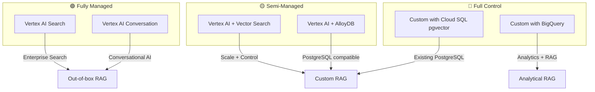

# 🔵 RAG on Google Cloud (Vertex AI)

> **Official resources and architectural guidance for building RAG on Google Cloud Platform**

---

## 🔗 Official Repositories

| Repository | Description | Start Here |
|------------|-------------|------------|
| [**GoogleCloudPlatform/generative-ai**](https://github.com/GoogleCloudPlatform/generative-ai) | Comprehensive Vertex AI samples including RAG, Gemini, embeddings | ⭐ Primary reference |
| [**google/generative-ai-docs**](https://github.com/google/generative-ai-docs) | Official documentation and tutorials | Learning |
| [**GoogleCloudPlatform/applied-ai-engineering-samples**](https://github.com/GoogleCloudPlatform/applied-ai-engineering-samples) | Production AI engineering patterns | Enterprise patterns |
| [**googleapis/langchain-google-genai**](https://github.com/googleapis/langchain-google-genai) | LangChain integrations for Google AI | LangChain users |

---

## 🏗️ Architecture Options



### Decision Guide

| Option | Best For | Complexity | Pricing Model |
|--------|----------|------------|---------------|
| **Vertex AI Search** | Quick deployment, enterprise search | Low | Per-query |
| **Vertex AI Conversation** | Chatbots with RAG | Low | Per-session |
| **Vertex AI Vector Search** | High-scale custom RAG | Medium | Index + queries |
| **AlloyDB AI** | PostgreSQL compatibility | Medium | Instance-based |
| **Cloud SQL + pgvector** | Existing PostgreSQL | Medium | Instance-based |

---

## 🚀 Quick Start: Vertex AI RAG

The most comprehensive samples:

📁 **Repository:** [GoogleCloudPlatform/generative-ai](https://github.com/GoogleCloudPlatform/generative-ai)

### Key Directories

| Path | Contents |
|------|----------|
| `/gemini/` | Gemini model samples |
| `/embeddings/` | Text and multimodal embeddings |
| `/search/` | Vertex AI Search samples |
| `/conversation/` | Conversational AI patterns |
| `/rag/` | RAG-specific implementations |

### RAG Sample Notebooks
📁 [generative-ai/gemini/rag-engine](https://github.com/GoogleCloudPlatform/generative-ai/tree/main/gemini/rag-engine)

- `rag_engine_intro.ipynb` - Introduction to RAG Engine
- `rag_engine_with_langchain.ipynb` - LangChain integration
- `rag_engine_customization.ipynb` - Custom configurations

---

## 📊 Key Services Reference

| Service | Purpose | Documentation |
|---------|---------|---------------|
| **Vertex AI Search** | Managed search and RAG | [Search Docs](https://cloud.google.com/enterprise-search) |
| **Gemini** | Multimodal foundation models | [Gemini Docs](https://cloud.google.com/vertex-ai/docs/generative-ai/model-reference/gemini) |
| **Vertex AI Embeddings** | Text embeddings API | [Embeddings Docs](https://cloud.google.com/vertex-ai/docs/generative-ai/embeddings/get-text-embeddings) |
| **Vector Search** | Scalable ANN search | [Vector Search Docs](https://cloud.google.com/vertex-ai/docs/vector-search/overview) |
| **Document AI** | Document parsing | [Document AI Docs](https://cloud.google.com/document-ai/docs) |
| **AlloyDB AI** | PostgreSQL with vector extensions | [AlloyDB AI Docs](https://cloud.google.com/alloydb/docs/ai) |

---

## 💰 Cost Considerations

### Gemini Pricing (as of 2025)

| Model | Input (per 1M tokens) | Output (per 1M tokens) |
|-------|----------------------|------------------------|
| Gemini 1.5 Flash | $0.075 | $0.30 |
| Gemini 1.5 Pro | $1.25 | $5.00 |
| Gemini 2.0 Flash | $0.10 | $0.40 |
| text-embedding-004 | $0.025 | - |
| text-multilingual-embedding-002 | $0.025 | - |

### Vertex AI Search Pricing
- **Search queries**: $0.004 per query (after free tier)
- **Document processing**: Varies by volume
- **Storage**: Standard GCS pricing

### Cost Optimization Tips
- Use **Gemini Flash** for cost-sensitive workloads (10x cheaper than Pro)
- Batch document processing for better rates
- Use Cloud Storage lifecycle policies for document management

---

## 🔧 Key Patterns

### Vertex AI Search (Managed RAG)
📁 [generative-ai/search](https://github.com/GoogleCloudPlatform/generative-ai/tree/main/search)

```python
from google.cloud import discoveryengine_v1 as discoveryengine

# Create search request
request = discoveryengine.SearchRequest(
    serving_config=serving_config,
    query="your query",
    page_size=10,
    content_search_spec=discoveryengine.SearchRequest.ContentSearchSpec(
        snippet_spec=discoveryengine.SearchRequest.ContentSearchSpec.SnippetSpec(
            return_snippet=True
        ),
        summary_spec=discoveryengine.SearchRequest.ContentSearchSpec.SummarySpec(
            summary_result_count=5,
            include_citations=True,
        ),
    ),
)
```

### Vector Search Integration
📁 [generative-ai/embeddings](https://github.com/GoogleCloudPlatform/generative-ai/tree/main/embeddings)

### LangChain Integration
📁 [langchain-google-genai](https://github.com/googleapis/langchain-google-genai)

```python
from langchain_google_genai import GoogleGenerativeAI, GoogleGenerativeAIEmbeddings

# Embeddings
embeddings = GoogleGenerativeAIEmbeddings(model="models/text-embedding-004")

# LLM
llm = GoogleGenerativeAI(model="gemini-1.5-flash")
```

---

## 🧠 Advanced: Grounding with Google Search

Unique GCP capability: Ground responses with real-time Google Search results.

📁 [generative-ai/gemini/grounding](https://github.com/GoogleCloudPlatform/generative-ai/tree/main/gemini/grounding)

```python
from vertexai.generative_models import GenerativeModel, Tool
from vertexai.preview.generative_models import grounding

# Create grounding tool
google_search_tool = Tool.from_google_search_retrieval(
    grounding.GoogleSearchRetrieval()
)

# Use in generation
model = GenerativeModel("gemini-1.5-flash")
response = model.generate_content(
    "What's the latest news about RAG?",
    tools=[google_search_tool]
)
```

---

## ⚠️ Common Pitfalls

| Pitfall | Solution | Reference |
|---------|----------|-----------|
| Vector Search cold start | Pre-warm with dummy queries | Vector Search docs |
| Gemini rate limits | Implement exponential backoff | [Quotas](https://cloud.google.com/vertex-ai/docs/quotas) |
| Document AI costs for large PDFs | Pre-process with simpler tools | Evaluate document types |
| Regional availability | Check service availability by region | [Region support](https://cloud.google.com/vertex-ai/docs/general/locations) |

---

## 🌐 Multimodal RAG

GCP excels at multimodal RAG with Gemini's native multimodal capabilities:

📁 [generative-ai/gemini/use-cases/multimodal](https://github.com/GoogleCloudPlatform/generative-ai/tree/main/gemini/use-cases)

- Image understanding
- Video analysis
- Audio transcription
- Mixed-media documents

---

## 📚 Additional Resources

- [Google Cloud AI Blog](https://cloud.google.com/blog/products/ai-machine-learning)
- [Vertex AI Documentation](https://cloud.google.com/vertex-ai/docs)
- [Google Cloud Skills Boost - GenAI](https://www.cloudskillsboost.google/paths/118)
- [Generative AI on Vertex AI](https://cloud.google.com/vertex-ai/generative-ai/docs/overview)

---

<div align="center">

[← Azure AI Search](azure-ai-search.md) | [Databricks →](databricks-mosaic.md)

</div>
