# 🤖 RAG with UiPath (AI + Automation)

> **Integrating RAG capabilities with UiPath's automation platform**

---

## 🔗 Official Resources

| Resource | Description | Link |
|----------|-------------|------|
| **UiPath AI Center** | ML model deployment and management | [AI Center Docs](https://docs.uipath.com/ai-center/) |
| **UiPath Document Understanding** | Intelligent document processing | [Document Understanding Docs](https://docs.uipath.com/document-understanding/) |
| **UiPath Integration Service** | API connectivity | [Integration Service Docs](https://docs.uipath.com/integration-service/) |
| **UiPath Community Forum** | Community discussions and samples | [Community](https://forum.uipath.com/) |
| **UiPath Marketplace** | Pre-built components | [Marketplace](https://marketplace.uipath.com/) |

---

## 🏗️ Architecture: RAG + RPA

UiPath uniquely positions RAG within an automation-first context:


### Key Use Cases
- **Document Processing + RAG**: Extract data, then query knowledge base
- **Automated Support**: RPA + RAG for ticket resolution
- **Compliance Automation**: Document review with AI augmentation
- **Process Mining + RAG**: Query process insights

---

## 🚀 Quick Start: RAG Integration Patterns

### Pattern 1: Integration Service + External LLM

Connect to OpenAI, Azure OpenAI, or other LLM APIs:

```
UiPath Integration Service
    ↓
External LLM API (OpenAI, Azure, etc.)
    ↓
Vector Database (Pinecone, Weaviate, etc.)
    ↓
Response back to automation
```

📁 **Marketplace**: Search for "OpenAI" or "Azure OpenAI" connectors

### Pattern 2: AI Center Custom Model

Deploy custom RAG components as ML Skills:

```
Document → AI Center ML Skill (Embedding) → Vector DB
Query → AI Center ML Skill (Retrieval) → LLM → Response
```

### Pattern 3: Generative AI Activities

Use UiPath's built-in GenAI activities for simpler integrations:

- **Generate Text**: Direct LLM calls
- **Summarize Document**: Document summarization
- **Extract Data**: Structured extraction

---

## 📊 Key Components

| Component | Purpose | Best For |
|-----------|---------|----------|
| **AI Center** | Custom ML model deployment | Custom embeddings, fine-tuned models |
| **Document Understanding** | Intelligent document processing | PDF extraction, form processing |
| **Integration Service** | API connectivity | External LLM/vector DB calls |
| **Orchestrator** | Workflow management | Scheduling, monitoring |
| **Action Center** | Human-in-the-loop | Review, approval workflows |
| **Test Manager** | Automation testing | RAG quality validation |

---

## 💰 Cost Considerations

### UiPath Licensing
- **Robot licenses**: Per-robot or consumption-based
- **AI Center**: AI Units for ML operations
- **Document Understanding**: Page-based pricing

### External API Costs
When integrating external LLMs (OpenAI, Azure, etc.):
- Factor in token costs
- Consider caching for repeated queries
- Batch operations where possible

### Cost Optimization Tips
- Use attended robots for interactive RAG queries
- Queue management for batch processing
- Implement response caching in workflows

---

## 🔧 Implementation Patterns

### Document Understanding + RAG

```
┌─────────────────────────────────────────────────────────────────┐
│                  Document Processing Pipeline                   │
├─────────────────────────────────────────────────────────────────┤
│                                                                 │
│  1. Document Intake (Email, Folder, Queue)                      │
│           ↓                                                     │
│  2. Document Understanding (Classification, Extraction)         │
│           ↓                                                     │
│  3. Generate Embeddings (AI Center or External API)             │
│           ↓                                                     │
│  4. Store in Vector Database                                    │
│           ↓                                                     │
│  5. Query with RAG for insights                                 │
│           ↓                                                     │
│  6. Action Center (if human review needed)                      │
│                                                                 │
└─────────────────────────────────────────────────────────────────┘
```

### Automated Support Agent

```
┌─────────────────────────────────────────────────────────────────┐
│                    Support Automation Flow                      │
├─────────────────────────────────────────────────────────────────┤
│                                                                 │
│  1. Ticket arrives (ServiceNow, Zendesk, etc.)                 │
│           ↓                                                     │
│  2. Extract intent and entities                                 │
│           ↓                                                     │
│  3. RAG query against knowledge base                            │
│           ↓                                                     │
│  4. Generate response with LLM                                  │
│           ↓                                                     │
│  5. Confidence check                                            │
│           ↓                                                     │
│      High → Auto-respond                                        │
│      Low  → Route to Action Center                              │
│                                                                 │
└─────────────────────────────────────────────────────────────────┘
```

---

## 🧠 Advanced: Human-in-the-Loop RAG

UiPath's Action Center enables sophisticated HITL patterns:

```mermaid
flowchart TD
    A["RAG Query"] --> B{"Confidence<br/>≥ 85%?"}
    B -->|"Yes"| C["Auto-respond"]
    B -->|"No"| D["Action Center<br/>Human Review"]
    D --> E{"Approve?"}
    E -->|"Yes"| F["Send Response"]
    E -->|"Modify"| G["Edit Response"]
    G --> F
    E -->|"Reject"| H["Escalate"]
    
    F --> I["Log for Training"]
    H --> I
```



### Benefits
- **Quality Control**: Humans verify low-confidence responses
- **Continuous Improvement**: Feedback improves RAG over time
- **Compliance**: Audit trail for regulated industries
- **Scalability**: Automation handles volume, humans handle exceptions

---

## ⚠️ Common Pitfalls

| Pitfall | Solution | Reference |
|---------|----------|-----------|
| API timeout in workflows | Implement retry logic and async patterns | UiPath best practices |
| Large document processing | Chunk documents before processing | Document Understanding guides |
| Rate limiting with external APIs | Implement queue-based throttling | Integration Service docs |
| Cold start latency | Pre-warm ML Skills in AI Center | AI Center deployment guides |

---

## 🎯 UiPath-Specific Advantages

| Feature | RAG Benefit |
|---------|-------------|
| **Orchestrator** | Centralized RAG pipeline management |
| **Action Center** | Native HITL for RAG quality control |
| **Document Understanding** | Pre-built document intelligence |
| **Integration Service** | Easy LLM/vector DB connectivity |
| **Test Manager** | Automated RAG testing in CI/CD |
| **Insights** | Analytics on RAG performance |

---

## 🔌 Integration Examples

### With Azure OpenAI
Use Integration Service Azure OpenAI connector:
1. Configure connection in Integration Service
2. Use "HTTP Request" or dedicated activities
3. Parse JSON responses in workflow

### With Pinecone
Custom connector via Integration Service:
1. Create custom connector for Pinecone API
2. Store embeddings via upsert operations
3. Query for nearest neighbors

### With LangChain (Python)
Use "Run Python Script" activity:
```python
from langchain_openai import ChatOpenAI
from langchain_pinecone import PineconeVectorStore

# RAG logic here
response = qa_chain.invoke(query)
return response
```

---

## 📚 Additional Resources

- [UiPath AI Center Documentation](https://docs.uipath.com/ai-center/)
- [UiPath Automation Cloud](https://cloud.uipath.com/)
- [UiPath Community Tutorials](https://www.uipath.com/learning/video-tutorials)
- [UiPath Academy - AI](https://academy.uipath.com/)
- [UiPath Marketplace - AI Components](https://marketplace.uipath.com/)

---

<div align="center">

[← Databricks](databricks-mosaic.md) | [Back to Platform Guides](../../README.md#-platform-guides)

</div>
